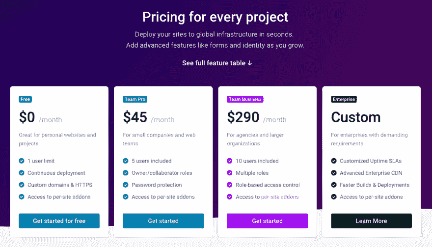
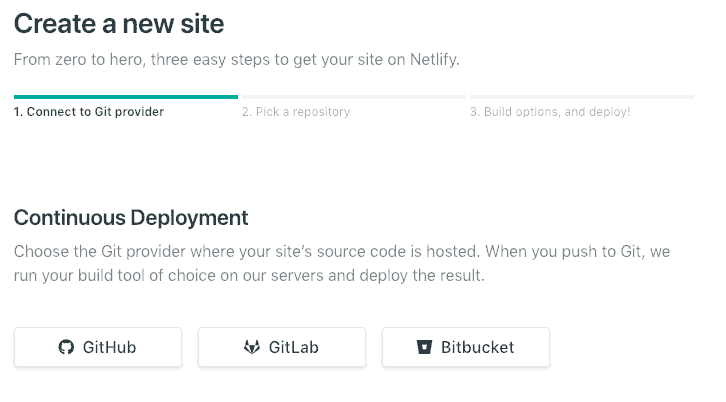
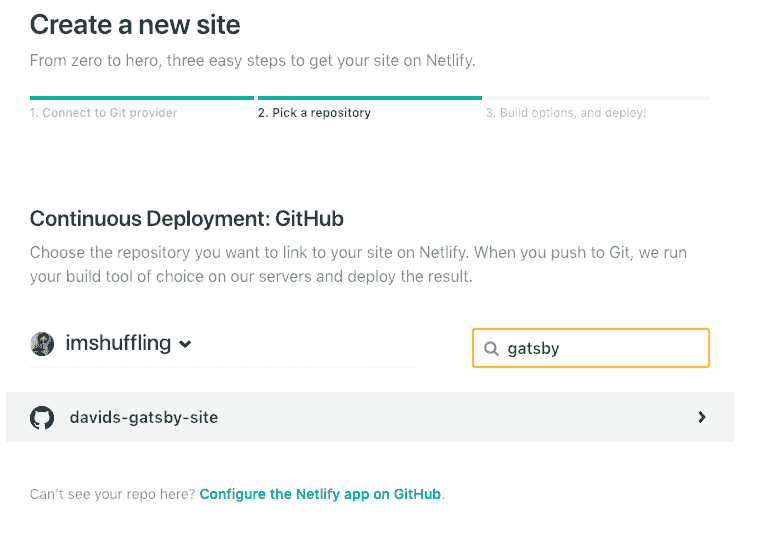
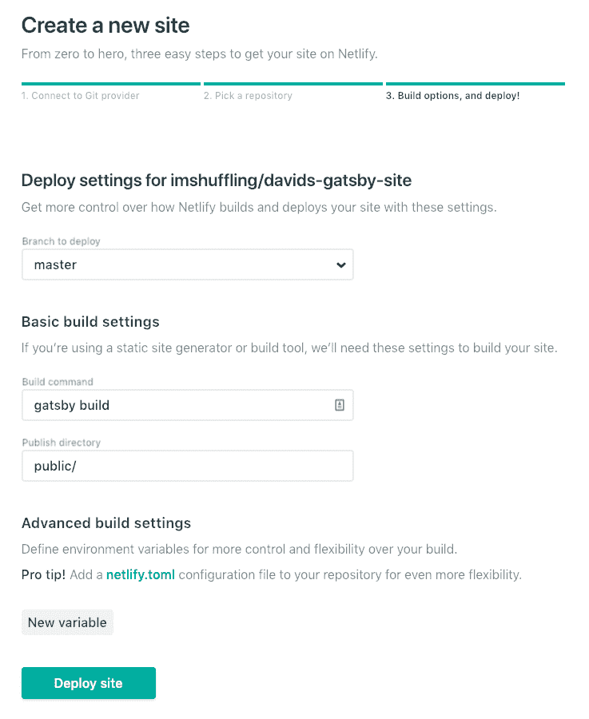
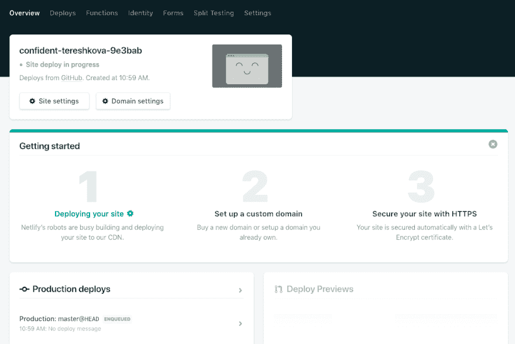
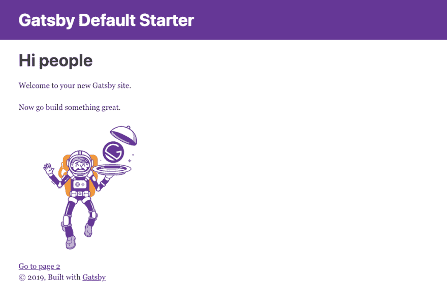

# 将 Gatsby.js 站点部署到 Netlify。

> 原文：<https://dev.to/imshuffling_31/deploying-your-gatsbyjs-site-to-netlify-4la>

我现在已经使用 Gatsby.js 构建了几个站点，这是一个基于 React 的奇妙的静态站点生成器工具。当我刚开始的时候，我在 Github 页面上托管我的站点，这有时变得很乏味，我想我浪费了几个小时来确保`pathPrefix`是正确的。

我最终遇到了 Netlify，一个基于云的托管服务提供商等等。

我发现显著的是他们的免费层托管，提供了我需要的一切。

因此，本指南是关于在 Github/Netlify 上托管个人投资组合网站的顶级指南。

首先，确保你在 Github 上有 Gatsby.js 项目。

我在这里选择了 Github。

选择您希望 Netlify 托管的存储库，我在这里用 Gatsby 初学者工具包创建了一个名为`davids-gatsby-site`的 Gatsby 演示。

现在，Netlify 应该会自动检测我们的站点是 Gatsby.js，并预先填充基本的构建设置。

专业提示:如果我们愿意，我们可以创建一个`netlify.toml`文件，我们今天不会深入讨论这个，但是这样做的一个好处是我们可以将它保存在代码中。

单击部署。

部署将在后台运行，几分钟后就应该完成了。

好了，[这里](https://confident-tereshkova-9e3bab.netlify.com/)您已经将站点 Gatsby.js 站点部署到 Netlify。

