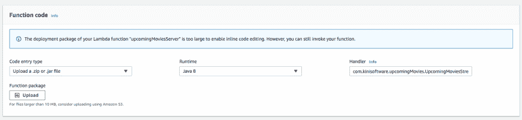

# 为 Alexa (IV)创建自定义技能:Java 8 中的基本后端代码

> [https://dev . to/kini/create-un-custom-skill-to-Alexa-iv-codido-basic-del-后端-en-java-8-4hpd](https://dev.to/kini/creando-un-custom-skill-para-alexa-iv-codido-basico-del-backend-en-java-8-4hpd)

由于[以前的帖子](https://kinisoftware.com/creando-un-custom-skill-para-alexa-iii-alexa-developer-console/)将会留得太久，所以我决定创建一个新的来教授代码中的东西。

首先，我将把我技能的 lambda 代码提升到 GitHub 的休息时间。如我所说，我对分支管理问题并不十分小心，也没有自动测试。此外，我会将它与型号部分集成，并使用“[”命令行准备好进行部署，而无需通过 alexa 或 aws 控制台。接下来几周我也会告诉你们。](https://developer.amazon.com/es/docs/smapi/quick-start-alexa-skills-kit-command-line-interface.html)

我将使用的是“t0”ask SDK for Java，它将使我们能够创建后端所需的一切。就我个人而言，我将使用版本 2，根据指南，这是最新版本。我要告诉你的不是你在官方文件(英文)上看不到的另一个世界的东西。

## 用 Maven 设置项目

为了组装它，我决定使用 Maven(你们有等级选项[，正如 ivn](https://www.koliseo.com/events/commit-2018/r4p/5630471824211968/agenda#/5734118109216768/5630923064213504)所做的那样)，并且完全有文件记载。pom.xml 至少需要添加:

Podemos destacar:

*   依赖〔t0〕。这是 sdk，它将允许我们构建代码，以便与 lambda 中的技能交互。
*   lambda 中的日志相关依赖项。我想我还没有完全配置好，但至少我可以在 AWS 控制台上看到日志。你可以在[doc](https://docs.aws.amazon.com/lambda/latest/dg/java-logging.html)上看到更多关于这个问题的信息。

一旦将 Maven 配置为所需的依赖项，我们就可以开始编写代码，它将使用 sdk 提供的所有内容。我们需要创建两种基本类:

*   我们需要多少`RequestHandler`来处理来自技能的尝试。一个`RequestHandler`可以处理多个意图。
*   一个`SkillStreamHandler`将成为我们后端的主要类。在此，我们将注册先前创建的处理程序。

## 查询处理程序的基本结构

要创建我们的处理程序，只需扩展 sdk 提供的“`RequestHandler`”类并复盖以下两种方法:

*   `canHandle`方法用于检查处理程序是否能够处理传入的请求。在此，通常的基本逻辑是查看请求的意图名称。此示例说明如何检查目的是取消还是停止。我举这个例子来看一个处理程序可以处理多个意图。
*   `handle`方法负责接收输入，并根据用户的请求构建用户响应。这是处理程序中最有趣的代码将使用的方法。在这个例子中，我要强调三点:
    *   `withSpeech`我们正在给答案 Alexa 将对用户口头说的文字。
    *   `withSimpleCard`我们在这里为 Alexa 建造了一个输出，它将对手机应用等显示设备有用。
    *   `withShouldEndSession`我们借此向 Alexa 表示，一旦处理了请求，我们就不再等待与用户的进一步交互，而结束了会话，即技能。

在这个非常基本的例子中，我们可以看到我们要如何处理一对尝试，并制定出两种类型的反应:Alexa 将大声说出的文本，以及构建 Alexa 将在屏幕上显示的“卡片”的信息。最后，如果选择结束会议，我们表示，我们不期待进一步的互动。它将是一个以请求为导向的处理程序，没有对话。

如果我们的处理程序要告诉 Alexa 我们希望继续与用户交互，我们必须用“`withReprompt`”构造响应。这样就不必用`withShouldEndSession`表示我们不希望终止会话，因为它隐含着使用责备。

## 后端输入点

正如我一开始所说，除了`RequestHandler`我们还要写另一个将成为我们 lambda 项目“主力”的课。此类必须从 SDK 提供的“`SkillStreamHandler`”扩展:

这是一个非常简单的类，在构造函数中，我们必须通过一个`Skill`类型的对象，我们将通过添加我们拥有的处理程序来构建该对象。

## 大楼！！

一旦我们得到了所有这些，我们就可以把我们的项目打包，以便上传到 AWS Lambda。既然我们使用了 Maven，我们可以用一个命令来做到这一点:

`mvn org.apache.maven.plugins:maven-assembly-plugin:2.6:assembly -DdescriptorId=jar-with-dependencies package`

命令的输出将存在于项目的“`target`”文件夹中，我们必须从 AWS Lambda 控制台上传文件:`*-jar-with-dependencies.jar`。

作为一个重要的详细信息，您要指定的处理程序将是对您的" main "类的完整引用，包括其名称。如果你在“信息”上画画，你就会明白。

* * *

这样我们就可以发布一套完整的技能，可以从 Alexa 的控制台上开始测试，甚至可以从与我们注册的同一 Amazon 帐户相关联的移动设备/应用程序上开始测试。技能不安装在任何地方，而是在云中。以 Alexa 的名义运行它会找到最新的生产版本或者在这种情况下是我们可以访问的开发版本。

在下面的帖子中，我们将看到从 Alexa 控制台和 AWS Lambda 控制台测试技能的选项。此外，我们还将进一步发展我们的交互模型，以便能够处理我们的自定义意图中的一个时间点:)