# 使用 Pytest 和 Selenium WebDriver 进行自动化测试

> 原文：<https://dev.to/lambdatest/test-automation-using-pytest-and-selenium-webdriver-jd8>

在当今时代，开发人员面临的挑战之一是确保他们的网站/web 应用程序能够在不同的设备、浏览器和操作系统(OS)/平台上无缝工作。这就是[跨浏览器测试](https://www.lambdatest.com/)在测试网站/网络应用中发挥非常关键作用的地方，因为它有助于测试不同的组合。基于目标市场，开发&产品团队需要制定一份关于[浏览器兼容性测试](https://www.lambdatest.com/feature)所涉及的各种活动的计划。

## Selenium–简介& WebDriver 接口

就测试 web 应用程序而言，有几个 web 框架可以用来自动化跨不同 web 浏览器执行的测试。Selenium 是一个非常流行的框架，主要用于 web 应用的自动化测试。它是一个开源工具，使用它可以对流行的浏览器进行 web 测试，如 [Chrome](https://www.lambdatest.com/test-on-chrome-browsers) 、 [Firefox](https://www.lambdatest.com/test-on-firefox-browsers) 、 [Opera](https://www.lambdatest.com/test-on-opera-browsers) 、 [Microsoft Edge](https://www.lambdatest.com/test-on-edge-browsers) 等。如果必须在 [Internet Explorer](https://www.lambdatest.com/test-on-internet-explorer-browsers) (最新版本或旧版本)上执行测试，也可以使用该框架。

Selenium WebDriver 被认为是 Selenium 框架的核心组件之一。Selenium WebDriver API 是一个开源 API/语言特定绑定的集合，它接受命令并将它们发送到浏览器(测试是针对浏览器执行的)。负责开发测试的个人无需担心网络浏览器的“架构细节或其他技术规范”，因为 WebDriver 充当测试套件/ [测试用例](https://www.lambdatest.com/blog/17-lessons-i-learned-for-writing-effective-test-cases/) &网络浏览器之间的接口(使用特定于浏览器的 WebDriver 实现)。Selenium WebDriver 支持不同的[编程语言，如 Python、C#、Ruby、PERL、Java](https://www.lambdatest.com/blog/top-programming-languages-helpful-for-testers/) 等。下图显示了 [Selenium WebDriver](https://www.lambdatest.com/blog/selenium-webdriver-tutorial-for-cross-browser-testing/) 接口的简化视图。我们在之前的文章中已经深入讨论了 Selenium WebDriver 架构。
[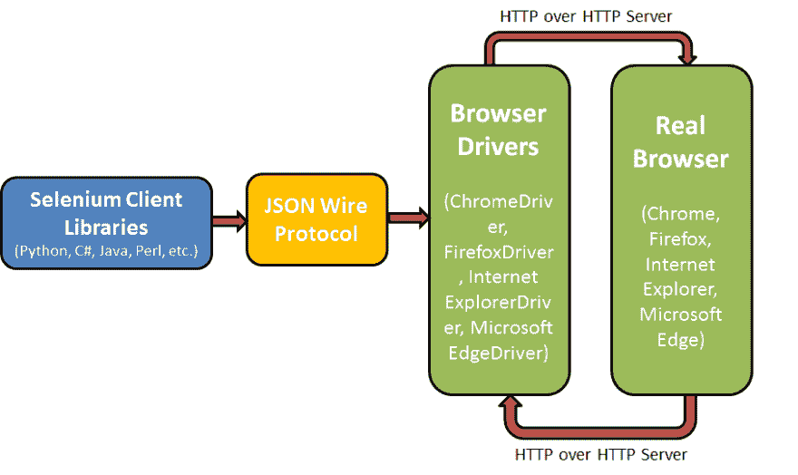](https://res.cloudinary.com/practicaldev/image/fetch/s--QyZswEU8--/c_limit%2Cf_auto%2Cfl_progressive%2Cq_auto%2Cw_880/https://www.lambdatest.com/blog/wp-content/uploads/2019/01/image2-6-1.png)

## Pytest 测试框架——简介及优势

Python 语言有几个测试框架可以简化 web 应用程序测试的任务，unittest 和 pytest 是使用最广泛的框架。unittest 是标准库(Python 中的)的一部分，是 Python 安装的一部分。对于使用 pytest 和 Selenium WebDriver 的测试自动化，您需要单独安装 pytest，它比 unittest 框架更受欢迎，下面是 Pytest 框架的一些优点。

*   可以被开发团队、测试团队、实践测试驱动开发(TDD)的团队以及开源项目使用。
*   可以用于应用程序和库的简单和复杂的功能测试用例。
*   易于将现有测试套件移植到 pytest，以便使用 pytest 和 Selenium WebDriver 执行测试自动化。
*   与 unittest & nose 等其他测试框架的兼容性，因此切换到这个框架非常容易。
*   支持参数化，这有助于使用简单的标记以“不同的配置”执行相同的测试。因此，你可以用“更少重复的代码实现”来提出更有效的测试用例/测试套件。
*   提供有关失败场景的更详细信息的断言数量。
*   支持夹具和类。使用 Fixtures，在整个模块/会话/函数/类中使用公共测试对象变得很容易。固定物和类将在随后的章节中详细介绍。
*   良好的最新文档。
*   xdist 支持，通过它可以并行化测试用例。

现在您已经了解了 pytest 相对于其他测试框架的优势，让我们详细了解一下 pytest 框架，以及它如何与 Selenium WebDriver 框架一起使用，以便为 web 应用程序执行[自动化跨浏览器测试](https://www.lambdatest.com/)。

总之，Pytest 是一个软件测试框架，可以用来轻松地制作简单的、可扩展的测试用例。

***嘿，你在找 [Hexo 测试](https://www.lambdatest.com/testing-cloud/hexo-testing?utm_source=devto&utm_medium=organic&utm_campaign=may10_rn&utm_term=rn&utm_content=testing_cloud)它测试你的基于 Hexo CSS 框架的网站，跨越 3000 多个不同的桌面和移动浏览器。***

## 使用 Pytest 进行自动化测试——安装和入门

如前所述，pytest 不是标准 Python 安装的一部分，需要单独安装。为了安装 pytest，您应该在提示符/终端上执行以下命令:
`pip install –U pytest`

安装完成后，您可以通过键入以下命令来验证安装是否成功:

`pytest --version`

下面是在 Linux 和 Windows 机器上执行上述命令时的输出。
[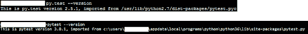T3】](https://res.cloudinary.com/practicaldev/image/fetch/s--c2GW_1UP--/c_limit%2Cf_auto%2Cfl_progressive%2Cq_auto%2Cw_880/https://www.lambdatest.com/blog/wp-content/uploads/2019/01/unnamed-15-1.png)

PyCharm 是一个流行的 IDE，用于 pytest 开发。您可以从这里安装 py charm edu Windows 版、Linux 版或 macOS 版。对于开发，我们使用 PyCharm for Windows。一旦安装了 PyCharm，您应该确保默认的测试运行程序是 pytest。为了更改默认的测试运行器，您应该导航到 File-> Settings-> Tools-> Python Integrated Tools，并更改默认的测试运行器，以便使用 pytest 和 Selenium WebDriver 执行测试自动化。

[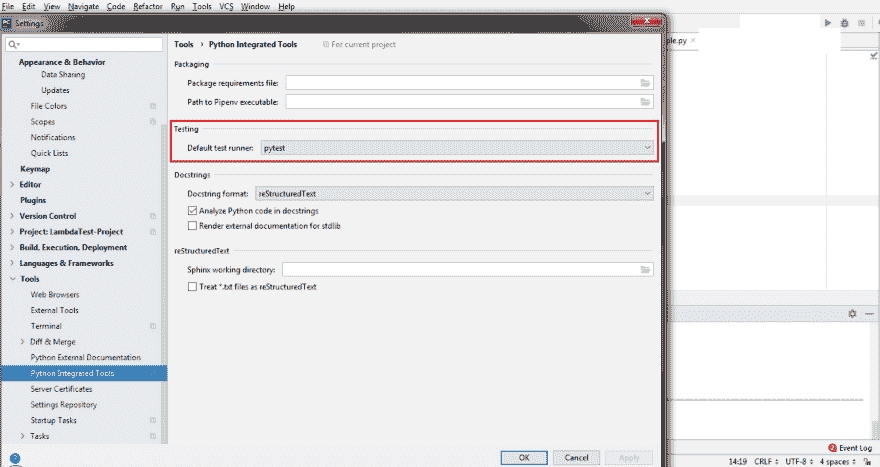](https://res.cloudinary.com/practicaldev/image/fetch/s--M3O2V_Lu--/c_limit%2Cf_auto%2Cfl_progressive%2Cq_auto%2Cw_880/https://www.lambdatest.com/blog/wp-content/uploads/2019/01/image10-3.png)

既然已经安装了 PyCharm Edu 版本，并且默认测试运行器被设置为 pytest，那么您需要为 Python 安装 Selenium 包，以便使用带有 Selenium WebDriver 的 pytest 来执行测试自动化。为了安装 Selenium，您应该在 PyCharm 的终端中调用下面提到的命令。

`pip install -U selenium ( Syntax – pip install –U )`

下面显示的是命令执行的快照。

[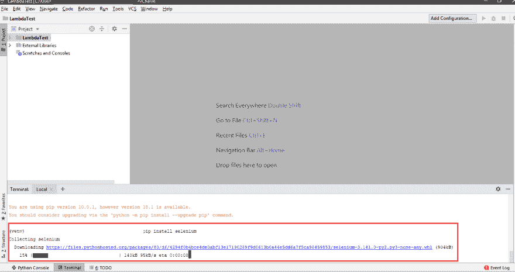](https://res.cloudinary.com/practicaldev/image/fetch/s--dNYpYo_p--/c_limit%2Cf_auto%2Cfl_progressive%2Cq_auto%2Cw_880/https://www.lambdatest.com/blog/wp-content/uploads/2019/01/image9-4.png)

现在您的开发环境已经设置好了，即 PyCharm 使用安装了 Selenium 的 pytest 执行测试自动化，我们来看看 pytest 的一些特性和方面。

## Pytest–用法、退出代码和编译

pytest 和 py.test 可以互换使用。为了获得 pytest 可以使用的参数的信息，您可以在终端上执行下面提到的命令

```
pytest --help     #Command to get help about the options that can be used with pytest command
# Details about fixtures
pytest --fixtures  #Shows the available built-in function arguments

```

[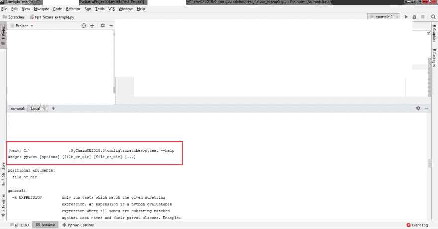](https://res.cloudinary.com/practicaldev/image/fetch/s--vwWDrY2b--/c_limit%2Cf_auto%2Cfl_progressive%2Cq_auto%2Cw_880/https://www.lambdatest.com/blog/wp-content/uploads/2019/01/image11-3-1.png)

当执行 pytest 代码时，它会导致以下退出代码之一。

| 退出代码 | 描述 |
| Zero | 成功执行测试用例/测试套件，最终结果为通过 |
| one | 测试用例/测试套件被执行，但是一些测试失败了 |
| Two | 用户停止了测试执行 |
| three | 执行测试时出现未知错误 |
| four | pytest 命令的用法不正确 |
| five | 未收集任何测试 |

包含 pytest 代码的文件应该命名为 test_*，这一点很重要。py 或*_test.py。为了编译和执行 pytest 源代码，以便使用带有 Selenium WebDriver 的 pytest 执行测试自动化，您可以在终端上使用以下命令。

`pytest --verbose --capture=no`

让我们看一些使用 pytest 的测试自动化的例子。我们从一个非常简单的例子开始——test _ py test _ example _ 1 . py(不言自明)

```
#pytest in action – test_pytest_example_1.py
def function_1(var):
  return var + 1

def test_success():
  assert function_1(4) == 5

def test_failure():
  assert function_1(2) == 5

```

在上面的代码片段中，我们创建了一个名为 function_1 的函数，它接受一个名为 var 的参数。有两个测试用例——test _ success()和 test_failure()。测试用例按顺序执行，并且在测试用例执行时发出断言。使用下面提到的命令编译代码。

`pytest --verbose --capture=no test_pytest_example_1.py`

如输出所示，第一个测试用例的结果是通过(显示为蓝色)，第二个测试用例的结果是失败(显示为红色)。

[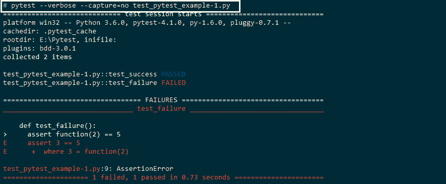](https://res.cloudinary.com/practicaldev/image/fetch/s--_TQL9bJT--/c_limit%2Cf_auto%2Cfl_progressive%2Cq_auto%2Cw_880/https://www.lambdatest.com/blog/wp-content/uploads/2019/01/image5-3.png)

pytest 使用 Python 中的 assert 来验证结果，它给出了有意义的信息，可用于验证和调试。pytest.raises 通常用于引发异常，下面是一个计算数字阶乘的示例。在一个测试案例中，负数作为输入传递给 factorial 函数，并引发 AssertionError。

factorial _ example . py–包含使用递归来计算输入数的阶乘的实现。在计算阶乘之前，会执行输入参数检查。如果输入数字为负数，将引发 Assert。

```
def factorial_function(number):
   # Perform a check whether the input number is positive or not, if it is not
   # positive, raise an assert
    assert number >= 0\. and type(number) is int, "The input is not recognized"

    if number == 0:
        return 1
    else:
      # recursive function to calculate factorial
        return number * factorial_function(number – 1)

```

test _ factorial _ example . py–使用阶乘功能的 pytest 实现。实现了三个测试用例——test _ standard _ library(factorial_function 的输出与从 math.factorial 模块获得的输出进行比较)、test_negative_number(当输入数为负时引发断言)和(factorial _ function 的输出结果与特定值进行比较)。

```
# Import the necessary modules/packages required for implementation
import pytest
import math

from factorial_example import factorial_function

def test_factorial_functionality():
    print("Inside test_factorial_functionality")

    assert factorial_function(0) == 1
    assert factorial_function(4)== 24

def test_standard_library():
    print("Inside test_standard_library")

    for i in range(5):
# verify whether factorial is calculated correctly
      # by checking against result against  standard
      # library - math.factorial()
        assert math.factorial(i) == factorial_function(i)

def test_negative_number():
    print("Inside test_negative_number")

   # This test case would pass if Assertion Error
   # is raised. In this case, the input number is negative
   # hence, the test case passes
    with pytest.raises(AssertionError): 
        factorial_function(-10)

```

您可以在命令提示符或 PyCharm IDE 的终端上使用命令 py . test–capture = no test _ factorial _ example . py 来执行代码。如快照所示，所有测试用例都已通过，控制台上输出了“print statement”下的日志。

[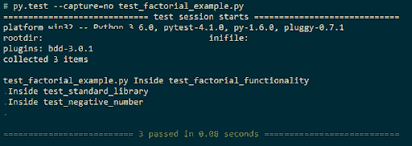](https://res.cloudinary.com/practicaldev/image/fetch/s--Rd9bSRYl--/c_limit%2Cf_auto%2Cfl_progressive%2Cq_auto%2Cw_880/https://www.lambdatest.com/blog/wp-content/uploads/2019/01/unnamed-16.png)

## 使用 Pytest-Fixtures 进行自动化测试(使用和实现)

考虑一个例子，您必须对包含组织内员工信息的数据库执行某些 MySQL 查询。执行一个查询所需的时间取决于数据库中的记录数量(即雇员数量)。在执行查询之前，必须执行所需的操作(w.r.t 数据库连接),并且在涉及数据库的后续实现中将使用“返回的句柄”。数据库操作可能是 CPU 密集型的(随着记录数量的增加),因此应该避免重复的实现和执行。有两种方法可以解决这个问题。

1.  借助经典的 xunit 风格设置和拆卸方法。
2.  通过使用夹具(推荐)。

unittest 已经支持 xunit 风格的 fixture，但是 pytest 有更好的方法来处理 fixture。夹具是一组必须在测试开始之前设置的资源，并且必须在测试执行完成之后清理。它包含了对安装和拆卸函数的经典实现的许多改进。使用夹具的主要优点是:

*   开发者可以设置夹具的寿命和范围。实现的 fixture 的范围可以是模块、函数、类或者整个项目。
*   夹具以模块化的方式实现；因此不存在学习曲线。
*   函数作用域的 fixtures 为测试代码带来了必要的可读性和一致性。这使得可维护性变得容易&不那么令人生畏。
*   Fixture 函数利用了称为“依赖注入”的面向对象编程设计概念，其中 fixture 函数承担注入器的角色&测试函数被视为 fixture 对象的消费者。
*   每个 fixture 都有一个名字(类似于一个函数名)，这个名字反过来可以调用其他 fixture 函数。
*   夹具可以重用，它可以用于简单的单元测试，也可以用于测试复杂的用例。

自从 3.5 版本发布以来，就实例化而言，较高范围的装置优先于较低范围的装置。较高范围的 fixture 包括会话，较低范围的 fixture 包括类、函数等。您甚至可以“参数化”这些 fixture 函数，以便在执行依赖测试的同时多次执行它们。夹具参数化已被广泛用于编写详尽的测试函数。下面是一个使用 pytest 进行测试自动化的简单代码，其中调用了“资源 1”的 setup()和 teardown()，即使在执行 test_2 时也是如此。由于这是一个简单的实现(具有较少的计算)，即使在“不必要的设置和模块调用被调用”时也不会有太多的开销，但是如果涉及任何“CPU 密集型”操作(如数据库连接)，它可能会影响整体代码性能:

```
#Import all the necessary modules
import pytest

def resource_1_setup():
    print('Setup for resource 1 called')

def resource_1_teardown():
    print('Teardown for resource 1 called')

def setup_module(module):
    print('\nSetup of module is called')
    resource_1_setup()

def teardown_module(module):
    print('\nTeardown of module is called')
    resource_1_teardown()

def test_1_using_resource_1():
    print('Test 1 that uses Resource 1')

def test_2_not_using_resource_1():
    print('\nTest 2 does not need Resource 1')

```

通过在终端上调用以下命令，执行测试用例“test_2_not_using_resource_1”。

`pytest --capture=no --verbose test_fixtures.py::test_2_not_using_resource_1`

从输出[Filename–py test-Fixtures-problem . png]中可以看出，即使执行了“test_2 ”,也不必要地调用了“resource 1”的 fixture 函数。这个问题可以通过使用夹具来解决；在接下来的例子中，我们会看到同样的情况。

[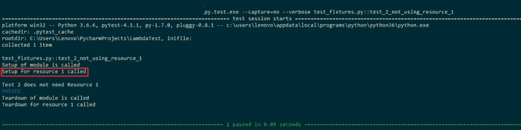](https://res.cloudinary.com/practicaldev/image/fetch/s--xvZFvl9r--/c_limit%2Cf_auto%2Cfl_progressive%2Cq_auto%2Cw_880/https://www.lambdatest.com/blog/wp-content/uploads/2019/01/image8-1-1.png)

如下例所示，我们定义了一个 fixture 函数 resource_1_setup()(类似于 xunit 风格实现中的 setup)和 resource_1_teardown()(类似于 xunit 风格实现中的 teardown)。fixture 函数使用@pytest.fixture(scope='module ')具有' module scope '。

```
#Import all the necessary modules
import pytest

#Implement the fixture that has module scope
@pytest.fixture(scope='module')
def resource_1_setup(request):
    print('\nSetup for resource 1 called')

    def resource_1_teardown():
        print('\nTeardown for resource 1 called')

    # An alternative option for executing teardown code is to make use of the addfinalizer method of the request-context
    # object to register finalization functions.
    # Source - https://docs.pytest.org/en/latest/fixture.html
    request.addfinalizer(resource_1_teardown)

def test_1_using_resource_1(resource_1_setup):
    print('Test 1 uses resource 1')

def test_2_not_using_resource_1():
    print('\n Test 2 does not need Resource 1')

```

我们通过触发所有测试用例来执行代码，即 test _ 1 _ using _ resource _ 1()& test _ 2 _ not _ using _ resource _ 1()。如下面的输出[Filename–py Test-Fixtures-all-tests-executed . png]所示，仅对测试 1 调用“资源 1 的设置”，而不对测试 2 调用。

[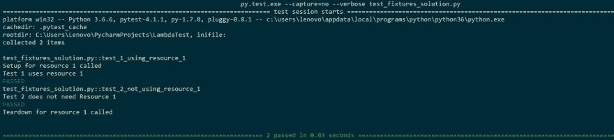](https://res.cloudinary.com/practicaldev/image/fetch/s--jun2MSPp--/c_limit%2Cf_auto%2Cfl_progressive%2Cq_auto%2Cw_880/https://www.lambdatest.com/blog/wp-content/uploads/2019/01/image7-3.png)

现在，我们只执行测试用例 2，即 test_2_not_using_resource_1()。如下面的输出[Filename–py test-Fixtures-only-2-tests-executed . png]所示，由于只执行了 test case–2，因此没有调用“资源 1”的设置和拆卸函数。这就是 fixtures 非常有效的地方，因为它消除了“重复代码”和“不必要代码的执行”。关于 pytest 中夹具的官方文档可以在这里找到。

[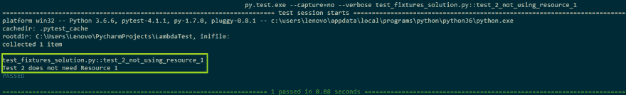](https://res.cloudinary.com/practicaldev/image/fetch/s--7j6b5qPJ--/c_limit%2Cf_auto%2Cfl_progressive%2Cq_auto%2Cw_880/https://www.lambdatest.com/blog/wp-content/uploads/2019/01/image6-2.png)

***嘿，你在找 [HubSpot 测试](https://www.lambdatest.com/testing-cloud/hubspot-testing?utm_source=devto&utm_medium=organic&utm_campaign=may10_rn&utm_term=rn&utm_content=testing_cloud)它测试你的基于 HubSpot CSS 框架的网站，跨越 3000 多个不同的桌面和移动浏览器。***

## 使用 Pytest 和 Selenium WebDriver 进行自动化测试

当您寻找一个测试自动化框架时，您可能需要一个能够满足您所有需求的测试框架，例如单元测试、功能测试、验收测试等等。框架应该有记录事件、生成测试报告的能力，并且应该有良好的社区支持。Pytest 满足了所有这些要求，强烈推荐使用 pytest 和 Selenium WebDriver 进行自动化测试，因为它不涉及陡峭的学习曲线。

当您计划使用 pytest 和 Selenium WebDriver 开发测试自动化时，您需要考虑的第一个问题是何时加载浏览器。不建议在每次测试后加载新的浏览器实例，因为这不是一个可伸缩的解决方案，可能会增加整个测试的执行时间。建议在实际测试用例开始之前加载浏览器(在测试中),并在测试完成后立即卸载/关闭浏览器实例。这可以通过在 pytest 中使用 fixture 来实现[下面在使用 Pytest 的自动化测试中讨论——fixture(使用和实现)一节]。如前所述，Fixtures 广泛使用了一个被称为“依赖注入”的概念，依赖可以在实际测试开始之前加载。

默认情况下，固定装置具有“功能”范围，这取决于需求；您可以将实现的 fixture 的范围更改为模块、会话或类。就像“C 语言中变量的生存期”一样，fixture 的作用域表示特定 fixture 将被创建多少次。

| 夹具范围 | 说明 |
| 功能 | 每个测试会话执行/运行一次夹具 |
| 会议 | 为整个测试会话创建一个夹具 |
| 班级 | 每类测试只创建一个夹具 |
| 组件 | 每个模块创建一次夹具 |

一旦执行了测试，您可能会对以报告格式(比如 HTML)捕获测试结果感兴趣。您需要安装 pytest-html 模块。

`pip install pytest-html`

下面是执行中的命令的快照。

[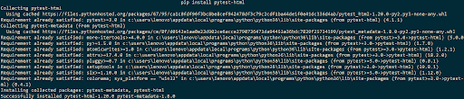](https://res.cloudinary.com/practicaldev/image/fetch/s--LB26LVGL--/c_limit%2Cf_auto%2Cfl_progressive%2Cq_auto%2Cw_880/https://www.lambdatest.com/blog/wp-content/uploads/2019/01/unnamed-17-1.png)

现在您已经了解了 pytest fixtures、Selenium 和 Selenium WebDriver 接口；让我们来看一个所有这些事情都在起作用的例子。在开始实现之前，请确保您分别从这里和这里下载了 Gecko Firefox 驱动程序和 Chrome driver Chrome 驱动程序。为了避免提及下载驱动程序的“路径/位置”,请确保将这些驱动程序放在相应浏览器所在的位置。在下面的快照中，你可以看到我们在火狐浏览器(firefox.exe)所在的位置复制了 Geckodriver.exe。

[](https://res.cloudinary.com/practicaldev/image/fetch/s--vtvUPqKO--/c_limit%2Cf_auto%2Cfl_progressive%2Cq_auto%2Cw_880/https://www.lambdatest.com/blog/wp-content/uploads/2019/01/image4-6.png)

现在您已经准备好了设置，让我们开始实现。在开始时导入所有必要的模块，这样可以避免错误。在我们的例子中，导入的模块是 selenium、pytest、pytest-html。两个 fixture 函数-driver _ init()和 chrome_driver_init()具有“类”范围。如 fixture 函数 driver_init()所示，Firefox 的一个实例是使用 GeckoDriver 创建的，而在 chrome_driver_init()中，chrome 浏览器的一个实例是使用 ChromeDriver 创建的。yield 包含 teardown 的实现，即 yield 内部的代码负责执行清理活动。一个类用来分组测试用例，在这个例子中，有两个重要的类，即 Test_URL()和 Test_URL_Chrome()。实现的类使用了通过 mark . use fixtures[@ pytest . mark . use fixtures(" driver _ init ")]实现的 fixtures。测试用例执行一个简单的测试，调用相应的浏览器(Firefox/Chrome)并打开提供的 URL，即[https://www.lambdatest.com/](https://www.lambdatest.com/)文件名–test _ selenium _ web driver-2 . py

```
# Import the 'modules' that are required for execution

import pytest
import pytest_html
from selenium import webdriver
from selenium.webdriver.chrome.options import Options
from selenium.webdriver.common.keys import Keys
from time import sleep

#Fixture for Firefox
@pytest.fixture(scope="class")
def driver_init(request):
    ff_driver = webdriver.Firefox()
    request.cls.driver = ff_driver
    yield
    ff_driver.close()

#Fixture for Chrome
@pytest.fixture(scope="class")
def chrome_driver_init(request):
    chrome_driver = webdriver.Chrome()
    request.cls.driver = chrome_driver
    yield
    chrome_driver.close()

@pytest.mark.usefixtures("driver_init")
class BasicTest:
    pass
class Test_URL(BasicTest):
        def test_open_url(self):
            self.driver.get("https://www.lambdatest.com/")
            print(self.driver.title)

            sleep(5)

@pytest.mark.usefixtures("chrome_driver_init")
class Basic_Chrome_Test:
    pass
class Test_URL_Chrome(Basic_Chrome_Test):
        def test_open_url(self):
            self.driver.get("https://www.lambdatest.com/")
            print(self.driver.title)

            sleep(5)

```

因为我们需要 HTML 文件中的测试输出，所以在执行测试代码时，我们使用–HTML =参数。使用 pytest 和 Selenium WebDriver 执行测试自动化的完整命令:

`py.test.exe --capture=no --verbose --html=pytest_selenium_test_report.html test_selenium_webdriver-1.py`

下面是执行输出，testcase test_open_url()是为类 Test_URL & Test_URL_Chrome()执行的。测试报告为 PyTest _ Selenium _ test _ report . html[Image–PyTest-Selenium-Output-1 . png]。这里是一份测试报告，以进一步明确。

[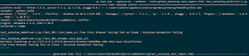](https://res.cloudinary.com/practicaldev/image/fetch/s--2kMXtsMG--/c_limit%2Cf_auto%2Cfl_progressive%2Cq_auto%2Cw_880/https://www.lambdatest.com/blog/wp-content/uploads/2019/01/unnamed-18-1.png)
[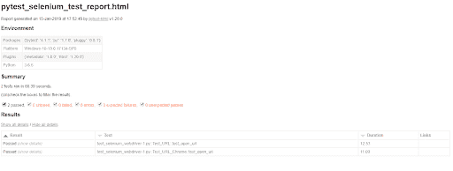T6】](https://res.cloudinary.com/practicaldev/image/fetch/s--MAn849x9--/c_limit%2Cf_auto%2Cfl_progressive%2Cq_auto%2Cw_880/https://www.lambdatest.com/blog/wp-content/uploads/2019/01/unnamed-19-1.png)

从上面的实现中可以看出，Firefox 和 Chrome 浏览器的 fixture 函数之间的唯一区别是“各自浏览器的设置”。两种浏览器的大部分实现是相同的[看看 Test_URL()、Test_URL_Chrome()]，因此通过避免“代码重复”来优化代码变得很重要。这可以通过使用“参数化夹具”来实现。正如在实现[Filename–test _ selenium _ web driver-1 . py]中看到的，主要的变化是向 fixture 添加了“参数”，即@ pytest . fixture(params =[" chrome "，" firefox"]，scope="class ")。根据使用的浏览器，相应的 web 驱动程序用于调用浏览器。

```
# Import the 'modules' that are required for execution

import pytest
import pytest_html
from selenium import webdriver
from selenium.webdriver.chrome.options import Options
from selenium.webdriver.common.keys import Keys
from time import sleep

#Fixture for Firefox
@pytest.fixture(params=["chrome", "firefox"],scope="class")
def driver_init(request):
    if request.param == "chrome":
        web_driver = webdriver.Chrome()
    if request.param == "firefox":
        web_driver = webdriver.Firefox()
    request.cls.driver = web_driver
    yield
    web_driver.close()

@pytest.mark.usefixtures("driver_init")
class BasicTest:
    pass
class Test_URL(BasicTest):
        def test_open_url(self):
            self.driver.get("https://www.lambdatest.com/")
            print(self.driver.title)

            sleep(5)

```

在我们的例子中，我们使用 Chrome 和 Firefox 浏览器，测试用例 Test_URL()将针对每个浏览器分别执行。如输出所示，测试用例被调用一次，参数为“firefox”和“chrome”。

[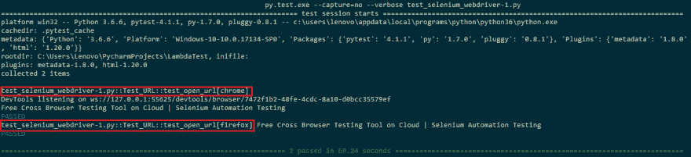](https://res.cloudinary.com/practicaldev/image/fetch/s--l9httudD--/c_limit%2Cf_auto%2Cfl_progressive%2Cq_auto%2Cw_880/https://www.lambdatest.com/blog/wp-content/uploads/2019/01/image13-1-1.png)

***嘿，你在找 [Hugo 测试](https://www.lambdatest.com/testing-cloud/hugo-testing?utm_source=devto&utm_medium=organic&utm_campaign=may10_rn&utm_term=rn&utm_content=testing_cloud)它测试你的基于 Hugo CSS 框架的网站，跨越 3000 多个不同的桌面和移动浏览器。***

## 跨浏览器测试用 Pytest，Selenium & Lambdatest

您可以在本地机器或测试机器上执行的测试数量总是有限制的，因为全面的测试必须在不同类型的设备(手机、平板电脑、台式机等)上执行。)、操作系统(Windows、Linux、macOS、Chrome 等。)以及 Chrome、Firefox、Safari、Opera 等浏览器。建立一个“本地测试环境/测试场”不是一个可扩展且经济的选择。这是您的测试团队可以利用 Lambdatest 在云功能上的跨浏览器测试的地方。

您可以在不同的浏览器(甚至旧版本)、设备等上对您的 web 应用程序/网站执行手动和自动跨浏览器测试。您还可以通过使用他们的隧道功能来执行实时测试，该功能允许您从终端使用他们的测试基础设施。[LambdaTest Selenium Automation](https://www.lambdatest.com/selenium-automation)Grid 使您能够在安全、可靠、可伸缩的 Selenium 基础设施上执行端到端的自动化测试。您不仅可以利用 LambdaTest Selenium 网格来增加整体代码覆盖率(通过测试)，还可以减少执行用 Python 编写的自动化脚本所需的总时间。

## 结论

使用 Pytest 和 Selenium WebDriver 进行自动化测试是一个非常好的选择，因为它是一个具有良好特性的框架，测试工程师可以用它来实现容易实现且可伸缩的实现。它可以用于编写简单场景和高度复杂场景的测试用例。精通 Python、unittest/其他基于 Python 的测试框架的开发人员/测试人员会发现 pytest 很容易学习。由于 pytest 利用了“依赖注入”等概念，因此“源代码的可维护性”的成本更低。

如果您正在寻找测试 web 应用程序或网站，您可以使用 pytest with Selenium framework 来执行测试自动化。由于设备的数量与日俱增，针对不同的设备、操作系统和浏览器测试您的代码变得非常不可能；这就是测试人员/开发人员可以利用 Lambdatest 的'[跨浏览器测试工具](https://www.lambdatest.com/)的地方，它允许您使用 pytest 和 Selenium WebDriver 轻松地执行测试自动化。

原文出处:[lambdatest.com](https://www.lambdatest.com/blog/test-automation-using-pytest-and-selenium-webdriver/)

相关文章:

1.  [使用 PyUnit 测试 Selenium Python 测试套件](https://www.lambdatest.com/blog/using-pyunit-for-testing-a-selenium-python-test-suite/)
2.  [使用 JUnit 和 Selenium 对浏览器兼容性进行自动化测试](https://www.lambdatest.com/blog/automated-testing-with-junit-and-selenium-for-browser-compatibility/)