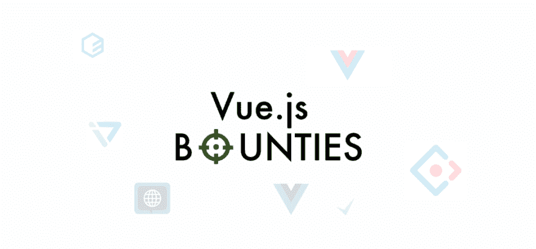
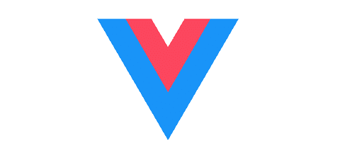
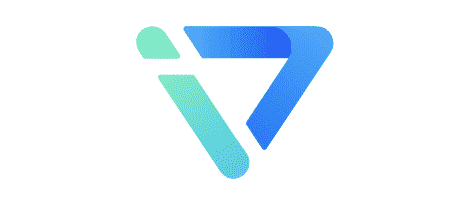
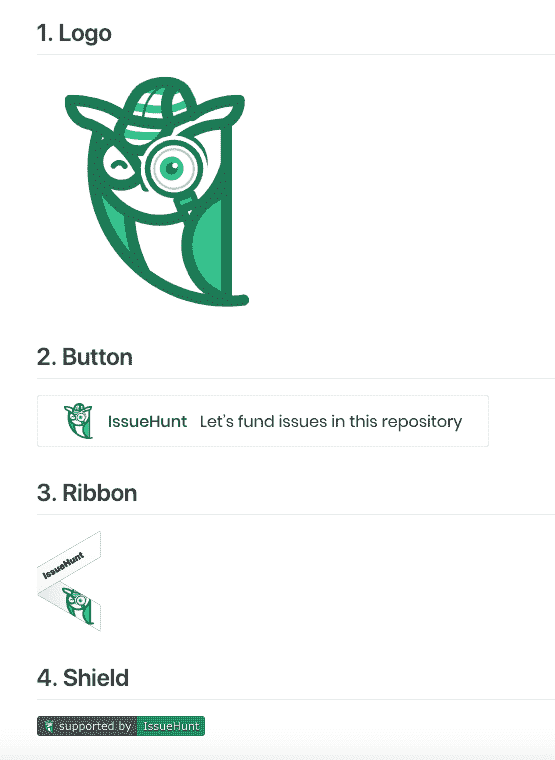

# Vue.js 赏金猎人项目

> 原文：<https://dev.to/issuehunt/vuejs-projects-for-bounty-hunters-1m4p>

IssueHunt 是一个面向开源项目的基于问题的赏金平台。
自 2018 年 7 月推出以来，许多项目一直在参与发行 Hunt。

[https://issuehunt.io](https://issuehunt.io)

今天总结了一下赏金猎人的 Vue.js 项目。

# 特色 Vue.js 项目发布

### 元素

用于 Web 的 Vue.js 2.0 UI 工具包

[查看发行号](https://issuehunt.io/repos/67274736)

* * *

### Ant 设计视图

一个基于 Ant 设计和 Vue 的企业级 UI 组件。🐜

[查看发行号](https://issuehunt.io/repos/104172832)

* * *

### vue-元素-管理

🎉神奇的 vue 管理员

[查看发行号](https://issuehunt.io/repos/88464704)

* * *

### iView

基于 Vue.js 2.0 构建的高质量 UI 工具包

[查看发行号](https://issuehunt.io/repos/64355429)

* * *

# 当前排行榜

*   $150.00 / ant-design-vue: [设计新标志](https://issuehunt.io/repos/104172832/issues/412)

*   $80.00 / vue-element-admin: [错误:加载块 1 失败。在 HTMLScriptElement.d](https://issuehunt.io/repos/88464704/issues/439)

*   $60.00 / vue-i18n: [链接消息翻译翻译后的消息](https://issuehunt.io/repos/19382828/issues/478)

*   $40.00/vue-element-admin: [Can the background management system add a new printing function](https://issuehunt.io/repos/88464704/issues/1245)

*   10.00 美元/ iview: [在表扩展组件](https://issuehunt.io/repos/64355429/issues/3546)上

*   $40.00 / goodwork: [为应用程序](https://issuehunt.io/repos/81873619/issues/395)创建自定义数字海洋图像

*   $30.00 / goodwork: [添加登录流程测试](https://issuehunt.io/repos/81873619/issues/254)

*   $40.00 / gridsome: [Airtable 插件](https://issuehunt.io/repos/143078055/issues/29)

*   $40.00 /元素:[通过搜索字段过滤表格](https://issuehunt.io/repos/67274736/issues/3308)

*   $5.00 / iview: [日历组件](https://issuehunt.io/repos/64355429/issues/1910)

*   $5.00 / iview: [模态:通过代码移除“加载”标志，不关闭模态](https://issuehunt.io/repos/64355429/issues/2364)

*   $20.00 / gridsome: [Retina 支持 gridsome 图像](https://issuehunt.io/repos/143078055/issues/66)

*   $20.00 / gridsome: [更多降价扩展](https://issuehunt.io/repos/143078055/issues/61)

[发现更多项目](https://issuehunt.io/repos)

* * *

# 关于发行的材料

我们已经提供了几份发行账户的材料。

*   GitHub 自述文件的按钮和屏幕
*   登录页面的功能区

请随意使用这些东西，并收集赞助商！

[发行库存材料](https://github.com/BoostIO/issuehunt-materials)

* * *

# 关于赞助计划

[对于开源可持续发展:引入 IssueHunt 赞助计划](https://medium.com/issuehunt/for-open-source-sustainability-introducing-issuehunt-sponsorship-program-ac80e0e331e2)

我们正在寻找 OSS 的两种赞助商。

*   ①月订阅:使企业能够每月资助在 IssueHunt 上上市的开源。发行机构将募集的资金分配给有前途的 OSS 项目。
*   ②IssueHunt Fest:我们在每年的 4 月和 12 月组织为期一个月的 OSS 赞助活动。我们为愿意支持这项活动的公司提供三种赞助选择。

[> > >申请资助< < <](https://issuehunt.io/sponsorship)

* * *

谢谢你，
发行团队

