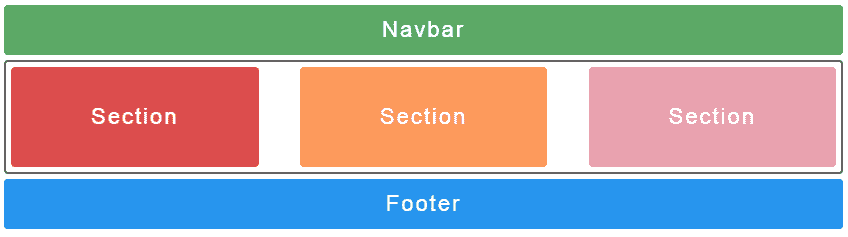
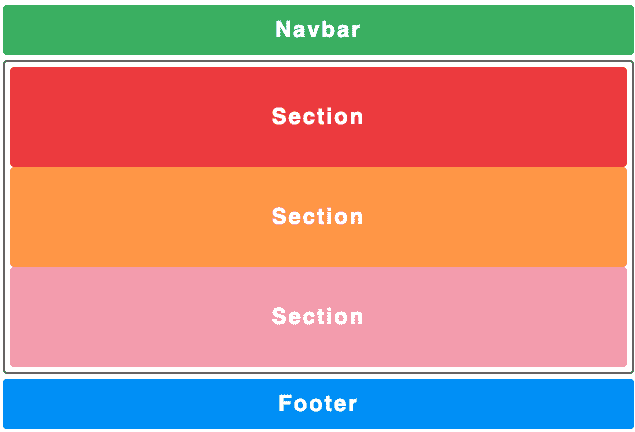
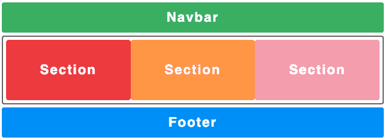
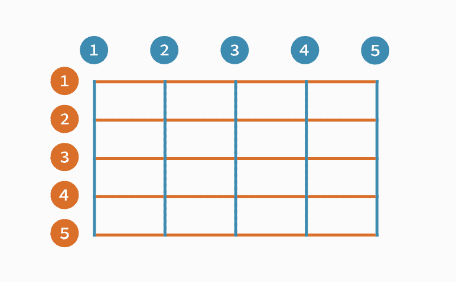
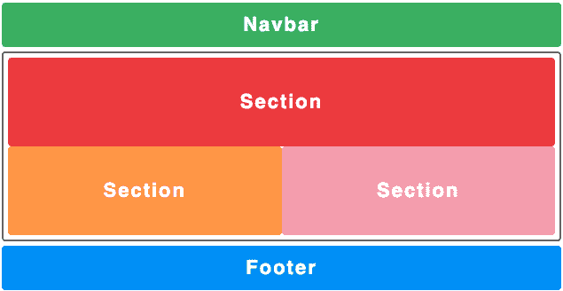
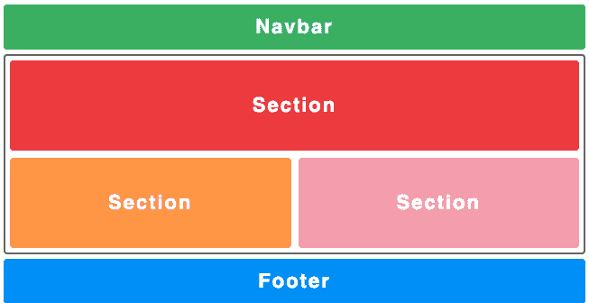
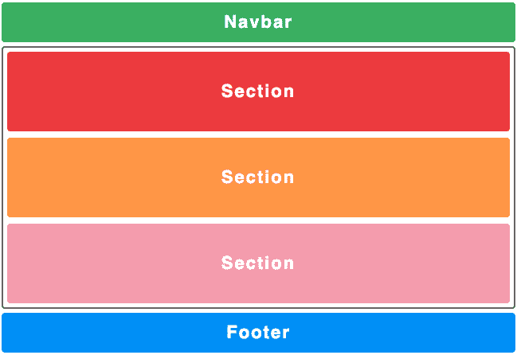
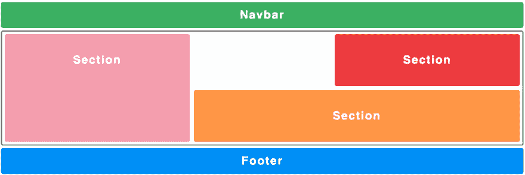

# 浮动和 flexbox 问题的 CSS 网格解决方案

> 原文：<https://dev.to/apium_hub/css-grid-solution-to-the-problems-of-float-and-flexbox-3hdn>

在继续解释什么是 *CSS 网格*以及它的用途之前，我将解释我们在开发网站布局时所拥有的工具的当前状态。

假设我们想要创建以下布局:

[](https://apiumhub.com/wp-content/uploads/2019/02/navbar1.png)

我们应该对每个必要的部分使用 html，例如:

```
 <body>
<nav>Navbar</nav>
<main class="container">
    <section class="left">Section</section>
    <section class="center">Section</section>
    <section class="right">Section</section>
</main>
<footer>Footer</footer>
</body> 
```

使用这个 *HTML* 我们将添加使用*浮动、flexbox* 和 *CSS 网格*的样式。

## 浮动

当使用 *float* 时，我们面临着创建布局的一些主要问题，因为 *float* 属性不是为创建布局而设计的，尽管它被用于创建布局。正如在*浮动*规范中提到的，浮动的使用仅限于指定一个元素将浮动到容器的右边或左边，而其内容的其余部分将围绕它浮动*。然而，使用*浮动*在我们的布局中定位元素可能会导致一系列奇怪的错误，需要“黑客”来解决它们，正如在[这篇关于*浮动*的文章](https://css-tricks.com/all-about-floats/#article-header-id-3)中提到的。为了实现下面的布局，我们应该使用一个 *CSS* [，就像这样](https://jsfiddle.net/arnausd/bxmhwf4t/)(我只添加了必要的 CSS，在前面的链接中会显示完整的代码):*

```
 .container {
  text-align: center; /* necesario para la class .center */
}

.container:after {
  content: "";
  display: table;
  clear: both;
}

.left {
  float: left;
}

.center {
  margin: 0 auto;
  display: inline-block;
}

.right {
  float: right;
} 
```

通过查看生成的 css，我们可以看到我们需要如何应用“补丁”来将。中心类，并使用 [clearfix hack](https://www.w3schools.com/howto/howto_css_clearfix.asp) 来防止。容器类不会因为让其子元素作为浮动元素而失去大小。

为了处理设计时需要的所有这些黑客， *flexbox* 应运而生，它提供了对 *float* 的重大改进。

## Flexbox

Flexbox 允许你创建出适应屏幕尺寸的布局，并让我们摆脱使用*浮动*的缺点，例如在特定屏幕尺寸下调整我们的元素。尽管如此，flexbox 的一个缺点是，它只允许我们横向或纵向组织我们的元素，而不是同时组织两者，这极大地限制了我们的可能性。为了创建下面的布局，我们应该使用一个 CSS [，就像这个](https://jsfiddle.net/arnausd/9th4c2g8/):

```
 .container {
  display: flex;
  justify-content: space-between;
}

.left {
  background-color: #dc4d4d;
}

.center {
  background-color: yellow;
}

.right {
  background-color: #e8a2af;
} 
```

在前面的代码中，我们看到不再需要在三列中指定任何内容，我们只需修改类的属性。容器，我们可以舒适地放置我们的元素。尽管在这个例子中没有被意识到，并且如上所述， *flexbox* 在垂直或水平的单一方向上工作得很好，但是如果我们想要在两个方向上的布局定位元素中工作，我们面临另一个共同的问题，不仅在 *flexbox* 中，而且在使用*浮动*时。

## 使用不必要的标签

同时使用 *flexbox* 和 *float* 的另一个缺点是，我们必须将元素分组放在盒子中，因为我们需要一组特定的元素一起放在同一区域。在 flexbox 的情况下，假设我们在一个水平布局中工作，我们应该将所有想要的元素垂直分组到一个新的父标签中，该标签将包含所有要垂直放置的元素，并在那里指定垂直方向。这样做迫使我们添加不必要的不提供任何语义值的 *html* 标签。

```
 <body>
<nav></nav>
<main class="container">
    <section class="left"></section>
    <section class="center"></section>
    <section class="right"></section>
    <div class="container container--vertical">
        <section class="first"></section>
        <section class="second"></section>
        ...
    </div>
</main>
<footer></footer>
</body> 
```

在前面的示例中，我们可以看到我们需要如何添加一个新的

to encapsulate the elements that we want to position vertically and despite being a single extra element, this large scale can lead us to have hundreds of tags without any semantic value, so that we would have a complex *html* without semantics.

## CSS 网格解决方案

为了解决使用 *float* 或 *flexbox* 时的问题，css grid 出现了，它不强迫我们使用“黑客”来实现我们的 *CSS* 的预期行为，并提供了在两个方向上设计布局的可能性，而无需添加额外和不必要的元素来实现它。使用 *grid* 的另一个优点，也许是最重要的一个，是它设法将我们的 *HTML* 从 css 中分离出来，我们不再需要修改或改编我们的 *html* 来很好地适应我们的 css，有了 grid 我们就能得到 *html* 应该有的样子，标记。

## CSS 网格

鉴于[大多数浏览器](https://caniuse.com/#feat=css-grid)都支持 css grid，它已经成为一个越来越有可能取代 *flexbox* 的选项，后者是其最近的竞争对手。

CSS grid 的主要概念与 flexbox 非常相似:我们有一个容器，其中包含一系列应用了网格属性的元素。

我们将开始将 display property: grid 应用到我们的。容器，这将表明我们的容器是一个网格，但由于没有指定任何其他内容，它只是将 div 一个一个地堆叠起来。

```
 .container {
  display: grid;
} 
```

[](https://apiumhub.com/wp-content/uploads/2019/02/navbar2.png)

[拉小提琴](https://jsfiddle.net/arnausd/asgvjbxL/)

## 网格-模板-列和网格-模板-行

现在我们将指定布局的形式。因为我们需要 3 列和一行，所以我们将使用属性 grid-template-columns 和 grid-template-rows，我们将为每行或每列传递所需的值。

```
 .container {
  display: grid;
  grid-template-columns: 33.33% 33.33% 33.33%;
  grid-template-rows: 100%;
} 
```

[](https://apiumhub.com/wp-content/uploads/2019/02/navbar3.png)

## 网格-列和网格-行

我们将继续定位元素:为此我们可以使用 grid-column 和 grid-row 属性。指定它的开始和结束，例如，grid-column-start 和 grid-column-end，我们可以定义我们的列和行从哪一行开始和结束。这为我们创建布局提供了很大的灵活性，也是一个非常简单的工具。在下图中，我们将看到线条是如何分布的，从 1 开始(如果我们用网格显示来检查元素，大多数浏览器会显示网格，这有助于区分这些线条):

[](https://apiumhub.com/wp-content/uploads/2019/02/5.png)

[*图片来源*](https://cms-assets.tutsplus.com/uploads/users/30/posts/27844/image/grid-terms-line-numbers-.svg)

```
 .container {
  ...
  grid-template-rows: 100px 100px; /* Usamos 100px como tamaño de las rows ya que es nuestro height fixo para secciones */
}

.left {
  grid-column-start: 1;
  grid-column-end: 3;
  /* también se puede resumir como grid-column: 1/3 */
} 
```

[](https://apiumhub.com/wp-content/uploads/2019/02/navbar6.png)

[拉小提琴](https://jsfiddle.net/arnausd/8men10jd/)

## 重复()，fr 和 grid-gap

现在我们将开始创建更精细的布局。首先，我们将使用单位 ab 的缩写*分数*，它从容器的总可用空间中取指定值。这个单位非常有用，因为它可以防止我们进行不必要的计算。我们还将使用 repeat()函数，它接受重复的次数作为第一个参数，接受一个值作为第二个参数。使用这个函数将防止我们重复列或行，例如 grid-template-rows: 1fr 1fr 1fr …最后，我们将使用 grid-gap 属性，它是 grid-row-gapy grid-column- gap 的缩写，按照这个顺序，我们可以为两者指定一个通用值，也可以为每一个指定一个特定值。

```
 .container {
  ...
  grid-template-column: repeat(3, 1fr);
  grid-template-row: repeat(3, auto);
  grid-gap: 8px;
} 
```

[](https://apiumhub.com/wp-content/uploads/2019/02/navbar7.png)

## 网格-模板-区域

除此之外，我们将使用 *CSS grid* 最有用和创新的属性之一，属性 grid-template-areas。这允许我们定义一个“方案”,在这个方案中，我们可以定义在网格的每个单元中需要哪个元素。我们将为每个元素分配一个 grid-area 属性，这将是我们想要使用的区域的名称。我们已经定义了 3 列 3 行，因此我们的模板将如下所示:

```
 .container {
  ...
  grid-template-areas: 
    "f f f"
    "s s s"
    "t t t";
}

.left {
  ...
  grid-area: f
}

.center {
  ...
  grid-area: s
}

.right {
  ...
  grid-area: t
} 
```

[](https://apiumhub.com/wp-content/uploads/2019/02/navbar9.png)

能够设计我们的布局，除了非常快速和直观之外，还允许我们完全修改 *HTML* 的结构，而不必接触它的任何部分，这被称为源顺序*独立性*。假设我们想改变手机的布局:

```
 @media screen and (max-width: 640px) {
  .container {
    ...
    grid-template-areas: 
      "t t t"
      "s s s"
      "f f f";
  }
} 
```

简单地说，通过 css 中的这个变化，我们已经完全修改了我们的整个布局，没有 *CSS grid* 这是不可能做到的。

这个令人难以置信的属性允许我们非常快速地修改我们的布局，允许我们非常快速地创建简单的模型，我们可以移动我们布局中的不同元素，以查看我们如何更喜欢它们。

```
 .container {
  ...  
  grid-template-areas: 
    "t . f"
    "t s s"
    "t s s";
}

.section {
  // height: 100px;
} 
```

[](https://apiumhub.com/wp-content/uploads/2019/02/navbar10.png)

我给 codepen 添加了一个链接,在这个链接中我可以修改属性 grid-template-areas，这样就可以看到布局是如何变化的。

## 何时使用 css 网格

正如我们已经说过的， *flexbox* 选择基于单向容器的方法，而 *CSS grid* 选择双向布局。因此， *flexbox* 更适合组件的使用，因为组件的大部分内容通常是单向的，因为它通常是小规模的内容，而如果我们需要一个更复杂的布局，有不同的方向，我们会使用 *CSS grid* 。

还必须考虑到对两种浏览器的支持，因为如果我们想支持 *IE* 浏览器，我们应该选择 *flexbox* ，因为更多使用的有 *polyfills* 适配 *IE* 。

如果你对 css grid 或者软件开发感兴趣，我强烈推荐你订阅我们的每月简讯！

帖子 [CSS Grid 解决 float 和 flexbox](https://apiumhub.com/tech-blog-barcelona/css-grid/) 的问题首先出现在 [Apiumhub](https://apiumhub.com) 上。