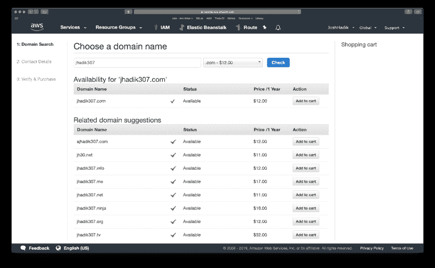
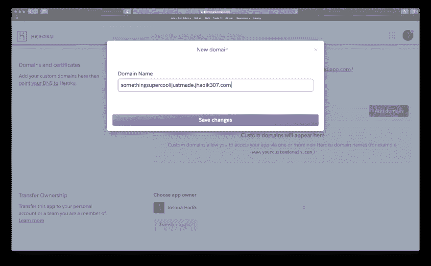
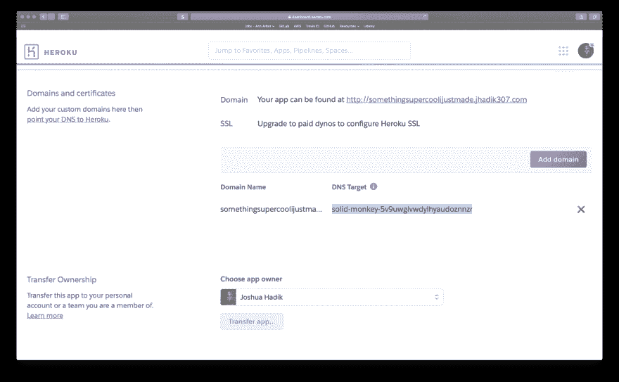
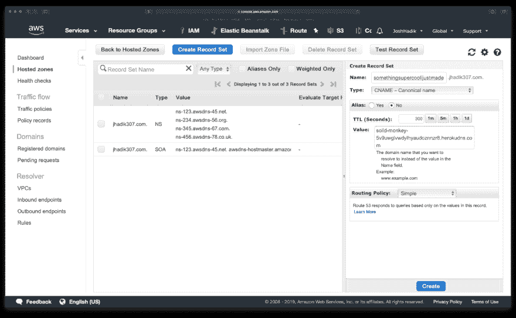
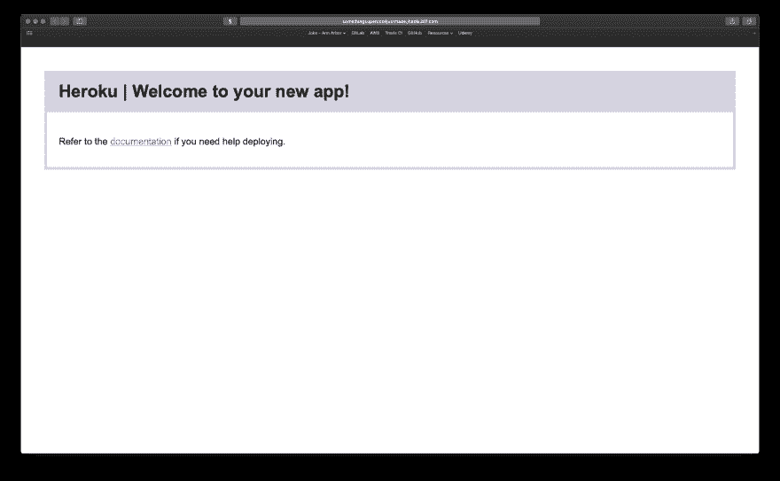

# 设置副项目域的七个步骤

> 原文：<https://dev.to/joshhadik/seven-steps-to-set-up-a-side-project-domain-487o>

我写了一篇名为[用一个域](https://dev.to/joshhadik/true-your-side-projects-with-a-single-domain-3716)组织你的副项目的独立文章，解释了什么是副项目域，以及为什么你应该使用一个。

**我强烈建议你先阅读那篇文章**，因为这篇文章原本只是为了快速浏览那篇文章的结尾，但我决定把它分成单独的一篇文章，以使文章简短扼要。

# 如何用 Route53 和 Heroku 设置副项目域。

在本文中，我选择使用 Route53 和 Heroku，因为我认为它们是最流行和最容易使用的两种解决方案，然而，即使你使用两种完全不同的服务，也应该很容易理解并找出它们之间的细微差别。

步骤#1
**选择一个端项目域**

尽量保持简短。

我喜欢为你的项目域使用“用户名”风格的想法，你可能会在 Github 或 Stack 上使用它(甚至可能是你在 Github 或 Stack 上使用的东西)。)

我和 jhadik307.com 一起去的

步骤#2
**购买 53 号公路上的域名**

你不必使用 53 号公路。我选择它是因为它真的很容易使用，而且因为我经常使用 AWS，所以把所有东西都整合在一个地方很好。如果你选择用别的东西，步骤会有一点不同，但是应该还是很容易搞清楚的。

假设您正在使用 Route 53，并且您已经有了一个 AWS 帐户设置，请访问 Route 53 主页。在那里，在注册域名部分输入你的新域名，并检查它是否可用！

一旦你找到一个可用的域名，点击“添加到购物车”,然后按照结账流程购买你的全新的副项目域名！

为你的项目想出一个子域。

关于使用一个副项目域的最好的部分之一是，没有一个子域将被占用！这意味着您可以使用任何您想要的子域，很可能只是您的项目的名称。

我将使用' somethingsupercoolijustmade '作为我的，但是你可以随意使用你现有的一个项目的名称，或者使用任何你想作为子域的名称！

步骤#4
**将完整域名添加到你的 Heroku 应用**

访问您现有的 Heroku 项目或启动一个新项目，然后转到项目的设置选项卡，找到“域和证书”部分一旦有按下“添加域”和键入完整的域名为您的边项目(包括子域。)

步骤#5
**复制 DNS 目标。**

复制在 Heroku 上你的新域的 DNS 目标中找到的文本(如下图所示)。)

步骤#6
**在 53 号线上设置子域**

转到 Route 53 上您的新域的托管区域部分，然后单击“创建记录集”
在“名称”字段中输入子域，选择 CNAME 作为类型，并粘贴 DNS 目标作为值。

*注意——切勿将域开头的协议(http / https)复制到 cname 值框中*

完成后，单击创建。

第 7 步
**访问你的新网站！**

# 感谢阅读

我希望你喜欢这篇文章！欢迎提问或在下面的评论中留下你的反馈！