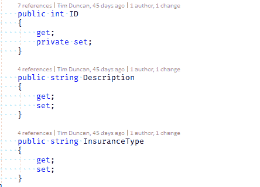
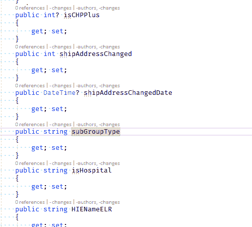

# 你的团队有格式标准吗？

> 原文：<https://dev.to/theothertimduncan/does-your-team-have-a-formatting-standard-19co>

正如我在[上一篇文章](https://dev.to/theothertimduncan/my-developer-story-1b55)中所说的，作为一名领导者和团队成员，与其他开发人员一起工作是我努力奋斗的一个领域。作为一个内向并且可能有轻微自闭症的人，与任何层次的人交流对我来说都是困难的。

我知道我的挣扎很平常。这个行业倾向于吸引像我这样的不适应者，他们更喜欢 1 和 0 的逻辑交互，而不是混乱的模拟世界。不幸的是，对于我们来说，孤独的程序员在地下室黑暗的角落里完成一些事情的时代已经不存在了。可能永远也不会。需要一个团队来完成一些事情。尽管上面提到了“不幸”，但我认为这是一件好事。

这是好事，但很有挑战性。这些年来，我越来越擅长与他人交流。我目前的工作实际上帮助我找到了可以改进和学习的地方。但有时也非常令人沮丧。我也是一个有点强迫症的完美主义者，所以真的很难区分我是一个追求质量的人还是一个傲慢挑剔的混蛋。

这就引出了我今天的问题。我一直在纠结——也在拖延——如何从我之前的帖子继续我一直在纠结的一些问题。然后，我上周遇到了一些事情，感觉这是一个很好的起点。你的团队有格式标准吗？也许更重要的是，你如何执行它？

对于最后一个问题，我相信实际的答案是你不知道。有多种方法可以在代码提交前自动清理代码，比如林挺。但是为了突出我的商店的第一个挑战，我们甚至不能在工具上达成一致。我们是一家. NET 商店，所以我们主要使用 Visual Studio Professional。我记得有一次在一次会议上提到，一个简单的键盘快捷键——Ctrl-K，Ctrl-D——可以为您处理大部分的格式清理工作。我从一个人那里得到的回答——我认为这个人也是最草率的——完美地抓住了问题:“我没有时间去学习新的键盘快捷键。”。

我们使用哪个版本的 Visual Studio 一直是争论的焦点。自从我设法让我们从 VS 2010 切换到 2015，仅仅是几年的时间。更别提过去一年围绕转向 VS 2017 的争论了。我们中的一些人已经转换了(像我一样)，但在大多数情况下，VS 2015 是预计使用的。这就排除了利用[的选项。编辑器配置](https://docs.microsoft.com/en-us/visualstudio/ide/create-portable-custom-editor-options?view=vs-2017)。我确实为我负责的所有项目创建了一个，所以至少那些使用 VS 2017 的人会受到影响。我知道 VS 2015 有一个扩展，增加了对. editorconfig 的支持。就此而言，我个人一直在使用 [CodeMaid](https://marketplace.visualstudio.com/items?itemName=SteveCadwallader.CodeMaid) ，它可以在任何一个版本中工作。但是我甚至还没有尝试开始讨论每个人应该使用什么扩展。我已经知道讨论将如何进行。

让我们说得更具体些。我有一个代码库，几个月来我一直是唯一的开发者。另一个开发人员最近已经开始工作了，而我正在做一个不同的项目。为了保护有罪的人(好吧，我会很好的-无辜的)，让我们称他为 D。D 已经在这个行业几十年了。例如，他曾经在 Compuserve 工作。而 D 是 Visual Studio 版本和其他领域最大的冲突点。但是有一点他确实重复了，我实际上同意的是一致性。在我们关于格式标准的一些讨论中，他指出与现有代码保持一致更重要。除了，我想，这并不适用于他。

这是我如何格式化我的代码的一个例子，也是这个代码库中所有东西如何被格式化的一个例子。

在 D 提交的代码中，他使用了两种不同的格式。我还发现“有趣”的是，他并不总是遵循 Pascal 对属性名大小写的 C#约定。我知道这个类是用来表示一个数据库表的，而这个表可能有一些列是这样大写的(是的，这个数据库是很糟糕，但是错在别处)。但我不知道他是否意识到大小写不匹配无关紧要，或者他是否认为他必须匹配大小写，因为“原因”。

基于之前与 D 的讨论，如果我向他提出这个问题，我期望得到的最有可能的回应是没关系，代码工作比它的一致性或“漂亮”更重要。你怎么想呢?我需要把强迫症降低一个等级然后就这样算了吗？你会如何处理这种情况？