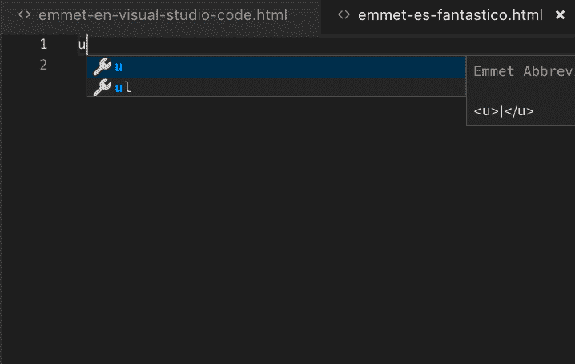
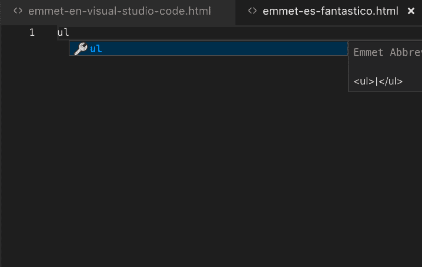
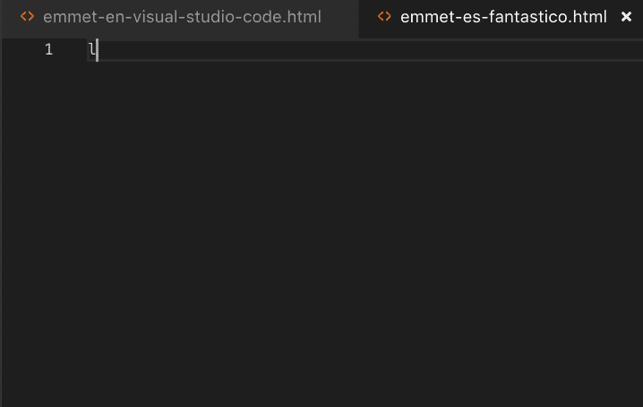

# 使用 Emmet 将 Visual Studio 代码中的速度提高一倍

> [https://dev . to/juananuiz/multiplier-tu-speed-in-visual studio-code-using-emmet-44h 5](https://dev.to/juananruiz/multiplica-tu-velocidad-en-visual-studio-code-utilizando-emmet-44h5)

## [T1】quées Emmet？](#qu%C3%A9-es-emmet)

Emmet 是一种小型但功能强大的代码自动完成语言，几乎在所有现有的编辑器中都可以使用。有一个插件可在 WordPress 中使用！

在 Visual Studio 代码中，Emmet 是默认安装的，因此要使用它，只需学习其简单的语法。

对于我来说，它最有趣的用途之一是 HTML 自动完成，它可用于在键入标签时自动完成标签或格式化现有文本。CSS 也是如此。

想象一下，一个顾客把所有的文字都传给你，放到你的网页上的一个 Word 文件里，这是相当典型的东西吗？。你有两个选择:

*   尝试复制 Word 附带的富格式文本
*   复制文本并将其粘贴到平面文本编辑器中

在第一个选项中，你可能会得到标题，黑色，也许一些列表。但是，标题可能不附带您需要的标签，其馀部分可能会被无用的 span、div 等标签感染。

第二个选项似乎需要更多的工作:手动放置所有标签，然后将其正确地关闭和打开是一个罐子。但你会更好地控制你的工作，而且你还可以用 Emmet 残忍地加速它。

## Emmet 生成新内容

在很多情况下，您必须从头开始编写 HTML 代码，这是一个罐子您必须打开标签、键入文本、关闭标签等。使用 Emmet 编写 HTML 成为一种乐趣。

我想从空白文件开始学埃米特比较容易，所以我们就从那里开始吧。

虽然你可以在自己的网页上查阅关于 Emmet 的所有文件，但我在这里告诉你最基本的和一些有趣的技巧，让你进入网壳去试试。

Emmet 使用缩写来生成元素，在本教程中，我们将仅看到 HTML，但它也非常适合于 CSS。缩略语非常简单，如果键入 **p** ，tab 键会为您创建段落的开始和结束标签。这本身并不太有趣，但如果你输入**【ul】>【Li * 5】**并给 tab 键，你就会得到一个包含五个元素的无编号列表。

在我们走之前先试试我说的话现在我们看到更有趣的东西了。

现在，您可以在包中安装导航菜单，而不必担心打开和关闭标签、复制和粘贴行等。试试这个:**ul . navbar>(Li . nav>a . menu item)* 5**和 tab 键，你会发现它会产生一个代码，你只需输入你缺少的文字，然后用 tab 键完成所有的信息。

点是用来表示前面标签的类别，就像你可以用枕头来创建**id。你看症状是从 CSS 继承来的，所以会很自然地出现在你身上。**

 **顺便说一下，当 Visual Studio 代码检测到你在使用 Emmet 时，它会给你一个带有 I 的小圆圈，这样你就可以看到你的代码将会是什么样子，这是非常有用的，直到你掌握了语言，这样你就不必一直删除失败的代码。

*   戴尔电子白板。
*   介绍**形式> (label > input:text)*4** ，您将会有一个表格，上面有 4 个字段，分别标有标签、类等。
*   键盘 **p*5 > lorem** ，你将有五段文字填入你的测试设计。

例子不胜枚举，我请你自己试试，有任何疑问时去查阅 Emmet 的文件。我鼓励你尝试写一张 10 行 5 列的表，或者写 3 段各有相应的标题**【H2】**

## Emmet 用于现有内容

正如我在本文开头所说的那样，当 Emmet 越亮时，您就需要将纯文本格式化为 HTML 格式，您必须对其进行格式化:标题、段落、列表、链接、粗体等。

首先，我建议您启用两个键盘快捷键，以便可以从 Visual Studio 代码中调用 Emmet，而无需拖动鼠标。为此，请参阅菜单首选项**然后**键盘快捷方式**，现在在命令查找器中按键，您将看到两个条目:**

*   用缩写封装
*   用缩写封装个别行

为每个快捷键指定一个快捷键组合(我在 Mac 上使用了 comando+m 和 alt+comando+m，因为已经为搜索捕获了快捷键组合)，现在可以打开需要格式化的纯文本，或者更好地遵循示例，首先按键:

 **

现在，我们将使用 Emmet 对其进行格式化:

*   选择第一行，用你的快捷方式键入□t0〖H2〗t1〗并按 intro 键。
*   选择以下两段，再次使用快捷方式，然后键入**【p ***(加上引言，当然)。这将为遇到的每一个换行符分配一个段落(如果不使用星号，则会将所有换行符都放在一个段落中)。
*   现在选择文本中的任意一页，双击该页，然后使用另一个快捷键设置一个粗体字(使用 **b** 或 **strong**
*   连续选择两三个单词并使用相同的快捷键 **a** 创建链接。
*   现在转到最短的 5 行，用第一个快捷方式选择，然后键入**【ul】>【Li ***

一开始您可能会觉得有点麻烦，但请记住，您可以使用所有 HTML 标签，为需要的标签定义类别或识别码，甚至可以为您经常使用的 html 样式结构定义您自己的**片段**

**如果你有任何疑问或发现埃美特的任何哲组合，我很乐意你在下面留下一个评论。**

## 参考文献

如果你想进一步了解这个问题，我留给你一些我写这篇文章所依据的或者我觉得有趣的参考资料。第一个是 Emmet 的正式文件。

*   [emmet 的官方文件](https://docs.emmet.io/)
*   [“Emmet in VS Code”por 高效用户](https://efficientuser.com/2017/11/12/emmet-in-vs-code/)
*   [如何在 Visual Studio 代码中设置 WordPress 编码标准](https://sridharkatakam.com/set-wordpress-coding-standards-visual-studio-code/)
*   [使用 VS 代码进行 WordPress 开发](https://deliciousbrains.com/vs-code-wordpress/)
*   [VS WordPress 开发代码](https://tommcfarlin.com/vs-code-wordpress/)
*   [本地 WordPress 开发的 Docker 和 Visual Studio 代码](http://www.tenseg.net/blog/2017/02/24/docker-and-visual-studio-code-for-local-wordpress-development/)****