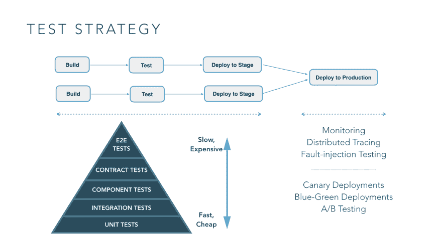
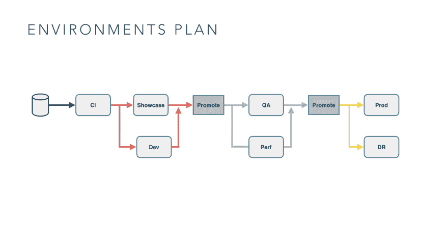
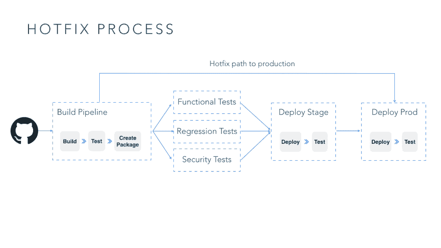

# 微服务持续交付的 5 个考虑因素

> 原文：<https://dev.to/gocd/5-considerations-for-continuous-delivery-of-microservices-n87>

 
微服务架构将软件构建为协作服务的套件。如今，这些架构被普遍认为是构建应用程序的更好方式。

连续交付是任何软件交付实践的基本组成部分。不管目标部署环境如何，您都必须设计一个 CD 工作流来将软件变更投入生产。

在 ThoughtWorks，在与客户合作构建业务关键型软件的同时，我们克服了为微服务构建 CD 工作流的诸多挑战。在这篇博文中，我将分享我们在架构设计和应用程序开发中牢记的注意事项。

## 微服务和持续交付

根据 Martin Fowler 的说法，微服务架构是“将软件应用程序设计成可独立部署的服务套件的一种特殊方式。”这些体系结构目前普遍用于构建基于分布式系统概念的应用程序。

Jez Humble 在他的开创性著作中将持续交付描述为“以可持续的方式安全快速地将所有类型的变更(包括新特性、配置、错误修复和实验)投入生产的能力。”

无论目标部署环境或您的架构选择如何，无论是过去的整体架构还是现在的微服务，设计一个连续交付工作流以将您的更改投入生产都是非常重要的。CD 工作流是 DevOps 流程的核心，跨越组织中的各种职能，包括开发、QA 和 IT 运营。

## 微服务对 CD 的四大挑战

1.  维护复杂分布式系统的完整性。由于你将一个大型的整体系统分解成更小的、更易管理的微服务，系统本身的整体复杂性增加了。您现在必须处理分布式系统问题。

2.  **不断安全快速地发布特性。**当您的功能可能涉及一个或多个微服务的变更时，管理频繁的功能发布需要特别考虑。

3.  管理不同技术堆栈的部署。微服务环境通常包括不同的服务技术堆栈。管理跨这些不同堆栈的部署过程是一项挑战。

4.  **用于独立和带外部署服务的流程和工具。**有许多工具可用于模拟光盘工作流程。最初规划出您的 CD 工作流程并选择最能代表该工作流程的工具是令人望而生畏的。

## 微服务上的 CD 五大考虑因素

当您在微服务架构上设计 CD 工作流时，我建议您记住五个注意事项。我将在本系列的后续文章中对它们进行深入讨论。这里只是一个概述:

**1。拥有有效的测试策略**
 
微服务系统的测试和验证明显比测试传统的整体应用更加细致和复杂。一个有效的测试策略需要考虑单独测试单个服务和验证整个系统的行为。

对于服务的生产前测试，特别是以隔离的方式，传统的测试方法仍然适用和相关。[测试金字塔](https://martinfowler.com/bliki/TestPyramid.html)仍然可以帮助你在不同类型的测试之间保持平衡。然而，在测试服务集合时，这种测试方式的有效性有限。有几类错误是您无法在测试环境中模拟的，例如，由高度分布式系统中的最终一致性引起的问题，导致部分系统失败的硬件和网络故障。

你必须用合成用户测试、轻量级用户接受测试和故障注入测试等技术来补充传统的测试技术。

**2。检查您的 CI 实践**

持续集成是成功的持续交付策略中的关键实践。除了围绕构建服务器和构建定义的显而易见的考虑之外，[基于主干的开发](https://trunkbaseddevelopment.com)和[特性切换](https://martinfowler.com/articles/feature-toggles.html)是两个关键的实践，它们对实现简单和健壮的 CI 过程大有帮助。

在基于主干的开发中，开发人员在一个称为“主干”的分支中就代码进行协作主要的好处是避免开发分支中的漂移和由此产生的合并地狱。这与维护长期特性和发布分支的实践相反。在分支模型中，尽管您可能在单个分支上运行构建，但可以说[您不是在进行持续集成](https://www.gocd.org/2017/05/16/its-not-CI-its-CI-theatre.html)。

要进行基于主干的开发，您需要有称为特性切换的控件。功能切换允许多次提交 WIP 和已完成功能的组合。使用这些开关，您可以在生产环境中关闭不完整特性的显示，直到这些特性在预生产环境中开发完成并经过充分测试。特性切换通常存储在靠近代码库的规范或配置文件中，并由 CD 管道中的自动化用来在特定环境中打开切换。

一旦有了维护特性切换的机制，就可以使用相同的机制引入其他种类的切换，如发布切换(控制对未完成代码的访问)、操作切换(控制生产代码的行为)、权限切换(为特权用户打开特定的行为)和实验切换(用于多变量测试——在使特性永久化之前，特性的接受程度)。

**3。规划您的环境**
 
一个环境规划包括您的环境集、它们的预期用途、通过这些环境提升工件的策略以及在这些环境上切换状态。

首先，考虑需要什么样的环境以及它们的预期用例。您组织中的不同群体将有不同的竞争需求。当创建一个环境时，你应该迎合所有这些相互竞争的需求。其次，如果可能的话，考虑使用云基础设施动态创建环境。例如，使用 Kubernetes 的标签功能为自动化测试创建动态测试环境，而不是长期存在的环境。第三，要有神器推广策略。CD 管道会产生很多伪像。您应该考虑:存储多少工件，需要多少存储库，等等。

**4。战略性地管理配置**

应用程序的配置包括每个部署的所有变化，应该与代码分开存储。当您拥有微服务套件时，您应该如何对待配置？

我们看到的一个有用的技术是在像[consult](https://www.consul.io/)或 [Vault](https://www.vaultproject.io/) 这样的存储库中集中管理部署配置。将部署配置分散到像 [Chef](https://www.chef.io/chef/) 和 CD 管道这样的工具上只会让理解和推理变得更加困难。

我们使用的另一项技术是标准化配置分发流程，而不管服务的技术堆栈如何，只让服务根据堆栈来处理配置的消费。例如，我们通常使用 [12 因素建议](https://12factor.net/)并避免分发配置文件。

最后，像证书这样的秘密需要一个治理过程来确保它们得到适当的管理。这通常是一个手动的过程，但是你需要更早地考虑它，并把它放在适当的位置。

**5。为出错做准备**

在微服务系统中，多个服务频繁更新，当一个服务的部署引入不稳定性或错误时，您如何应对？

前滚意味着找到故障的根本原因并尽快应用修复，它通常是最佳的补救响应。能够做到这一点的先决条件是确保您有能力从[热修复分支](https://www.gocd.org/2017/06/20/hotfixes-rollback-rollforward/)直接发布到生产。您可能不希望生产中断的修复通过 CD 管道，这取决于变更通过管道所需的时间。
 
生产系统中的回滚总是很棘手。在大多数情况下，如果更改是细粒度的，并且可以进行推理，那么回滚就很容易。但是，如果部署包含不容易推理的更改，例如，数据库更改，尤其是导致模式更改的更改，您需要在连续的部署中将数据库更改与代码更改分开部署，以确保数据库更改与早期版本的代码向后兼容。

## 总结

这是我们连续发布微服务博客系列的第 1 部分。我们已经讨论了在微服务架构上构建 CD 管道的四个挑战和五个考虑因素。在下一篇博客中，我将深入讨论第一个考虑因素:基于微服务架构的系统的测试策略。