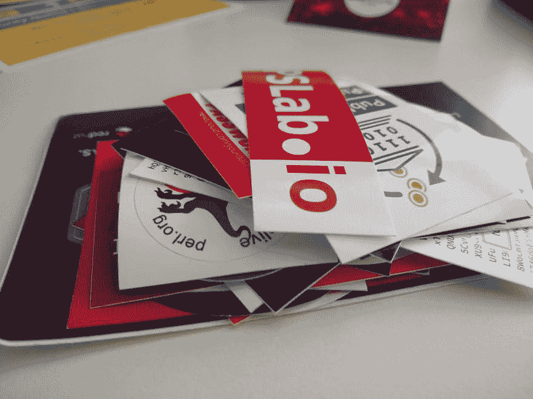

# 福斯特姆体验

> 原文：<https://dev.to/terceranexus6/fosdem-experience-2phe>

这个周末我去了欧洲最大的软件自由活动之一: [**FOSDEM**](http://fosdem.org/) 。今年是在比利时的布鲁塞尔。这是我第一次去，我希望这不是最后一次，因为我非常喜欢它。我有机会给[做了一个关于 IPFS](https://fosdem.org/2019/schedule/event/the_new_internet/) 的演讲，并会见了[协议实验室](https://protocol.ai/)的优秀人员，但除此之外，我还会见了所有我钦佩的组织，如 TOR project、Debian 或 Mozilla。事实上，我尴尬地、胆怯地走近满怀钦佩的黛比安·斯坦德。在本帖中，我想提供一份关于此类活动的*用户指南*，一般来说，对于这类活动，我大多参加安全活动，但这份更广泛。

准备协助一项技术活动比你一开始想象的要困难得多。我决定只带一个包旅行，但我真的想带所有我需要的东西，甚至不提那些日子的生活必需品(卫生，衣服等)，而是我的电脑，我的 RPI(极客分享？去黑？无论什么)，贴纸，个人卡，arduino...焊接工具可能...？我认真考虑了最后一个问题，但是没有。那你应该带什么？

*   如果你有贴纸，请拿出来，每个人都喜欢贴纸，这是打破僵局和建立联系的好方法。
*   关于您的协会的信息，如果您参加了任何。没有带一些关于干扰的印刷资料真的让我很生气
*   你的电脑。你永远不知道，从记笔记到快速编写脚本的极客时刻。
*   笔记本和几支铅笔、智能手机和电脑都很棒，但有时让你的智能手机给某人写下他们很难写的电子邮件或联系信息并不舒服。
*   选择你最古怪、最便于旅行的小玩意。你知道，当你喝醉了想炫耀的时候。

除此之外，我建议和你感兴趣的人交谈。如果你害羞，你可能会在接近某人和说话之前三思，但这完全值得。每个人都很高兴听到你对他们的项目感兴趣，这样就不会尴尬了。当我们谈论软件自由时，它也涉及到*社区*。就我而言，我是通过大学里的一个社区了解到的，但将你的社区相关活动放在网上是很常见的，这很好，但这些活动是一个很好的机会，可以面对面地认识你在网上认识的那些人。这很有趣。

你对此有什么看法？你去过科技活动吗？你玩得开心吗？