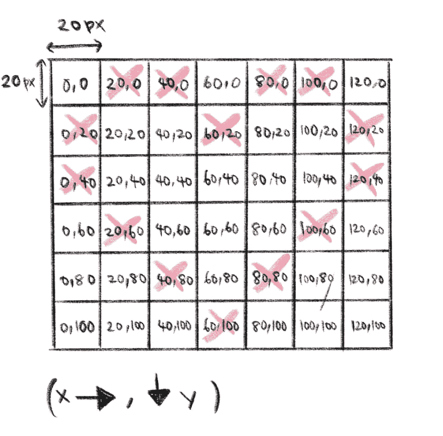
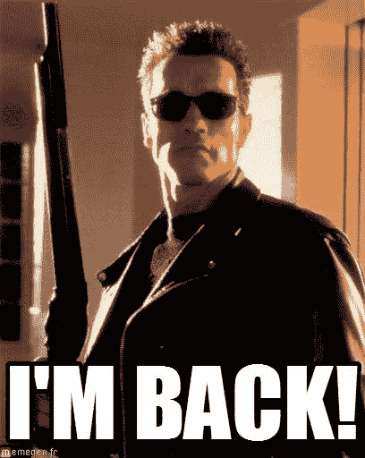

# 用 CSS 盒阴影绘制像素化图像

> 原文：<https://dev.to/annlin/drawing-pixelated-image-with-css-box-shadow-j2b>

你知道可以用 CSS `box-shadow`画画吗？我也不知道，直到我看到一个由杰森·迪莉娅设计的非常愚蠢的像素化拉尔夫。检查出[沉船拉尔夫演示](https://dev.to/linxea/wreck-it-ralph-2-virus-popup-58gm)和我丑陋的[千年隼图](https://dev.to/linxea/star-wars-hyperjump-1mf0)。

我们开始吧！

### 首先，使用`div`创建一个块。

盒子阴影将跟随`div`的`width`和`height`。通过用逗号分隔阴影`position-x position-y blur-radius color`的属性，你可以对一个`box-shadow`应用多个阴影。

基本构建模块:

```
.block {
    width: 10px;
    height: 10px;
    box-shadow: 0 0 0 black, 10px 0 0 black;
}

<div class="block"></div> 
```

### 二、用坐标规划你的形象。

我耐心的把自己完美的心的坐标`(x,y)`画出来，供大家参考。不客气`div`从左上角的框开始，坐标为`(0,0)`。每个方框阴影的高度`(20px)`和宽度`(20px)`与`div`相同。

[](https://res.cloudinary.com/practicaldev/image/fetch/s--wfmRG6VQ--/c_limit%2Cf_auto%2Cfl_progressive%2Cq_auto%2Cw_880/https://thepracticaldev.s3.amazonaws.com/i/5vice6lnfnxr5sczvly0.png)

注意我在`.heart-shadow`中添加了`margin-bottom`。顾名思义，`box-shadow`是一个不会增加`div`体积的影子。您可能希望设置边距以防止覆盖其他 DOM 元素。

HTML 和 CSS 中的代码片段:

```
.heart {
                width: 20px;
                height: 20px;
                margin-bottom: 100px;
                box-shadow: 20px 0 0 #60748c, 40px 0 0 #60748c, 60px 20px 0 #60748c,
                    80px 0 0 #60748c, 100px 0 0 #60748c, 120px 20px 0 #60748c,
                    0 20px 0 #60748c, 60px 20px 0 #60748c, 120px 20px 0 #60748c,
                    0 40px 0 #60748c, 120px 40px 0 #60748c, 20px 60px 0 #60748c,
                    100px 60px 0 #60748c, 40px 80px 0 #60748c, 80px 80px 0 #60748c,
                    60px 100px 0 #60748c;
            }
<div class="heart"></div> 
```

我们在本教程中硬编码一切，因为我很懒。然而在现实生活中，我们尽量不硬编码任何东西。 [@vyvit](https://dev.to/vyvit) 给出了一个使用 CSS var()的好建议。对于颜色代码这样的重复值，可以使用前缀`--`将其指定为 CSS 变量，然后将其添加到`:root`元素中。现在您可以在任何地方使用它，因为变量是在全局范围内设置的。

使用 CSS var():

```
:root {
    --pink-color: #d87385;
}

.heart-shadow-with-color-variable {
    width: 20px;
    height: 20px;
    margin-bottom: 100px;
    box-shadow: 20px 0 0 var(--pink-color), 40px 0 0 var(--pink-color),
    60px 20px 0 var(--pink-color), 80px 0 0 var(--pink-color),
    100px 0 0 var(--pink-color), 120px 20px 0 var(--pink-color),
    0 20px 0 var(--pink-color), 60px 20px 0 var(--pink-color),
    120px 20px 0 var(--pink-color), 0 40px 0 var(--pink-color),
    120px 40px 0 var(--pink-color), 20px 60px 0 var(--pink-color),
    100px 60px 0 var(--pink-color), 40px 80px 0 var(--pink-color),
    80px 80px 0 var(--pink-color), 60px 100px 0 var(--pink-color);
} 
```

这里有更详细的解释:
[https://codepen.io/twhite96/embed/JxJzLR?height=600&default-tab=result&embed-version=2](https://codepen.io/twhite96/embed/JxJzLR?height=600&default-tab=result&embed-version=2)

网上有很多像素盒阴影生成器可以帮助你计算你的画的坐标。我用我能在网上找到的最漂亮的生成器——[像素化器](http://elrumordelaluz.github.io/Pixelator/)绘制了离线恐龙。Pixelator 最好具有以前绘制的历史记录(撤销、重做)以及拖动和着色像素的能力。我想制作恐龙的动画，但是我总是忘记坐标。我们会看到的。

在这里查看我的恐龙。我的恐龙会眨眼。😂【T2[https://codepen.io/twhite96/embed/OdgGqP?height=600&default-tab=result&embed-version=2](https://codepen.io/twhite96/embed/OdgGqP?height=600&default-tab=result&embed-version=2)

( [@vms20591](https://dev.to/vms20591) 希望你看到这个，这是给你的！抱歉，花了这么长时间。)

P/S:反正，
[](https://res.cloudinary.com/practicaldev/image/fetch/s--WKdE3liL--/c_limit%2Cf_auto%2Cfl_progressive%2Cq_auto%2Cw_880/https://thepracticaldev.s3.amazonaws.com/i/c2ifnhonyjc9gspxktt6.jpg)