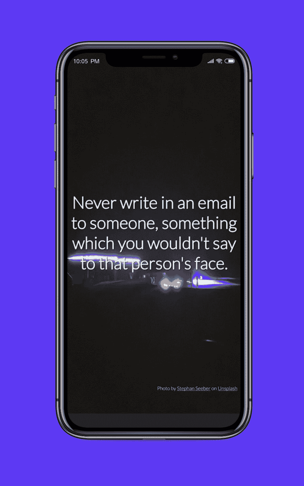
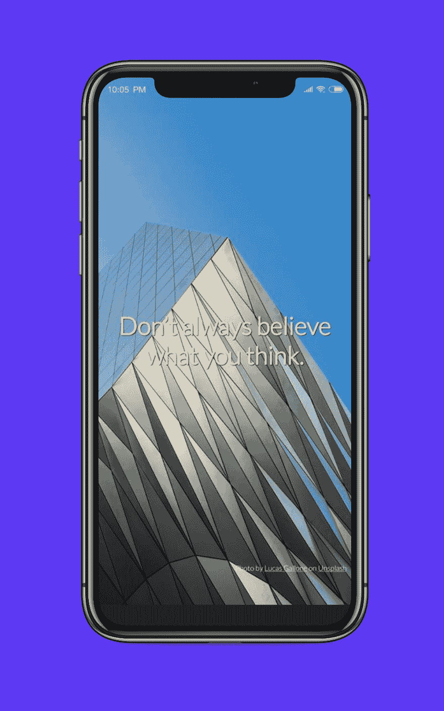
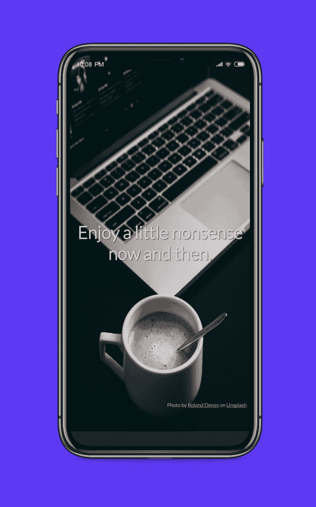
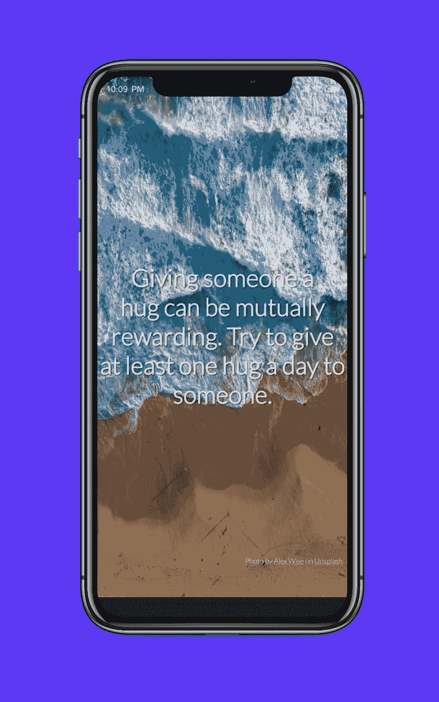

# 建议——自动获取建议的 Android 应用程序

> 原文：<https://dev.to/sicksand/advice---android-application-to-get-automated-advice-1jgh>

如果你们能在 Play Store 上下载我的应用程序[建议](https://play.google.com/store/apps/details?id=my.sustento.apeaceofadvice&referrer=utm_source%3Ddev.to%26utm_medium%3Darticles%26utm_campaign%3Ddev.to)，我将不胜感激

# API

我总是对公共 API 着迷。2019 年 1 月的一天，我发现了一个公共的 api 来征求意见。类似于引用(我讨厌引用)，但更像是建议。这里是 api -> [通知单](https://api.adviceslip.com/)。

打开我的 Android 工作室，创建一个新项目，一个和平的建议。提供获取建议的网址[获取](https://api.adviceslip.com/advice)将返回

```
{  slip:  {  advice:  "What's stopping you?",  slip_id:  "159"  }  } 
```

Enter fullscreen mode Exit fullscreen mode

# 安卓

因此，当打开我的应用程序时，主活动将获得一个建议。简单。但是如何获得新的建议呢？我不希望我的用户打开和关闭我的应用程序只是为了获得新的建议。

因此，我实现了一个向下滑动的手势(拉动以刷新)，我的应用程序将返回一个新的建议。简单的部分现在已经完成，但应用程序太简单了。我在 Pinterest 上搜索如何呈现可读字体的 UI，以及我必须选择什么样的配色方案才能让我的用户看起来舒服。

# 字体

对于建议文本，我将使用 [Abril Fatface](https://fonts.google.com/specimen/Abril+Fatface?selection.family=Abril+Fatface) ，对于版权文本，我选择 [Lato Thin](https://fonts.google.com/specimen/Lato)

# 不飞溅

该应用程序仍然缺乏一些视觉效果。我需要一套令人耳目一新的肖像壁纸。没错。对于生产使用，每小时 5000 个请求就足够了(我认为)。我只需要注册成为开发者就可以获得 API。对于演示应用程序，你每小时只会得到 50 个请求。为了让 unsplash 在我的应用上工作，我发现了一个非官方的 Android Unsplash API 库(【https://github.com/KeenenCharles/AndroidUnplash】T2)。

我随机查询(android 壁纸，iphone 壁纸，壁纸)以获得随机照片，每次用户打开应用程序时都是肖像模式。这将消除(解决方法)用户得到相同的壁纸。简单的部分几乎完成了，但验证应用程序的过程比我预期的要长。Unsplash 表示，最多需要 10 天时间进行验证。我的花费了 8 天外加将近 5 天的时间来来回回的发送支持邮件。幸运的是，在 2019 年 2 月 1 日，unsplash 批准了我的应用程序，现在它已经进入生产环境。

我已经在同一天把我的 apk 上传到 play store 的生产版本中。下面是一些使用 [Shotsnapp](https://shotsnapp.com/) 的截图

[](https://res.cloudinary.com/practicaldev/image/fetch/s--2I0Qg4Dw--/c_limit%2Cf_auto%2Cfl_progressive%2Cq_auto%2Cw_880/https://i.imgur.com/J9UHRiV.png)
[](https://res.cloudinary.com/practicaldev/image/fetch/s--mTPxZug0--/c_limit%2Cf_auto%2Cfl_progressive%2Cq_auto%2Cw_880/https://i.imgur.com/6WP3IPC.png)
[](https://res.cloudinary.com/practicaldev/image/fetch/s--03umDPFw--/c_limit%2Cf_auto%2Cfl_progressive%2Cq_auto%2Cw_880/https://i.imgur.com/3RCpIQR.png)
[](https://res.cloudinary.com/practicaldev/image/fetch/s--srXbJ4k7--/c_limit%2Cf_auto%2Cfl_progressive%2Cq_auto%2Cw_880/https://i.imgur.com/PlHYbyu.png)
[](https://res.cloudinary.com/practicaldev/image/fetch/s--cZyWOADS--/c_limit%2Cf_auto%2Cfl_progressive%2Cq_auto%2Cw_880/https://i.imgur.com/aIzLuYx.jpg)

我在 Play Store 上的应用程序建议