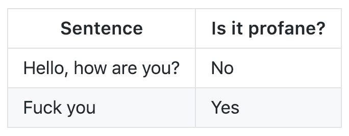
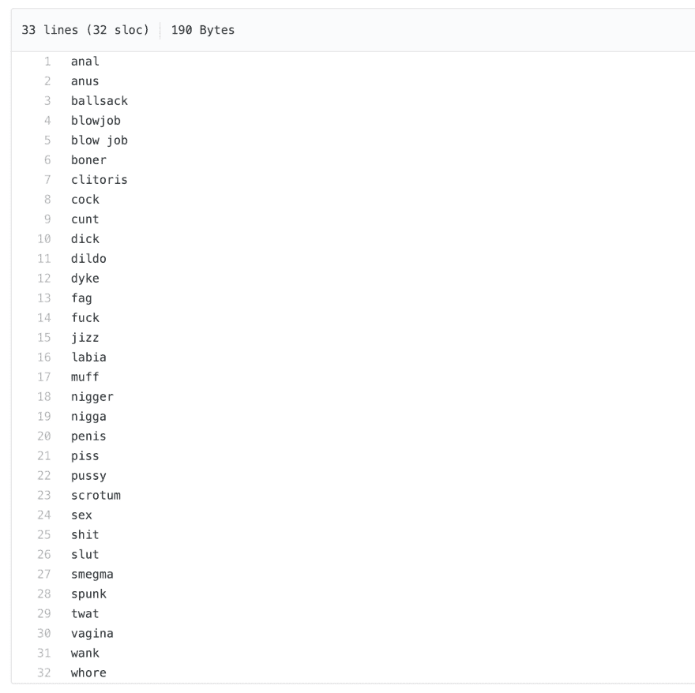
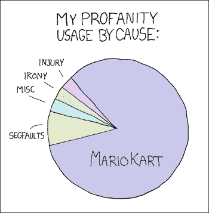
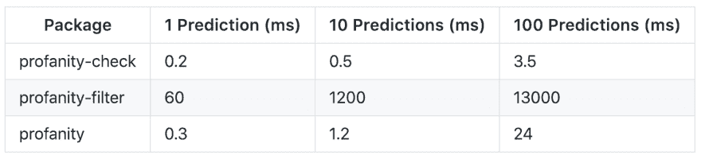
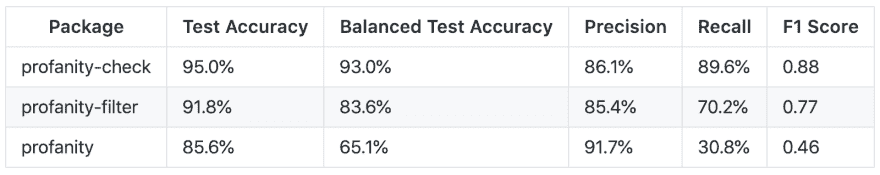
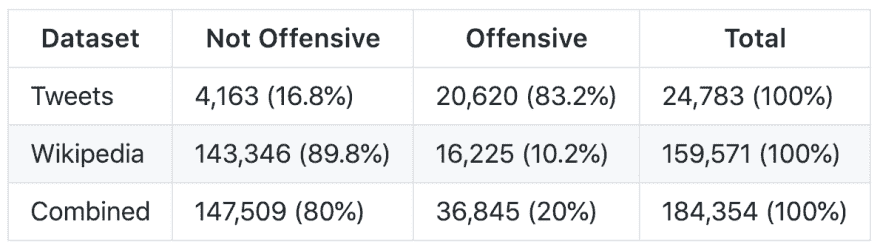
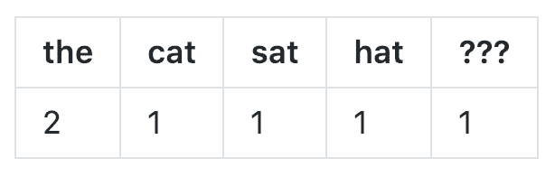
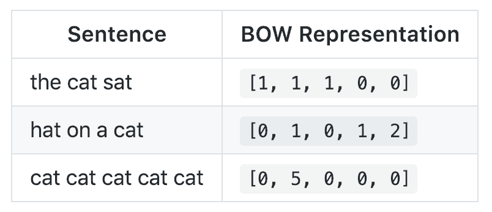

# 用 scikit-learn 构建一个更好的亵渎检测库

> 原文：<https://dev.to/vzhou842/building-a-better-profanity-detection-library-with-scikit-learn-3b7f>

几个月前，我需要一种方法来检测用户提交的文本字符串中的亵渎内容:

[](https://res.cloudinary.com/practicaldev/image/fetch/s--NqEJ0ql3--/c_limit%2Cf_auto%2Cfl_progressive%2Cq_auto%2Cw_880/https://cdn-images-1.medium.com/max/1600/1%2Ai2fk4aGvplR7le_3PPajAA.png) 

<figcaption>这应该没那么难吧？</figcaption>

为此，我最终构建并发布了自己的库，名为[亵渎检查](https://github.com/vzhou842/profanity-check)。

当然，在我这么做之前，我在 [Python 包索引](https://pypi.org/) (PyPI)中寻找任何可以为我做这件事的现有库。搜索查询“亵渎”得到的结果只有一半还不错:

*   [脏话](https://pypi.org/project/profanity/)(理想的包装名称)
*   [更好-亵渎](https://pypi.org/project/better-profanity/) : *“灵感来自* [*亵渎*](https://github.com/ben174/profanity) [*本·弗里德兰*](https://github.com/ben174) *的* *，这个库比原来的快多了。”*
*   [亵渎过滤器](https://pypi.org/project/profanityfilter/)(有 31 颗 Github 星，比大多数其他结果多 30 颗)
*   [脏话过滤](https://pypi.org/project/profanity-filter/)(采用机器学习，说够了吧？！)

然而，第三方库有时可能是粗略的，所以我对这 4 个结果做了尽职调查。

## 亵渎，更好的亵渎，亵渎过滤器

在快速浏览了一下`profanity`库之后，我找到了一个名为 [wordlist.txt](https://github.com/ben174/profanity/blob/master/profanity/data/wordlist.txt) 的文件:

[](https://res.cloudinary.com/practicaldev/image/fetch/s--tMhbBYcF--/c_limit%2Cf_auto%2Cfl_progressive%2Cq_auto%2Cw_880/https://cdn-images-1.medium.com/max/2000/1%2A0lTbmHR5WE7HZ8wCvLpqtg.png) 

<figcaption>NSFW</figcaption>

整个库只是这个 32 个单词列表的包装！`profanity`只需查找其中一个单词，即可检测亵渎。

令我沮丧的是，`better-profanity`和`profanityfilter`都采用了同样的方法:

*   `better-profanity`使用[一个 140 字的单词表](https://github.com/snguyenthanh/better_profanity/blob/master/better_profanity/profanity_wordlist.txt)
*   `profanityfilter`使用[一个 418 字的单词表](https://github.com/areebbeigh/profanityfilter/blob/master/profanityfilter/data/badwords.txt)

这很糟糕，因为**基于单词表的亵渎检测库非常主观。**比如，`better-profanity`的词表里就有“吸”这个词你愿意说任何包含“吸”字的句子都是亵渎吗？此外，任何硬编码的不良词汇列表将不可避免地是不完整的——你认为只有`profanity`的 32 个不良词汇吗？

[](https://res.cloudinary.com/practicaldev/image/fetch/s--Eapd_ELP--/c_limit%2Cf_auto%2Cfl_progressive%2Cq_auto%2Cw_880/https://victorzhou.com/static/b0cc99529a0fad11e9353fc7ff189e2f/b8b3f/xkcd-290.png)

<figcaption>Fucking Blue Shells. source: [xkcd](https://xkcd.com/290/)</figcaption>

已经排除了 3 个库，我把希望放在了第 4 个也是最后一个:`profanity-filter`。

## 脏话-过滤

`profanity-filter`采用机器学习！太棒了。

原来，它的 ***真的*** 慢。这是我在 2018 年 12 月运行的一个基准测试，比较了(1) `profanity-filter`、(2)我的库`profanity-check`、(3) `profanity`(有 32 个单词列表的那个):

[](https://res.cloudinary.com/practicaldev/image/fetch/s--IWtaUBbc--/c_limit%2Cf_auto%2Cfl_progressive%2Cq_auto%2Cw_880/https://cdn-images-1.medium.com/max/1600/1%2AKRJEl4YHfSTk9PmmScIcUA.png)

我需要能够实时执行许多预测，而`profanity-filter`甚至还不够快。但是，嘿，也许这是一个经典的速度与准确性的权衡，对不对？

没有。

[](https://res.cloudinary.com/practicaldev/image/fetch/s--kKiTADjE--/c_limit%2Cf_auto%2Cfl_progressive%2Cq_auto%2Cw_880/https://cdn-images-1.medium.com/max/1600/1%2ALYOeGE6vTXTAKhJ_W1fZgQ.png)

我在 PyPI 上找到的库都不能满足我的需求，所以我自己建了一个。

## 建筑物亵渎检查，第 1 部分:数据

我知道我想让`profanity-check`基于数据进行分类，以避免主观*(理解为:可以说我使用了机器学习)*。我从两个公开来源收集了一个综合数据集:

*   来自[t-Davidson/仇恨言论和攻击性语言](https://github.com/t-davidson/hate-speech-and-offensive-language/tree/master/data)的“Twitter”数据集，其中包含从 Twitter 上抓取的推文。
*   Alphabet 的[对话人工智能](https://conversationai.github.io/)团队发布的来自 [this Kaggle competition](https://www.kaggle.com/c/jigsaw-toxic-comment-classification-challenge) 的“维基百科”数据集，其中包含来自维基百科对话页面编辑的评论。

这些数据集中的每一个都包含了由人类通过众包网站手工标注的文本样本，比如[Figure fight](https://www.figure-eight.com/)。

我的数据集最终看起来是这样的:

[](https://res.cloudinary.com/practicaldev/image/fetch/s--CQUVsJ4J--/c_limit%2Cf_auto%2Cfl_progressive%2Cq_auto%2Cw_880/https://cdn-images-1.medium.com/max/1600/1%2ABw_we8cbs-WOpWXOCxzSTg.png) 

<figcaption>合计=推文+维基百科</figcaption>

> Twitter 数据集有一个名为`class`的列，如果推文包含仇恨言论，则为 0，如果包含攻击性语言，则为 1，如果两者都不包含，则为 2。我将任何一条`class`为 2 的推文归类为“不冒犯”，而将所有其他推文归类为“冒犯”。
> 
> 维基百科数据集有几个二进制列(如`toxic`或`threat`)，表示该文本是否包含该类型的毒性。我将任何包含*任何*毒性类型的文本归类为“攻击性的”，所有其他文本归类为“非攻击性的”

## 建筑亵渎-检查，第二部分:培训

现在有了一个干净的组合数据集(你可以[在这里](https://github.com/vzhou842/profanity-check/blob/master/profanity_check/data/clean_data.csv)下载)，我准备好训练这个模型了！

> 我跳过了我是如何清理数据集的，因为老实说，这很无聊——如果你有兴趣了解更多关于预处理文本数据集的知识，请查看[这篇文章](https://machinelearningmastery.com/clean-text-machine-learning-python/)或[这篇文章](https://medium.com/@datamonsters/text-preprocessing-in-python-steps-tools-and-examples-bf025f872908)。

```
import pandas as pd
from sklearn.feature_extraction.text import CountVectorizer
from sklearn.calibration import CalibratedClassifierCV
from sklearn.svm import LinearSVC
from sklearn.externals import joblib

# Read in data
data = pd.read_csv('clean_data.csv')
texts = data['text'].astype(str)
y = data['is_offensive']

# Vectorize the text
vectorizer = CountVectorizer(stop_words='english', min_df=0.0001)
X = vectorizer.fit_transform(texts)

# Train the model
model = LinearSVC(class_weight="balanced", dual=False, tol=1e-2, max_iter=1e5)
cclf = CalibratedClassifierCV(base_estimator=model)
cclf.fit(X, y)

# Save the model
joblib.dump(vectorizer, 'vectorizer.joblib')
joblib.dump(cclf, 'model.joblib') 
```

<figcaption>Are you also surprised the code is so short? Apparently [scikit-learn](https://scikit-learn.org/) does everything.</figcaption>

这里有两个主要步骤:(1)矢量化和(2)训练。

### 矢量化:文字袋

我使用了`scikit-learn`的 [CountVectorizer](https://scikit-learn.org/stable/modules/generated/sklearn.feature_extraction.text.CountVectorizer.html) 类，它基本上通过计算每个给定单词出现的次数，将任何文本字符串转换成一个向量。这就是所谓的[单词袋](https://en.wikipedia.org/wiki/Bag-of-words_model)(鞠躬)表示法。例如，如果英语中仅有的单词是`the`、`cat`、`sat`和`hat`，那么句子`the cat sat in the hat`可能的矢量化结果可能是:

[](https://res.cloudinary.com/practicaldev/image/fetch/s--iQt0gsbq--/c_limit%2Cf_auto%2Cfl_progressive%2Cq_auto%2Cw_880/https://cdn-images-1.medium.com/max/1600/1%2Asbnts1u_QFB_V-X5DSC3pg.png) 

<figcaption>【坐在帽子里的猫】——>【2，1，1，1，1】</figcaption>

`???`代表任何未知单词，对于这个句子来说就是`in`。任何句子都可以这样表示为`the`、`cat`、`sat`、`hat`、`???`的计数！

[](https://res.cloudinary.com/practicaldev/image/fetch/s--85uri1WU--/c_limit%2Cf_auto%2Cfl_progressive%2Cq_auto%2Cw_880/https://cdn-images-1.medium.com/max/1600/1%2A-wONWZDab2gNQP3Rfdpt_A.png) 

<figcaption>下次需要矢量化“猫猫猫猫猫”时的一个便捷参考表</figcaption>

当然，英语中有更多的单词，所以在上面的代码中我使用了`fit_transform()`方法，它做了两件事:

*   **Fit:** 通过查看数据集中出现的所有单词来学习词汇。
*   **Transform** :将数据集中的每个文本字符串转换成它的向量形式。

### 训练:线性 SVM

我决定使用的模型是线性支持向量机(SVM)，它是由`scikit-learn`的 [LinearSVC](https://scikit-learn.org/stable/modules/generated/sklearn.svm.LinearSVC.html) 类实现的。[如果你不知道什么是支持向量机，这篇文章](https://medium.com/machine-learning-101/chapter-2-svm-support-vector-machine-theory-f0812effc72)和[这篇教程](https://www.svm-tutorial.com/2014/11/svm-understanding-math-part-1/)是很好的介绍。

> 上面代码中的 [CalibratedClassifierCV](https://scikit-learn.org/stable/modules/generated/sklearn.calibration.CalibratedClassifierCV.html) 作为一个包装器存在，为我提供了`predict_proba()`方法，它返回每个类的概率，而不仅仅是一个分类。不过，如果最后一句对你来说毫无意义，你几乎可以忽略它。

你可以用一种(简化的)方式来思考线性 SVM 的工作原理:在训练过程中，该模型学习哪些单词是“坏的”，以及它们有多“坏”，因为这些单词在攻击性文本中出现得更频繁。**这就好像训练过程是在为我挑选“不好的”单词**，这比用我自己写的单词表好多了！

线性 SVM 结合了我发现的其他亵渎检测库的最佳方面:它足够快，可以实时运行，但又足够健壮，可以处理许多不同类型的亵渎。

## 告诫

话虽如此，`profanity-check`远非完美。让我澄清一下:对`profanity-check`的预测持保留态度，因为**会出错。**例如，它不擅长挑选不太常见的脏话变体，如“f4ck you”或“you b1tch”，因为它们在训练数据中出现的频率不够高。你永远无法发现所有的脏话(人们会想出新的方法来逃避过滤器)，但是`profanity-check`在发现大多数方面做得很好。

## 亵渎-检查

`profanity-check`是开源的，可以在 PyPI 上获得！简单地说，使用它

```
$ pip install profanity-check 
```

怎样才能更好？如有任何想法或建议，请随时联系我们或发表评论！

* * *

*本文最初发布于[victorzhou.com](https://victorzhou.com/blog/better-profanity-detection-with-scikit-learn/)。*