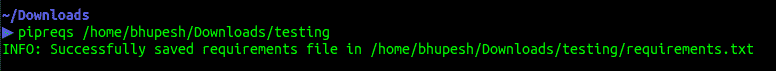
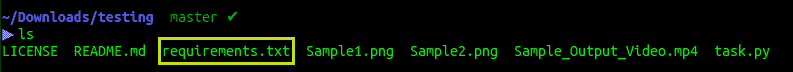
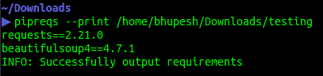

# pipreqs:自动生成 python 依赖项

> 原文：<https://dev.to/bhupesh/pipreqs-automatically-generate-python-dependencies-30nl>

我最近发现了一种替代方法，可以为 python 项目管理自动生成 python 依赖项。
它根据您在项目中导入的模块&包生成 **requirements.txt** 文件。通过这个简短的教程，我将简要介绍如何使用 [pipreqs](https://pypi.org/project/pipreqs/) 。

## 安装 pipreqs

安装非常简单。

`pip install pipreqs`

## 用法

生成 requirements.txt 文件。

`pipreqs /<your_project_path>/`

[](https://res.cloudinary.com/practicaldev/image/fetch/s--KmDLtODh--/c_limit%2Cf_auto%2Cfl_progressive%2Cq_auto%2Cw_880/https://drive.google.com/uc%3Fexport%3Dview%26id%3D1Lf1sJfl4qTdHuIJAilSyr7VUOgOYej6N)

您可以验证 **requirements.txt** 是否出现在同一个文件夹中。

[](https://res.cloudinary.com/practicaldev/image/fetch/s--Vmab1jep--/c_limit%2Cf_auto%2Cfl_progressive%2Cq_auto%2Cw_880/https://drive.google.com/uc%3Fexport%3Dview%26id%3D1HzA9OSeJeWJ2A8maFyUj_wkdAYKEEq4L)

您也可以通过使用
**- print** 附加标志在命令终端本身列出需求。

[](https://res.cloudinary.com/practicaldev/image/fetch/s--We6lXiW8--/c_limit%2Cf_auto%2Cfl_progressive%2Cq_auto%2Cw_880/https://drive.google.com/uc%3Fexport%3Dview%26id%3D1cslm9_LzUSyHVf0SFY9L1Wv3uNn-shQd)

此外，对于其他选项，您可以始终运行

`pipreqs --help`

这是帮助屏幕

```
Usage:
    pipreqs [options] <path>

Options:
    --use-local           Use ONLY local package info instead of querying PyPI
    --pypi-server <url>   Use custom PyPi server
    --proxy <url>         Use Proxy, parameter will be passed to requests library. You can also just set the
                          environments parameter in your terminal:
                          $ export HTTP_PROXY="http://10.10.1.10:3128"
                          $ export HTTPS_PROXY="https://10.10.1.10:1080"
    --debug               Print debug information
    --ignore <dirs>...    Ignore extra directories
    --encoding <charset>  Use encoding parameter for file open
    --savepath <file>     Save the list of requirements in the given file
    --print               Output the list of requirements in the standard output
    --force               Overwrite existing requirements.txt
    --diff <file>         Compare modules in requirements.txt to project imports.
    --clean <file>        Clean up requirements.txt by removing modules that are not imported in project. 
```

Enter fullscreen mode Exit fullscreen mode

## 为什么不用 pip 冻结？

正如 pipreqs 的 github [repo](https://github.com/bndr/pipreqs) 所说:

1.  **pip freeze** 保存环境中的所有包，甚至包括您在当前项目中不使用的包。
2.  另外 **pip 冻结**也是有害的。阅读[下面的](https://medium.com/@tomagee/pip-freeze-requirements-txt-considered-harmful-f0bce66cf895)帖子了解更多。