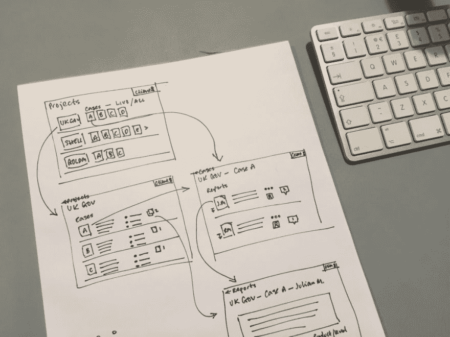

# 如何写一份出色的项目简介

> 原文：<https://dev.to/browserlondon/how-to-write-a-great-project-brief-3a44>

我们喜欢会见新客户，探索项目的新想法；如果不是这样，我们就不会在这里工作了。那么，当我们得知我们不能总是立即投入并开始我们收到的每一个项目简报时，可能会感到惊讶。

即使一个想法有真正的潜力，如果它看起来像一个简报没有得到它所需要的温柔的爱和关怀，警钟将在浏览器办公室这里开始大声响起！

## 发现可以填补空白

现在，我们确实不应该期望一个项目概要从一开始就包含所有的答案。事实上，任何好的项目都应该计划在[发现阶段](https://www.browserlondon.com/blog/2017/03/01/building-an-app-what-to-expect-from-the-discovery-phase/)进一步探索和巩固概要。

然而，在进行彻底的发现之前，准备好一份好的项目简报会为项目的成功奠定基础。例如，一份好的简报清晰地表达了一个清晰的愿景，并传达了紧密的目标，这可以帮助[促进新的](https://www.twineapp.com/blog/beginners-guide-employee-onboarding/)[设计师和开发人员团队](https://www.browserlondon.com/blog/2017/09/18/building-house-dev-team-hard/)的入职。当然，在建造过程中有许多其他因素会影响进度(资源、沟通、技术挑战)，但是修补漏洞比拯救一艘正在下沉的船要容易得多。

在任何项目中，我们最优先考虑的是打造正确的产品，以及尽可能最好的 T2 产品，确保为我们的客户创造最大的价值，而一份好的简报是其中很重要的一部分。

## 项目简要指南

那么，我们在理想的客户简报中能找到什么呢？嗯，我们喜欢能简单解释的复杂事物。如果你是一个新企业，一个好的、严密的价值主张是一个好的起点。除此之外，无论你是从零开始，重新制定平台，还是重塑品牌，这都是塑造所有好简报的指导原则。只需描述“如何”、“为什么”和“什么”。

*   从商业角度来看，这个想法是如何产生的。
*   *为什么*需要发展，或者*为什么*现在正是发展的时候。
*   以及*成功的衡量标准是什么*。

此外，应指导简报的其他问题包括:

*   你已经做了哪些研究来支持这个观点？
*   你的竞争对手是谁？(如果有)
*   谁是你的利益相关者？你的用户？

我们认为有一个理想的简短模板吗？嗯，是也不是。

我们发现的一件事是，少往往就是多。这并不是说摘要必须是一个特定格式的单页 word 文档或类似的东西，但是如果你使用上面的指南来组织所需的信息，它应该是中肯的和概括的。

毕竟，我们将在整个构建过程中与我们的客户密切合作，所以我们完全期待更多的细节出现，并在项目的各个阶段不断发展，所以一份简报不需要完全详尽。

根据项目的规模，我们甚至可以在与团队分享之前，将原始简报进一步分解成小简报(在敏捷开发的说法中通常称为史诗或用户故事),从而允许工作以更容易理解的块来处理。

## 使之可及

在一个领域工作一段时间后，我们都会被一个行业特有的术语所困扰。除非我们也非常熟悉行话，否则最好避免这样做，因为这样会有混淆的风险，并可能导致不同的解释。

想象一下，让你的建筑商自由支配你的房屋建设项目，只包括你正在寻找一些更“现代”的东西。谁知道你会有什么下场！

就像任何项目团队一样，无论是数字团队还是其他团队，我们都希望与客户保持一致。我们希望了解偏移中的小事情和大事情，以确保我们最终完成的任何工作对业务和用户都是正确的，并最终获得成功，正如简报中所述。

* * *

帖子[如何写一份伟大的项目简介](https://www.browserlondon.com/blog/2019/02/04/how-to-write-a-great-project-brief/)首先出现在[浏览器伦敦](https://www.browserlondon.com)上。