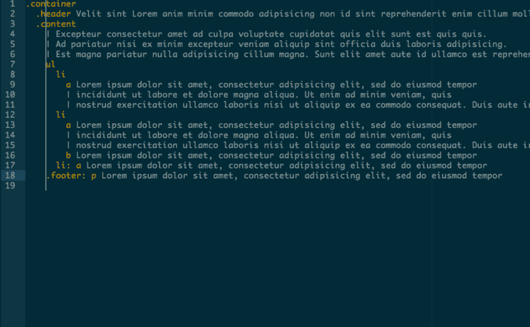

# 我的编辑器扩展开发之旅

> 原文：<https://dev.to/runtime-revolution/my-journey-in-developing-editor-extensions-21pb>

<figure> 

<figcaption>照片由[里卡多·罗卡](https://unsplash.com/photos/nj1bqRzClq8?utm_source=unsplash&utm_medium=referral&utm_content=creditCopyText)上[下](https://unsplash.com/search/photos/journey?utm_source=unsplash&utm_medium=referral&utm_content=creditCopyText)</figcaption>

</figure>

几年前，当 Github 的 Atom 编辑器发布时，我和许多其他 Web 开发人员一样，认为“很棒！基于我所知的堆栈构建的可扩展编辑器”。许多开发人员马上开始为它做贡献，这让编辑器变得非常棒。我开始使用 Atom 有两个原因:

1.  每隔一周就会有新的令人敬畏的扩展出现。
2.  我知道整个堆栈，这使得它非常可怕，这意味着有一天我可以创建自己的扩展。

#### 大光标扩展

当我开始使用 Atom 时，我用 3 种基于缩进的语言编程:Slim、Sass 和 CoffeeScript。

我不知道我可以改变标签的大小，所以我用了一个空格标签。弄清楚缩进块将在哪里结束是一件痛苦的事情。所以我想，如果我能把编辑器光标转换成一种标尺来查看每件事情的结束位置，那将是一件非常棒的事情。我想要这样的东西:

为了弄清楚如何做到这一点，我只是在 Atom 上切换了开发工具，选择了光标元素并改变了它的 CSS。这几乎是概念的证明。我知道这是可以做到的，现在我要做的就是去做。

我通过选择 Atom 菜单中的选项来创建一个扩展。我不得不看一下文档，弄清楚如何注册一个命令，以及如何将一个类应用到光标上。扩展的第一次迭代非常简单，可以归结为: