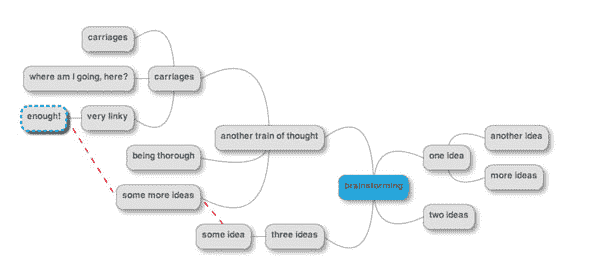

# 我希望从一开始就知道的工具

> 原文：<https://dev.to/dvddpl/tools-i-wish-i-knew-from-the-start-48kl>

在软件开发人员的职业生涯中，很多时候你不得不从零开始使用新技术，因为你擅长的技术已经过时，因为你加入了一个新的酷项目，或者仅仅因为你的公司没有人可以修复旧项目中的错误。
不管什么原因，除了语言技能、语法和其他东西之外，我一直认为最具挑战性和最耗时的是**了解特定技术堆栈的生态系统**。当然，人们可以在记事本上快速记下一些代码行，并能够编译/捆绑和运行它们，而不会有太多麻烦。但是当涉及到开发速度和有效的调试时，就有必要了解和使用大量的工具，这些工具使我们变得高效和熟练。

我总是着迷于寻找避免乏味重复任务的方法，当我最终意识到我不能自动完成这些任务时，我至少试着让我的生活更简单，让 T2 变得更快。
我喜欢结对编程或者只是路过与一些同事讨论一些实现细节的原因之一是，我不可避免地会注意到一些事情，这是*“嘿嘿嘿..捷径是什么，你刚才用的工具是什么？!"这就是今天的主显节。*

[](https://i.giphy.com/media/Lcn0yF1RcLANG/giphy.gif)

这就是为什么我从来不理解那些坚持用他们已知的舒适的方式做事的同事，无论这种方式有多慢多乏味(比如在 Tortoise 中必须用鼠标点击 10 次才能提交一个文件，或者到处丢弃 console.logs 而不是配置 VisualStudio 来运行一个合适的调试器)；每当我建议一个快捷方式或者一个工具时，答案都是:*“哦，但是那太复杂了，需要太长时间来设置，我没有时间去做。我只需要快速修复这个东西。”*他们就在那里，一遍又一遍地手动做耗时、乏味且容易出错的事情。

[](https://res.cloudinary.com/practicaldev/image/fetch/s--Cr49I2hV--/c_limit%2Cf_auto%2Cfl_progressive%2Cq_auto%2Cw_880/https://thepracticaldev.s3.amazonaws.com/i/29ky6rmdlsj2lqockhj8.jpg)

一开始，它可以是一个简单的快捷方式，如“Ctrl + Shift + ↑/↓”来移动一行代码，然后它建立起来，你会发现自己在生产中代理 web 应用程序的流量，并使用断点来调试你的 lambda 函数。

作为我在 DEV 上的第一篇文章。我想分享一些工具，我真的希望在我开始编码时向我展示一些库和插件，自从我在大约两年半前切换到**full stack Javascript server less**世界以来，我几乎每天都在使用它们，另外还有一些其他工具，它们确实在效率方面产生了影响。

* * *

## 节点和 Javascript

当然，每个库、语言和框架都有其好的或不好的文档页面，但是有一个可以查看的地方总是更好更快。
[Husky](https://github.com/typicode/husky) Git 挂钩是每当 Git 存储库中发生特定事件时自动运行的脚本。git 挂钩的主要缺点是它们不能被版本控制(它们驻留在您的本地 git 文件夹中)，它们大多是 shell 或 Perl，与您的团队共享它们或强制使用它们并不容易。使用 Husky，您可以编写一些 js，与您的项目一起提交，并将作为 git 钩子执行。Husky 会负责将您的脚本绑定到您喜欢的任何 git 动作。
[XO](https://github.com/xojs/xo) 众多 javascript linters 之一。选择的主要原因是输出漂亮，配置非常容易。(Linters 分析您的代码，寻找潜在的编程和风格错误。检测(并修复)从缩进到分号、未使用的导入或打字错误的问题，它有助于防止编译错误和缺陷，并强制执行严格和可读的代码，它保证了统一的代码风格。
[AVA](https://github.com/avajs/ava) 众多测试框架中的一个，但是最小且快速。选择的主要原因是它在一个单独的节点进程中运行每个测试，因此测试可以并发运行，并且能够在一个隔离的环境中并发运行测试。
[](https://res.cloudinary.com/practicaldev/image/fetch/s--kegGhilk--/c_limit%2Cf_auto%2Cfl_progressive%2Cq_auto%2Cw_880/https://thepracticaldev.s3.amazonaws.com/i/nq4405821daur6sv7m5m.png) 
[标准变更日志](https://www.npmjs.com/package/standard-changelog)遵循常规提交的规范，在您发布 NPM 包时，您将获得自动生成的变更日志。
[env-cmd](https://www.npmjs.com/package/env-cmd) 处理不同阶段(开发-质量保证-生产等)的环境变量和构建可能很难，而且很快变得混乱。有了这个方便的模块，您可以使用 env 文件中的环境来执行 package.json 中的脚本。
[React 开发工具](https://chrome.google.com/webstore/detail/react-developer-tools/fmkadmapgofadopljbjfkapdkoienihi)和 [Redux 开发工具](https://chrome.google.com/webstore/detail/redux-devtools/lmhkpmbekcpmknklioeibfkpmmfibljd?hl=it)如果您正在构建 React 应用程序，您不能不使用这些工具来检查组件和状态变化。

## 后端

如果你正在开发或测试一个 RESTful API，Postman 就是这个应用。这些年来，他们增加了越来越多的功能，比如模拟服务器和测试集，我大概用了其中 20%的功能。但是配置 GET POST 更新请求非常简单——使用不同环境的模板并快速检查响应。而不必使用 curl 或手动填写 web 应用程序的表单。
[](https://res.cloudinary.com/practicaldev/image/fetch/s--heLhNJPN--/c_limit%2Cf_auto%2Cfl_progressive%2Cq_auto%2Cw_880/https://thepracticaldev.s3.amazonaws.com/i/72l7bjmdq04clf836u1e.png) 
[查尔斯](https://www.charlesproxy.com/)查尔斯是一个 Web 代理，它将记录和显示所有发送和接收的数据。您可以使用它来查看 XML 和 JSON 请求和响应，调节带宽和模拟较慢的互联网连接，设置断点以及拦截和编辑请求和响应。(这是最好的特性之一，因为在服务器和客户机之间的通信中测试修复或重现错误非常方便。只需拦截使客户端崩溃的响应，修改它，然后看到您的客户端像魔法一样工作，然后您就可以确定您希望您的服务器如何响应，并可以安全地进行更改)。对于大多数简单的任务来说，Charles 可能是大材小用，但是经常会发生这样的情况:您希望将应用程序中的 API 调用重定向到本地运行的 API，以便您可以调试它，或者您只是希望检查网页加载的不同图像或 CSS。在这种情况下，这个 chrome 扩展做得非常好，真的只需几次点击。
[无服务器架构](https://serverless.com/)说真的，如果你从无服务器架构开始，就不要考虑使用 UI 控制台来构建你的应用。以代码的形式直接进入**基础设施。描述您的无服务器堆栈的所有组件，对其进行版本控制，并轻松部署。
[Dbeaver](https://dbeaver.io/about/) 免费开源的通用数据库工具。我用它来检查表的模式和内容，并测试我的 Lambdas 将执行的 SQL 查询。
[Robo 3T 原名 Robomongo](https://robomongo.org/) 由于 Dbeaver 只在企业版中支持 NOSQL，所以每当我需要使用 NoSQL 和 MongoDB 时，我都会使用 Robomongo。漂亮又直观。**

## 生产力

停止使用便利贴和待办清单来组织你的任务。可能在工作中，你已经在使用一些标签系统和协作工具来处理你在 sprint 期间的特性和 bug 开发。我个人在工作和家里都使用 Trello 来提醒自己在看板风格中必须做什么。
[](https://res.cloudinary.com/practicaldev/image/fetch/s--5VXE72Fk--/c_limit%2Cf_auto%2Cfl_progressive%2Cq_auto%2Cw_880/https://thepracticaldev.s3.amazonaws.com/i/ocy8l2c1yx51h5mpbnc8.png) 
[番茄工作法](https://chrome.google.com/webstore/detail/marinara-pomodoro%C2%AE-assist/lojgmehidjdhhbmpjfamhpkpodfcodef)番茄工作法有很多 chrome 扩展。选择一个，安排好你的时间，定义好你的任务，集中一小段时间，休息一下。没有电子邮件，电话，facebook 检查，直到计时器超时！
[Jumpcut](http://jumpcut.sourceforge.net/) **我们都 copypaste** 。jumpcut 允许你保存多达 99 个剪贴板的历史。

[奇观](https://www.spectacleapp.com/)无论您是拥有一台小屏幕笔记本电脑还是一台 3 显示器工作站，能够轻松快速地移动和调整您的窗口都是至关重要的。MacPass 使用简单的密码是不好的。许多服务和帐户使用相同的密码是非常糟糕的。到处都有复杂和不同的密码是不可能的。使用这样的工具来生成和存储您所有帐户的密码。
[](https://res.cloudinary.com/practicaldev/image/fetch/s--9dovu78I--/c_limit%2Cf_auto%2Cfl_progressive%2Cq_auto%2Cw_880/https://static.makeuseof.com/wp-content/uploads/2013/07/Mindmup-mind-map.png) 
[思维导图](https://www.mindmup.com/)每次我头脑风暴，或者我想整理我的思路时，我都会画一张思维导图。无论是在纸上还是在屏幕上，这都是跟随你的思路，然后重新组织概念的好方法。另一个图表工具，但是在这种情况下，它是关于 UML、流程图、模型和 AWS 架构的。

## 杂项

oh my zshgit 命令的自动完成，轻松导航到文件夹和文件，显示你的包中的所有脚本。
[源代码树](https://www.sourcetreeapp.com/)如果你真的忍不住想看一看 git repo，我发现源代码树非常整洁(虽然我只在没有纪律的时候使用它，我需要检查许多文件之间的差异，并为原子提交重新组织我的更改。JSON 查看器这个插件只是让你浏览器中打开的 Json 更具可读性。

[jq](https://stedolan.github.io/jq/) JQ 让你可以非常容易地打印、过滤、映射你的 JSON 文件

```
curl 'https://api.github.com/repos/stedolan/jq/commits?per_page=5' | jq '.[0]' 
```

Enter fullscreen mode Exit fullscreen mode

例如，通过管道传输 API 返回的 JSON，并返回列表的第一个元素。

* * *

这当然不是一个详尽的列表，而且在某种程度上是固执己见的，我没有研究和比较替代方案和类似的工具。(我已经准备好——也很高兴——转到我明天可能会发现和尝试的东西上)

最后，这真的无关紧要。重要的是灵活和高效，无论我们决定使用什么工具，它都必须允许我们提高生产力，加快枯燥的过程，让我们**专注于我们喜欢的事情**并做得最好——**解决问题并实施解决方案**。