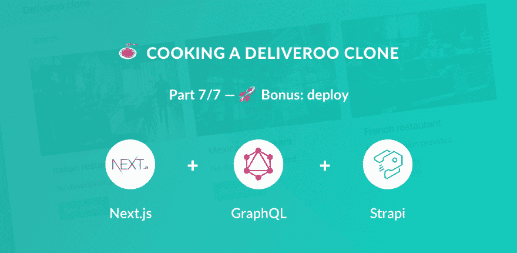
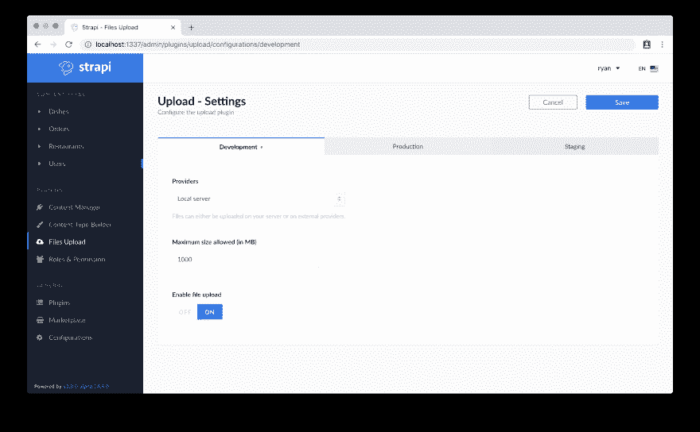
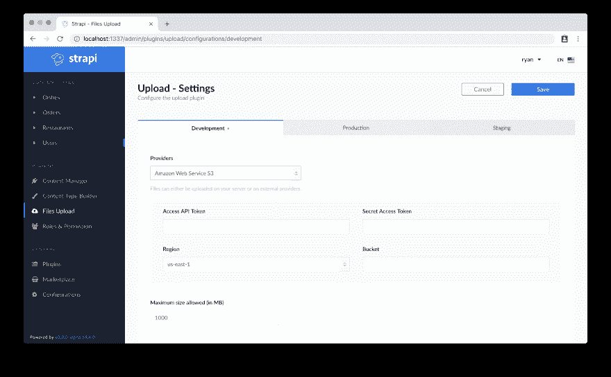

# 🍝用 Next.js (React)、GraphQL、Strapi 和 Stripe 制作一个 Deliveroo 克隆🚀额外奖励:部署-第 7/7 部分)

> 原文：<https://dev.to/ryanaz/-cooking-a-deliveroo-clone-with-nextjs-react-graphql-strapi-and-stripe----bonus-deploy---part-77-1i8e>

[](https://res.cloudinary.com/practicaldev/image/fetch/s--UEDfy7fY--/c_limit%2Cf_auto%2Cfl_progressive%2Cq_auto%2Cw_880/https://thepracticaldev.s3.amazonaws.com/i/bsm0q2edt1uhnn5r5jmv.png)

本教程是用 Next.js (React)、GraphQL、Strapi 和 Stripe 制作 Deliveroo 克隆教程系列的一部分。

**目录**

*   [设置](https://dev.to/ryanrez/-cooking-a-deliveroo-clone-with-nextjs-react-graphql-strapi-and-stripe----setup-part-17-ked)(第 1 部分)
*   🏠[餐馆](https://dev.to/ryanrez/-cooking-a-deliveroo-clone-with-nextjs-react-graphql-strapi-and-stripe----restaurants-list-part-27-10ce)(第二部分)
*   🍔[菜肴](https://dev.to/ryanrez/-cooking-a-deliveroo-clone-with-nextjs-react-graphql-strapi-and-stripe----dishes-list-part-37-5eh/)(第三部分)
*   🔐[认证](https://dev.to/ryanrez/-cooking-a-deliveroo-clone-with-nextjs-react-graphql-strapi-and-stripe----authentication-part-47-eho)(第四部分)
*   🛒 [购物车](https://dev.to/ryanrez/-cooking-a-deliveroo-clone-with-nextjs-react-graphql-strapi-and-stripe----shopping-cart-part-57-2h1e)(第五部分)
*   💵[订购和结账](https://dev.to/ryanrez/-cooking-a-deliveroo-clone-with-nextjs-react-graphql-strapi-and-stripe----order-and-checkout-part-67-fph)(第六部分)
*   🚀[奖励:部署](https://dev.to/ryanrez/-cooking-a-deliveroo-clone-with-nextjs-react-graphql-strapi-and-stripe----bonus-deploy---part-77-1i8e)(第七部分)——**当前**

*注:* *源代码* *在 GitHub 上有**:[https://GitHub . com/strapi/strapi-examples/tree/master/nextjs-react-strapi-deliver oo-clone-tutorial *](https://github.com/strapi/strapi-examples/tree/master/nextjs-react-strapi-deliveroo-clone-tutorial*)。**

## 🚀奖励:部署

此时，我们只需要部署我们的 API 和 web 应用程序。Strpi 可以托管在任何提供节点部署的主要提供商(AWS、Heroku、DO)上。在这里阅读关于 Strapi 部署的更多信息:
[https://Strapi . io/documentation/3 . x . x/guides/deployment . html](https://strapi.io/documentation/3.x.x/guides/deployment.html)

*注意:对于部署，您需要将您的 URL 和连接字符串从我们在教程中使用的默认 localhost:1337 更改为您要部署到的绝对服务器 URL。*

*在实际应用中，建议使用 webpack 环境变量，以避免每次部署到生产环境时都必须手动更改 URL*

### 奖励:奖励 AWS 文件上传

如果将您的后端部署到不在服务器上持久存储的提供商(如 Heroku ),默认的 Strapi 本地服务器上传将不起作用，因为服务器上的文件会定期自动擦除。

Strapi 支持简单的文件上传到 S3，使其遵循以下说明。

**Strapi Docs:**[https://Strapi . io/documentation/3 . x . x/guides/upload . html #示例](https://strapi.io/documentation/3.x.x/guides/upload.html#examples)

要安装 strapi-aws-upload 包，请转到创建 strapi 的文件夹的根目录:

```
cd backend
npm install strapi-upload-aws-s3@alpha --save 
```

软件包安装完成后，您可以在浏览器中导航到:
[http://localhost:1337/admin/plugins/upload/configuration s/development](http://localhost:1337/admin/plugins/upload/configurations/development)

您应该会看到相应环境的文件上传存储选项的配置选项

[](https://res.cloudinary.com/practicaldev/image/fetch/s--kCxhOF0f--/c_limit%2Cf_auto%2Cfl_progressive%2Cq_auto%2Cw_880/https://thepracticaldev.s3.amazonaws.com/i/bk781femukljrxe5hzbi.png)

从*供应商*下拉菜单
[](https://res.cloudinary.com/practicaldev/image/fetch/s--r9EJOmv8--/c_limit%2Cf_auto%2Cfl_progressive%2Cq_auto%2Cw_880/https://thepracticaldev.s3.amazonaws.com/i/3woce7hdyyzbac7cgohe.png) 中选择亚马逊网络服务 S3

输入您各自的 AWS 访问密钥 ID、密码、区域和存储桶名称，同时确保启用文件上传已打开

在前端代码中，确保从 img src 属性中删除 localhost:1337。你现在可以使用 **res.image.url** 来获取 S3 图片链接

对于`RestaurantList index.js`组件和`restaurants.js`页面，您都必须这样做

示例: