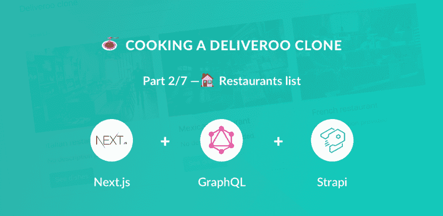
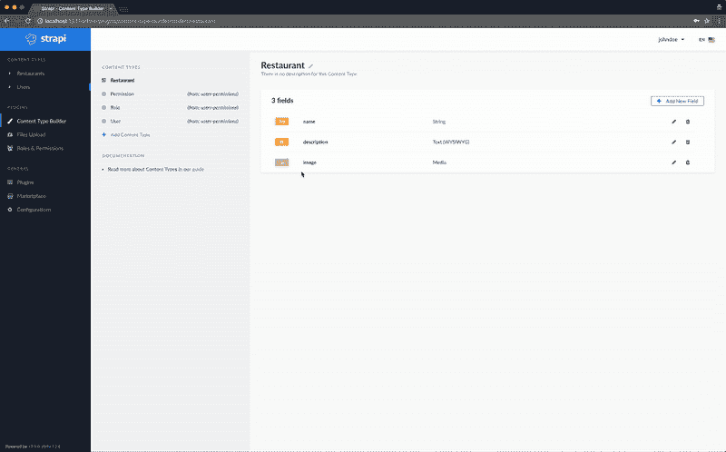
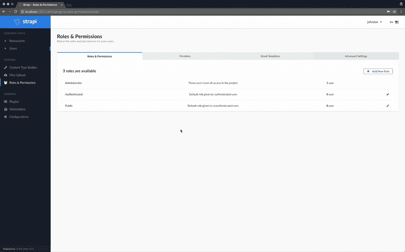
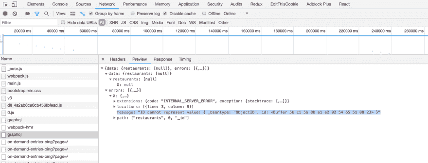
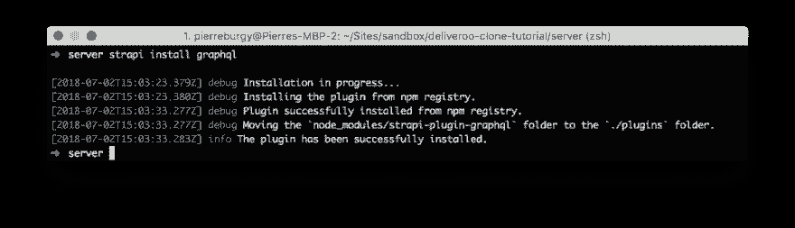
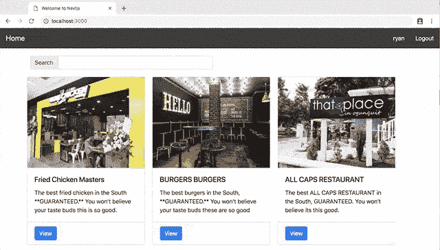

# 🍝用 Next.js (React)、GraphQL、Strapi 和 Stripe 制作一个 Deliveroo 克隆🏠餐馆列表(第 2/7 部分)

> 原文：<https://dev.to/ryanaz/-cooking-a-deliveroo-clone-with-nextjs-react-graphql-strapi-and-stripe----restaurants-list-part-27-10ce>

[](https://res.cloudinary.com/practicaldev/image/fetch/s--nSob71Y7--/c_limit%2Cf_auto%2Cfl_progressive%2Cq_auto%2Cw_880/https://thepracticaldev.s3.amazonaws.com/i/0294g6s34sm0586ozarz.png)

本教程是用 Next.js (React)、GraphQL、Strapi 和 Stripe 制作 Deliveroo 克隆教程系列的一部分。

**目录**

*   [设置](https://dev.to/ryanrez/-cooking-a-deliveroo-clone-with-nextjs-react-graphql-strapi-and-stripe----setup-part-17-ked)(第 1 部分)
*   🏠[餐厅](https://dev.to/ryanrez/-cooking-a-deliveroo-clone-with-nextjs-react-graphql-strapi-and-stripe----restaurants-list-part-27-10ce)(第二部分)**-当前**
*   🍔[菜肴](https://dev.to/ryanrez/-cooking-a-deliveroo-clone-with-nextjs-react-graphql-strapi-and-stripe----dishes-list-part-37-5eh/)(第三部分)
*   🔐[认证](https://dev.to/ryanrez/-cooking-a-deliveroo-clone-with-nextjs-react-graphql-strapi-and-stripe----authentication-part-47-eho)(第四部分)
*   🛒 [购物车](https://dev.to/ryanrez/-cooking-a-deliveroo-clone-with-nextjs-react-graphql-strapi-and-stripe----shopping-cart-part-57-2h1e)(第五部分)
*   💵[订购和结账](https://dev.to/ryanrez/-cooking-a-deliveroo-clone-with-nextjs-react-graphql-strapi-and-stripe----order-and-checkout-part-67-fph)(第六部分)
*   🚀[奖励:部署](https://dev.to/ryanrez/-cooking-a-deliveroo-clone-with-nextjs-react-graphql-strapi-and-stripe----bonus-deploy---part-77-1i8e)(第七部分)

*注:* *源代码* *在 GitHub 上有**:[https://GitHub . com/strapi/strapi-examples/tree/master/nextjs-react-strapi-deliver oo-clone-tutorial *](https://github.com/strapi/strapi-examples/tree/master/nextjs-react-strapi-deliveroo-clone-tutorial*)。**

## 🏠餐馆列表

首先，我们需要在 web 应用程序中显示餐馆列表。当然，这个列表将通过我们的 API 来管理。因此，我们将开始配置它。

### 定义内容类型

内容类型也称为`model`，是一种数据类型。默认情况下，Strapi API 包括`user`内容类型。现在，我们需要餐馆，所以正如你已经猜到的，我们的新内容类型将是`restaurant`(内容类型总是单数)。

以下是必需的步骤:

*   导航到内容类型构建器([http://localhost:1337/admin/plugins/Content-Type-Builder](http://localhost:1337/admin/plugins/content-type-builder))。
*   点击`Add Content Type`。
*   将`restaurant`设置为名称。
*   点击`Add New Field`并创建以下字段:
    *   `name`同式串。
    *   `description`用富文本编辑器键入文本(在 modal 的高级设置部分，选择`Display as a WYSIWYG`)。
    *   `image`同类型`Media`。
*   点击保存。

[](https://res.cloudinary.com/practicaldev/image/fetch/s--WOC7VFAS--/c_limit%2Cf_auto%2Cfl_progressive%2Cq_66%2Cw_880/https://thepracticaldev.s3.amazonaws.com/i/3fpbccr35t7l79ow2jm5.gif)

此时，您的服务器应该已经自动重启，一个新的链接`Restaurant`出现在左侧菜单中。

### 添加一些条目

干得好！您创建了您的第一个内容类型。下一步是在数据库中添加一些餐馆。为此，点击左侧菜单中的“餐馆”([http://localhost:1337/admin/plugins/content-manager/Restaurant](http://localhost:1337/admin/plugins/content-manager/restaurant))。

你现在在内容管理器插件中:一个自动生成的用户界面，允许你查看和编辑条目。

让我们创建一个餐厅:

*   点击`Add New Restaurant`。
*   给它一个名字，一个描述和一个图片。
*   省省吧。

在你的应用程序中创建尽可能多的餐馆。

[](https://res.cloudinary.com/practicaldev/image/fetch/s--pAP7jh9_--/c_limit%2Cf_auto%2Cfl_progressive%2Cq_66%2Cw_880/https://thepracticaldev.s3.amazonaws.com/i/1q8r1wo25xhgc5h9z7xx.gif)

### 允许访问

拥有数据库中的项目是伟大的。能够从 API 请求它们就更好了。正如你已经知道的，Strapi 的任务是创建 api(我有一个超级秘密的轶事告诉你:它的名字来自 Boot **strap** your**API**😮).

当您创建您的`restaurant`内容类型时，Strapi 在幕后创建了位于`api/restaurant`中的几组文件。这些文件包括公开完全可定制的 CRUD API 的逻辑。`find`路线可在[http://localhost:1337/restaurants](http://localhost:1337/restaurants)查询。尝试访问这个网址，你会惊讶地发现被一个 403 禁止错误阻止。这实际上是完全正常的:Strapi APIs 在设计上是安全的。

别担心，让这条路线无障碍实际上是超级直观的:

*   导航到管理插件的`Roles & Permissions`部分([http://localhost:1337/admin/plugins/users-permissions](http://localhost:1337/admin/plugins/users-permissions))。
*   点击`Public`角色。
*   勾选`Restaurant`部分的`find`和`findone`复选框。
*   保存。

*重要的*:为`authenticated`角色做同样的事情。

现在回到[http://localhost:1337/restaurants:](http://localhost:1337/restaurants:)此时，您应该能够看到您的餐馆列表。

[](https://res.cloudinary.com/practicaldev/image/fetch/s--skLjRvBo--/c_limit%2Cf_auto%2Cfl_progressive%2Cq_66%2Cw_880/https://thepracticaldev.s3.amazonaws.com/i/khqfzezl5gxqk8op1qf0.gif)

### 启用 GraphQL

默认情况下，用 Strapi 生成的 API 最符合 REST 约定。如果我告诉你，你可以在 10 秒钟内将它们转换成 GraphQL，会怎么样？

让我证明给你看。

Strapi 提供了一个 GraphQL 插件，它将为您完成所有工作。使用 Strapi CLI 安装它:

**导航到安装 strapi 的后端文件夹，使用 strapi install 命令安装 graph QL:**

```
cd backend
strapi install graphql 
```

或者点击管理面板上的“Marketplace”并选择 GraphQL

就这样，您完成了 GraphQL 的安装。

**如果 strapi 服务器没有自动重启，请确保重启它**

# 重要:

#### 降 graphql-js 依赖关系

对于当前的实现，当您试图查询 MongoDB _id 字段时，将会收到一个 GraphQL 错误:

graphql-js 的维护者目前正在修复这个问题，但是在撰写本文时还没有修复(下面链接了 github 问题)。

**消息:" ID 不能表示值:{ _bsontype: "ObjectID "，id: }"**

[](https://res.cloudinary.com/practicaldev/image/fetch/s--hjyrINLq--/c_limit%2Cf_auto%2Cfl_progressive%2Cq_auto%2Cw_880/https://thepracticaldev.s3.amazonaws.com/i/ty52s68zx1t3tvuhcdv5.png)

这是由 graphql-js 更新中关于 MongoDB 的 ID 如何序列化的突破性变化引起的:[https://github.com/graphql/graphql-js/issues/1518](https://github.com/graphql/graphql-js/issues/1518)。

根据评论，看起来维护者正在修复，但在撰写本文时(2018 年 10 月 12 日)，修复是将您的 graphql 包降级为:GraphQL 0.13.2。

依赖包在位于`/backend/plugins/graphql/`的 GraphQL 插件文件夹下的**/后端**文件夹中。

```
cd plugins/graphql
npm install graphql@0.13.2 --save 
```

在您的 packages.json 文件中，您的 graphql 依赖项应该被列为`"graphql": "0.13.2"`

在问题解决之前，如果您在服务器内部升级您的软件包，您将会破坏实现。

* * *

[](https://res.cloudinary.com/practicaldev/image/fetch/s--N1iLHl3---/c_limit%2Cf_auto%2Cfl_progressive%2Cq_auto%2Cw_880/https://thepracticaldev.s3.amazonaws.com/i/0363m11lbi58h2kzsdsf.png)

重启你的服务器，进入[http://localhost:1337/graph QL](http://localhost:1337/graphql)并尝试这个查询:

```
{
  restaurants {
    _id
    name
  }
} 
```

## T2】

### 显示餐厅

看起来你走对了方向。如果我们在下一个应用程序中显示这些餐厅会怎么样？

[](https://res.cloudinary.com/practicaldev/image/fetch/s--E4TkDXXN--/c_limit%2Cf_auto%2Cfl_progressive%2Cq_66%2Cw_880/https://thepracticaldev.s3.amazonaws.com/i/zrjowwba57275b9xmkwz.gif)

在我们的应用程序的**前端安装 Apollo，导航到`/frontend`文件夹:** 

```
cd ..
cd ..
cd ..
cd frontend
yarn add react-apollo next-apollo graphql gql recompose 
```

为了将我们的应用程序与 GraphQL 连接起来，我们将使用 apollo 和下一个 apollo 实现来将我们的组件包装在一个 withData HOC 中，以使它们能够进行 Apollo 数据查询。

将 GraphQL 实现到 Nextjs 应用程序中有几种不同的方法，我们将采用的方法是将 Apollo 逻辑提取到 lib 文件中，并用名为 withData 的高阶组件包装我们的组件，以处理每个组件中的 GQL 查询。

详细描述 Apollo Next.js 实现的示例回购:
[https://github.com/adamsoffer/next-apollo-example](https://github.com/adamsoffer/next-apollo-example)。

在项目的根目录下创建一个 lib 目录:

```
mkdir lib
cd lib
touch apollo.js 
```

* * *

路径:`/frontend/lib/apollo.js`