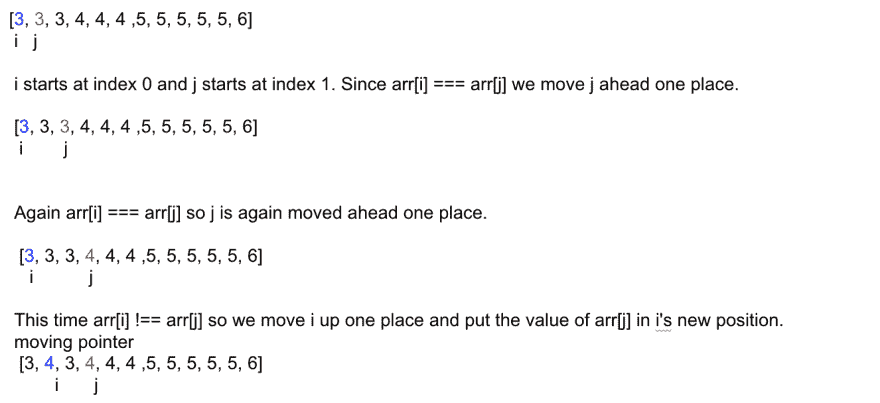
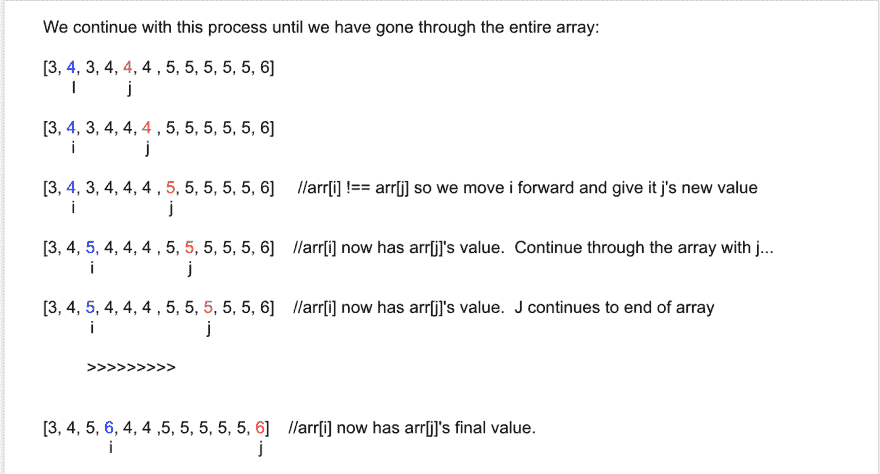
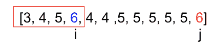

# 处理算法:计算唯一值

> 原文：<https://dev.to/denisepen/tackling-algorithms-counting-unique-values-1a5n>

### 问题:给定一个整数数组，统计唯一值的个数。

例如，如果我们有以下数组:

[1, 1, 1, 1, 1, 1, 3, 5]

原始值的计数为 3 => 1、3 和 5。

#### 第一种解决方案:频率计数器

第一次尝试这个问题的时候我决定:
**1。创建一个空对象**，并对每一个遇到的整数或者
**2。将该整数添加到对象**中，或者，如果该整数已经存在于对象
**3 中。将其值增加 1** 。

下面是我的代码(使用 javascript):

```
function countUniqueValues(arr){

  let newObj = {};                  //created new empty object to hold integer values.

  for (let i=0; i<arr.length; i++){ //iterate over the array

      let char = arr[i];

      if ( newObj[char] > 0 ) {     //if the item is already in newObj 
          newObj[char]++            //increment its value by 1
      } else {
          newObj[char] = 1          //if the integer is not already in newObj put it there with a value of 1
      }

  }
  return Object.keys(newObj).length;   //return length of array returned by Object.keys(newObj)
} 
```

运行 **countUniqueValues([3，3，3，4，4，4，5，5，5，5，6])** 返回 4。因为有 4 个唯一值= > 3，4，5，6。

如果我们想在函数的末尾看到 newObj 的值，我们可以在最终返回之前加上* console . log(new obj):

```
...
}
  console.log(newObj)
  return Object.keys(newObj).length;
} 
```

运行 **countUniqueValues([3，3，3，4，4，4，5，5，5，5，6])** 打印一个
的 newObj 值

```
 newObj = {
     3: 3, 
     4: 3, 
     5: 5,
     6: 1
} 
```

正如你所看到的，对象中有 4 个键:3、4、5 和 6。

此时，剩下要做的就是计算我们用 Object.keys(newObj).length 完成的键的数量。

#### 第二种解法:多个指针

(*摘自[本课程](https://www.udemy.com/js-algorithms-and-data-structures-masterclass/learn/v4/overview)* )

要使用这个方法，你必须从一个有序的数组开始。

1.  比较索引 I 处的值和索引 j 处的值。

2.  如果它们相等，向前移动 j，直到找到不等于 I 的值。

3.  如果它们不相等，则将 I 上移 1 格，并将 j 的值放入 I 的新位置。

4.  继续这样做，直到你已经完成了整个数组。“I”将位于最终唯一值的索引处。如果我们在这个索引号上加 1，我们将得到唯一值的总数。

我们将使用与上面相同的数组:**【3，3，3，4，4，4，5，5，5，5，6】**

让我们浏览一下代码:

```
function countUniqueValues(arr) {
    var i=0;

    for (var j=1; j < arr.length; j++) {
        if(arr[i] !== arr[j]){
            i++;
            arr[i] = arr[j]
        }
    console.log(i,j)
    }
    return i + 1;
} 
```

[](https://res.cloudinary.com/practicaldev/image/fetch/s--d8JMJOVu--/c_limit%2Cf_auto%2Cfl_progressive%2Cq_auto%2Cw_880/https://i.imgur.com/UUJpmbB.png)

[](https://res.cloudinary.com/practicaldev/image/fetch/s--k7F-liac--/c_limit%2Cf_auto%2Cfl_progressive%2Cq_auto%2Cw_880/https://i.imgur.com/yo7Lobw.png)

在我们完全遍历完数组一次后，每个唯一值都位于数组的开头，而“I”位于最后一个唯一值的位置:

[](https://res.cloudinary.com/practicaldev/image/fetch/s--uj9sneUw--/c_limit%2Cf_auto%2Cfl_progressive%2Cq_auto%2Cw_880/https://i.imgur.com/kvUCdF5.png)

我们看到 I 在索引 3 处，所以我们只需在此处加 1，得到 4，这是唯一值的总数:

```
return i + 1 
```

因为我们要给 I 加 1，所以当给定一个空数组[]时，这就成了一个问题。如果我们使用上面的解决方案，我们将得到返回值 1。为了解决这个问题，我们可以在函数的开头添加一个检查来检查空数组:

```
if (arr.length === 0 ) return 0; 
```

最后一个功能是:

```
function countUniqueValues(arr) {
  if (arr.length === 0 ) return 0;
    var i=0;

    for (var j=1; j < arr.length; j++) {
        if(arr[i] !== arr[j]){
            i++;
            arr[i] = arr[j]
        }
    console.log(i,j)
    }
    return i + 1;
} 
```

如您所见，这个问题的第二个解决方案只在数组中运行一次，不需要创建额外的对象或计算该对象的键数，因此第二个解决方案比第一个解决方案更有效。虽然这两种解决方案的时间复杂度都应该是 O(n)，但是第二种解决方案在空间复杂度方面是一种改进。

你会如何处理这个问题？