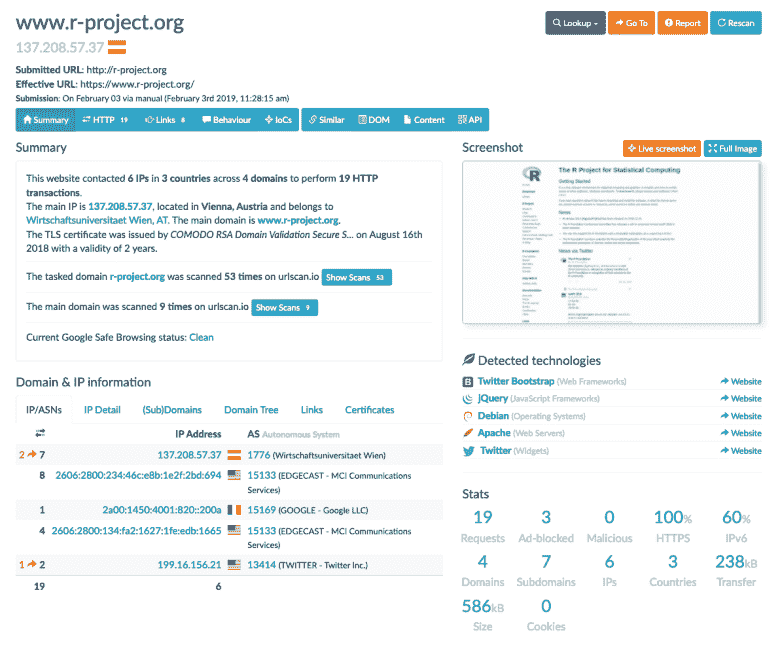
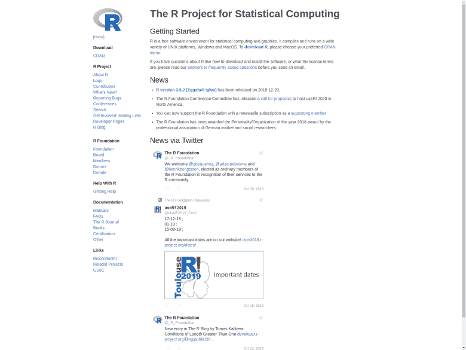

# r 包更新:urlscan

> 原文：<https://dev.to/hrbrmstr/r-package-update-urlscan-2hdi>

[`urlscan`](https://git.sr.ht/~hrbrmstr/urlscan) 包( [urlscan.io](https://urlscan.io/) API 的接口)现在的版本是 0.2.0，支持 urlscan.io 在提交链接进行分析时的认证要求。如果你想了解一个网站的细节——所有血淋淋的技术细节，这项服务很方便。

例如，假设您想要检查`r-project.org`。您可以手动进入网站，在请求栏中输入，然后等待[结果](https://urlscan.io/result/42fe8168-93f5-484b-89e2-1abbd1007b73/loading):

[](https://rud.is/b/2019/02/03/r-package-update-urlscan/urlscan-result/)

或者，可以用 R！。首先选择你喜欢的社交编码网站，通读源代码(这将是从这篇文章开始的每篇文章的新建议。不要盲目相信任何社交编码网站的代码)然后安装`urlscan`包:

```
devtools::install_git("https://git.sr.ht/~hrbrmstr/urlscan")
# or
devtools::install_gitlab("hrbrmstr/urlscan")
# or
devtools::install_github("hrbrmstr/urlscan") 
```

Enter fullscreen mode Exit fullscreen mode

接下来，回到 urlscan.io 并获取一个 API 密匙(这是免费的)。把那个插在你的`URLSCAN_API_KEY`下面的`~/.Renviron`里，然后把`readRenviron("~/.Renviron")`插在你的 R 控制台里。

现在，让我们来看看`r-project.org`。

```
library(urlscan)
library(tidyverse)

rproj <- urlscan_search("r-project.org")

rproj
## URL Submitted: https://r-project.org/
## Submission ID: eb2a5da1-dc0d-43e9-8236-dbc340b53772
## Submission Type: public
## Submission Note: Submission successful 
```

Enter fullscreen mode Exit fullscreen mode

在那个`rproj`对象中有更多的数据，但是我们有足够的数据来获得更详细的结果。请注意，当您使用`urlscan_result()`时，如果 site 还没有完成分析，它将返回一个错误。

```
rproj_res <- urlscan_result("eb2a5da1-dc0d-43e9-8236-dbc340b53772", include_shot = TRUE)

rproj_res
## URL: https://www.r-project.org/
## Scan ID: eb2a5da1-dc0d-43e9-8236-dbc340b53772
## Malicious: FALSE
## Ad Blocked: FALSE
## Total Links: 8
## Secure Requests: 19
## Secure Req %: 100% 
```

Enter fullscreen mode Exit fullscreen mode

那个`rproj_res`保存了相当多的数据，并且没有假设你想如何使用它，所以你需要和它争论一番才能找到答案。`rproj_res$scan_result`条目包含具有以下信息的条目:

*   `task`:提交信息:时间、方式、选项、截图/DOM 链接
*   `page`:关于页面的高级信息:地理位置、IP、PTR
*   `lists`:域名、IP、URL、ASN、服务器、哈希列表
*   所有的请求/响应、链接、cookies、消息
*   `meta`:处理器输出:ASN、GeoIP、AdBlock、Google 安全浏览
*   `stats`:计算的统计数据(按类型、协议、IP 等)。)

让我们看看 R 核心成员允许多少个域来跟踪你:

```
curlparse::domain(rproj_res$scan_result$lists$urls) %>% # you can use urltools::domain() instead of curlparse
  table(dnn = "domain") %>% 
  broom::tidy() %>% 
  arrange(desc(n))
## # A tibble: 7 x 2
## domain n
## <chr> <int>
## 1 platform.twitter.com 7
## 2 www.r-project.org 5
## 3 pbs.twimg.com 3
## 4 syndication.twitter.com 2
## 5 ajax.googleapis.com 1
## 6 cdn.syndication.twimg.com 1
## 7 r-project.org 1 
```

Enter fullscreen mode Exit fullscreen mode

具有讽刺意味的是，这也是我如何得知他们允许 Twitter 不安全地(没有子资源完整性或任何内容安全策略)在您的浏览器中执行 JavaScript(Twitter JavaScript 在 hrbrmstr 大院通过多种方式被阻止，所以我看不到小部件)。

因为我添加了`include_shot = TRUE`选项，所以我们也得到了一个页面截图(作为一个`magick`对象):

```
rproj_res$screenshot 
```

Enter fullscreen mode Exit fullscreen mode

[](https://rud.is/b/2019/02/03/r-package-update-urlscan/urlscan-shot/)

### 鳍

通过使用这个包，有大量的关于网站的元数据可以探索，所以跳进来吧，踢踢轮胎，玩得开心！并根据需要归档问题/PRs。