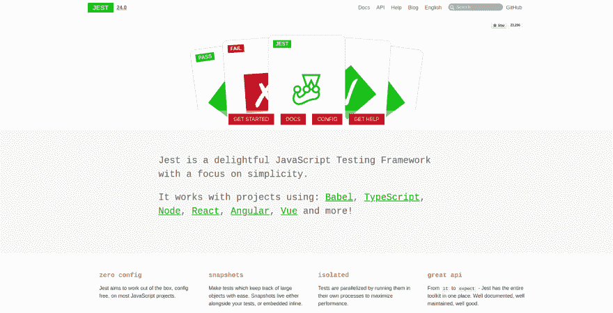
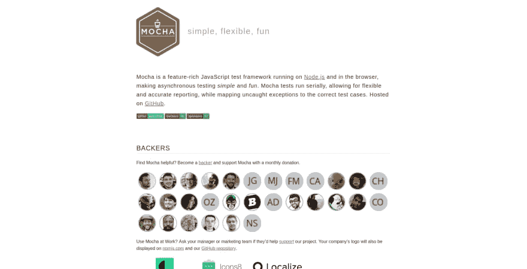
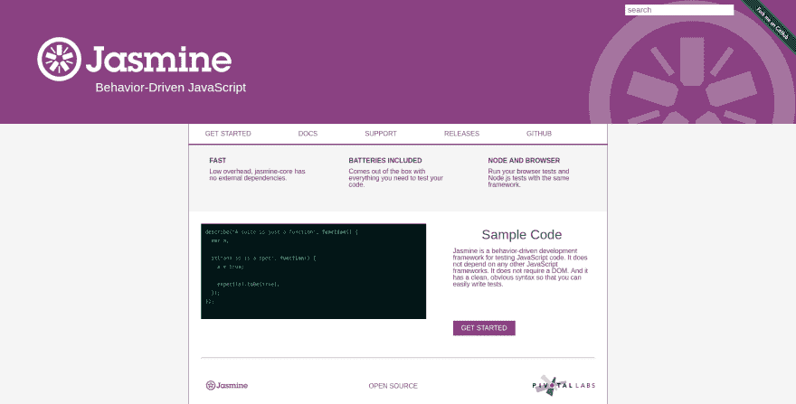
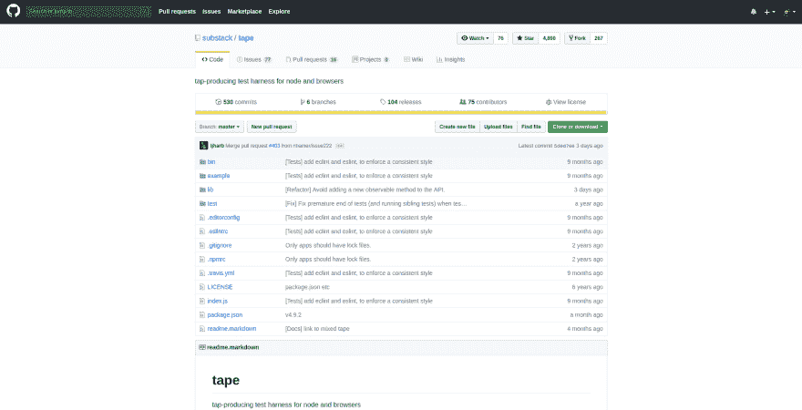
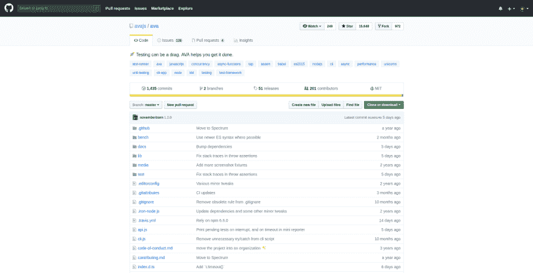
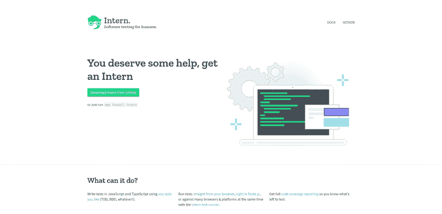
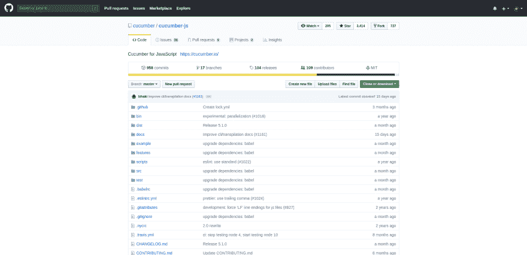

# JS 中的单元测试简介

> 原文：<https://dev.to/areknawo/introduction-to-unit-testing-in-js-2bmk>

**这篇文章摘自[我的博客](https://areknawo.com)，所以请务必查看更多最新内容😉**

如果你是编程新手，或者你只是一个业余爱好的程序员，从来没有做过任何类型的开源项目，那么你可能会对测试你的代码的想法感到有点怀疑。如果你确实是，那么在这篇文章中，让我说服你为你的代码做**单元测试**，并且测试它，一般来说，是一个好的实践。然后我们将学习/修改一些关于代码测试的知识，最后探索进行单元测试的最佳工具。尽情享受吧！😉

# 为什么要检测？

首先，让我们谈谈为什么测试很重要。当你开发任何种类的应用或工具(尤其是开源的)时，测试应该是你的盟友。想想他们带来的**质量**。当您的测试覆盖了代码中所有可能的异常和情况时，您可以确信它在将来不会让您失望。这是测试的另一个原因- **保证**。覆盖您整个代码库的测试保持最新，允许您不断地检查它是否有任何错误。它让你确信一切都很好。如果你没有做过任何需要由许多人管理或需要为他人服务的项目(OSS ),那么你可能不会真的把这整个保证当成一件事。但是相信我，这真的很重要。没有任何**保证**，你永远无法确定你的代码是否**健康**。😕最后但同样重要的是，我们有**文档**的优势。信不信由你，与整页文字相比，正确完成的测试有时可以更好地理解如何使用一段特定的代码。想想吧。您的代码通过了测试。这样，您就有了如何使用给定代码及其结果的信息。因此，正如你所看到的，有很多理由开始测试你的代码，因此，如果你还没有，是时候做一些测试了！

# 测试种类

如果我成功说服你去做测试，那我真的很开心。🎉但是代码测试世界的规模在开始的时候可能会让人感到有些不知所措。有如此多的术语、概念、意识形态和工具以及库需要了解。让我们给它一些结构。首先，你必须知道你在做什么样的测试，这样你就可以为这项工作选择合适的工具。根据存在的原因，有 3 种主要的**类型**的测试。

*   **单元测试** -单元测试允许你测试你的代码的一个真正**特定的方面**，例如，一个针对预期结果的功能。对于你的测试来说，覆盖你所有的代码，一个特性接一个特性，这真的很重要。这些是这篇文章的主要焦点。
*   **集成测试** -测试你的代码的不同部分，例如组件是否正常工作。你还应该检查它们一起工作的方式，即**结构完整性**。检查副作用也很重要。你必须知道是否有函数调用等等。你没有计划。
*   **功能测试**——我认为 **UI 测试**这个名字更好地解释了这些测试的目的。通过功能测试，你可以在特定的**环境**中检查你的最终产品，比如网络应用，通常是浏览器。这里出现了无头浏览器的概念，通过使用不同的 API 调用来控制它，在没有可视 UI 的浏览器中执行测试。乍一看，这似乎有点笨拙，但这是一种非常有用的技术，尤其是节省了 UI 和其他进程所需的一些时间，这在无头模式中是不存在的。

# 术语

现在，你对不同类型的测试和单元测试有了更多的了解，我认为在测试的时候谈论一些基本的概念和术语是一个好主意。

我想先解释一下 **TDD** 和 **BDD** 这两个快捷方式，你们可能之前已经在某个地方看到过，但是没有太注意。因为这些可以被看作是**构建**和编写测试的基本指导方针。

测试驱动开发(Test-Driven-Development)是基于测试开发软件的过程。这就像一个周期，一个循环——每次你想要添加一个特性，你首先要写你的测试(很明显这会失败),然后你写实际的代码，完成这些测试，然后你再次测试来检查它。**你的发展基于测试**。很有趣的想法，你同意吗？

至于**行为驱动开发** (BDD)，这是另一种意识形态，事实上是基于 TDD 的。但是，这个名称可能不像第一个那样一目了然。它可以被看作是带有一些更好的附加指导方针的 TDD。在这里，我们的开发不是由测试驱动的，而是由行为、规范驱动的，事实上无论如何都是测试。😂他们只是更好的描述，用**纯正英语**。这允许你的测试被更好地记录，从而更具**可读性**。这就是为什么图书馆比 TDD 更经常采用这种方式进行测试。

了解了这两个对测试如此重要的趋势后，是时候探索一些术语了，就像 BDD 建议的那样，用英语解释。😉

*   **断言函数**——我们用来**测试**我们的代码与预期输出的函数。在 Jest 和许多其他单元测试库中，它们看起来像这样:

```
expect(value).toBeTruthy() 
```

Enter fullscreen mode Exit fullscreen mode

*   代码覆盖率 -指出测试覆盖了我们代码的多大部分。这些是非常有用的统计数据，当您选择下一个测试库时，可以考虑这些额外的特性。当然，有[独立工具](https://gotwarlost.github.io/istanbul)可以解决这个问题，但是把所有东西都放在一个包里会舒服得多。
*   **环境**——一般是一个(**无头** ) [浏览器](https://pptr.dev/)或者[类似](http://nightwatchjs.org/)的东西来进行你的功能测试。我们不打算深究这一点，但这里也有一些不错的选择。😄
*   [**模拟**](https://sinonjs.org)——也称为**模拟**，用于模拟某些行为，以便稍后在测试中使用，即使没有以现实方式实现的不同功能，也能提供可靠的输入/输出检查。
*   [**间谍**](https://sinonjs.org)——提供**信息**有关功能。通过使用它们，你可以知道一个函数被调用的次数、时间和参数。它们可能是检查副作用的最好方法。
*   [**存根**](https://sinonjs.org)——也称为**配音**，给你用不同的东西替换所选功能的能力，以测试预期的功能和行为。
*   **快照测试** -一种测试方式，基于将输出数据与已保存的副本(快照)进行比较。

至此，您应该对测试方法和您期望从您选择的库获得的功能有了基本的了解。因为这里我只关注单元测试，所以一定要查看上面列出的一些链接，看看在一个独立的包中提供给定功能的工具。

# 单元测试

理论已经过时了，是时候做一些测试了——单元测试！但是首先，让我们为这项工作选择最好的工具。下面是一些最好的单元测试库和工具的列表&更多。🔥

[](https://res.cloudinary.com/practicaldev/image/fetch/s--ARJgGdp6--/c_limit%2Cf_auto%2Cfl_progressive%2Cq_auto%2Cw_880/https://areknawo.com/conteimg/2019/02/Screenshot-from-2019-02-01-16-31-43.png)

# [t1](#jest)[是](https://jestjs.io/)

```
test('adds 1 + 2 to equal 3', () => {
  expect(1 + 2).toBe(3);
}); 
```

Enter fullscreen mode Exit fullscreen mode

谈到单元测试，Jest 是我个人的首选。由来自脸书的家伙开始，它已经在许多流行的库上经过了充分的测试，例如 **React** 本身。它提供了高质量单元测试所需的几乎所有特性。可读的断言函数、出色的**覆盖率**报告、**模拟 API** 、**并行测试运行器**以及总体易用性使得这个库成为目前市场上的最佳选择之一，尤其是对于 BDD 而言。除此之外，一个伟大的社区和支持以及精心编写的文档是非常引人注目的。

[](https://res.cloudinary.com/practicaldev/image/fetch/s--Uu1l1ZHm--/c_limit%2Cf_auto%2Cfl_progressive%2Cq_auto%2Cw_880/https://areknawo.com/conteimg/2019/02/Screenshot-from-2019-02-01-20-43-34.png)

# [摩卡](https://mochajs.org/)

```
var assert = require('assert');
describe('Array', function() {
  describe('#indexOf()', function() {
    it('should return -1 when the value is not present', function() {
      assert.equal([1,2,3].indexOf(4), -1);
    });
  });
}); 
```

Enter fullscreen mode Exit fullscreen mode

Mocha 是另一个库，目标是让测试变得有趣和简单。遵循 BDD 思想，它有设计良好的描述性 API。此外，当谈到它的架构时，摩卡是不同的。它为开发者提供了**最小**、**灵活**的设置，允许他们用其他定制库来扩展它，负责不同的任务。有了 Mocha，你可以使用任何你想要的断言库(它没有自己的)，包括 NodeJS 内置的那个或者 [**柴**](https://www.chaijs.com) 。它的 API 可能感觉有点类似于 Jest，只是有一些小的不同。由于其架构，Mocha 缺少 Jest 内置的特性。我们正在讨论代码覆盖率，更重要的是并行测试运行器(Mocha 只在一个进程上运行测试)。好吧，在它缺乏功能的地方，Mocha 用大量的测试选择弥补了视觉上的不足**progress reporters**(Jest 也支持这个特性)。但是，正如我所说的，Mocha 是为那些喜欢拥有自己的**可配置**设置的人准备的。除此之外，它的文件可能会觉得不如 Jest 的精美，但他们公然用尽这个话题。

[](https://res.cloudinary.com/practicaldev/image/fetch/s--M2mNKZXu--/c_limit%2Cf_auto%2Cfl_progressive%2Cq_auto%2Cw_880/https://areknawo.com/conteimg/2019/02/Screenshot-from-2019-02-01-20-43-56.png)

# [茉莉](https://jasmine.github.io/)

```
describe("A suite is just a function", function() {
  var a;
  it("and so is a spec", function() {
    a = true;
    expect(a).toBe(true);
  });
}); 
```

Enter fullscreen mode Exit fullscreen mode

Jasmine 可能比这份名单上的一些竞争对手要老一些。它被宣传为内置**电池的**，试图提供开发者可能需要的所有功能。因此，Jasmine 具有内置于 expect 风格实现中的断言功能。随之而来的是其他内置功能，如间谍，模仿，记者等。此外，如果你正在用 **Ruby** 或 **Python** 做一些开发，你可能会发现使用同一个库很舒服，因为 Jasmine 对这两个库有官方支持。至于文档，它们很好地涵盖了所有的主题，但是它们的结构并没有给我留下深刻的印象。

[](https://res.cloudinary.com/practicaldev/image/fetch/s--jb-V4wS5--/c_limit%2Cf_auto%2Cfl_progressive%2Cq_auto%2Cw_880/https://areknawo.com/conteimg/2019/02/Screenshot-from-2019-02-01-20-45-08.png)

# [胶带](https://github.com/substack/tape)

```
var test = require('tape');

test('timing test', function (t) {
    t.plan(1);
    var start = Date.now();

    setTimeout(function () {
        t.equal(Date.now() - start, 100);
    }, 100);
}); 
```

Enter fullscreen mode Exit fullscreen mode

**Tape** 也是用于测试 NodeJS 和 browser 的最小且灵活的库。它的 API 与其他的稍有不同，但仍然可读，但思想是一样的。你需要知道的一切都在**的自述文件**中。和...它拥有大量的 **[TAP](https://en.wikipedia.org/wiki/Test_Anything_Protocol) 记者**的支持，这总是一个优势。

[](https://res.cloudinary.com/practicaldev/image/fetch/s--w0B29LFe--/c_limit%2Cf_auto%2Cfl_progressive%2Cq_auto%2Cw_880/https://areknawo.com/conteimg/2019/02/1549050504248.png)

# [AVA](https://github.com/avajs/ava)

```
import test from 'ava';

test('foo', t => {
    t.pass();
});

test('bar', async t => {
    const bar = Promise.resolve('bar');
    t.is(await bar, 'bar');
}); 
```

Enter fullscreen mode Exit fullscreen mode

AVA 是一个测试库，内置断言函数，非常关注异步测试。它有简单的 API(就像其他 BDD 工具一样)和并行运行测试的能力。就像磁带(它的灵感来自于磁带)，它没有**没有隐含的全局**。除此之外，它还内置了**Babel V7**，这样你就可以在 ES-Next 中编写你的测试，而不需要任何额外的配置。它的所有文档都可以在它的 GitHub repo 上找到。

[](https://res.cloudinary.com/practicaldev/image/fetch/s--sY9D0swo--/c_limit%2Cf_auto%2Cfl_progressive%2Cq_auto%2Cw_880/https://areknawo.com/conteimg/2019/02/1549050582959.png)

# [t1](#intern)[内部](https://theintern.io/)

Intern 是一个 TDD/BDD 测试框架，测试 JavaScript 的 runner，以及 TypeScript。它允许您执行单元测试和功能测试。它使用 [**柴**](https://www.chaijs.com) 作为断言库，使用 [**伊斯坦布尔**](https://gotwarlost.github.io/istanbul) 来生成您的代码覆盖率统计数据。它还可以同时运行您的测试**和**。一般来说，它是一个可扩展的测试框架。我提到过它有非常好的、**全面的文档记录**吗？

[](https://res.cloudinary.com/practicaldev/image/fetch/s--879JT1UW--/c_limit%2Cf_auto%2Cfl_progressive%2Cq_auto%2Cw_880/https://areknawo.com/conteimg/2019/02/1549050656023.png)

# [cumber . js](https://github.com/cucumber/cucumber-js)

```
Feature: Simple maths
  In order to do maths
  As a developer
  I want to increment variables

  Scenario: easy maths
    Given a variable set to 1
    When I increment the variable by 1
    Then the variable should contain 2

  Scenario Outline: much more complex stuff
    Given a variable set to <var>
    When I increment the variable by <increment>
    Then the variable should contain <result>

    Examples:
      | var | increment | result |
      | 100 |         5 |    105 |
      |  99 |      1234 |   1333 |
      |  12 |         5 |     18 | 
```

Enter fullscreen mode Exit fullscreen mode

**Cucumber.js** 是另一个单元测试工具，但是这次有点不同...它允许你用**简单的语言**编写你的测试。基本上，你所做的就是使用一些**关键字**以结构化的文本格式编写你的测试，比如*场景*、*给定*、*当*时等等。然后在代码中定义用简单语言编写的每一步应该做什么来运行预期的测试。我从来没有用过这样的做法，所以我不会告诉你它在实际使用中有多舒服。但是，至少看起来很有趣。😅

# 测试，检测...

这就是我列出的进行单元测试的最佳工具。当然，如果我错过了值得列入这个列表的条目，请在评论中告诉我。请记住，我只在这个列表中介绍了单元测试，所以这里没有用于集成、功能或端到端(包括每种类型的测试)测试的工具。我认为这对于一篇文章来说太多了。还不如一个一个的探讨更小的话题 IMHO。事实上，通过写那篇文章，我也学到了很多。我肯定不是测试专家，但至少现在我学到了一些新知识。我希望这篇文章对你的代码测试之旅有所帮助。目前就这些。如果你喜欢那篇文章，一定要不时查看我的博客[，在 Twitter 上关注我的](https://areknawo.com)**和在我的脸书页面[。✌](https://www.facebook.com/Areknawos-Blog-770620059945105)**