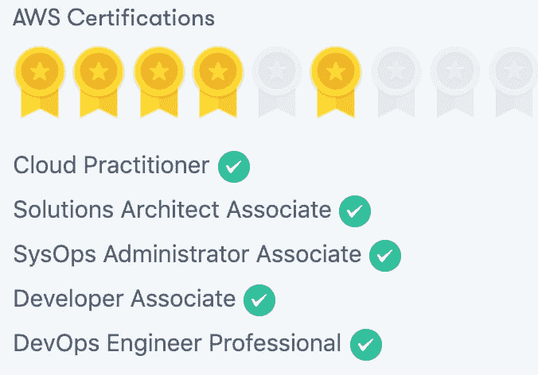

# AWS 认证资源建议

> 原文：<https://dev.to/kave/aws-certifications-cheatsheet-13g4>

我刚刚获得了 5 个 AWS 认证，希望分享我使用的资源，以防对他人有所帮助

**云从业者**

*   资源
    *   acloud.guru
*   技巧
    *   我会先学习解决方案架构师助理，然后第二天就淘汰云从业者。80%都是一样的材料。

**助理考试** -架构师、开发人员、系统运营

*   *系统运行管理员*
    *   关注 cloudwatch 和与公共服务相关的指标(dynamodb、ec2、rds 等)
*   资源
    *   acloud.guru
*   技巧
    *   完成所有的云计算专家实验室、测验和考试生成器，直到你的平均分达到 85%以上

**Devops 专业版**

*   资源
    *   acloud.guru
        *   对于这个特定的考试，acloud.guru 很好地总结了考试相关的服务。
    *   whizlabs - AWS DevOps 专业实践测试
        *   20%的考试，我以前在练习中见过试题
*   技巧
    *   对云系、OpsWorks、豆茎了如指掌
    *   以之前的 **sysOp 管理员助理**为例，它有很多与指标相关的主题(cloudwatch ),占考试的 30%

**解决方案架构师专业人员**

*   资源
    *   TBD