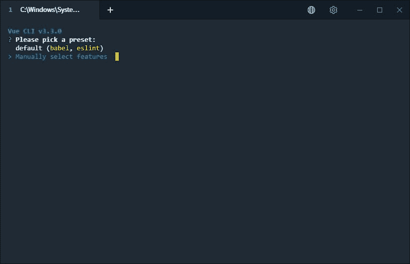
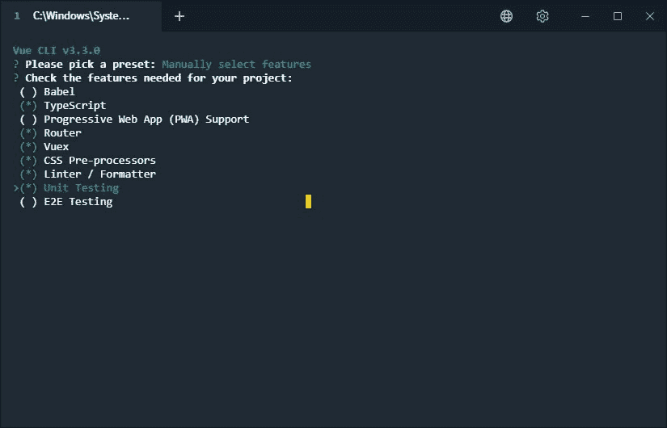
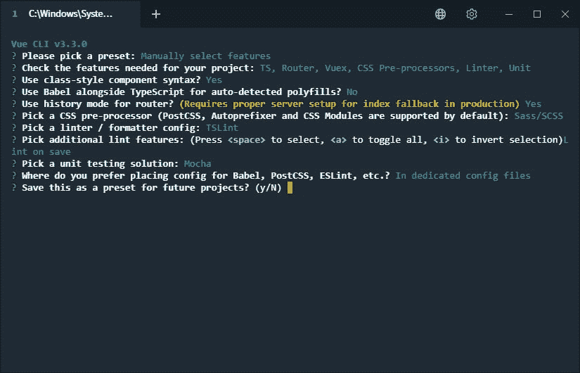

# 第 013 集-用 Vue.js 启动前端-ASP.NET 核心:从 0 到矫枉过正

> 原文：<https://dev.to/joaofbantunes/episode-013---starting-the-frontend-with-vuejs---aspnet-core-from-0-to-overkill-29gc>

在这一集，我们从 Vue.js 开始前端开发。有人可能会说这不是 ASP.NET 核心，但我们确实需要一个前端，单页面应用程序这些天非常流行，所以我们要随大流😛

对于演练，您可以查看下一个视频，但如果您喜欢快速阅读，请跳到书面综合。

[https://www.youtube.com/embed/kFmqBX8OkMc](https://www.youtube.com/embed/kFmqBX8OkMc)

整个系列的播放列表是[这里是](https://www.youtube.com/playlist?list=PLN0oN9Azm_MMAjk3nhRnmHdr1l0160Dhs)。
T3】

## [T1】简介](#intro)

在这篇文章中，我们将开始构建我们的前端，这将是用 vue . js(2 . x 版)开发的单页应用程序。正如我提到的，这不是真正的 ASP.NET 核心，但我们需要一个前端和温泉是“的事情”，所以我想借此机会在 Vue.js 摇摆

### 为什么是 vista . js

我们准备用 Vue.js 主要是因为它好评好，容易接。我想在前端保持简单，展示我们在后端做什么，同时使用最新和最棒的。

我以前没怎么用过 Vue.js，我想学习它，所以这个系列是一个很好的机会。我有一些前端 JS 框架的经验，因为我曾在 Angular 工作过，所以希望这种经验能让我更容易掌握另一个框架。

### 开发工具

为了开发前端，我将使用 [npm](https://www.npmjs.com/) 来管理依赖关系，使用 [Vue CLI](https://cli.vuejs.org/) 来搭建应用程序，使用 [Visual Studio Code](https://code.visualstudio.com/) 作为编辑器，使用方便的 [Vetur](https://vuejs.github.io/vetur/) 扩展来支持 Vue.js。

### 后端为前端

在这篇文章中，我们不会到达那个阶段，但是我们最终将需要与一个 API 通信来获取和更新数据。

最初，我们将只使用我们在过去几集中开发的组管理服务，但最终我们将创建一个特定的后端来处理前端的需求，抽象与组管理服务和我们最终将创建的所有其他服务的通信。

目标是遵循不同的客户端应用程序(web、移动、桌面，...)可能有不同的需求，所以最好有一个后端的入口点，消除一些客户端服务器交互的复杂性。

### 新建 GitHub 资源库

对于我们 PlayBall 应用程序的这个新组件，我在 GitHub 上创建了一个新的存储库，您可以在这里查看。

### 免责声明

在我们开始之前，请记住前端并不是我真正擅长的，我在学习 Vue.js 的同时也在学习，所以请带着额外的批判精神接受我在这里写的任何东西，甚至比我在后端/C#帖子中写的还要多😉。

## 设置项目

为了设置项目，我们将使用可用的[命令行界面](https://cli.vuejs.org/)。要安装它，我们可以运行`npm install -g @vue/cli`(也可以用 Yarn，不过我用的是 npm)。

安装了 CLI 后，我们就可以创建项目了。CLI 提供了一个`create`命令，引导我们完成 Vue.js 项目的可用选项。为了开始这个过程，在新创建的存储库的文件夹中，我们执行`vue create client`(其中“client”是项目的名称，以及为包含它而创建的文件夹)。

一旦项目设置过程开始，我们首先会想到的是我们是想使用默认设置还是手动浏览选项。我选择了后者，因为我想使用 TypeScript(我喜欢我的一些类型，我是一个 C#的家伙，对不对？！😅).

[](https://thepracticaldev.s3.amazonaws.com/i/mw4w0ickupyq4qy8hu92.jpg)

在第一次选择完成手动过程后，我们有更多的选择。

[](https://thepracticaldev.s3.amazonaws.com/i/hzjhq6d1bpoeqga8gzzz.jpg)

上面你可以看到我所做的选择。取消选择 Babel，而是选择 TypeScript。还启用了我期望使用的东西，比如管理应用内部导航的[路由器](https://router.vuejs.org/)、集中应用状态的 [Vuex](https://vuex.vuejs.org/) 、CSS 预处理器(像 SCSS 或更少)、linter/formatter 和单元测试。

我没有选择 PWA 支持，因为我不希望在可预见的将来使用它，如果需要，我们可以在以后添加它。也没有选择端到端测试。

按回车键进入最后一批选项，这些选项考虑了我们之前所做的选择。

[](https://thepracticaldev.s3.amazonaws.com/i/qo00ag84pq4ubsbs3fs8.jpg)

仔细检查我的选择:

*   使用类风格的语法——这里又是 C#家伙！
*   在 TypeScript 旁边使用 Babel 我说不，假设 TypeScript 足够了...希望我以后不会后悔😛
*   使用路由器的历史模式——像我一样选择“是”,散列将不会附加到应用程序 URL，因此我们必须确保配置服务器(当我们到达那里时)以正确地将请求路由到我们的 SPA 的索引。关于这个[的更多信息在这里](https://router.vuejs.org/guide/essentials/history-mode.html)
*   CSS 预处理器——和 SCSS 一起去，没有特别的原因，我不喜欢所有的 CSS
*   棉绒
*   Lint 特性——有两个选项，“保存时 lint”和“提交时 lint 和 fix ”,但只选择了第一个。
*   单元测试解决方案——在没有特殊原因的情况下使用了 Mock + Chai。另一个选择是开玩笑。
*   将特定特性的配置放在哪里——使用专用文件，另一种方法是将所有内容放在`package.json`文件中。

当我们完成设置并按 enter 键后，CLI 开始创建必要的文件并安装所需的依赖项。这需要一点时间，通常当我们从 npm 安装东西的时候😛。

我们总是可以在以后添加我们现在没有选择的东西，这个过程只是使初始设置更简单，从一开始就配置好我们期望使用的东西。

开箱即用的 CLI 生成一个简单的示例应用程序，因此我们可以`cd`进入创建的项目文件夹，执行`npm run serve`，然后前往浏览器，导航到`http://localhost:8080/`，查看应用程序的运行情况。

## 创建第一个视图

让我们从第一个视图开始(至少是我们创建的，有几个已经被 Vue CLI 搭建好了)。我称它为视图，但它只是一个表示页面的组件，但由于 Vue CLI 创建了一个名为`views`的文件夹，我认为我们应该这样称呼它。

在`views`文件夹中，我们创建一个新的`Groups.vue`文件。

`Groups.vue`

```
<template>
  <h1>GROUPS</h1>
</template>

<script lang="ts">
import { Component, Vue } from 'vue-property-decorator';

@Component({})
export default class Groups extends Vue {}
</script>

<style lang="scss" scoped>
</style> 
```

Enter fullscreen mode Exit fullscreen mode

一个`*.vue`文件最多有 3 个部分，`template`用于放置组件的 HTML，`script`用于组件的 JavaScript(或者在这种情况下是 TypeScript)，而`style`用于 CSS(或者我们选择的任何预处理的替代文件)。如果我们希望该部分中的样式只应用于这个组件，我们可以添加`scoped`属性，如上所示。

这份文件可以拆分，把这些部分分开，但我觉得没有必要，所以保留了下来。

我们可以在这个视图/组件中直接实现 MVC 应用程序中的所有组管理逻辑，但是我们可以通过创建更多的组件来处理逻辑的特定部分，从而更好地组织它。

关于组件实现，唯一值得一看的可能是我们在类风格语法中定义组件的方式，因为我在互联网上看到的大多数示例都不使用它。我们定义了一个表示组件的类，它从`Vue`扩展而来，并用装饰器`Component`对其进行标记，稍后我们将向其传递一些额外的信息。

## 路由到视图

要访问新视图，我们必须在路由器中配置它，并添加一个到应用程序的链接，这样我们就可以到达那里。

要配置路由器，我们必须编辑现有的`router.ts`文件。在那里，我们已经可以看到其他现有的视图，并使用它们作为指导来配置我们自己的视图。

`router.ts`

```
import Vue from 'vue';
import Router from 'vue-router';
import Home from './views/Home.vue';

Vue.use(Router);

export default new Router({
  mode: 'history',
  base: process.env.BASE_URL,
  routes: [
    {
      path: '/',
      name: 'home',
      component: Home,
    },
    {
      path: '/about',
      name: 'about',
      // route level code-splitting
      // this generates a separate chunk (about.[hash].js) for this route
      // which is lazy-loaded when the route is visited.
      component: () => import(/* webpackChunkName: "about" */ './views/About.vue'),
    },
  ],
}); 
```

Enter fullscreen mode Exit fullscreen mode

从现有的视图中，我们可以看到我们有几个配置路由器的选项。我们可以直接导入和注册组件，就像对`Home`视图所做的那样。或者，我们可以注册一个函数，该函数只在路由被激活时导入组件，使其延迟加载。

`router.ts`

```
export default new Router({
  mode: 'history',
  base: process.env.BASE_URL,
  routes: [

    // ...

    {
      path: '/groups',
      name: 'groups',
      component: () => import('./views/Groups.vue'),
    },

    // ...
  ],
}); 
```

Enter fullscreen mode Exit fullscreen mode

我选择了延迟加载方法，因为...理由😛该应用程序仍在很大程度上开始作出明智的决定。这可能取决于各种因素，如所有视图都预加载时的初始加载时间、特定视图的预期使用情况等等。

现在我们需要创建一个链接，这样我们就可以看到创建的视图。转到搭建的`App.vue`文件，在模板部分我们有其他视图的链接，我们只需要用`router-link`组件为我们的添加一个。

`App.vue`

```
<template>
  <div id="app">
    <div id="nav">
      <router-link to="/">Home</router-link> |
      <router-link to="/groups">Groups</router-link> |
      <router-link to="/about">About</router-link>
    </div>
    <router-view/>
  </div>
</template>

<!-- ... --> 
```

Enter fullscreen mode Exit fullscreen mode

现在，如果我们转到浏览器，我们在主页顶部有一个链接，可以导航到我们仍然非常简单的组视图。

## 创建和使用组件

现在让我们通过创建一些组件来处理我们的需求，让视图做一些有用的事情。

我们将采用智能和非智能组件方法(或容器和表示组件)，其中一些组件具有使事物协同工作的逻辑，与应用程序的其他部分(服务、商店、...)而其他人只关心表示，处理作为输入传递给他们的数据，通过发送给其父对象的事件对其进行更改。这种方法的更好的解释可以在[这里](https://medium.com/@dan_abramov/smart-and-dumb-components-7ca2f9a7c7d0)找到。

### 分组组件

我们将创建三个组件:一个用于查看和编辑组信息，一个用于创建新组，另一个用于列出现有组。因此，我们将在名为`groups`的`components`文件夹中创建一个新文件夹，将这些组的特性组件分组(可能是双关语😇).

在新的`groups`文件夹中，我们还创建了另一个名为`models`的文件夹，用来保存我们在这些组件中需要的数据模型。虽然 JS 通常不需要这样做，但是当我们使用 TypeScript 时，我们希望我们传递的所有东西都有一个表示它们的类型。

**注意:**我对文件夹结构还是不完全满意，如果你有什么好的想法可以改进，请告诉我。

### 群组视图模型

如前所述，我们需要将组件使用的数据表示添加到`models`文件夹中。现在，我们只需要一个，小组的代表。

根据 MVC 应用程序中的内容，我们创建了一个用于组件的`GroupViewModel`。

`group-view-model.ts`

```
export interface GroupViewModel {
    id: number;
    name: string;
    rowVersion: string;
} 
```

Enter fullscreen mode Exit fullscreen mode

请注意，我使用的是接口，而不是类。TypeScript 中的接口并不完全像 C#中的那样工作，因此值得快速浏览一下。

我们主要只是想强制在组件中传递的数据遵循特定的约定，就像在中一样，具有我们需要的属性。接口很好地服务于这个目的，因为我们不需要一个实现它的类，并且可以利用 [duck typing](https://en.wikipedia.org/wiki/Duck_typing) 来创建对象。

假设我们有一个函数`sampleFunc`，它将`GroupViewModel`作为参数。要调用它，我们可以如下:

```
sampleFunc({id: 1, name: 'Sample Group', rowVersion: '1234'}); 
```

Enter fullscreen mode Exit fullscreen mode

这很好，因为对象“实现”了接口。这就是我们对模型的所有要求，只要让它们具有我们期望的格式就行了。

顺便提一下，记住接口在运行时并不存在，它们的存在只是为了帮助编译器发现类型错误。另一方面，类存在于运行时。因此，接口最终有助于在编译时捕捉编码错误，同时不会膨胀(可能是不必要的)最终的 JavaScript 输出。

### GroupDetail 组件

组件将负责显示一个组的信息并编辑它。让我们从组件的脚本部分开始。

`GroupDetail.vue`

```
<template>
  <!-- ... -->
</template>

<script lang="ts">
import { Component, Vue, Prop } from 'vue-property-decorator';
import { GroupViewModel } from './models';

@Component({})
export default class GroupDetail extends Vue {
  @Prop() private group!: GroupViewModel;
  private isInEditMode: boolean = false;
  private editableGroup: GroupViewModel | null = null;

  private edit(): void {
    this.isInEditMode = true;
    this.editableGroup = { ...this.group };
  }
  private save(): void {
      this.$emit('update', this.editableGroup);
      this.discard();
  }

  private discard(): void {
    this.isInEditMode = false;
    this.editableGroup = null;
  }
  private remove(): void {
      this.$emit('remove', this.editableGroup!.id);
  }

}
</script> 
```

Enter fullscreen mode Exit fullscreen mode

类声明与我们在`Groups`组件中看到的非常相似，但是当我们开始查看声明的属性时，我们看到了第一个新东西，在`group`属性中的`Prop`注释。这意味着`group`属性是一个输入，将由组件的父组件传入。其他属性是“普通”属性，有助于组件的内部工作。

在属性之后，我们得到方法。这些都将在模板中被调用，以引起组件状态的变化，并将这些变化通知父组件。

虽然`edit`和`discard`只影响组件的内部状态，改变它的用户界面(正如我们将在模板中看到的)，`save`和`remove`发出事件，这样监听的父节点可以对它们进行操作。`save`将更改后的组发送给父组，因此它可以(最终)在 web API 中更新，而`remove`发出一个事件，要求删除该组。

现在我们来看看模板。

`GroupDetail.vue`

```
<template>
  <span v-if="isInEditMode">
    <input v-model="editableGroup.name" placeholder="Enter a name for the group">
    <button v-on:click="save()">Save</button>
    <button v-on:click="discard()">Discard</button>
    <button v-on:click="remove()">Remove</button>
  </span>
  <span v-else>
    {{ group.name }}
    <button v-on:click="edit()">Edit</button>
  </span>
</template>

<script lang="ts">
// ...
</script> 
```

Enter fullscreen mode Exit fullscreen mode

我们使用在组件类中声明的`isInEditMode`属性，使用`v-if`和`v-else`指令分别以编辑或只读模式呈现组件。

在编辑模式下，我们有一个输入，使用`v-model`指令将值绑定到`editableGroup.name`属性，这提供了双向绑定，从属性中存在的值开始，当我们更改输入时更新属性。

在输入之后，我们有一些按钮来作用于已更改的数据，因此我们可以保存或放弃更改，以及选择完全删除组。我们已经在脚本部分看到了这些方法的实现，在模板中，通过使用`v-on`指令将事件处理程序附加到特定事件，在本例中为`click`，这些方法被绑定到按钮。

最后，看看模板的只读模式部分，这里没有太多内容。组名与进入编辑模式的按钮一起显示，使用我们已经看到的相同的`v-on:click`指令。

### 创建组组件

`CreateGroup`与`GroupDetail`组件有很多共同之处，通过使用几乎相同的逻辑，甚至更简单一点。

`CreateGroup.vue`

```
<template>
  <span v-if="creating">
    <input v-model="group.name" placeholder="Enter a name for the group">
    <button v-on:click="save()">Save</button>
    <button v-on:click="discard()">Discard</button>
  </span>
  <button v-else v-on:click="create()">Create new group</button>
</template>

<script lang="ts">
import { Component, Vue, Prop } from 'vue-property-decorator';
import { GroupViewModel } from './models';

@Component({})
export default class CreateGroup extends Vue {
  private group: GroupViewModel | null = null;
  private creating: boolean = false;

  private create(): void {
    this.group = { id: 0, name: '', rowVersion: '' };
    this.creating = true;
  }
  private save(): void {
    this.$emit('add', this.group);
    this.discard();
  }

  private discard(): void {
    this.creating = false;
    this.group = null;
  }
}
</script> 
```

Enter fullscreen mode Exit fullscreen mode

我们又有两种模式，一种简单地显示一个带有文本“创建新组”的按钮，当点击进入另一种模式时，我们可以输入信息来创建新组。

就模板而言，我们没有使用任何新东西。脚本也是如此，只是我们有一个不同的事件，在这个例子中是为了通知父类，我们想用提供的数据创建一个新组。

### GroupList 组件

`GroupList`组件仍然是一个哑组件，负责显示使用`GroupDetail`组件的组列表，以及使用`CreateGroup`组件创建新组的选项。它将注册其子组件发出的事件，并将它们转发给其父组件。

让我们看一下代码，从脚本开始。

`GroupList.vue`

```
<template>
  <!-- ... -->
</template>
<script lang="ts">
import { Component, Vue, Prop } from 'vue-property-decorator';
import GroupDetail from './GroupDetail.vue';
import CreateGroup from './CreateGroup.vue';
import { GroupViewModel } from '@/components/groups/models';

@Component({
  components: {
    GroupDetail,
    CreateGroup
  }
})
export default class GroupList extends Vue {
  @Prop() private groups!: GroupViewModel[];

  private onUpdate(group: GroupViewModel): void {
    this.$emit('update', group);
  }

  private onRemove(groupId: number): void {
    this.$emit('remove', groupId);
  }

  private onAdd(group: GroupViewModel): void {
    this.$emit('add', group);
  }
}
</script> 
```

Enter fullscreen mode Exit fullscreen mode

首先，也是唯一的，我们在这里可以看到的新东西是，我们导入我们想要使用的组件，并在`Component`注释中传递它们，因此它们可以在模板中使用。

组件类的其余部分基本相同:一个由组件的父组件传递的输入属性`groups`,以及一些事件处理程序方法，这些方法将向子组件注册，以便将事件转发给`GroupList`父组件进行操作。

现在是模板。

`GroupList.vue`

```
<template>
  <ul>
    <li v-for="group in groups" v-bind:key="group.id">
      <GroupDetail v-bind:group="group" v-on:update="onUpdate" v-on:remove="onRemove"/>
    </li>
    <li><CreateGroup v-on:add="onAdd"/></li>
  </ul>
</template>
<script lang="ts">
// ...
</script> 
```

Enter fullscreen mode Exit fullscreen mode

模板真的很小，但我们确实有一些新的东西要看。首先，我们使用`v-for`指令(和`v-bind:key`一起使用，用于使 Vue 更容易跟踪列表元素，更多信息请参见为什么[在这里](https://vuejs.org/v2/guide/list.html#key)为我们拥有的每个组添加一个新的`GroupDetail`组件。

我们通过使用带有属性名的`v-bind`指令来绑定`GroupDetail` `group`输入。

最后，我们使用`v-on`和事件的名称，以与单击按钮相同的方式注册组件事件。我们对`GroupDetail`和`CreateGroup`组件都这样做。

### 把一切联系在一起

作为这篇文章的总结，我们回到`Groups`视图并使用创建的组件。现在，我们只是将数据保存在内存中。

`Groups.vue`

```
<template>
  <GroupList v-bind:groups="groups" v-on:update="onUpdate" v-on:remove="onRemove" v-on:add="onAdd" />
</template>
<script lang="ts">
import { Component, Vue } from 'vue-property-decorator';
import GroupList from '@/components/groups/GroupList.vue';
import { GroupViewModel } from '@/components/groups/models';

@Component({
  components: {
    GroupList
  }
})
export default class Groups extends Vue {
  private currentId: number = 0;
  private groups: GroupViewModel[] = [
    { id: ++this.currentId, name: 'Sample Group', rowVersion: 'aaa' },
    { id: ++this.currentId, name: 'Another Sample Group', rowVersion: 'bbb' }
  ];

  private onUpdate(group: GroupViewModel): void {
    const index = this.groups.findIndex(g => g.id === group.id);
    this.groups = [...this.groups.slice(0, index), group, ...this.groups.slice(index + 1, this.groups.length)];
  }

  private onRemove(groupId: number): void {
    this.groups = this.groups.filter(g => g.id !== groupId);
  }

  private onAdd(group: GroupViewModel): void {
    group.id = ++this.currentId;
    this.groups = [...this.groups, group];
  }
}
</script> 
```

Enter fullscreen mode Exit fullscreen mode

再说一遍，没有我们没见过的。视图组件导入在模板中使用的`GroupList`组件，注册它的事件。因为我们在内存中有数据，在这种情况下是组件实例的属性，所以在事件中注册的方法作用于这些属性。有一些初始数据，这样我们一打开页面就能看到一些东西。

现在回到浏览器，我们可以看到所有组件一起工作。由于数据保存在组件的实例中，如果我们导航到另一个页面，我们会丢失任何更改，但我们会在下一篇文章中处理这个问题。

## 其他

有了 Vue.js 应用程序的第一次工作，我们就可以结束这篇文章了。在接下来的文章中，我们将开始使用 Vuex 来集中应用程序的状态，然后将其连接到我们开发的 web API。

帖子中的链接:

*   [npm](https://www.npmjs.com/)
*   vista . js
*   vista CLI
*   [检视路由器](https://router.vuejs.org/)
*   [Vuex](https://vuex.vuejs.org/)
*   [Visual Studio 代码](https://code.visualstudio.com/)
*   [Vetur](https://vuejs.github.io/vetur/)
*   [鸭子打字](https://en.wikipedia.org/wiki/Duck_typing)

这个帖子的源码是[这里](https://github.com/AspNetCoreFromZeroToOverkill/WebFrontend/tree/episode013)。

如果你有任何问题或意见，请告诉我。分享也感激不尽！

谢谢你的来访，cyaz！