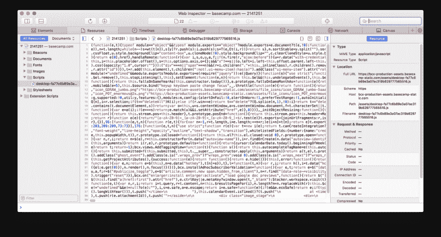

# 为什么大家都在争 CSS/UX 和 JS

> 原文：<https://dev.to/ulitroyo/why-everyone-is-fighting-about-cssux-and-js-4cpp>

*TL；大卫:没有。说这些没有捷径，但是你继续战斗的原因之一是因为你误解了战斗是关于什么的。看那该死的文章。请和谢谢你。*

我讨厌介绍。我们开始吧，我会告诉你相关的情况。

## 巨大的鸿沟

克里斯·科伊尔的文章[“巨大的鸿沟”](https://css-tricks.com/the-great-divide/)打破了前端开发社区，在 Twitter 和其他地方引起了不小的争议和戏剧性。如果你没有读过这篇文章(你应该读一读)，它围绕着主要使用 JavaScript 相关技术来完成工作的前端开发人员和前端开发人员之间的明显分歧，对于前端开发人员来说，JavaScript 只是他们用来完成更多以 UX 为中心的工作的许多技术中的一种。每个人似乎都忽略了一点，那就是这不是一个关于前端世界应该如何工作的规定性观点，而是一个描述性观点，来自克里斯和他的好友戴夫·鲁伯特在他们的播客[商店脱口秀](https://shoptalkshow.com/) (dot com)上进行的真实生活采访。

换句话说，分裂是真实的。克里斯和戴夫只是把它用语言表达出来。

Chris 在“The Great Divide”中总结道，这种焦点上的裂痕正在发生，因为前端领域已经基本上脱离了旧的环境，在旧的环境中，前端开发仅仅由样式化的服务器呈现的组件组成。他指出，许多前端开发人员使用 JavaScript 的方式更接近于通常的 MVC 风格的后端编程，而其他人则专注于使用一套更全面的工具，主要是 CSS，以使前端体验更好，更容易访问，因此，如果我们要有助于描述前端开发人员受雇做的工作，我们应该区分 JS 工程师和 UX 工程师。

## 阶级斗争

不过，讨论很快就转移到了 JS 工程师(我已经接受了 Chris 提出的术语)是否比 UX 工程师做更多的工作，以及 UX 工程师是否应该和 JS 工程师获得同样的报酬。

我应该指出:如果你已经看到了网上的讨论，而我提出的大纲与你对事件的描述不一致，那没关系。网络是一个很大的地方，你和我完全有可能见证了同一个硬币的两面。我试图将我所看到的*与我正在构建的这个故事联系起来；我希望你没问题。*

无论如何，对于业内的任何人来说都不奇怪，我们有一个重复出现的主题，即对他人技术的嘲笑和普遍蔑视，这种态度被开发者 Aurynn Shaw 精辟地称为[“蔑视文化】](https://blog.aurynn.com/2015/12/16-contempt-culture)。在这种情况下，我们开始看到这种蔑视针对 UX 工程师...我敢肯定，读到这里的许多人现在会想“你是指设计师，对吗？设计怎么也是工程？”

因为事情是这样的:即使没有冒犯的意思，很多人也不认为 UX 工程师是个东西，或者他们充其量只是被美化的网页设计师。我在围绕那些主要从事以设计为中心的工作的人的工作会谈的讨论中观察到了同样的态度。我不会以这种或那种方式唠叨你这是否正确；我只是指出这是人们持有的一种态度。

我同样要指出的是，参与这种蔑视文化的人通常并不意味着他们的轻蔑是有害的(当然需要引用，但这是我的文章)。当人们认为 Ruby 慢时，当他们认为 JavaScript 天就写好”时，当他们认为 Java 是一种过时的技术时，当他们认为 Elixir 是一种玩具语言时，当他们认为 PHP 是 PHP 时，当他们认为 web 开发“不是真正的编程”时，当他们认为 UX 的工程师“不是工程师”时，他们不一定是在试图成为一个混蛋。有时候，这种傲慢只是基于消极偏见的观察而得出的粗糙观点。

然而，没有多少人热衷于为这种行为辩护，因为对于专门研究被鄙视的技术的人来说，这些观点通常构成了直接攻击。你可以在这一点上打上一个巨大的星号，但基本上:事实证明，当一个人觉得其他人在支付账单的事情上拉屎时，这个人可能会(正确或可以理解，你的选择)变得有所防备。这正是我们在推特上看到的。

Jen Simmons (W3C 工作组，Mozilla，Layout Land)将对 UX 工程师的敌意描述为“阶级斗争”，并针对 JS 工程师的特定倾向发布了一些精选的辛辣推文:

> Jen Simmons@ Jen Simmons开始感觉 HTML-CSS-JS vs JS-JS-JS 的战争是阶级战争。如果你的项目有数百万的预算，“当然”你应该使用一个复杂的构建过程和一个处理一切的 JavaScript 框架(根据相信这一点的人的说法)。压力…2019 年 1 月 27 日下午 19:48291910

> Jen Simmons@ Jen Simmons重新架构 web 本身以符合这些理念的压力，并抛弃原有的设计原则(HTML 作为基础，超级健壮，可与*所有*设备一起工作；CSS 在此之上进行样式化，带有层叠；JS 为奖金 fancy)是激烈的。感觉像是阶级战争。2019 年 1 月 27 日下午 19:4878358

> 詹西蒙斯@詹西蒙斯富人 vs 穷人。
> 
> 海量球队 vs 其他所有人。
> 
> 建立一个适用于所有人的网站，还是一个只适用于那些拥有昂贵新设备且没有残疾的人的网站。
> 
> 构建一个有利于大公司、排斥弱势声音和想法的网络。2019 年 1 月 27 日下午 19:4866382

> 詹西蒙斯@詹西蒙斯这确实感觉像是一场战争。一场关于网络未来的战争。当我读到“标准团体不关心 web 开发者”时，我看到有人在这场战争中挥舞着武器——推动抛弃为每个人制作 web 的设计原则。给强者更多的权力。2019 年 1 月 27 日下午 19:4859340

我并不是在帮你(或不帮你)的忙，包括任何随后投向 Jen 方向的狗屎推文:这是网络——发挥你的想象力。然而，从更明智的角度来看，这场争论变得更加微妙。丹·阿布拉莫夫写道:

> 丹阿布拉莫夫@丹 _ 阿布拉莫夫真正的阶级战争:阶级 vs class name21:06PM-27 Jan 20191471245

> 丹·阿布拉莫夫@丹 _ 阿布拉莫夫(尽管这条推文很幽默，但我想提一下，我对 JS 开发人员并不总是对他们的解决方案投入足够的关注和表现表示同情。这是一个教育和文化问题，需要我们社区来解决。)21:08PM-27 Jan 20195102

> 丹·阿布拉莫夫@丹 _ 阿布拉莫夫((在社区之间筑墙并将其称为战争而不是交叉极化和相互学习只会让事情变得更糟))21:09PM-27 Jan 20197

很明显我把丹放在 JS 工程师营了，因为，你知道，反应。还有一些人不完全认同我们的新前端设计。例如，[凯尔·辛普森](https://www.amazon.com/You-Dont-Know-Js-Book/dp/B01AY9P0P6)(你不知道 JS，Frontend Masters)写道:

> getify@ getify“巨大的前端鸿沟”是存在的，但不是因为人们选择了哪些技能或职位描述中列出了什么。2019 年 1 月 22 日上午 00:5674248

> getify@ getify它的存在是因为我们把技术看得比人更重要的方式意味着很多(最？)会对自己的选择/道路产生优越感，看不起其他的“下等人”。2019 年 1 月 22 日上午 00:565112

> getify@ getify根本问题是缺乏同理心。这是加深矛盾的原因。那些以设计为主的观点的人通常对那些以开发为主的观点缺乏同情心。反之亦然至少是常见的。2019 年 1 月 22 日上午 00:5613101

然而，在其他观点中，你可以看到人们开始厌倦持续不断的负面情绪。Das 苏尔马(谷歌，HTTP203)如此总结(我真的希望我能说“苏尔马推测”，但这是错误的措辞):

> @ dass urma*叹*好:
> 
> 前端 dev:硬。
> 后端开发:硬。
> 语言设计:辛苦。
> 写文档:辛苦。
> HTML/CSS:硬。
> UI 设计:硬。
> 沟通:难。
> 领导人物:辛苦。
> 管理:辛苦。
> 
> 都是辛苦。每一个都是无尽的兔子洞。这不是一场比赛。2019 年 1 月 21 日下午 18:23444814775

## 基本为 HTML

然而，当苏尔马发表这一声明时，我们已经失去了所有共同讨论的表象。这不再是前端开发如何发展的问题，而是 CSS 和 HTML 作为技术是否困难的问题，这是为了保护那些工作可能不会在编程方面有进一步发展的人(尽管在我的例子中，显然没有忽视 UX 工程所需的大量教育和经验)。

这就是为什么 [DHH](https://m.signalvnoise.com/author/dhh/) ，他的 JavaScript 框架[刺激](https://stimulusjs.org/)(事实上，他在 [Rails](https://rubyonrails.org/) 上的全部工作)都是基于这样一种观点，即网络正变得不必要的复杂，我们最好专注于尽可能简单地开发应用程序，这给了我们他毫不奇怪的直接观点，即[为网络设计应该意味着制作 HTML 和 CSS](https://m.signalvnoise.com/designing-for-the-web-ought-to-mean-making-html-and-css/) 。以下是他关于这个话题的推文:

> @ dhh远远地看着这场关于前端开发者的争论，真是引人入胜，因为感觉像是在异国他乡。在 Basecamp，设计师自己做 HTML 和 CSS。大多数人也可以用 JS + Rails 模仿事物。程序员做最后的 JavaScript/Ruby。🤷css-tricks.com/the-great-divi…00:37am-24 Jan 2019103612

我承认，我认为在 DHH 说这话的时候，讨论似乎有点过火了(虽然是以捍卫 UX 工程师的名义，所以我没有指责任何人)....我的意思是，网络技术的全部意义难道不在于可访问性吗？我们不应该为 HTML 和 CSS 既简单又强大而自豪吗？

## 等等，我们刚才在说什么？

在这一点上，气氛似乎发生了变化:一个次要的论点开始出现...我认为这是所有事情变得非常复杂的地方，也是人们很难弄清楚 UX 和 JS 之间到底发生了什么的地方。因为当一方在争论 UX 是不是和 JS 一样酷的时候，另一个更有趣的话题开始出现了...

从我个人的角度来看，这是从 DHH 开始的，他继续在这个故事中第二次出现，对网络技术的状态进行了观察，这一次是在一篇关于 [View Source 如何在衰落以及我们如何不应该让它消亡](https://m.signalvnoise.com/paying-tribute-to-the-web-with-view-source/)的帖子中。这是他关于这个话题的推文:

> @ dhh像编译器一样吐了你的浏览器一地。多么可悲的对网络的漠视。[twitter.com/sindresorhus/s…](https://t.co/OlSZDLdnMc)2019 年 1 月 15:13PM-26辛德雷·索胡斯@辛德雷·索胡斯我在早期(远在 GitHub 之前)用“查看源代码”按钮学习 web 开发，生成类名的趋势让我很难过...141743

(此处[汤姆·戴尔](https://tomdale.net/)向 DHH 扔了一个辣的；我把这些包括进来只是因为它很有趣:)

> 汤姆戴尔@汤姆戴尔只是把那个编译器产生的糊糊比作 Basecamp 的手工制作的 JavaScript。令人惊奇的是坐下来欣赏原始的技术和工艺，制作出如此清晰的艺术品。这是我们必须回归的网络。2019 年 1 月 26 日下午 18:3646473

> @ dhh公平点来自汤姆。丑陋的 JavaScript 也是对网络之美的侵犯。让人们能够阅读你的 HTML、CSS 和 JavaScript 是给任何想要学习的人的礼物。我们将加倍努力，在所有产品中实现这一目标🙏❤️[twitter.com/tomdale/status…](https://t.co/ENLFpPg0fH)22:11pm-26 Jan 2019汤姆·戴尔@汤姆·戴尔只要把那个编译器产生的黏糊糊的东西比作 Basecamp 手工制作的 JavaScript 就行了。令人惊奇的是坐下来欣赏原始的技术和工艺，制作出如此清晰的艺术品。这是我们必须回归的网络。58387

无论如何，视图源代码值得保存的想法非常有趣，因为我知道我不是唯一一个认为最初的讨论正在合并成第二个更微妙的对话的人，即:[语义 web 到底是怎么回事？](https://twobithistory.org/2018/05/27/semantic-web.html)

## 等等，什么？到底是谁提出了语义网？

好吧，听着，让我来个简短的跳跃。如果你不熟悉，也不想看我刚才链接的那篇文章，语义网是蒂姆·伯纳斯·李爵士对网络未来的构想，在这个构想中，网页对人和计算机来说都是可理解的。然而，实事求是地说，语义网最终只不过是一堆[模式标签](https://schema.org/)，我们应该把它们扔进 HTML，让谷歌更容易地完成他们的工作，但是尽管对此冷嘲热讽很有趣，但我们不要忘记语义网概念存在的真正原因:一个分散化网络的梦想，在那里每个人都拥有自己的数据，[信息孤岛不再是一件事](https://www.theguardian.com/technology/2010/nov/22/tim-berners-lee-facebook)。然而，更相关的是，语义网表明，自从网络出现以来，就有了这样一种想法，即**网络应该是可访问和开放的**。

同意或不同意——这不是重点。我只是声称*这个*是 JS 与 UX 第二轮斗争的核心:JS 是否正在变得臃肿，使网络无法访问和开放。

正如你可能知道的，这个*也是*在蔑视文化领域运行，因为它暗示了前端 Javascript 技术对网络是有害的。虽然我认为这种争论比 UX 工程师是否不如 JS 工程师酷或其他什么更有智力价值，但正如你可能推断的那样，事情再次变得相当激烈。为了简洁起见，这里粗略地列出了争论的类型:

*   一些人认为，在前端使用这么多 JS 正在创造一个场景，在这个场景中，原本应该将我们联系在一起的网络结构不再是人类可以访问的(这意味着这是一个问题)。
*   有些人认为这无关紧要，因为网络只是数字产品的一种交付方式。
*   有些人认为 JS 框架使得 web 对于有可访问性需求的人来说不切实际或者不可访问。
*   有些人认为，虽然对可访问性的关注是一种合理的批评，但这并不意味着框架和最佳实践不再发展，这是一个可以解决的问题。
*   一些人认为，框架让人们过度依赖非 web 固有的技术，新开发人员正在失去对原始技术可能性的理解。
*   一些人认为框架有助于驯服网络的复杂性，让人们更快地变得有生产力。
*   有些人认为框架体积庞大，没有必要，而且会让使用垃圾互联网的人的网络体验变得更糟。
*   一些人认为这也是一个可以解决的问题....

我想用单独的推特来具体表达这些观点，但这需要做大量的工作，所以我使用了我的编辑自由裁量权，没有做任何事情。然而，你可以在 Twitter 或 Dev.to 或 Medium 上做你自己的研究——人们*正在*表达这些观点。

## 这些都不是新的

这场关于网络现状和未来的斗争长期以来一直是这股力量中一股即将爆发的骚动，通常被开发者们认为只不过是一种沉闷的背景悸动，但每隔一段时间就会卷土重来。这显然是一个这样的时间。作为开发人员，我们认为这个反复出现的论点是一个陈旧的主题，已经变形但仍然熟悉，并且只要我们的行业存在就一直存在:**计算机在我们集体人类体验的主题中应该扮演什么角色？**

...是的，好吧——我会缓和一下这种哲学上的幻想。

但是你至少知道我在说什么。这个行业创造了[黑客伦理](https://en.wikipedia.org/wiki/Hacker_ethic)、[自由软件](https://www.gnu.org/philosophy/free-sw.en.html)、[开源](https://opensource.org/osd-annotated)、[知识共享](https://creativecommons.org/about/)、“[信息想要免费](https://medium.com/backchannel/the-definitive-story-of-information-wants-to-be-free-a8d95427641c)”以及前述的[语义网](https://www-sop.inria.fr/acacia/cours/essi2006/Scientific%20American_%20Feature%20Article_%20The%20Semantic%20Web_%20May%202001.pdf)，靠，我们甚至可以追溯到道格·恩格尔巴特关于[用计算机增强人类智能的概念](http://dougengelbart.org/content/view/138/000/)。我想说的是，众所周知，开发人员会思考人类和计算机之间关系的本质。

因此，这场斗争中出现的一件好事是从网络的角度重新审视这个话题:我们想从中得到什么？我们希望网络是什么样子的？什么是值得保留的，什么是可以牺牲的？我们希望看到哪些新功能？带来这一切的是谁的角色？各种信仰的前端工程师将扮演什么角色？

事实上，我在推特上提到的一些人对网络的未来有一些非常敏锐的观察。例如，在 Kyle Simpson 关于 JavaScript 的未来的精彩演讲中，他谈到了我们是否应该让 JavaScript 成为一个纯粹的编译目标([27:50](https://youtu.be/lDLQA6lQSFg?t=1670)的相关位):

[https://www.youtube.com/embed/lDLQA6lQSFg](https://www.youtube.com/embed/lDLQA6lQSFg)

在她关于现代 CSS 的一个很棒的视频中，Jen Simmons 建议停止使用 Bootstrap 之类的框架，开始使用原始 CSS 及其所有令人敬畏的功能([8:29](https://youtu.be/0Gr1XSyxZy0?t=509)的相关内容):

[https://www.youtube.com/embed/0Gr1XSyxZy0](https://www.youtube.com/embed/0Gr1XSyxZy0)

观看另一个精彩的演讲也无妨，这个演讲是关于为什么语义网像最初设想的那样失败了，以及我们可以做些什么(大约在 1:09:24 时抛出的[摘要幻灯片)。](https://youtu.be/oKiXpO2rbJM?t=4164)

[https://www.youtube.com/embed/oKiXpO2rbJM](https://www.youtube.com/embed/oKiXpO2rbJM)

但也许我跑题了....

## 言归正传，作者盖伊

好的。我的观点是，我们中有很多人(哎呀，我想我是在选择立场)认为网络应该是一个包含电池的、每个人都可以访问的平台，我们应该努力保持它的开放性和语义性。我们中的一些人(包括我)甚至接受了蒂姆·伯纳斯·李爵士的观点，认为网络应该完全去中心化，成为[坚定的诡计多端的海龟，一直到](https://solid.inrupt.com/docs/expressing-ld-with-turtle)或其他什么地方。在这个新变形的讨论中，让我们称这个极端的**面为**。

还有一些人认为，如果 web 只是一个编译目标，这并不重要:web 只有在人们将它用于真正的商业目的时才重要，如果是这样，那么我们唯一关心的应该是为我们的产品用户提供良好的体验，这种将 web 视为我们可以牵手和查看可读源代码的地方的嬉皮士观念是该死的。我们姑且称这个极端为**侧 B** 。

毫无疑问，大多数人的观点会落在这个统一体的某个地方，而不是在两个极端。总之，尽管:

1.  Chris Coiyer 的“大鸿沟”是对前端开发状态的描述，而不是说明。

2.  关于 UX 工程师是否应该获得与 JS 工程师一样的薪酬的讨论，陷入了对 UX 工程师到底在做什么的误解，以及这个称谓是否只是“设计师”的一个花哨的新名字，在这种情况下，这个词似乎承载着大量错位的厌恶。我会远离这件事。

3.  明智的开发人员之间的对话更多地集中在我们在前端使用如此多的 JS 框架魔法是否可以，这实际上是在发展行业——不像[逐渐升级一个神奇宝贝](https://bulbapedia.bulbagarden.net/wiki/Evolution)，更像[在皮卡丘](https://bulbapedia.bulbagarden.net/wiki/Evolutionary_stone)上强制进行雷石引发的转型。我认为这两种方式都有优点，但每个人都可能从小心不涉足蔑视文化的领域中受益。不是说你需要我来评判你的狗屎，但是你知道，这是我的博客。

4.  同样，不出意外的是，不理智的推特评论者确实会成为大型垃圾压实机的大量素材。

5.  但是去他们的，因为尽管有这些人，关于网络的未来有一个整洁的成人对话，所以让我们，你知道，在那方面开始吧:让我们讨论 JS 框架的角色；让我们讨论一下 Web Assembly 是否真的要取代 JavaScript，以及我们是否希望它取代；让我们来讨论一下[网络上所有伟大的新功能...](https://youtu.be/adgI8-W1VjE)关于我们作为网络居民和开发者的未来，有很多东西值得讨论，我们应该坐下来好好谈谈。

不过，你先来。

* * *