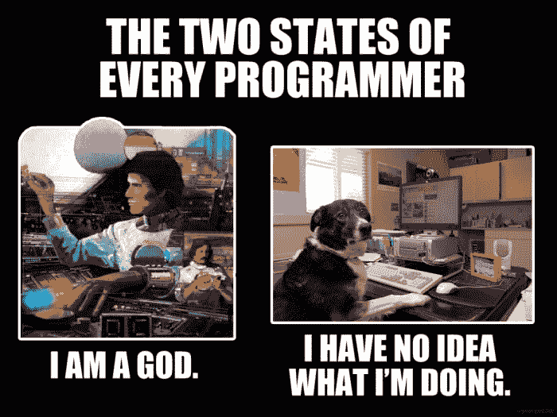

# 为未来的自己编写代码

> 原文：<https://dev.to/sunnysingh/writing-code-for-your-future-self-3da2>

我们都经历过。你写了一段代码，通读了一遍，觉得很完美，因为当时对你来说很有意义。一年后回到同样的代码，它**无法识别**🙈

> 我写的这段代码太完美了！😎
> <cite>—1 年前的你。</cite>

[发这条微博](https://twitter.com/intent/tweet?text=%22This%20code%20I%20wrote%20is%20perfect!%20%F0%9F%98%8E%20%E2%80%94%20You%2C%201%20year%20ago.%22%0A%0Ahttps%3A%2F%2Fsunnysingh.io%2Fblog%2Freadable-code%0A%0Acc%20%40sunnysinghio&related=sunnysinghio)

* * *

> 这是搞什么鬼？😡
> <cite>—你，看着你 1 年前的代码。</cite>

[发这条微博](https://twitter.com/intent/tweet?text=%22WTF%20is%20this%3F%20%F0%9F%98%A1%20%E2%80%94%20You%2C%20looking%20at%20your%20code%20from%201%20year%20ago.%22%0A%0Ahttps%3A%2F%2Fsunnysingh.io%2Fblog%2Freadable-code%0A%0Acc%20%40sunnysinghio&related=sunnysinghio)

问题是你在为当前的自己写代码。相反，你需要为未来的自己而写作。本质上，你只需要问自己这样一个问题:“未来的我能理解这段代码的意图吗？”

这里有一些我多年来编写不可读代码时学到的技巧。

## 不要试图打动自己

我喜欢写聪明的代码。这让我觉得自己很聪明。也就是说，直到一年后我回头看我聪明的代码，并试图弄清楚它在做什么，以及为什么我没有用一种更简单、更标准的方式来做它。

所以，如果你想做一些令人印象深刻的事情，写可读的代码。毕竟，在同一天里，你可能会从感觉自己像个神变成不知道自己在做什么。

[](https://res.cloudinary.com/practicaldev/image/fetch/s--bvhAizHB--/c_limit%2Cf_auto%2Cfl_progressive%2Cq_auto%2Cw_880/https://thepracticaldev.s3.amazonaws.com/i/q3lzdl6v7dvzukjyy8mw.png)

## 使用有意义的名字

我很难想出我的变量、函数、模块等的名字。甚至有这样一句名言:

> 计算机科学只有两个硬东西:缓存失效和事物命名。
> <cite>—菲尔·卡尔顿</cite>

虽然命名是一项需要培养的技能，但我发现大多数人要么想得不够多，要么想得太多。以下是我遵循的一些有用的建议:

*   远离通用名称，如`container`或`data`。
*   对布尔值使用类似于`is`或`has`的前缀(即使在类型化语言中)。
*   对函数使用前缀`get`或`create`来表示动作。
*   使用前缀`min`或`total`获得更多描述性数字。
*   创建类似`users`的数组时，使用适当的复数。
*   避免像`e`这样的单字母变量。用`event`或者`error`就可以了。
*   不要害怕像`getTotalDaysSinceLastLogin`这种有多个单词的长名字。

最重要的是:**尽可能减少潜在的混乱**。

## 分开你的条件

许多应用程序的核心是逻辑，它实际上就是你的`if`语句。这些语句的条件会变得非常复杂。

在这个例子中，*你花了多长时间*理解其中的逻辑？

```
if (users[0] && posts.find(post => post.userId === users[0].id)) {
  showUserPost();
} 
```

Enter fullscreen mode Exit fullscreen mode

时间在这里是一个重要的方面。当然，我可能最终能够弄清楚这个代码片段，但是如果整个代码库都是以这种方式编写的，那么任何未来的维护者(包括你自己)都会绞尽脑汁试图理解它。

您可能急于在这里创建注释，但是让我们通过将条件移到一个有意义的变量来改进代码本身。

```
const isUserPostCreated = users[0] && posts.find(post => post.userId === users[0].id);

if (isUserPostCreated) {
  showUserPost();
} 
```

Enter fullscreen mode Exit fullscreen mode

如果我们增加另一个条件呢？创建另一个变量。

```
const isUserPostCreated = users[0] && posts.find(post => post.userId === users[0].id)
const isReaderLoggedIn = getReaderFromDatabase().isLoggedIn();

if (isUserPostCreated && isReaderLoggedIn) {
  showUserPost();
} 
```

Enter fullscreen mode Exit fullscreen mode

现在，当未来的你看到这段代码时，你将能够大声读出整个语句，并准确理解发生了什么。

## 创建具有单一职责的功能

我犯了创建有数百行代码做多种事情的`init()`函数的错误。这很容易做到，但不幸的是随后会创建不可移动的代码。

一个简单的建议是遵循所谓的**单一责任原则**。这意味着一个功能应该只负责一小部分功能。

让我们举一个验证用户名的例子。

```
function validateUsername(username) {
  // Invalid if username is over 20 characters.
  if (username.length > 20) {
    return false;
  }

  // Invalid if username has non-alphanumeric characters.
  if (/[^a-z0-9]/gi.test(username)) {
    return false;
  }

  // Invalid if user already exists in database.
  if (db.query('SELECT id FROM users WHERE username = ', username)) {
    return false;
  }

  // Otherwise valid!
  return true;
} 
```

Enter fullscreen mode Exit fullscreen mode

在某种意义上，这确实遵循了单一责任原则，因为它只是验证一个用户名。然而，我们在这里运行多个验证，包括查询数据库。我们也不能完全确定它是否有效。

我们能做的是把这个函数分解成其他更小的函数。

```
function validateUsernameLength(username) {
  return username.length <= 20;
}

function validateAlphanumeric(string) {
  return !/[^a-z0-9]/gi.test(string);
}

function checkUsernameExists(username) {
  return db.query('SELECT id FROM users WHERE username = ', username);
}

function validateUsername(username) {
  const isLengthValid = validateUsernameLength(username);
  const isAlphanumeric = validateAlphanumeric(username);
  const isUsernameTaken = checkUsernameExists(username);
  return isLengthValid && isAlphanumeric && !isUsernameTaken;
} 
```

Enter fullscreen mode Exit fullscreen mode

现在这些更小的功能更容易改变、移动和测试。

* * *

## 你的未来你会感谢你的

以及任何可能从事你写的代码的人。

这篇文章与你的经历有关吗？对于可读代码，你还有其他建议吗？我一直在寻求提高自己，所以请随时[发微博给我](https://twitter.com/sunnysinghio)或在下面留言。

> **注**:本文原写于[我的个人博客](https://sunnysingh.io/blog/readable-code)。我在这里为神奇的开发者社区重新发布它。