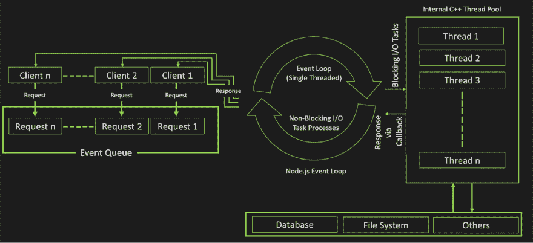
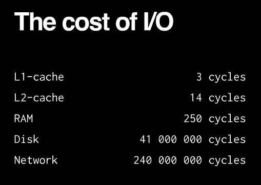
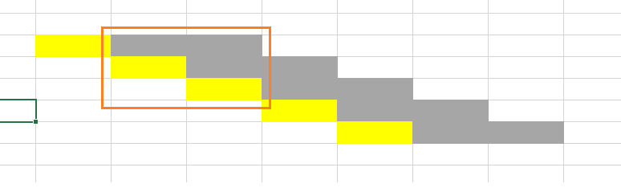
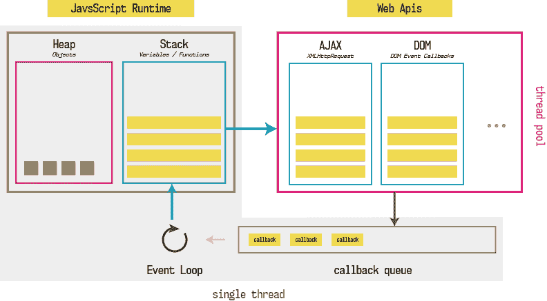

# 建筑在节点内处理同步问题。JS

> 原文::t0【https://dev . to/mnhatt/kin-TRC-x-l-Bt-ng-B- trong-nodejs-nnf】

节点。JS(已经叫做节点)的现象，2009 年出生时，已经用 js[已经回收的]和 js[前端]一个 js[已经变成一种真正的完整的语言]。节点的一个优势是从一开始就注意到同步处理能力，但是节点的这个优点也是基于节点的发展者面临的最大挑战之一。

# 就是因为有一个极为重要的原因所以我们正在用来弄一个电子游戏

任何程序启动时，计算机都执行类似的任务，操作系统将启动该驱动程序从 ram 中启动一个记忆体，运行程序(堆叠)，它将与外部程序互动(从硬盘读取文件，同时按键/键盘接触，等待 web 服务器结果)。..我是说。

上述各个部分将影响瓶颈的性能。如果程式使用万有计算符号颂号，散列函数，。..整体的性能依赖于 cpu，所以称之为 cpu 时，如果您打电话多个 web 服务器或数据库服务器，那将取决于联系速度或响应，因此称之为“防止 be-be-boud-bus”。

通过访问多个服务网站的客户端密码就会产生很多限制。因此，忽略了 JS 解决方案的首要优先权和已经选择的 JS 解决方案是循环活动机制。

同样的故事位于服务器上需要处理多个请求，同时需要使用更多的时间如读取文件或调用数据库。

除了其他语言，这里的解决方案是使用多头绪，多肽，我们可以耗费大量的原帖，生成又复杂的帖帖。节点定位是一种抗逆转录病毒治疗方法来解决这个问题。

总之，回到后端去花费了很多成本，因为有人公司是按节约法来快速解决问题，很少耗费资源。

# 就是因为我们讲了一个差不多 1231 块的电子游戏方式来处理？

循环的解释可能有点复杂，暂时听到循环活动是一个全机器的音乐学校。我们在阅读档案或「布洛克清楚」的路上等待一个协定。

然后在史丹杰的身份协议前找到 200 个数据库。

1.  只要一句话我们就得把 5 * 300 毫克的时间全部抓起来以完成 5 个要求。

2.  或者我们可以使用 5 条帖子来同时处理 5 个请求。每 300 毫秒。

3.  或者是只使用一个流，但是可以跟加州人联系。

    *   在第 300 个 ms，不需要花 200ms，cpu 可以处理下一个需要，然后连续呼叫数据库

*   相对来说，节点处理需要比 1 个流和资源少，而不是多线程来处理。

# 不阻塞事件循环

我们必须保证循环循环常常工作不会受到 FBI 制造的影响。

循环中的事件是什么时候？

现在我们必须回到节点的建筑。一个相当混乱的现象，节点到底是什么？它也不是新语言，也不是在红宝石版的红砖模式，拉丁文的 php 朋友或强盗的版本。一个暂时的答案，是一个平台或者润滑环，从回到回端的 js 代码运行。

它由 V8 个引擎组成，以运行 js 电脑和 libuv 图书馆，解决同步呼叫。这里有多个“节点”或“多线程”捕捉混乱？唯一一条主线是 V8 惹缰皎，它的下面是利比亚紫色流，没有单一线索。

> 除了你的代码，所有的东西都是并行运行的

可以用来参考网路节点使用的方式(例如，这个范例是 1231 使用一个严格的描述)

因此，我们的程序已经执行了 1230 处分布的电子串行程序使用本周末使用最低的 1 个正常电子样本来显示，因为有一个同步呼叫会使用“节点”来处理多段流程(明白)。每个同步呼叫都会被注册一个处理函数，然后称为「后缀」，第一个扣动不会被直接执行，然后在这里将会被推进第七个提示并等待。循环播放的时候，我们的八个主播节目才能被处理。

我们的主播放程序终于破解了，回到我们循环中的控制权。循环活动中，新的第一个扣环选择让它滚动到主要的主题上进行处理并退回主要的主播权。

所以，如果我们要做一个长期计算的工作那我们的循环将会循环播放布拉克。这使得服务器响应节点的能力大大降低。

有一件很重要的事情是因为这里有 12330 个电子游戏描述的一个真实故事

# 多线程

幸运的是，到了“节点 10”节点。5 个试验和 11 个。7 个正式的 multi-dog 机制。

正如我们在上面说的，multi syn 有问题，所以我想它的精神是最少限制的帖子，所以放到网络杂志上，仅仅是为了避免布拉克循环播放。但这是一个新功能，需要时间的功能在实际上是最合理的应用。

# 就为了使用一个差不多 1231 分布的电子游戏来解释一下

同步建筑物协助节点可以使用有限资源来处理需要求伺服器的大量伺服器。循环循环中的一个活动机制，不过这是我们唯一能做到的。

### 就为了使用一个差不多 1231 个电子游戏描述一个供参考量使用的网站

[nodejs–hiểu 异步事件驱动非阻塞 I/O](http://en.sotatek.com/nodejs-hieu-asynchronous-event-drivent-nonblocking-io/)

用来处理我们在一次案件中的一个真实故事