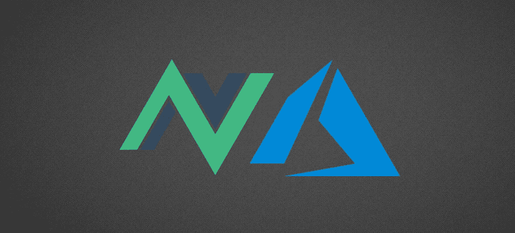
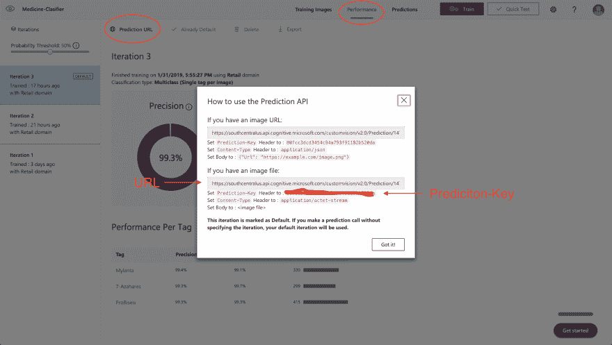
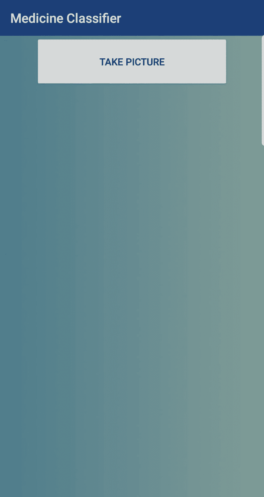
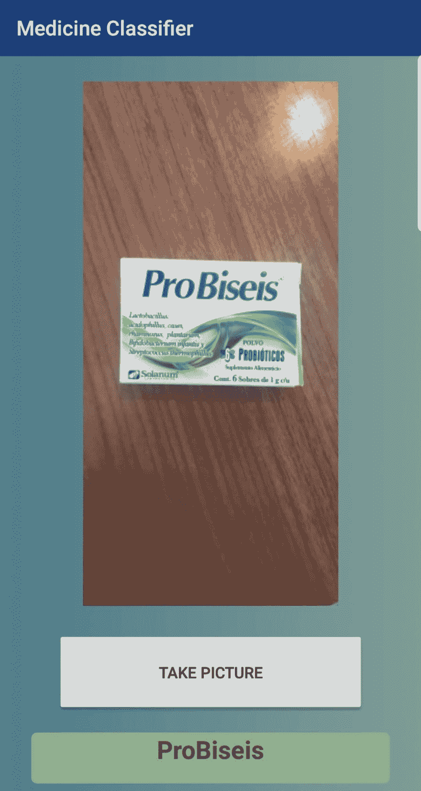
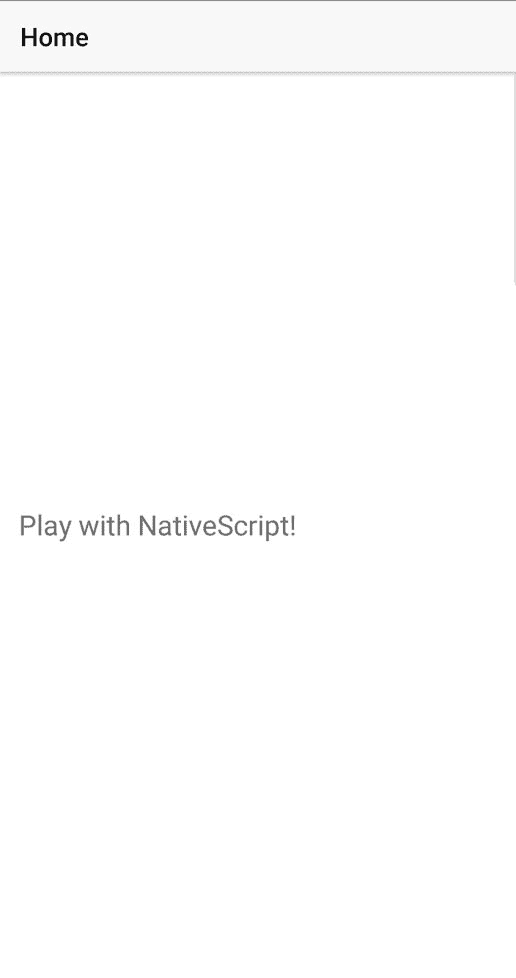
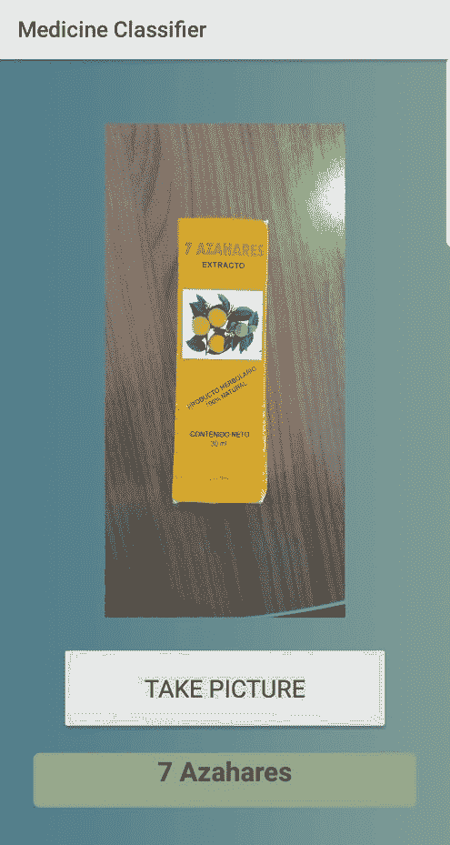

# 使用 NativeScript-Vue 和 Azure 自定义视觉 API 构建图像分类应用程序

> 原文：<https://dev.to/edlgg/build-an-image-classification-app-with-nativescript-vue-and-azure-custom-vision-api-n2c>

[](https://res.cloudinary.com/practicaldev/image/fetch/s--alO-hsda--/c_limit%2Cf_auto%2Cfl_progressive%2Cq_auto%2Cw_880/https://github.com/edlgg/NativeScript-Vue-MedicineClassifier/blob/master/postImages/banner.jpg%3Fraw%3Dtrue)

声明:这是我的第一篇帖子，欢迎在评论中留下任何意见和建议。

先决条件:了解 Vue，知道什么是 API。

[Github 回购一切](https://github.com/edlgg/NativeScript-Vue-MedicineClassifier)

## 简介

我已经和 Vue.js 一起工作了几个月了。自从我听说 NativeScript-Vue 之后，我一直在寻找机会尝试它。本周我得到了这个机会。我最近正在上商务课，在某个时候，我们被问到了商业点子。我团队中的一个女孩说，如果有一个应用程序，让你拍下一些药物的照片，看看它是干什么用的，它的特性和类似的药物，那会很酷。对我来说，这听起来很有趣，因为用 Azure 的自定义 Vision API 进行概念验证很容易。

## 规划

有人告诉我，在选择使用哪种技术之前，我应该考虑我遇到的具体问题。然而，对于这个项目，我知道我想尝试 NativeScript-Vue 和 Azure 的自定义 Vision API，所以做出了决定。

目标:构建一个简单的应用程序，它可以拍摄一种药物的图片，并告诉您这是哪一种药物。

由于这是一个概念验证，基本上是出于好奇在 1 天内完成的，所以它不会非常优雅，只会对 3 种药物起作用(至少对我来说，你可以根据自己的需要训练你的模型)。

## 设计

该应用程序分为两个主要部分:

1.  后端(Azure 的自定义视觉 API)

使用这个 API 是免费的，而且非常简单。最困难的部分是得到你想要分类的事物的图片。我找到了我最终使用的 3 种不同的药物，并对每种药物拍了大约 300 张照片。我上传了它们并训练了模型。我们从 API 中唯一需要的是 URL 和预测键。

[Azure 的自定义视觉 API](https://customvision.ai)

[](https://res.cloudinary.com/practicaldev/image/fetch/s--ytDxcocc--/c_limit%2Cf_auto%2Cfl_progressive%2Cq_auto%2Cw_880/https://github.com/edlgg/NativeScript-Vue-MedicineClassifier/blob/master/postImages/API.jpg%3Fraw%3Dtrue)

1.  前端(NativeScript 检视)

这是应用程序的核心所在。虽然，实际上不会有很多工作。我们基本上需要做 N 件事。

1.  创建基本用户界面
2.  用图片和药品名称建立数据模型
3.  利用照相机
4.  将图片发送到 API 进行分类并显示分类

用户界面将允许你按一个按钮并拍照。之后，它会显示您拍摄的图像和药物的名称。大概是这样的:

[](https://res.cloudinary.com/practicaldev/image/fetch/s--uPdbanYX--/c_limit%2Cf_auto%2Cfl_progressive%2Cq_auto%2Cw_880/https://github.com/edlgg/NativeScript-Vue-MedicineClassifier/blob/master/postImages/1.jpg%3Fraw%3Dtrue)
[T6】](https://res.cloudinary.com/practicaldev/image/fetch/s--JC-fGptW--/c_limit%2Cf_auto%2Cfl_progressive%2Cq_auto%2Cw_880/https://github.com/edlgg/NativeScript-Vue-MedicineClassifier/blob/master/postImages/2.jpg%3Fraw%3Dtrue)

## 代码

为了编写应用程序，我们将使用 NativeScript 的基于 web 的 IDE。你可以在这里或 play.nativescript.org 找到它

开始之前，您需要做以下工作:

1.  创建一个帐户
2.  单击左上方的 new 创建一个新的 Vue 项目
3.  将项目的名称改为您喜欢的名称
4.  去掉不必要的 HTML，CSS 和 JS，直到看起来像这样

HTML
我们去掉了一些我们不打算使用的标签

```
<template>
    <Page class="page">
        <ActionBar title="Home" class="action-bar" />
        <StackLayout class="home-panel">
            <Label textWrap="true" text="Play with NativeScript!" />
        </StackLayout>
    </Page>
</template> 
```

我们离开了同一个地方

```
<script>
export default {
    data () {
        return {
        };
    },
}
</script> 
```

我们去掉了一个类。

```
<style scoped>
.home-panel {
    vertical-align: center;
    font-size: 20;
    margin: 15;
}
</style> 
```

按下顶部的二维码，使用它告诉你下载的应用程序扫描代码，尝试应用程序。应该是这样的。

[](https://res.cloudinary.com/practicaldev/image/fetch/s--K-BceQzB--/c_limit%2Cf_auto%2Cfl_progressive%2Cq_auto%2Cw_880/https://github.com/edlgg/NativeScript-Vue-MedicineClassifier/blob/master/postImages/step1.jpg%3Fraw%3Dtrue)

### 用户界面

首先，我们需要删除我们的标签，并添加图像，按钮和标签，以显示药品的名称。这非常简单，因为 NS 已经预先准备好了所需的元素。你可以在这里看文档[。现在，我们将在元素中使用占位符。另外，我把动作栏的标题改成了相关的。模板现在应该看起来像这样:](https://nativescript-vue.org/en/docs/introduction/) 

```
<template>
    <Page class="page">
        <ActionBar title="Medicine Classifier" class="action-bar" />
        <StackLayout class="home-panel">
            <Image class="mainImage" src="https://github.com/edlgg/NativeScript-Vue-MedicineClassifier/blob/master/postImages/example.jpg?raw=true" />
            <Button class="button" text="Take Picture" height="80" width="300" />
            <Label class="data" text="7 Azahares"
                height="50" width="350" backgroundColor="#8fad88" />
        </StackLayout>
    </Page>
</template> 
```

我们还会添加一些 CSS，这样看起来就不会那么难看了。我不会解释 CSS，因为它超出了这篇文章的范围，但它是非常基本的 CSS。

```
<style lang="scss" scoped>
    .home-panel {
        vertical-align: center;
        font-size: 20;
        margin: 15;
    }

    .page {
        background-image: linear-gradient(to right, #4D7C8A, #7F9C96);
    }

    .actionBar {
        background-color: #1B4079;
        color: #ffffff;
    }

    .mainImage {
        margin: 200px;
        margin-bottom: 25px;
        margin-top: 25px;
        border-radius: 15px;
        padding: 5rem;
        object-fit: contain;
    }

    .button {
        margin-bottom: 50px;
    }

    .data {
        border-radius: 15px;
        font-size: 22;
        font-weight: bold;
        text-align: center;
    }
</style> 
```

结果:

[](https://res.cloudinary.com/practicaldev/image/fetch/s--MkDveg_I--/c_limit%2Cf_auto%2Cfl_progressive%2Cq_auto%2Cw_880/https://github.com/edlgg/NativeScript-Vue-MedicineClassifier/blob/master/postImages/step2.jpg%3Fraw%3Dtrue)

### 数据模型

我们现在需要做的是让静态数据变得动态。为此，我们需要创建将要使用的变量，并将它们绑定到相关的元素。我们基本上只有 2 件事，改变形象和预测的名字。我们还将添加一些 v-if，以便元素只显示是否有设置。确保在 src 和 text 前面添加:,因为我们现在将它绑定到一个变量。

JS

```
data() {
    return {
        pictureFromCamera: "https://github.com/edlgg/NativeScript-Vue-MedicineClassifier/blob/master/postImages/example.jpg?raw=true",
        predictedName: "testName"
    };
} 
```

模板

```
<StackLayout class="home-panel" orientation="vertical">
    <Image v-if="pictureFromCamera" class="mainImage" :src="pictureFromCamera" />
    <Button class="button" text="Take Picture" height="80" width="301" />
    <Label v-if="predictedName" class="data" :text="predictedName"
        height="50" width="350" backgroundColor="#8fad88" />
</StackLayout> 
```

该应用程序应该看起来和以前完全一样，但知道我们可以通过方法调用来更改或变量的值。

### 设置摄像机

这是开始变得有趣的地方。我们需要能够从相机中拍摄照片并将其存储在我们的图片中。我们需要向 Vue 实例添加方法，并添加 takePicture 方法。然后，我们需要在按钮上添加一个@tap，这样当我们按下它时，它就会运行这个方法。我们还可以将 pictureFromCamera 和 predictedName 设置为 null，这样它在开始时就不会加载任何东西。

重要提示:为了让相机工作，你需要添加 nativescript-camera 包。要做到这一点，只需点击文件浏览器右上角的+号。然后点击添加 NPM 包，搜索“nativescript-camera”。之后，选择最新版本，并点击添加。要包含它，您需要将它添加到脚本的顶部，如下所示。

我用[这篇文章](https://www.raymondcamden.com/2018/11/15/working-with-the-camera-in-a-nativescript-vue-app)来学习如何使用相机。

JS

```
import * as camera from "../nativescript-camera";

export default {
        data() {
            return {
                pictureFromCamera: null,
                predictedName: null
            };
        },
        methods: {
            takePicture() {
                camera.requestPermissions();
                camera.takePicture({
                    width: 108,
                    height: 162,
                    keepAspectRatio: true
                }).then(picture => {
                        this.pictureFromCamera = picture;
                    });
                }
        }
    } 
```

这个方法的作用是拍一张照片，然后保存在我们的数据模型上。随意改变宽度和高度，使其适合您的手机。

模板

```
<Button class="button" text="Take Picture" height="80" width="301" @tap="takePicture" /> 
```

在那之后，你应该能够拍摄图像并显示出来。

### 自定义视觉 API 调用

为此，我假设您已经在这里设置了您的 API [，并且您已经有了本文开头提到的 URL 和密钥。](https://customvision.ai)

这可能是整个项目中最复杂的部分。因为我们发送的是图像，所以我们不能使用 NS 用于基本 http 调用的普通 http 模块。相反，我们将使用 nativescript-background-http。请按照我们添加上一个包的方式添加它。除此之外，我们将使用 imageSourceModule 和 fileSystemModule 来保存图像和访问我们的手机文件系统。我们需要把他们包括在剧本里。

JS

```
import * as camera from "../nativescript-camera";
import * as bghttp from "../nativescript-background-http";
const imageSourceModule = require("tns-core-modules/image-source");
const fileSystemModule = require("tns-core-modules/file-system");

export default {
        ...
    } 
```

为了能够将图片发送到 API，我将图片保存在设备中，然后使用保存的图片的路径进行 bghttp 调用。文档在这里向您展示如何将图像保存到设备上，您可以在这里学习如何使用 bghttp 模块。记得设置你的网址和密钥。

这是修改后的方法:

```
takePicture() {
                camera.requestPermissions();
                camera
                    .takePicture({
                        width: 108,
                        height: 162,
                        keepAspectRatio: true
                    })
                    .then(picture => {
                        this.pictureFromCamera = picture;
                        const source = new imageSourceModule.ImageSource();
                        source.fromAsset(picture).then(imageSource => {
                            const folder = fileSystemModule.knownFolders.documents().path;
                            const fileName = "picture.png";
                            const path = fileSystemModule.path.join(folder,fileName);
                            const picsaved = imageSource.saveToFile(path, "png");

                            if (picsaved) {
                                console.log("Saved");
                                var session = bghttp.session(
                                    "image-upload");
                                var request = {
                                    url: "YOUR-URL",
                                    method: "POST",
                                    headers: {
                                        "Content-Type": "application/octet-stream",
                                        "Prediction-Key": "YOUR-KEY"
                                    }
                                };
                                try {
                                    var task = session.uploadFile(path, request);
                                } catch (err) {
                                    console.log(err);
                                }
                                task.on("responded", data => {
                                    const result = JSON.parse(data.data).predictions[0].tagName;
                                    this.predictedName = result;
                                });
                            } else {
                                console.log("Failed");
                            }
                        });
                    })
                    .catch(err => {
                        console.log("Error: " + err.message);
                    })
            } 
```

花几分钟时间完成这个功能。这没什么复杂的。它只是保存图像，然后用保存的图像进行 http 调用。最后，它从响应中读取预测，并将其设置在我们的模型中。

## 结论

应用程序现在已经完成。你应该可以用你的手机拍照，并调用自定义的视觉 API。我希望你喜欢这篇文章，如果你认为我应该添加，删除或修改什么，请在评论中告诉我。

谢谢大家！