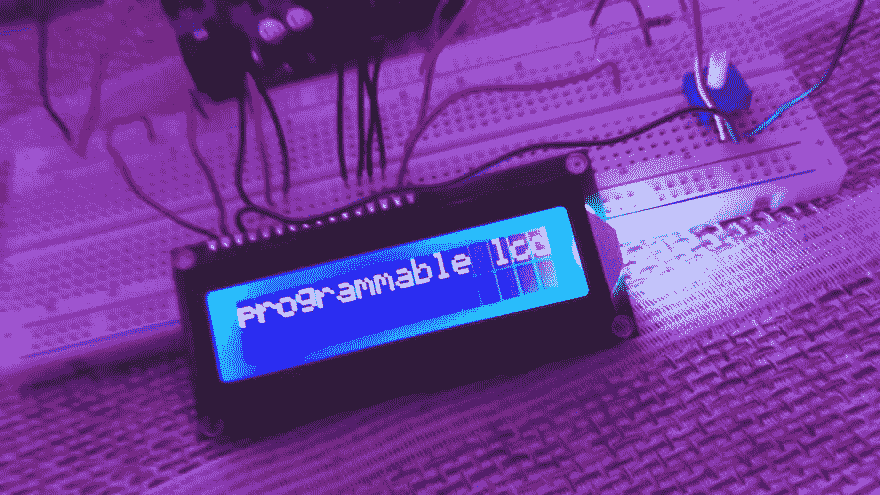

# 无聊的冒险:建立/编程一个液晶显示器

> 原文：<https://dev.to/thetealpickle/-bored-adventures-builtprogrammed-an-lcd-display-47o5>

无聊的冒险:建立/编程一个液晶显示器

醒来时觉得我需要用我的手做点什么，现在我们在这里——>建造并编程一个 LCD，那是一段有趣多彩的时光🌈🤖另外，我用视频记录了这次经历🔨😄