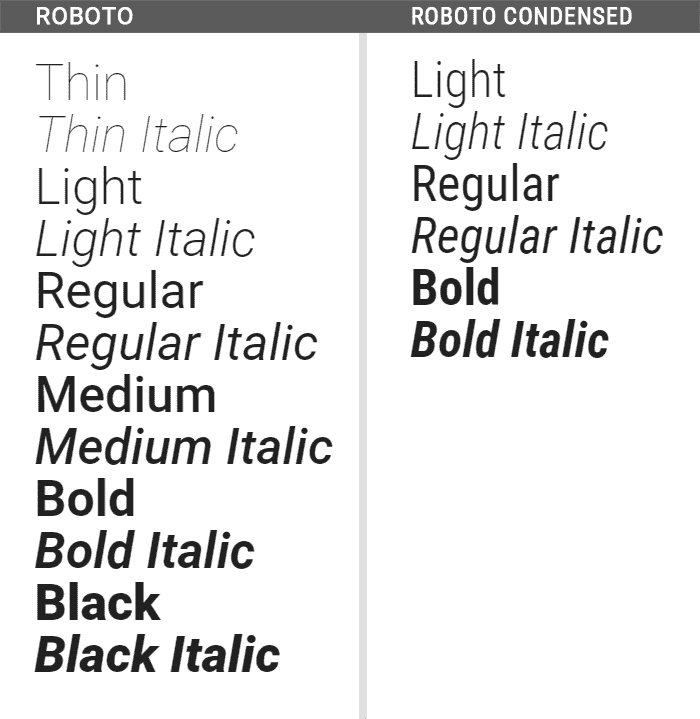
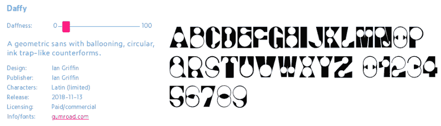

# 网络上的可变字体

> 原文：<https://dev.to/fridanyvall/variable-fonts-on-the-web-187k>

可变字体是一种相对较新的在 web 上设计和显示字体的方式。本文将对该技术进行概述，讨论优缺点以及用例。

它还将讨论普通字体和可变字体之间的区别，并涵盖相关问题，如浏览器支持和在哪里可以找到可变字体。

**重要提示:**要尝试下面的演示，您需要使用现代化的最新网络浏览器！

[https://codepen.io/twhite96/embed/ZmKdqJ?height=600&default-tab=result&embed-version=2](https://codepen.io/twhite96/embed/ZmKdqJ?height=600&default-tab=result&embed-version=2)

# 什么是可变字体？

可变字体是苹果、谷歌、微软和 Adobe 的共同努力，使得从一个单一的字体文件中派生出无限数量的字体变体成为可能。

因为这项倡议得到了大公司的支持，所以在浏览器中适应和实现的速度相对较快。

# 正常与可变

### 普通字体

字体可以有不同的变体。例如，下面的 Roboto 家族由 12 种不同的变体组成。还有一个由 6 个变体组成的精简版本。

<figure>

<figcaption>Roboto 的变种和 Roboto 的浓缩</figcaption>

</figure>

每个变体通常都有自己的名字，如“轻”或“大胆”。这些名称描述了字体变体，但也决定了字体的宽度(1 到 999 之间的值)和粗细(50 到 200 之间的百分比值)。使用普通字体，用户只能访问每个预定义的变体。

要在网站上使用字体变体，必须将其添加到网站中。向网站添加字体变体将增加网站的权重，因为字体变体是网站访问者必须下载的文件。增加网站的权重会对其性能(网站加载速度)产生负面影响。因此，一个网站通常只添加几个不同的字体。例如，添加上面 Roboto 字体的所有 12 种不同变体对于网站的加载时间来说是非常不利的。

只有几种字体而不是全部字体，有时会阻碍或限制网页设计师的创造力。

### 可变字体

可变字体在一个文件中包含所有字体变体的信息。可变字体允许用户访问所有粗细值(在特定字体的定义范围内)，而不是将字体变体的值限制在与特定粗细相对应的值(如“轻”或“粗”的值)。

可变字体也可以包含多种属性的变体。例如，Roboto 的可变版本可以包括 12 个预定义变量之间的每个可能的重量，以及 Roboto Condensed 的 6 个定义版本之间的每个可能的宽度。

可变字体因此提供了更多的字体样式，这反过来意味着更广泛的设计多样性。这使得微调和调整排版以适应每一个目的和情况变得更加容易，因为设计师不会局限于特定的预定义样式/变化。

***性能***
即使可变字体文件在重量上相当大，但与加载所有单独的字体可变文件相比，它还是比较轻的(如前一个使用 Roboto 和 Roboto Condensed 的例子)。

使用可变字体将提高使用许多不同字体变体的网站的性能。但是，建议确保字体文件尽可能小，因为可变字体文件中包含的数据量不可避免地会使其变得相当大。

绩效改进也可以表现为可感知的绩效。例如，这意味着网页似乎加载得更快，因为可变字体中的所有字体变体都同时加载。因此，从浏览器渲染假粗体到加载真实字体变体之间不会有任何突然的“跳跃”。

***光学尺寸***
除了性能改进之外，可变字体还可以包含字体的变体，这些变体根据字体大小而略微改变以提高可读性。可变字体文件可以根据查看条件(如设备类型、视口大小、方向和其他设计约束)进行调整以进行不同的呈现。这种特性称为光学尺寸。在撰写本文时，只有最新版本的 Firefox 才完全支持该功能。

***自定义坐标轴***
一个可变字体也可以有自定义特征坐标轴，这要由字体设计师来发明。例如，自定义坐标轴可以控制轮廓字体中线条的粗细。

<figure> 

<figcaption>改变自定义轴的“刚度”</figcaption>

</figure>

* * *

## 浏览器支持

主要浏览器的最新版本都支持可变字体:Edge、Firefox、Chrome、Safari iOS、Safari、Android 和 Opera。注意，部分平台需要 MacOS 10.13 或以上版本。

目前，该功能在大多数现代浏览器中都可用，并且大约 78%的用户都支持该功能。

***回退***
对于不支持的浏览器，考虑加载回退字体。关于如何在网络上实现可变字体的更多信息，请访问我们的技术博客，看看帖子[“如何在网络上实现可变字体”](https://redonion.se/en/how-to-implement-variable-fonts-on-the-web/)。

## 哪里可以找到可变字体？

现在还没有太多的可变字体，但是随着技术越来越普及，它们的数量可能会增加。

*   Axis-praxis 是一个展示和使用可变字体的网站。
*   v-fonts.com 是另一个致力于寻找和尝试可变字体的在线资源。
*   这是一个谷歌文档，列出了可用的可变字体和相关信息。

***定价***
就像普通字体家族一样，可变字体可以在不同的许可下发布。因为可变字体包含创建所有可想象的字体变体的信息，所以定价可能类似于整个字体系列的价格。

* * *

*最初发表于 [redonion.se](https://redonion.se/en/variable-fonts-on-the-web/) 。*