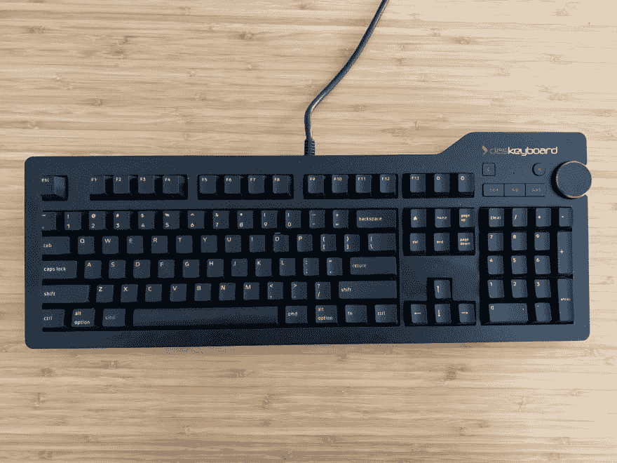
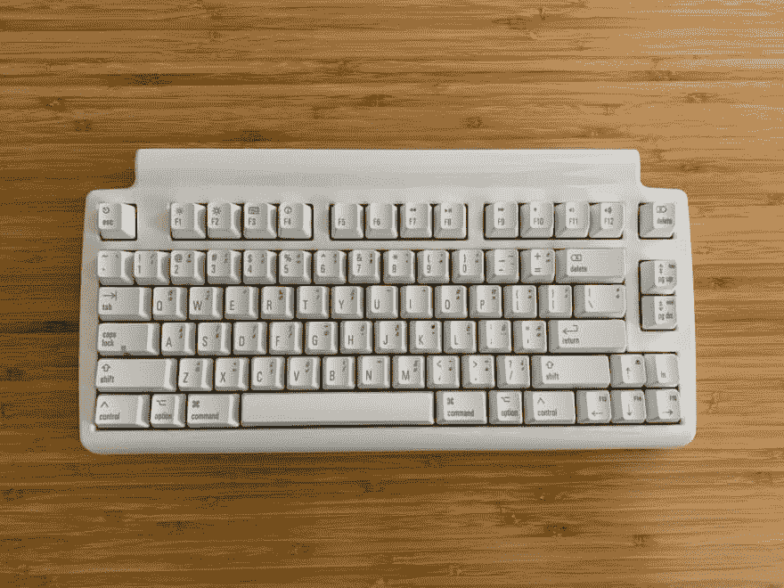
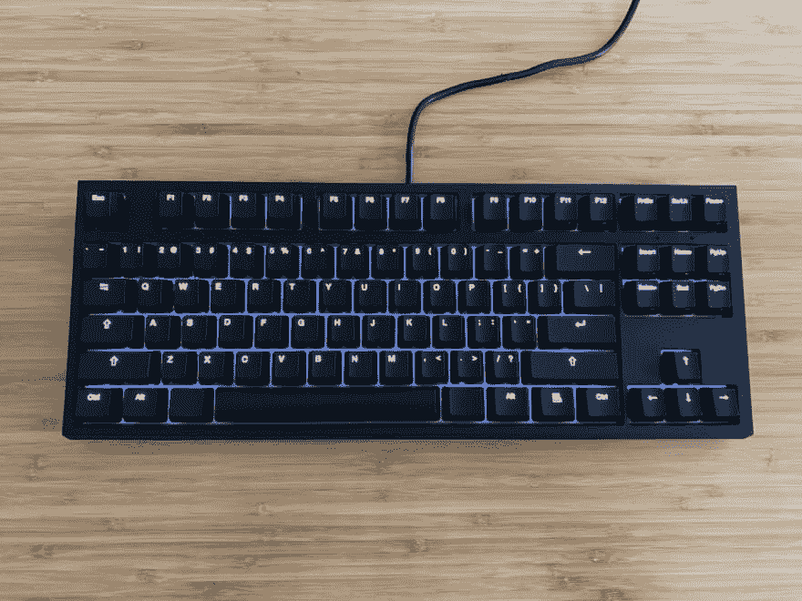

# 我的 Mac 机械键盘搜索

> 原文：<https://dev.to/scottw/my-mac-mechanical-keyboard-search-36ih>

## 短版

我喜欢使用 Das 键盘和 WASD 代码 V3。更小的尺寸和背光足以推动 WASD 前进，但 V3 糟糕的滚动和窗口要求太多而不能忽视。

最后我保留了 Das 键盘，还了另外两个。

## 我测试的车型

*   Das 键盘 4 专业版(MX 蓝色)
*   马蒂亚斯迷你触觉专业版(阿尔卑斯)
*   WASD 代码 V3 87 键(MX 蓝色)

可悲的是，机械键盘的“真正”Mac 选择并不多。[Apple.com](http://apple.com)没有列出。亚马逊上出现的大多数东西都是“复古”的，和机械的不一样。苹果在硬件领域获得了很大一部分利润，但数量仍然很少。

## 我从哪里来

我已经使用罗技蓝牙轻松开关(K811)大约四年了。总的来说，它对我很有帮助。在此之前，我相信我使用的是苹果的魔法键盘或类似的键盘。老实说，我从来没有想过这个问题，但总的来说，我喜欢它们小巧玲珑。

随着所有关于键盘在当前的 MBPs 系列中有多糟糕的谈论，它让我思考和研究键盘更多。电池是罗技开始走，所以它感觉像是一个很好的时间来采取一步的质量。

在你做出类似的改变之前，请注意，一旦你打出了真正高质量的东西，回到 MacBooks 的键盘是非常令人失望的。

## 我的要求

*   一流的 Mac 支持。我的意思是，键盘的所有功能都需要正常工作。没有键盘重映射，第三方驱动等。
*   标准 Mac 键(命令、选项、功能键)。
*   干净的声音-我喜欢键盘有节奏的声音。我过去用过 Ommwriter，它模仿了经典的老式打字。
*   背光——我非常喜欢在昏暗的光线下工作。在大多数情况下，显示器将提供足够的光线，但我从未对键盘背光感到失望。

就是这样。相当简单的要求。

## Das 键盘 4 专业版

Das 键盘是我订购的第一个。当它到达时，我震惊于它比我现在的键盘大了多少(宽度和高度)。我原本打算使用 Das，但考虑到它的不同之处，我认为在提交之前先看看还有什么可用的是个好主意。

### 我喜欢 Das 键盘的地方:

*   它建造得很好。你可以把它捡起来，它有很好的重量。
*   它有所有的 Mac 密钥，所有的东西都有正确的标签
*   它有一个伟大的全布局，这是一个全尺寸键盘的预期
*   我喜欢媒体控制。有一个音量旋钮的感觉是对的。
*   它有很好的点击感。不知道如何更好地表达这一点，但它只是听起来像你在打字
*   它很低调。它比罗技高得多，但与替代品相比，它短了约 1/4(从桌面到空格键顶部约 1/2 英寸)。
*   优质软线。
*   两个 USB 端口。对他们来说没有真正的用处，但拥有它们很好

### 我不喜欢 Das 键盘的地方:

*   键盘-我不需要这个选项，有了它，我的触控板最终会离我稍微远一点。
*   USB 3 -我看错了描述，以为是 USB C，虽然软线质量很好，但它是永久连接的，无法拆除。虽然在一个 100 美元的键盘上花额外的钱买一根 UBC C 转 USB C 线的想法没有吸引力，但它仍然是其他人的一个选择。再说一次，Mac 和 USB-C 是小市场，但 Mac 'Pro '键盘没有 USB-C 选项感觉像是一个疏忽。
*   没有背光。

## 马蒂亚斯迷你触觉 Pro

马蒂亚斯最近推出了他们的触觉键盘的“迷你”版本。我完全期待这将解决我的 Das 键盘问题，并寄予厚望。

### 我喜欢马蒂亚斯的什么

*   它具有最小的水平占地面积。
*   这是 100%苹果机。所有的钥匙都在那里。他们按预期工作。不需要额外的软件。
*   两个 USB 端口。我对它们没有太大的用处，但是有选择总是好的。

嗯，就是这样。这不是一个坏键盘，但它不适合我。我知道它应该是模仿过去的苹果键盘，但我不买它。

### 我不喜欢马蒂亚斯的地方

*   它非常高(字体为 3/4 英寸)。空格键在顶部大约一英寸。腿朝上时，功能键离桌子近 2 英寸(键盘 1.5 英寸多一点)。如果没有支腿，功能键的顶部大约为 1 1/4 英寸。
*   键盘感觉很挤。如果你看看照片，你会发现右下角的箭头键被卡住了。我肯定他们有他们的理由，但是移动控制键旁边的功能键，把箭头向右推半英寸，可能会让它更流畅。WASD 键盘钉住了这一点。
*   附带的软线迫使电缆向左移动。它是一根迷你 USB 线(质量非常好)，但它是一个非常奇怪的设计选择。其他东西都是白色的，我不知道为什么这是一根银线。
*   点击/按键-开关是阿尔卑斯山。正如我在介绍中提到的，我在这里没有强烈的意见，但这听起来更像是我在猛敲键盘而不是快速打字。

## WASD 电码 V3 87 键

几年来，我一直收到 WASD 时事通讯。正是他们关于 V3 的声明引起了我的注意。

WASD 人远远地检查了所有的箱子。

它拥有 Das 键盘和 Matias 的大部分最好的部分。它像马蒂亚斯一样狭窄，但没有 smooshed。像 das 一样，它对重量有很好的固体感(它比全尺寸 Das 重)。它还有一个(对我来说)其他两个都没有的关键功能，背光键盘。

我还喜欢它带有一个方便的工具来移除钥匙，并且可以无限定制。我将在下面抱怨 Mac 默认键选项的缺乏，但快速改变事情的机会是一个体面的妥协。

### 我喜欢 WASD 电码 V3 的什么:

*   它很窄，但不太窄
*   它像岩石一样坚固
*   逆光
*   非常灵活的电线放置。我喜欢在大多数人很少注意到的事情上有多少想法
*   alt 和 command/system 键是向后的，但是它提供了一个简单的工具，您可以使用它来在物理上交换它们

### 我不喜欢 WASD 电码 V3 的地方:

*   它仍然相当高(3/4 英寸)。过去十年在小(短)键盘上打字惯坏了我(或者至少训练我觉得太高了)。我买了一个似乎有帮助的腕托，但是我不喜欢在我的桌子上一直放一个。
*   V3 的标签是 USB-C。对我来说，这意味着电缆插入电脑的一端是 USB-C。但不，它是进入键盘的一端。我无论如何也不明白这有什么关系。虽然我有一个小连接器让它工作，但如果我坚持使用这一个，我将不得不购买 USB-C 到 USB-C 电缆。以这个键盘的价格，那感觉像是犯罪。
*   当我打开盒子时，映入眼帘的是 V2 的安装说明。我最初的想法是，要么是我收到了错误的型号，要么是亚马逊上的列表有误。WASD 的支持团队向我保证这是一款 V3 机型，但是没有固件更新，任何新功能都不可用
*   说到固件，在 OS X 模式下，反勾号和波浪号输出 and 而不是`和~。我确信很快会有更新，这感觉像是一个大的早期失误。
*   代码键盘有一个伟大的电缆五路配置选项。这很好，因为你可以优化你需要插入的电缆。不幸的是，他们寄给你的电报大约有一毫米厚。它最终会“刮伤”电缆的所有塞住的地方。因为我可能会把它换出来，这不是世界末日，但它仍然是一个扫兴的人。
*   没有 USB 接口——我没有任何东西可以插，我的桌子有内置的充电接口，但是你永远不知道。
*   这不是“真正的”Mac 键盘。你可以 Mac 启用它，但按键并没有全部贴上标签。他们卖一包钥匙来解决这个问题，但还是要 20 美元。我与之比较的另外两个键盘是 Mac 键盘。
*   我喜欢 Das 键盘上的媒体控制。

在与 WASD 支持团队反复沟通之后，我被告知固件更新既要解决反勾号和波浪号问题，又要启用 V3 的特定功能，这不仅需要固件更新，而且需要在 Windows 计算机上进行更新。

对此我有一些重要的担忧:

1.  为什么 V3 不支持特定于 V3 的特性？我知道在一个新产品的早期可能会有 bug，但是没有，这是一个可怕的经历。
2.  需要一台 windows 计算机来执行更新。你不能列出 Mac 兼容性，然后说我需要 Windows 才能使用它。

## 其他选项

安德烈·布托夫(Andrey Butov)推荐了，尽管它看起来像海盗船。我每年去一次当地的百思买超市，看看是否还有别的东西可以买。

在典型的百思买时装中，他们展出的大部分商品都没有库存，但有几件胸花展出。我赞成逆光，但我不认为彩虹是我所追求的。看起来他们也依赖于相当多的软件来实现完全的功能。这些软件似乎都不支持 Mac。有一些变通办法(比如在 windows 机器上进行设置，内置内存键盘)或者使用一组社区驱动程序，这不是我想要依赖的东西。

在那里，我确实看到了几个罗技机械键盘。我喜欢他们有一个漂亮而简单的白色背光，但他们展示的那个感觉很便宜(它不比我看过的任何其他东西便宜)。

Donn Felker 推荐了 kine sis Advantage 2，它融合了一些非常有趣的人体工程学，但在这一点上，学习新的键盘布局(并使价格翻倍)不是我愿意做的事情(真的，该死的增加价格，不是 Mac 专用的)。

这些年来，我在 Kickstarter 上收藏了几个薄型机械键盘的项目。我甚至联系了一家现在可以买到的公司，询问他们的退货政策，但什么也没听到。

## 我们有了一个赢家…

我将坚持使用 Das 键盘。当我今天写这篇文章时，我将错过背光，但我发现 1/4 英寸的高度产生了明显的差异，我无法忘记 WASD 是如何处理 V3 的推出和更新要求的。