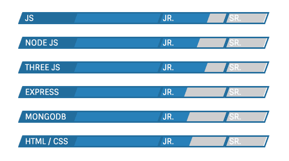

# 你的 Web 开发组合做错了什么

> 原文：<https://dev.to/raddevon/what-youre-doing-wrong-with-your-web-development-portfolio-2j56>

在本文中，我将向您展示新的开发人员通常如何在他们的 portfolio 站点中出错，以及您应该做些什么。

当你最近学会了如何为网络构建时，你自然会为你所学到的东西感到自豪。我看过几十个新开发人员建立的作品集网站，最大的错误总是相同的。他们建立了一个关于他们自己和他们所学的所有东西的文件夹。

这不是一个有效的投资组合网站。你的投资组合网站应该专注于降低雇佣你的风险。你可以通过展示与你希望被雇佣的工作相似的工作来做到这一点。这项工作应该为你想雇用你的人解决一个问题，你应该强调它是如何做到这一点的。可以用社会证明。展示与你想关注的人相似的人的评价或推荐。

这里有一些你*不应该*包含在你的作品集网站中的东西，以及，在不明显的地方，你会怎么做。

## 长长的技能列表&技能米

感觉上一长串技能让你看起来更有吸引力，但实际上只是让你看起来不专注。仪表是一种展示你努力学习这些东西的方式。不幸的是，他们可能会让*你*感觉更好，但是**他们不会告诉浏览你的投资组合网站的人太多事情**。

|  |

### 做什么相反

如果你想得到一份全职工作，列出一些关键技能是有意义的。选择 4-5 个最适合你想做的工作的选项。如果你*不知道*你想做什么样的工作，就随便挑吧。(你随时都可以换。)

这使得你的作品集一目了然，但是要确保你包含了关于你的项目的细节，这些细节展示了你如何实际运用这些技能。

如果你是自由职业者，确保你的技能能与你想服务的客户沟通。企业通常不关心您是使用 Node 还是 Python 来构建他们的解决方案。他们关心的技能*是那些产生**商业结果**的技能。不要用项目列表，确保你用你解决的问题来引导你的投资组合网站。当你展示你的项目时，说出每种情况下你的解决方案的结果。*

如果你刚刚开始你的 web 开发生涯，并且需要一些帮助，我很乐意帮助你。报名参加在[拉德德文郡](https://raddevon.com/)举办的免费辅导课程吧！我将帮助你找到你 web 开发生涯的下一步！🚀

## 突出“公分母”的技巧

当你想突出你擅长的事情时，先回答这个问题:**有人会说他们*而不是*擅长这项技能吗？**如果他们不愿意，你声称自己*擅长这个*就不是在让自己与众不同。你能想到谁会告诉未来的雇主他们不诚实吗？他们不善于沟通？他们没有野心或者学东西慢？你能想到有哪个开发者的网站不“漂亮”吗？做出这些声明并不会真的帮你一把。

## 没有上下文的项目

展示你建立的网站的图片对那些想雇佣你的人来说没什么用。即使你提供了链接，也还是不够。首先，没有人知道你在这个项目中实际做了什么。另一方面，它留下了重要的背景，比如你试图解决的问题、你构建的解决方案以及结果。

基于一个形象来购买你的服务就像买了一辆车却不去开，或者买了一栋房子却不去逛。

## 被铺得太薄

当我谈到技能时，我提到了这一点，但它足够重要，值得有自己的标题。即使你做对了其他事情，如果你的投资组合显示了 3-4 个不同类别的解决方案，这只会疏远那些想雇用你解决任何一个问题的人。

想象你想要一些非常好的冰淇淋。你更有可能去吃到饱的自助餐厅，那里也有软服务机，还是你会特意去找一个自己现场制作冰淇淋的地方，而不做其他事情？很容易的决定，对吗？

### 做什么相反

你想成为最容易做出决定的人。将你的投资组合集中在一种或最多两种你建立的解决方案上，突出那些显示你是任何有这个问题的人的本垒打的项目。

这并不意味着你必须只为单一类型的客户提供单一的服务。你可以有不同的投资组合网站，每个网站与不同类型的客户/雇主对话，或者突出不同类型的解决方案。

## 使用对你有意义的语言

你将开始用对你有意义的语言写你的作品集页面。当你谈论你的项目时，你可能会使用技术术语，或者你可能会称自己为“web 开发人员”取决于谁会看你的投资组合，这可能是好的。如果你想得到一份全职工作，或者如果你想以自由职业者的身份加入一个现有的团队，做决定的人可能会有足够的技术来完成这项工作。

事实上，你会*希望*使用对你有意义的语言 ***如果*也是对你的听众有意义的语言**。如果不是，尽管…

### 做什么相反

使用对你想服务的人有意义的语言。在你的脑海中，你可能是一名“web 开发人员”,但你并不想将“web 开发”推销给瑜伽馆、运输公司、当地餐馆或电视台。他们可能已经有了某种网站。相反，你需要向他们推销你能提供的他们迫切需要的好处。用你的话来说，你可能会提高 WordPress 网站的性能，但是，对你的客户来说，你可能会帮助他们提高搜索引擎排名。你可以通过提高性能来做到这一点，但他们并不真正关心这个。

找到对你的客户有意义的语言并使用它。如果你不知道这是什么，是时候走到那些人面前和他们说话了。

## 如果我没有任何项目要展示怎么办？

你需要解决这个问题。没有项目展示，你就无法建立作品集。弄清楚你想用你的投资组合吸引谁，建立一个或两个范围严格的项目，展示你能为客户或雇主做什么。

如果你不确定你想为谁工作或者做什么样的工作，你仍然需要项目来证明你能做出对某人有用的东西。如果你在想点子上有困难，使用[我的项目点子列表](https://raddevon.com/articles/10-great-web-development-learning-project-ideas/)来获得灵感。

## 但是，没有遵循任何这种建议！

一旦你名声在外，你也可以打破所有的规则，建立一个“开发人员组合”,它只是对你所有的猫的描述。在那之前，**你需要你能得到的每一个优势**来打破噪音，赢得你的投资组合网站访问者的信任。

## 如果你只拿走一样东西…

你的投资组合中的一切都应该围绕着你想雇佣你的人。别说你了。谈论他们的问题。不要建立你的技能清单。展示你为他们的问题制定的**解决方案**。

当你建立你的作品集时，把这个原则放在最前面，你会对访问它的人产生深远的影响。