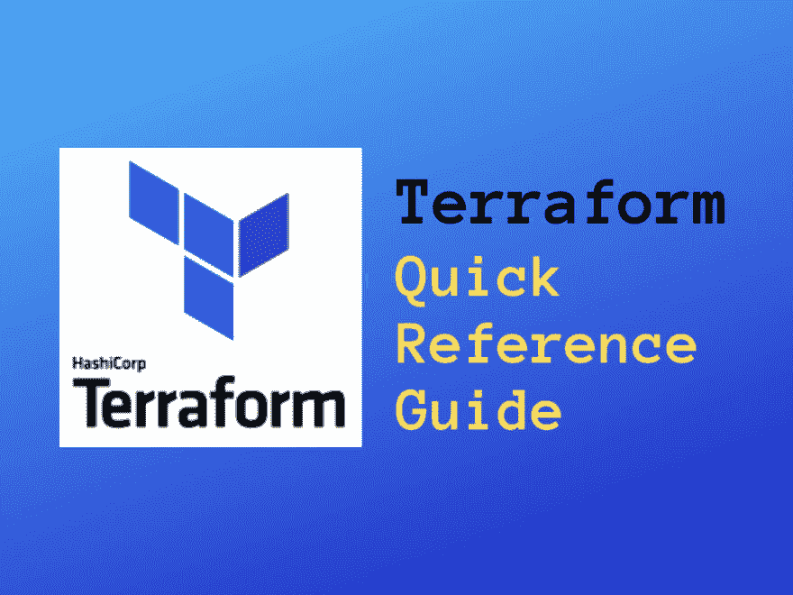

# Terraform 快速参考指南

> 原文：<https://dev.to/simon_sugob/terraform-quick-reference-guide-47n8>

Terraform 仍然是我最喜欢的 DevOps 工具之一。这不仅仅是因为易于模块化和对抗多云。Terraform 使其用户能够将基础设施作为代码进行管理，这是 DevOps 实践的关键和基础。

[https://www.youtube.com/embed/RO7VcUAsf-I](https://www.youtube.com/embed/RO7VcUAsf-I)

### 我为什么爱 Terraform？–出于 5 个原因:

✔It 是开源的，有大量活跃的社区在开发该工具
✔It 是多云提供商
✔It 是多平台的
✔Its 计划命令允许您在应用之前看到它将应用的更改
✔It 在命令行中运行，支持自动化 DevOps 管道集成

## Q1。**为什么是 Terraform？**

了解自 2016 年以来 Terraform 变得多么受欢迎，并考虑 6 个理由[为什么 Terraform 应该成为您的 DevOps 工具之一？](https://medium.com/devopslinks/why-should-terraform-be-one-of-your-devops-tools-29ae15861b1f)

## Q2。**作为代码工具，Terraform 与其他基础设施相比如何？**

这个问题的答案出现在 Quora 上。回答者给我们提供了地形和云形成的共同特征和区别。使用 Terraform 和 CloudFormation 的优缺点是什么？。如果你想潜得更深，那就去:[地形与云层——一个实用的比较](https://cloudership.com/blog/terraform-vs-cloudformation-a-pragmatic-comparison)。

## Q3。**我在哪里可以找到 Terraform 指南、最佳实践和技巧？**

Yevgeniy Brikman 是 Gruntwork 的联合创始人，也是《Hello，Startup》和畅销书[《Terraform:Up&Running】](https://www.terraformupandrunning.com/)的作者，他发布了一系列帖子，教你在现实世界中使用 terra form 的最佳实践。这是他的[地形综合指南](https://blog.gruntwork.io/a-comprehensive-guide-to-terraform-b3d32832baca)。

GitHub 是一个很好的地方，不仅可以找到，还可以与社区分享您的 Terraform 最佳实践和定制模块。访问[GitHub–terra form 最佳实践](https://jamesdld.github.io/terraform/Best-Practice/)并充分利用它！

使用模块，隔离环境，保持干燥。你可以在苏国豪的一篇文章中找到这些和其他 4 个有用的建议:[以正确的方式开始你的 Terraform 项目的 7 个建议](https://medium.com/@simon.so/7-tips-to-start-your-terraform-project-the-right-way-93d9b890721a)。而 [Terraform 推荐实践](https://www.terraform.io/docs/enterprise/guides/recommended-practices/index.html)指南更适合希望将 Terraform 的使用从几个人提升到整个组织的企业用户。

## Q4。**你为什么要为 Terraform 做贡献？**

如果你正在考虑让你的开发者帮助你完成操作工作，现在这是可能的。阅读这篇文章并学习如何做。[将 Dev 放入 DevOps:为什么你的开发者也应该编写 terra form](https://medium.com/runatlantis/putting-the-dev-into-devops-why-your-developers-should-write-terraform-too-d3c079dfc6a8)。

## Q5。**为什么要 Terraform 模块，如何构建？**

当基础架构管理超越简单配置时，该怎么办？如果您希望帮助减少您的维护并使管理您的基础设施更有效，请利用模块。它们提供了一种简单的方法，将常见的配置块抽象成可重用的基础设施元素。下面两篇文章值得研究:

✔ [HashiCorp Terraform:模块作为基础设施的构建模块](https://www.hashicorp.com/blog/hashicorp-terraform-modules-as-building-blocks-for)。

✔ [如何用 Terraform 模块创建可重复使用的基础设施](https://blog.gruntwork.io/how-to-create-reusable-infrastructure-with-terraform-modules-25526d65f73d)。

## Q6。**存储库结构怎么样？**

如果你熟悉 Terraform Enterprise (TFE ),你应该知道一个合适的存储库结构是至关重要的。它决定了 Terraform 在 Terraform Enterprise 中执行时可以访问哪些文件，以及 Terraform 计划何时运行。深入挖掘➛ [仓库结构](https://www.terraform.io/docs/enterprise/workspaces/repo-structure.html)。

## Q7。**如何使用 Terraform 提供零停机更新？**

了解如何确保在旧的基础设施被摧毁之前创建新的基础设施。请记住，一个正在运行的虚拟机并不一定意味着一个正常工作的应用程序。了解更多:[hashi corp Terraform](https://www.hashicorp.com/blog/zero-downtime-updates-with-terraform)实现零停机更新。

## Q8。**如何开始使用 Terraform Automation？**

无论您是在生产中定期使用 Terraform，还是在大型团队中使用 Terraform，都希望以某种自动化方式编排 terra form 运行，以确保运行之间的一致性，并提供其他有趣的功能，如与版本控制挂钩的集成。听起来很有趣？浏览本指南:[在自动化中运行 terra form](https://learn.hashicorp.com/terraform/development/running-terraform-in-automation)。

## Q9。**通过不同的云提供商使用 Terraform。**

Terraform 不可否认是第一个不可变的多云基础设施工具。你更喜欢哪家云提供商？

*带 AWS 的 Terraform:*
[用 terra form 实施 AWS 虚拟私有云(VPC)基础设施](https://dzone.com/articles/implementing-aws-virtual-private-cloud-vpc-infrast?utm_medium=feed&utm_source=feedpress.me&utm_campaign=Feed:%20dzone)。

[WildRydes(无服务器 Web 应用程序)，在 AWS 中使用 terra form](https://dzone.com/articles/wildrydes-serverless-web-application-with-terrafor?utm_medium=feed&utm_source=feedpress.me&utm_campaign=Feed:%20dzone)。

[利用 EKS 和 Terraform 创建 Kubernetes 集群](https://www.hashicorp.com/blog/hashicorp-announces-terraform-support-aws-kubernetes)。

*terra form with Azure:*
[使用 terra form with Azure–有什么好处？](https://samcogan.com/terraform-and-azure-whats-the-benefit/?utm_content=buffer7563f&utm_medium=social&utm_source=linkedin.com&utm_campaign=buffer)

[在 AzureStack 上开始使用 Terraform](https://charbelnemnom.com/2019/01/getting-started-with-terraform-on-azurestack-azure-azurestackdevkit-hashicorp-azure/)。

[使用 AKS 和 Terraform 创建 Kubernetes 集群](https://www.hashicorp.com/blog/kubernetes-cluster-with-aks-and-terraform)。

*Terraform with Google:*
[Google 提供商入门](https://www.terraform.io/docs/providers/google/getting_started.html)。

[使用 Terraform](https://cloud.google.com/community/tutorials/managing-gcp-projects-with-terraform) 管理 GCP 项目。

[利用 Terraform](https://dzone.com/articles/build-a-kubernetes-cluster-on-gcp-with-terraform) 在 GCP 建造一个 Kubernetes 集群。

*用于多云管理的 Terraform。*
[了解如何使用 Terraform 进行多云管理](https://searchcloudcomputing.techtarget.com/tip/Learn-how-to-use-Terraform-for-multi-cloud-management)。

观看本演示，了解:【HashiCorp Terraform 的多云供应。

## Q10。 **Terraform 与其他 DevOps 工具的集成。**

我只挑选了一些我们目前正在使用的工具，如 Ansible、Docker、Jenkins。但这只是冰山一角。

[使用 Hashicorp Terraform 和 Jenkins 的不可变基础设施 CI/CD](https://dzone.com/articles/immutable-infrastructure-cicd-using-hashicorp-terr)。

[使用 Ansible 和 Terraform 开始使用 kubernetes】。](https://itnext.io/getting-started-with-kubernetes-using-ansible-and-terraform-741e6bb6ad7a)

使用 Terraform 的 Docker 部署。

[用 Terraform](https://twindb.com/managing-github-with-terraform/) 管理 GitHub。

### 如果你喜欢看而不喜欢读，以下是必看的视频，包括我的:

[https://www.youtube.com/embed/J2wPkiBKKHw](https://www.youtube.com/embed/J2wPkiBKKHw)

[用 Terraform 扩展:从创业到企业的旅程](https://www.hashicorp.com/resources/scaling-with-terraform-startup-enterprise)

[HashiConf 2018 第二天主题演讲:Terraform 正在改变世界](https://www.hashicorp.com/resources/hashiconf-day-two-keynote-terraform-way)

[编写超过 300，000 行基础设施代码的 5 个经验教训](https://www.youtube.com/watch?v=RTEgE2lcyk4)

[利用 Terraform 发展您的基础设施](https://www.youtube.com/watch?v=wgzgVm7Sqlk&t=6s)

[快乐的地球化！真实经验和经过验证的最佳实践](https://www.hashicorp.com/resources/terraforming-real-world-experience-best-practices)

我希望它有帮助。

也贴[这里](https://www.hiredevops.org/terraform-quick-reference-guide/)