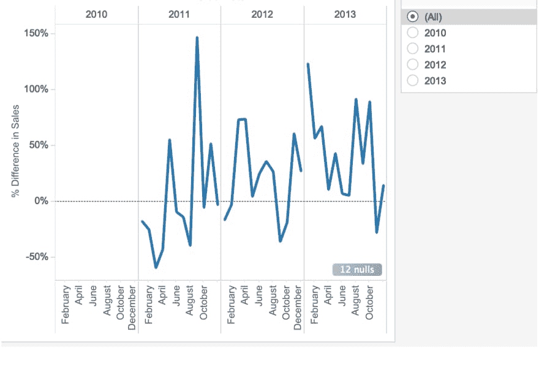
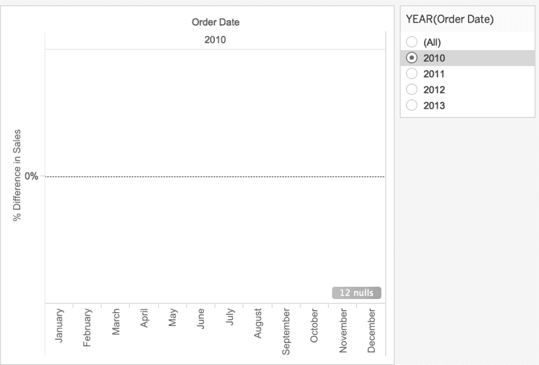
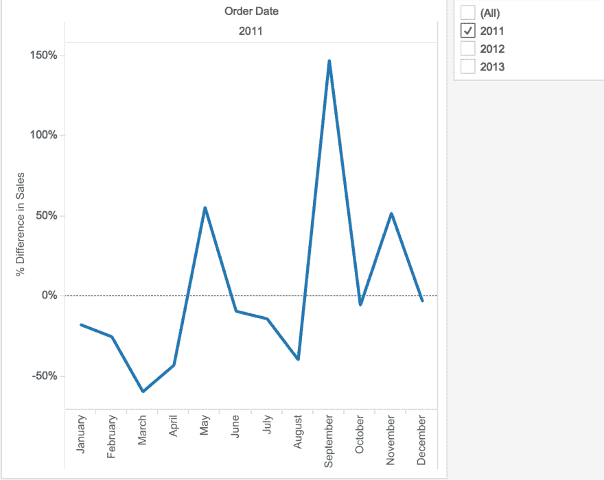

# 使用查找的 Tableau 日期筛选不显示任何数据

> 原文：<https://dev.to/sneha27j/tableau-date-filtering-using-lookup-shows-no-data-1n7>

日期过滤器，是你三明治上涂的吗？你必须拥有它。有时候，你不会！

如果您碰巧在报表中使用了 LOOKUP()和日期过滤器，那么当您选择除了*和*之外的日期时，您会发现数据变成了 *null* 。这个 by Tableau 的解决方案可以在这个 [*链接*](https://kb.tableau.com/articles/howto/date-filtering-using-lookup-shows-no-data) 得到。

不过，我想用一个例子来阐述一下。

让我们以销售额的年差异%为例。tableau 给你一个简单的点击选项。(右键单击销售>快速表格计算>同比增长)。布局如下图所示，带有年份过滤器(选择了所有*)
*

 *现在，试着选择一年，布局就消失了。见下文:

那么，你会问为什么会发生这种情况？表格计算——在我们的例子中，LOOKUP()需要视图中的所有数据才能工作，因为它引用其他单元格中的数据来进行计算。但是，当您应用日期过滤器时，引用不再可用。

解决方法: ***动态隐藏***
创建一个表计算来复制数据，然后对这个新的表计算进行过滤。
*公式*:LOOKUP(YEAR(MIN([订单日期]))，0)
将此转换为离散并创建您的过滤器。通过更改数字格式来删除千分位数。要删除 2010，在过滤器架中添加过滤器销售< > Null。

最终布局如下:

参考:布兰登·肖克*