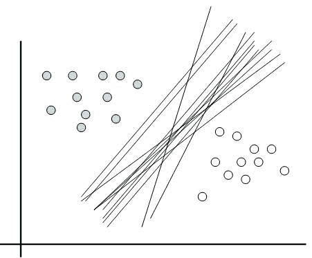
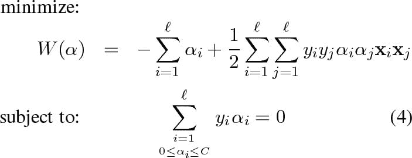
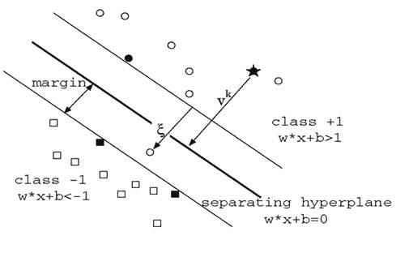
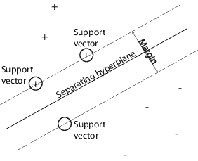
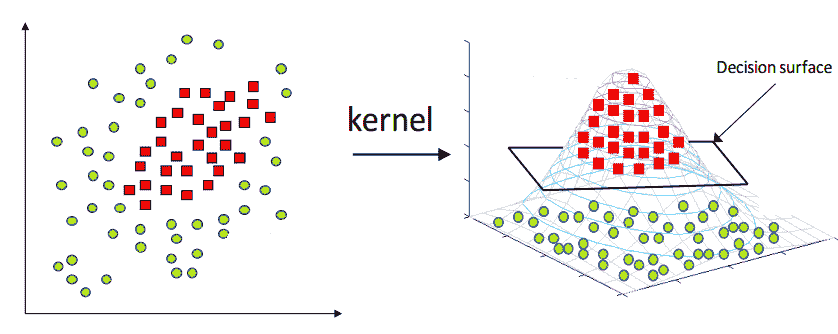
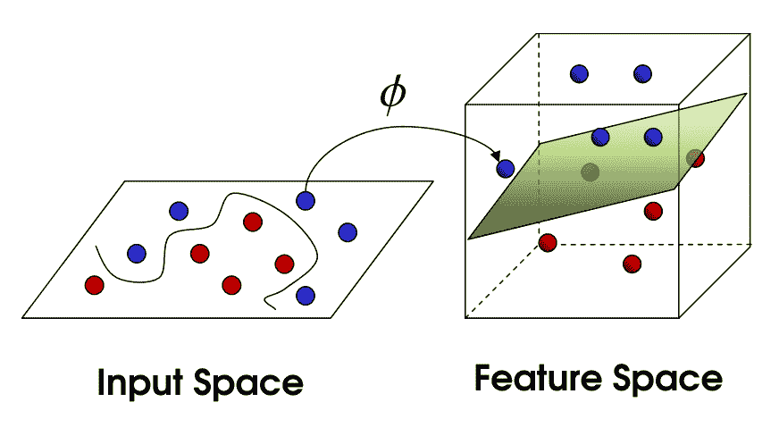
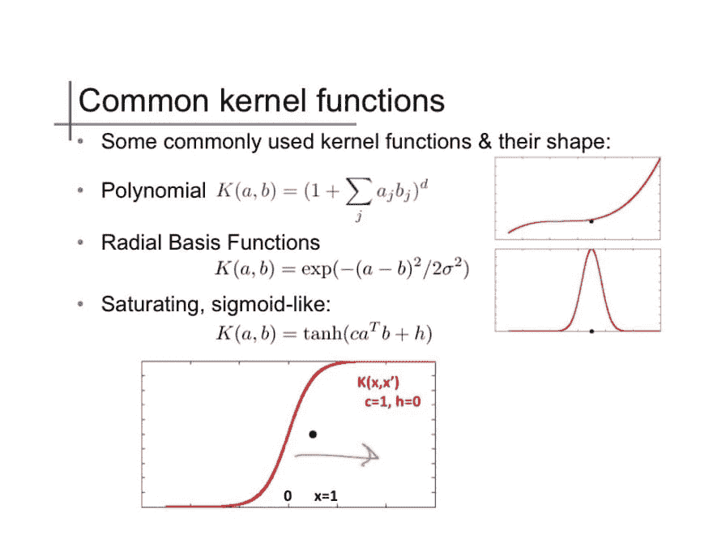
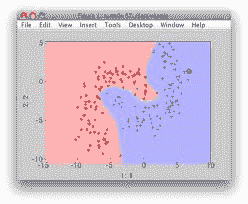
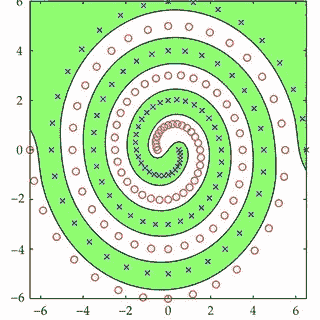

# 监督学习:支持向量机

> 原文：<https://dev.to/swyx/supervised-learning-support-vector-machines-3mgk>

*这是我学习[佐治亚理工学院/优达城机器学习课程](https://www.udacity.com/course/machine-learning--ud262)的系列课堂笔记中的第七篇。课堂教材是汤姆·米切尔的[机器学习。](https://www.cs.ubbcluj.ro/~gabis/ml/ml-books/McGrawHill%20-%20Machine%20Learning%20-Tom%20Mitchell.pdf)*

## 直觉为为什么

画线把组与组之间分开，其实是一个相当弱的条件。既然我们已经知道如何将我们的算法提升到任意的复杂程度，下一个要解决的前沿问题就是选择“最佳”的线条来绘制。仍然有各种各样的有效线(又名弱学习者)完全区分群体，但主观上有些线比其他线更好。

[](https://res.cloudinary.com/practicaldev/image/fetch/s--QNsOio4o--/c_limit%2Cf_auto%2Cfl_progressive%2Cq_auto%2Cw_880/https://onionesquereality.files.wordpress.com/2009/03/infinte-linear-separators.jpg)

给定 A 组和 B 组，你更希望 A 和 B 之间有一条等距线，而不是仅仅在两者的边界上。该理论认为，A 和 B 只是一个更大群体的样本，所以如果你画的线太靠近其中任何一个，他们很可能**不能概括**。

另一种表述方式是，假设线得到了数据的支持，但对数据的承诺最少。

找到这个最佳的描述是支持向量机的直觉。

## 寻找边际

我们找到组之间可能空间的最宽可能带，找到在每个点上垂直于带的每个边的线，并选择垂直线的中点。我们称这条线为**边距**。

形式上，量词`f`可以归结为:

```
wX + b = C

where 

- b is a constant
- w is a simple, linear vector
- X is one or more dimensions of input variables
- C is the classifier output, either -1 or +1 
```

所以我们可以设置

```
wX1 + b = 1
wX2 + b = -1 
```

对于任意两组 X 变量。边距或它们之间的垂直距离的等式`(w/mod(w))X1-X2`给出了`2/mod(w)`，它也是两个平面之间的距离。我们想要最大化`2/mod(w)` *，同时正确地分类一切*，这很难解决，所以我们将问题转化为最小化`1/2 * mod(w) ^ 2`，这是一个[二次规划问题](https://en.wikipedia.org/wiki/Quadratic_programming#Solution_methods)，我们确实知道如何解决，有相同的答案。

解决方案如下所示:

[](https://res.cloudinary.com/practicaldev/image/fetch/s--TTwknVhF--/c_limit%2Cf_auto%2Cfl_progressive%2Cq_auto%2Cw_880/https://cdn-images-1.medium.com/max/1600/0%2AOEjd8IeZaCx8SQWz.jpg)

并且可以查看[关联的帖子](https://towardsdatascience.com/understanding-the-kernel-trick-e0bc6112ef78)来进一步了解 alpha 参数。

事实证明，二次规划解决方案仅依赖于几个数据点，即位于组边缘的数据点。换句话说，除了那些靠近组边缘的`xi, xj`组合之外，大多数 alpha 参数都接近 0。这很直观——组内的点并不能提供太多关于组的边界在哪里的信息。我们称这些外部数据点为[支持向量](https://onionesquereality.wordpress.com/2009/03/22/why-are-support-vectors-machines-called-so/)——正如你在这里看到的，这些是最接近直线的黑点:

[](https://res.cloudinary.com/practicaldev/image/fetch/s--KsKIaAMd--/c_limit%2Cf_auto%2Cfl_progressive%2Cq_auto%2Cw_880/https://onionesquereality.files.wordpress.com/2009/03/optimal-margin-classifier.jpg)

这里有另一张照片可以确认一下:

[](https://res.cloudinary.com/practicaldev/image/fetch/s--Kp7pBdV4--/c_limit%2Cf_auto%2Cfl_progressive%2Cq_auto%2Cw_880/https://www.mathworks.com/help/stats/svmhyperplane.png)

这听起来很像 [K 最近邻](https://dev.to/swyx/supervised-learning-instance-based-learning-and-k-nearest-neighbors-kge)！除此之外，您可以找到整组数据点的分隔符。

## 内核绝招

在二次规划解决方案中，在页边空白两侧的两点之间有一个涉及相似性得分的投影。在最简单的情况下，它可以是一个简单的点积(如果垂直，则为 0；如果方向相同，则为 1；如果方向相反，则为 1)，但您可以将其推广到几乎任何您能想到的相似性函数。这对于添加维度以将现有数据转换为线性可分空间非常有用。

因此，即使我们只能用 SVM 方法画直线，并且可能无法为给定的一组数据画线，我们也可以转换我们的数据点，以便可以在更高维度中画线:

[](https://res.cloudinary.com/practicaldev/image/fetch/s--__CfsWln--/c_limit%2Cf_auto%2Cfl_progressive%2Cq_auto%2Cw_880/https://blog-c7ff.kxcdn.com/blog/wp-content/uploads/2017/02/kernel.png)

在这里，我们不能在二维空间画一条线来画出这个圆，但是一旦我们增加了一个额外的维度，这就变得很容易了。您几乎可以对任何东西这样做:

[](https://res.cloudinary.com/practicaldev/image/fetch/s--uO8IRA9E--/c_limit%2Cf_auto%2Cfl_progressive%2Cq_auto%2Cw_880/https://qph.fs.quoracdn.net/main-qimg-cd6cde306c8273b2af183f57f25c259d)

酷的是，转换不必是显式的-如果我们选择新的维度，使得总的新数据点的点积具有良好的封闭形式(很难出错)，我们可以使用它作为我们的内核*而不是线性点积的*，我们将求解该优化。可以使用任意数量的内核:

[](https://res.cloudinary.com/practicaldev/image/fetch/s--CFYBkHWT--/c_limit%2Cf_auto%2Cfl_progressive%2Cq_auto%2Cw_880/https://i.ytimg.com/vi/OmTu0fqUsQk/maxresdefault.jpg)

各有各的特点。因此，您的支持向量机甚至可以这样做:

[](https://res.cloudinary.com/practicaldev/image/fetch/s--vHEbwC8p--/c_limit%2Cf_auto%2Cfl_progressive%2Cq_auto%2Cw_880/https://encrypted-tbn0.gstatic.com/images%3Fq%3Dtbn:ANd9GcRUPB_k4gT1YtQTsctdyhGsOp6OSObJtD3_dbBjDAb8tqlFJJKPDw)

或者这个:

[](https://res.cloudinary.com/practicaldev/image/fetch/s--e5yyzwZq--/c_limit%2Cf_auto%2Cfl_progressive%2Cq_auto%2Cw_880/https://www.researchgate.net/publication/258395951/figure/fig3/AS:325609399046184%401454642739017/Comparison-between-LS-SVMs-and-FLSA-SVMs-a-two-spiral-pattern-recognized-by-the_Q320.jpg)

最终重要的是，您对内核的选择反映了您的领域知识，您对哪些数据点(以及这些数据点的投影)是基于您识别的特征、基于它们的相似性的组的有效成员的判断。

旁注:所有 SVM 核必须满足 [Mercer 条件](http://www.svms.org/mercer/) ( [关于为什么](https://www.quora.com/Why-should-a-kernel-function-satisfy-Mercers-condition)的一个很好的答案——基本上，确保矩阵是 PSD，这意味着有一个全局最优收敛)

## SVM 和 Boosting

在[我们的增强章节](https://dev.to/swyx/supervised-learning-ensemble-learning-lim)中，我们讨论了增强如何不会过度适应。我们可以在我们的训练结果中引入*误差*和*置信度*概念之间的差异。在训练的早期阶段，随着错误的减少，信心会增加。这类似于支持向量机搜索并扩大它们的边界，越宽越好。

然而，如果我们到达一个没有错误的点呢？(因为我们把假设提升了这么多，我们得到了完美的分离)误差在 0，并且没有进一步的发展。然而，随着我们不断添加越来越多的弱学习者，随着分离变得越来越清晰，我们对结果的*信心*继续上升(我们继续重新绘制我们分离双方的空间)。boostign 算法有效地继续扩大了裕度，正如我们上面所推断的那样，这有助于最小化过拟合。

Boosting 在某些情况下会过度适应，例如当它的学习器基于非常复杂的多层人工神经网络时。实际上，这没什么大不了的。

## 我们系列的下一个

关于此主题的更多说明:

*   关于支持向量机的 ICML 教程:[https://www . cs . rochester . edu/~ stefanko/Teaching/09cs 446/SVM-icml 01-tutorial . pdf](https://www.cs.rochester.edu/%7Estefanko/Teaching/09CS446/SVM-ICML01-tutorial.pdf)
*   用于模式识别的伯格斯支持向量机:[http://research.microsoft.com/pubs/67119/svmtutorial.pdf](http://research.microsoft.com/pubs/67119/svmtutorial.pdf)
*   Scholkopf 的 SVMS 和内核方法:[https://github . com/pushkar/4641/raw/master/downloads/SVM-scholkopf . PS](https://github.com/pushkar/4641/raw/master/downloads/svm-scholkopf.ps)
*   麻省理工学院 SVM 讲座:[https://www.youtube.com/watch?v=_PwhiWxHK8o](https://www.youtube.com/watch?v=_PwhiWxHK8o)(推荐)
*   支持向量机白痴指南:[http://web.mit.edu/6.034/wwwbob/svm-notes-long-08.pdf](http://web.mit.edu/6.034/wwwbob/svm-notes-long-08.pdf)

希望这是对支持向量机的良好介绍。我正在计划更多的初级读本，希望您能就以下方面提供反馈和问题:

*   [概述](https://dev.to/swyx/machine-learning-an-overview-216n)
*   监督学习
    *   [决策树](https://dev.to/swyx/machine-learning-classification-learning--decision-trees-1mbh)
    *   [回归](https://dev.to/swyx/supervised-learning-regression-4d17)
    *   [神经网络](https://dev.to/swyx/supervised-learning-neural-networks-mpo)
    *   [基于实例的学习(K 最近邻)](https://dev.to/swyx/supervised-learning-instance-based-learning-and-k-nearest-neighbors-kge)
    *   [集成学习(AdaBoost)](https://dev.to/swyx/supervised-learning-ensemble-learning-lim)
    *   [内核方法&支持向量机](https://dev.to/swyx/supervised-learning-support-vector-machines-3mgk)
    *   [计算学习理论](https://dev.to/swyx/supervised-learning-computational-learning-theory-160h)
    *   [VC 尺寸](https://dev.to/swyx/supervised-learning-vc-dimensions-10b)
    *   [贝叶斯学习](https://dev.to/swyx/supervised-learning-bayesian-learning-403l)
    *   [贝叶斯推理](https://dev.to/swyx/supervised-learning-bayesian-inference-4l72)
*   无监督学习
    *   [随机优化](https://dev.to/swyx/unsupervised-learning-randomized-optimization-4c1i)
    *   [信息论](https://dev.to/swyx/unsupervised-learning-information-theory-recap-4iem)
    *   聚类-2 月 25 日这一周
    *   功能选择-3 月 4 日开始的一周
    *   功能转变-3 月 11 日开始的一周
*   强化学习
    *   马尔可夫决策过程-3 月 25 日的一周
    *   “真实”RL-4 月 1 日开始的一周
    *   博弈论-4 月 15 日的一周