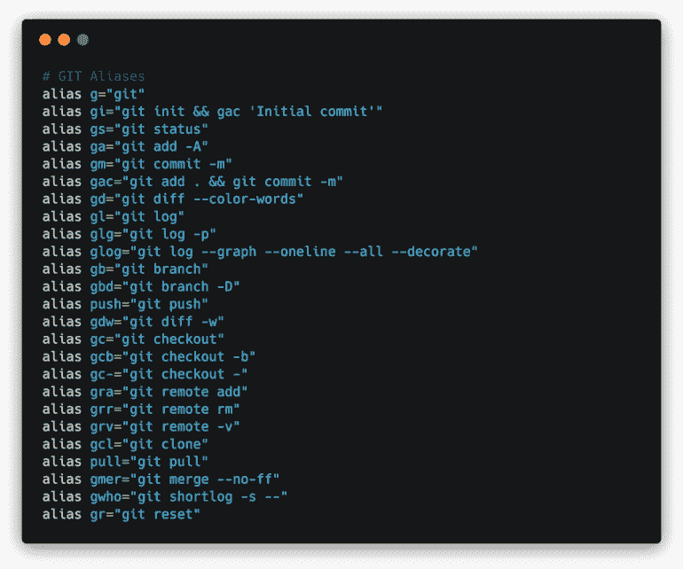

# 我的 Git 别名

> 原文：<https://dev.to/juanfernandes/my-git-aliases-5569>

我通过命令行使用 Git，自从几年前我工作的一家公司引入 Git 以来，我就一直这样使用它。

但是在使用 g it 几天后，我开始不喜欢命令的重复——所以我搜索了一下，发现我可以在 Bash 中创建快捷方式(别名)。

所以我开始为我一天使用几次的命令创建别名，多年来，当我发现其他开发人员有自己的 git 别名时，我就给它们添加了别名。

## 如何创建别名

您可以在. bash_profile 或中创建别名。bashrc，通常在您的用户主目录中。

bash 别名采用以下格式:

```
alias ALIAS_NAME="ALIAS_COMMAND" 
```

Enter fullscreen mode Exit fullscreen mode

以下是我的化名:

[](https://res.cloudinary.com/practicaldev/image/fetch/s---OWpRZ-r--/c_limit%2Cf_auto%2Cfl_progressive%2Cq_auto%2Cw_880/https://www.juanfernandes.uk/assets/imgs/aliases.png)

你可以在这个 [Github gist](https://gist.github.com/juanfernandes/7e13fa0c81253ae46f8d) 上看到列表

## 痛击鱼

对于我的新笔记本电脑(MacBook Pro ),我决定尝试 fish，一个 bash 的替代品，所以用 Fish 创建别名不是以同样的方式完成的——它们被称为 Fish 中的函数。

不是将它们添加到文件中，而是在命令行中创建它们，就像这样:

```
alias x='exit' 
```

Enter fullscreen mode Exit fullscreen mode

然后，使用以下命令保存它:

```
funcsave x 
```

Enter fullscreen mode Exit fullscreen mode

这些函数随后保存在一个文件夹中:~/。config/fish/functions/ -要在基于 web 的界面中查看所有函数，请键入以下命令:

```
fish_config functions 
```

Enter fullscreen mode Exit fullscreen mode

我不会对鱼太深入，因为我还在学习它——也许是未来的帖子。

你觉得这有用吗？你有你自己的一套别名吗-请分享它们。