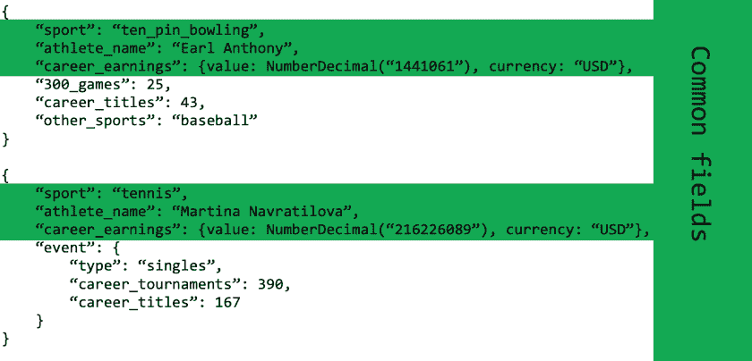
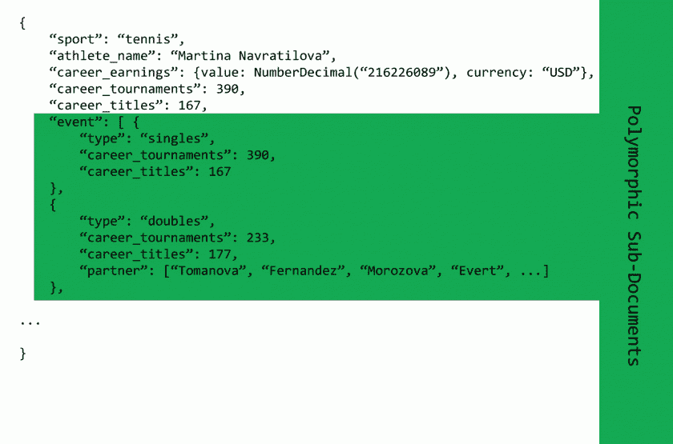

# MongoDB 模式设计模式——多态

> 原文：<https://dev.to/kenwalger/mongodb-schema-design-patterns--polymorphic-4563>

一个关于 MongoDB 的常见问题是“我如何在 MongoDB 中为我的应用程序构建我的模式？”诚实的回答是，视情况而定。你的应用程序读的比写的多吗？从数据库中读取时，哪些数据需要放在一起？有哪些性能上的考虑？文档有多大？它们会变得多大？您预计您的数据将如何增长和扩展？

所有这些问题，以及更多的问题，都会影响到如何在 MongoDB 中设计数据库模式。有人说 MongoDB 是无模式的。事实上，模式设计在 MongoDB 中非常重要。事实是，我们发现的大多数性能问题都可以追溯到糟糕的模式设计。

在这个博客系列的过程中，我们将看看在 MongoDB 中运行良好的 12 种常见模式设计模式。我们希望本系列能够建立一个通用的方法和词汇表，供您在设计模式时使用。利用这些模式允许在模式规划中使用“构建块”,导致比艺术使用更多的方法。

MongoDB 使用一个[文档数据模型](https://docs.mongodb.com/manual/core/data-model-design/)。这种模型本质上是灵活的，允许数据模型支持您的应用程序需求。这种灵活性还会导致模式变得更加复杂。当考虑模式设计时，我们应该考虑性能、可伸缩性和简单性。

让我们从什么可以被认为是所有模式的基础开始探索模式设计，即*多态模式*。当我们的文档相似之处多于不同之处时，就使用这种模式。当我们希望将文档保存在一个集合中时，它也是一个很好的选择。

#### 多态模式

当一个集合中的所有文档具有相似但不完全相同的结构时，我们称之为多态模式。如前所述，当我们想要从单个集合中访问(查询)信息时，多态模式非常有用。基于我们想要运行的查询将文档分组在一起(而不是跨表或集合分离对象)有助于提高性能。

假设我们的应用程序跟踪所有不同运动项目的职业运动员。

我们仍然希望能够在我们的应用程序中访问所有的运动员，但是每个运动员的属性都非常不同。这就是多态模式的闪光点。在下面的例子中，我们将两个不同运动项目的运动员数据存储在同一个集合中。即使文档在相同的集合中，存储的关于每个运动员的数据也不需要相同。

职业运动员记录有一些相似之处，但也有一些不同之处。有了多态模式，我们很容易适应这些差异。如果我们不使用多态模式，我们可能有一个保龄球运动员的集合和一个网球运动员的集合。当我们想要查询所有运动员时，我们需要进行耗时且可能复杂的连接。相反，由于我们使用多态模式，我们所有的数据都存储在一个运动员集合中，对所有运动员的查询可以通过一个简单的查询来完成。

这种设计模式也可以流入嵌入的子文档。在上面的例子中，玛蒂娜·纳芙拉蒂洛娃不仅仅是作为一个单独的选手参赛，所以我们可能要按如下方式来组织她的记录:

从应用程序开发的角度来看，当使用多态模式时，我们将查看文档或子文档中的特定字段，以便能够跟踪差异。例如，我们知道，一名网球运动员可能参与不同的项目，而另一名运动员可能没有参与。这通常需要基于给定文档中的信息在应用程序代码中使用不同的代码路径。或者，可能会编写不同的类或子类来处理网球、保龄球、足球和橄榄球运动员之间的差异。

#### 示例用例

多态模式的一个用例是[单视图应用](https://www.mongodb.com/use-cases/single-view)。想象一下，为一家公司工作，随着时间的推移，这家公司收购了其他公司的技术和数据模式。例如，每个公司都有许多数据库，每个数据库都以不同的方式对“客户的保险”进行建模。然后你买下这些公司，想把所有这些系统整合成一个。将这些不同的系统合并成一个统一的 SQL 模式既昂贵又耗时。

[MetLife](https://www.metlife.com/) 能够利用 MongoDB 和多态模式在几个月内构建他们的单一视图应用程序。他们的单一视图应用程序将来自多个来源的数据聚合到一个中央存储库中，使客户服务、保险代理、计费和其他部门能够全方位了解客户。这使得他们能够以更低的成本为公司提供更好的客户服务。此外，使用 MongoDB 灵活的数据模型和多态模式，开发团队能够快速创新，使他们的产品上线。

单视图应用程序是多态模式的一个用例。它还适用于产品目录之类的东西，其中自行车与鱼竿具有不同的属性。我们的运动员例子可以很容易地扩展成一个更成熟的内容管理系统，并在那里利用多态模式。

#### 结论

当文档的相似之处多于不同之处时，就使用多态模式。这种模式设计的典型用例是:

*   单一视图应用程序
*   内容管理
*   移动应用
*   产品目录

多态模式提供了一种易于实现的设计，允许跨单个集合进行查询，并且是我们将在后续文章中探索的许多设计模式的起点。我们要讨论的下一个模式是属性模式。

如果你有问题，请在下面留下评论。

* * *

*这篇文章最初发表在 [MongoDB 博客](_wp_link_placeholder)上。*

帖子 [MongoDB 模式设计模式——多态](https://www.kenwalger.com/blog/uncategorized/mongodb-schema-design-patterns-polymorphic/)最早出现在肯·w·阿尔杰的[博客上。](https://www.kenwalger.com/blog)