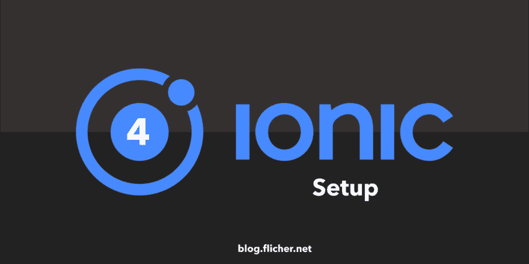
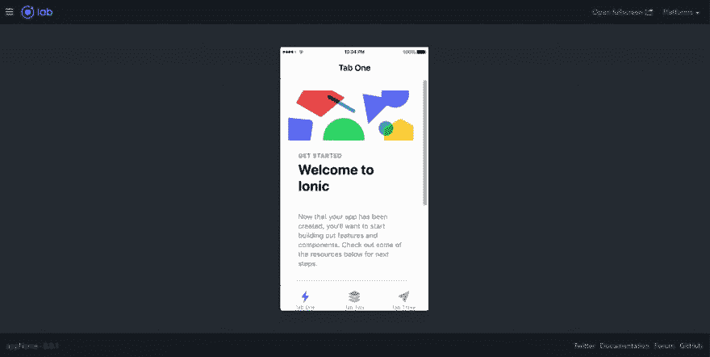
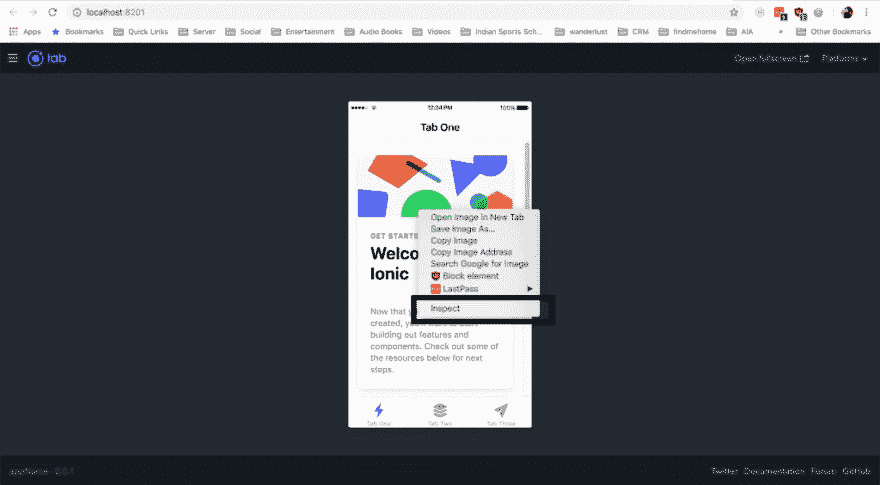
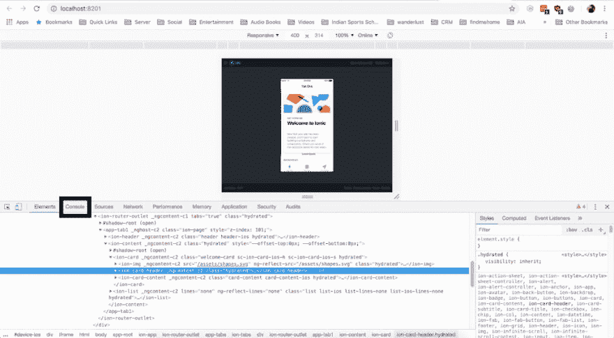
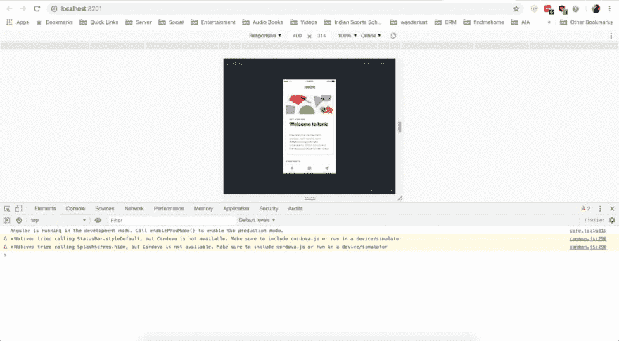
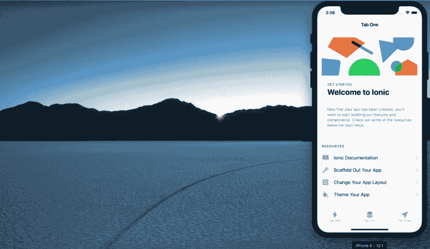
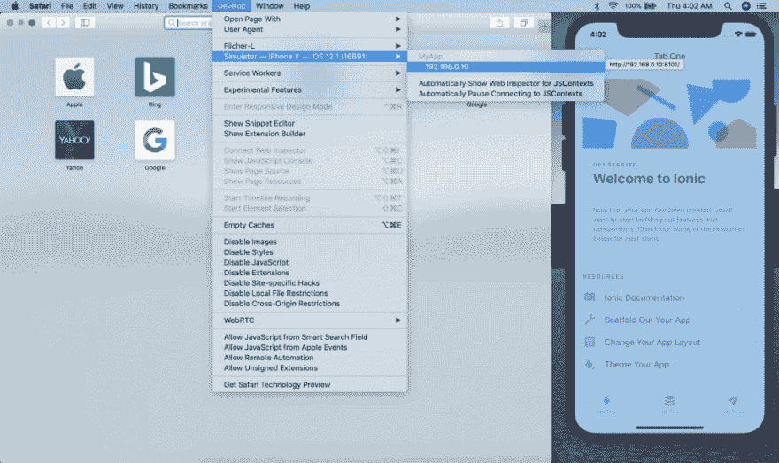
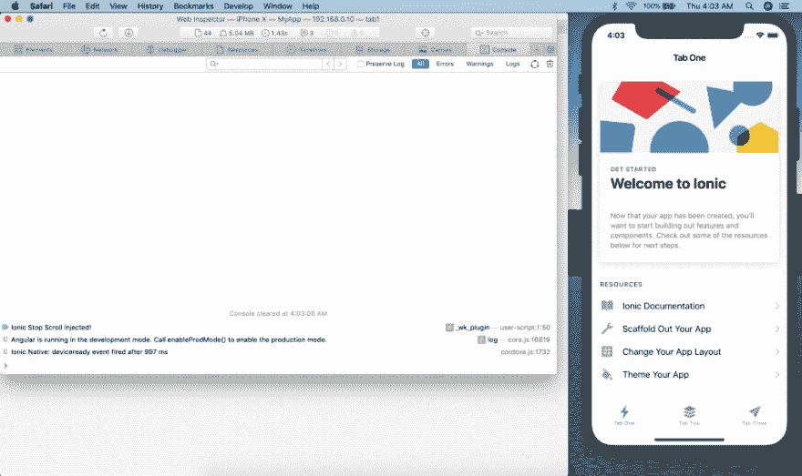

# 在 MAC 上设置 Ionic 4

> 原文：<https://dev.to/flicher/setting-up-ionic-4-on-mac-45jc>

[](https://res.cloudinary.com/practicaldev/image/fetch/s--ziRkW-V3--/c_limit%2Cf_auto%2Cfl_progressive%2Cq_auto%2Cw_880/https://blog.flicher.net/wp-content/uploads/2019/01/ionic-setup-1280x640.png)

### 介绍

爱奥尼亚 4 号终于来了！因此，在本帖中，我们将讨论安装、运行和模拟 Ionic 4 应用程序的最佳方式。我们还将看到如何在构建时测试我们的应用程序。现在这个帖子只针对 Mac 用户。

### 先决条件

确保您的系统上安装了 Node.js 的最新版本。如果没有安装 Node.js，可以从[这里](http://nodejs.org/)安装

我们还需要 Ionic 和 Cordova，所以打开一个终端窗口(Mac)并安装 Cordova 和 Ionic:

```
sudo npm install -g cordova ionic
```

如果您的计算机上已经安装了 Cordova 和 Ionic，请确保更新到最新版本:

```
sudo npm update -g cordova ionic
```

我们还需要一个 IDE 或文本编辑器。我个人用的是 [Visual Studio 代码](https://code.visualstudio.com/)。但是你可以用任何一个。

我们还需要 [Xcode](http://xcode/) 来模拟设备。

### 示例配置

出于演示目的，我们将创建一个简单的应用程序

### 第一步——创建新的离子应用

首先打开终端，进入你想创建应用程序的目录。您可以使用以下命令转到不同的目录。

```
cd Desktop/
```

要创建新的 Ionic 4 应用程序，请将此命令粘贴到您的终端中。当我们创建一个新的 Ionic 4 应用程序时，我们可以使用 3 种基本布局。

*   空白的
*   幻灯片菜单
*   制表符

在本教程中，我们将使用标签。

```
ionic start appName tabs --type=angular
```

安装“NPM”模块和依赖项后，您会看到这个问题，只需键入“n ”,因为我们还没有使用它。

```
Install the free Ionic Appflow SDK and connect your app? (Y/n) : N
```

接下来，转到新创建的应用程序文件夹。

```
cd appName/
```

### 第二步—运行应用程序

现在，我们可以使用以下命令在浏览器中运行应用程序。

```
ionic serve -l
```

你会看到这个问题，只需键入' y '并按回车键。

```
Install @ionic/lab? (Y/n) : Y
```

<figure>[](https://res.cloudinary.com/practicaldev/image/fetch/s--8x2JALAa--/c_limit%2Cf_auto%2Cfl_progressive%2Cq_auto%2Cw_880/https://blog.flicher.net/wp-content/uploads/2019/01/ionic-serve-1024x514.png) 

<figcaption>之后，一个新的窗口会在你的默认浏览器中打开，看起来像这样
</figcaption>

</figure>

现在，我们已经成功地创建了一个 Ionic 4 应用程序，我们甚至通过在网络浏览器上运行它来测试它。完美！！！

就这样吗？

也许我们还需要做一件事，现在，如果您打开此页面的 Inspect 元素，右键单击应用程序，然后单击 Inspect

[](https://res.cloudinary.com/practicaldev/image/fetch/s--e2TOBq22--/c_limit%2Cf_auto%2Cfl_progressive%2Cq_auto%2Cw_880/https://blog.flicher.net/wp-content/uploads/2019/01/inspect-element-1-1024x564.png)

单击 Inspect 后，您将看到一个新窗口，现在我希望您单击 Console。

[](https://res.cloudinary.com/practicaldev/image/fetch/s--jmPHgD5A--/c_limit%2Cf_auto%2Cfl_progressive%2Cq_auto%2Cw_880/https://blog.flicher.net/wp-content/uploads/2019/01/inspect-1024x564.png)

您将看到类似下图的内容。这些错误到底是什么？

[](https://res.cloudinary.com/practicaldev/image/fetch/s--gNRsPBTu--/c_limit%2Cf_auto%2Cfl_progressive%2Cq_auto%2Cw_880/https://blog.flicher.net/wp-content/uploads/2019/01/console-1024x564.png)

所以基本上 StatusBar 是一个本地 Cordova 插件，因为我们在网络浏览器上运行我们的应用程序，所以本地 Cordova 插件不会像相机、推送通知等一样工作。

现在可以用 [Ionic DevApp](https://ionicframework.com/docs/appflow/devapp/) 了。你可以把它安装在你的 iOS 或 Android 设备上，然后在那里运行应用程序。本地的科尔多瓦插件在那里会工作得很好。

但是在开发应用的时候。我们需要查看控制台来查看所有错误。但是如果我们用的是 [Ionic DevApp](https://ionicframework.com/docs/appflow/devapp/) ，就看不到控制台了。

那么解决办法是什么呢？

因此，我们需要在实际的 iPhone 中运行这个应用程序，并使用 Safari Web Inspector 来查看控制台。那么如果我们没有物理设备呢？那也可以。我们可以为 iPhone 运行一个模拟器，它将像物理设备一样工作。

### 第三步—启用科尔多瓦

运行以下命令获取所有的科尔多瓦文件。

```
ionic integrations enable cordova
```

该命令将创建一些新文件。之后，我们需要更改 **config.xml** 文件中的包 id。您必须更改**微件标签**的 **id** 属性才能更改您的应用 id。

例如:

因此，对于我的项目，我将把 **io.ionic.starter** 改为 **net.flicher**

```
<widget id=”io.ionic.starter” version=”0.0.1″ xmlns=”http://www.w3.org/ns/widgets” xmlns:cdv=”http://cordova.apache.org/ns/1.0″>
```

```
<widget id=”net.flicher” version=”0.0.1″ xmlns=”http://www.w3.org/ns/widgets” xmlns:cdv=”http://cordova.apache.org/ns/1.0″>
```

### 第四步—在模拟器上运行应用程序

如 [Ionic 文档](https://ionicframework.com/docs/installation/ios)所述，要运行模拟器，运行以下命令。

科尔多瓦对 Xcode 10 的支持仍在进行中。所以他们推荐用 XCode 9。所以你可以安装 XCode 9 或者使用下面的命令让它和 XCode 10 一起工作。详见[本期](https://github.com/apache/cordova-ios/issues/407)。

```
ionic cordova emulate ios -lc -- --buildFlag="-UseModernBuildSystem=0"

```

让我们了解一下这个命令中使用的标志

> **-l:**Live Reload
> **-c:**终端出现控制台错误
> `**--**`**`**--**`**build flag = "-UseModernBuildSystem = 0 ":**使用 XCode 旧构建系统**

 **运行此命令后，模拟器将打开，应用程序将安装在上面。它看起来会像这样。

[](https://res.cloudinary.com/practicaldev/image/fetch/s--aZkLsShr--/c_limit%2Cf_auto%2Cfl_progressive%2Cq_auto%2Cw_880/https://blog.flicher.net/wp-content/uploads/2019/01/simulator-1024x594.png)

### 第五步—打开 Safari Web 检查器

Safari 支持 iOS 模拟器和设备的 Web Inspector。打开开发菜单，选择模拟器或设备，然后选择 Ionic 应用程序打开 Web Inspector。

> 如果**开发**菜单隐藏，在 **Safari** **首选项** **高级** **菜单栏**显示开发菜单中启用。

[](https://res.cloudinary.com/practicaldev/image/fetch/s--BjOQOvm5--/c_limit%2Cf_auto%2Cfl_progressive%2Cq_auto%2Cw_880/https://blog.flicher.net/wp-content/uploads/2019/01/simulator-develop-1024x609.png)

在你点击模拟器之后，一个新的窗口将会打开，看起来像这样。

[](https://res.cloudinary.com/practicaldev/image/fetch/s--7ZeJ72kN--/c_limit%2Cf_auto%2Cfl_progressive%2Cq_auto%2Cw_880/https://blog.flicher.net/wp-content/uploads/2019/01/simulator-open-develop-1024x609.png)

您可以通过在 Web 检查器上按下 Command (⌘)-R)来刷新应用程序一次，以查看控制台日志。因为启用了实时重新加载，所以如果您对项目进行修改。Ionic 应用程序会自动重新加载，当你保存文件时，你会看到你在模拟器中所做的更改。

### 结论

祝贺你，你已经成功地创建了你的第一个 Ionic 4 应用程序，并在模拟器上运行。

下一步是什么？

前往 [Ionic 文档](https://ionicframework.com/docs/)并向您的应用添加新功能。

玩得开心！

[在 Twitter 上关注我](https://twitter.com/_varunverma)

[在 Instagram 上关注我](https://www.instagram.com/_varunverma/)

[我的博客浏览器](https://blog.flicher.net/)**