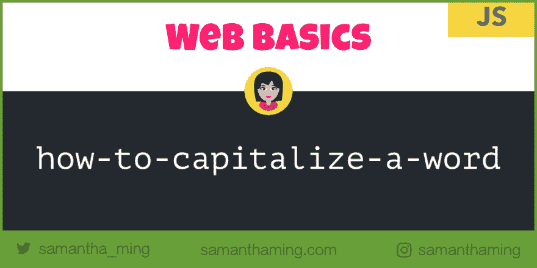

# 网络基础:如何在 JavaScript 中大写一个单词

> 原文：<https://dev.to/samanthaming/web-basics-how-to-capitalize-a-word-in-javascript-44p8>

[](https://res.cloudinary.com/practicaldev/image/fetch/s--9Dj5ZGS7--/c_limit%2Cf_auto%2Cfl_progressive%2Cq_auto%2Cw_880/https://thepracticaldev.s3.amazonaws.com/i/aoshe23g3fkeucscmu3s.png)

回到另一轮网络基础知识。在上一篇文章中，我们学习了如何在 Javascript 中反转一个字符串。顺便说一下，对于我的社区的新成员。《网络基础》是一个关于基本编程主题的系列，每个网络开发者都应该知道！你可以在我的 [Instagram](https://www.instagram.com/samanthaming/) 上看到网络基础知识的帖子。好了，介绍完毕，让我们开始上课吧🤓

下面是我将要介绍的三种方法:

*   `toUpperCase()`
*   `slice()`
*   `charAt()`
*   `toLowerCase()`

最后，你将能够应用你所学的知识，解决这个基本的算法挑战:

```
/** Capitalize a Word
 *
 * Implement a function that takes a word and
 *  return the same word with the first letter capitalized
 *
 * capitalize('aWESOME')
 * Output: 'Awesome'
 * 
 */ 
```

准备好了吗？太好了，我们开始吧！💪

## 网络基础知识:`toUpperCase()`

此方法用于将字符串中的所有字母转换为大写。它不会改变原来的字符串。相反，它将返回一个新的修改过的字符串🔅

```
const name = 'samantha';
const result = name.toUpperCase();

console.log(result); 
// 'SAMANTHA' 
```

### 网络基础知识举例:`toUpperCase()`

**例 1:**

让我们来看看这个方法的一些用例。如你所见，它不影响原始字符串。如果你有一个包含数字的字符串，没有大写字母，所以这不会改变。

```
const text = 'Web Basics 101';
const upper = text.toUpperCase();

text; // 'Web Basics 101'
upper; // 'WEB BASICS 101' 
```

**例 2:**

有一点要注意。此方法仅适用于字符串。如果你尝试传入其他数据类型(比如`null`、`undefined`或者`number`，它会抛出一个错误。你会得到一个`TypeError`。所以一定要在传入这个函数之前检查类型，否则，你的应用会崩溃。

```
(null).toUpperCase(); // TypeError
(undefined).toUpperCase(); // TypeError
(['hi']).toUpperCase(); // TypeError
(45).toUpperCase(); // TypeError 
```

## 网络基础知识:`charAt()`

此方法返回字符串中指定索引处的字符。

```
const name = 'samantha';
const result = name.charAt(0);

console.log(result);
// 's' 
```

### 网络基础知识举例:`charAt()`

**例 1:**

默认值为 0。这意味着它返回第一个字母。记住，JavaScript 中数组是 0 索引的。所以第一个字母从索引 0 开始。

```
const text = 'Web Basics';

text.charAt(); // default is 0
// 'W'

text.charAt(text.length - 1); // get the last letter
// 's'

text.charAt(1000); // out of range index
// '' 
```

**例 2:**

如果你是一个自作聪明的人，想要传递一个不是数字的东西，会发生什么😝如果你尝试这样做，默认的将会接管，你将会得到第一个字母。

```
// Everything else will be the default (0) 

'hi'.charAt(undefined); // 'h'
'hi'.charAt(null); // 'h'
'hi'.charAt(false); // 'h'
'hi'.charAt('W'); // 'h' 
```

### `charAt()`和`[]`符号的区别

如果您有更多的 JavaScript 经验，您可能会看到其他人使用括号符号来访问字符串。

```
const name = 'Samantha';

name.charAt(2); // 'm'
name[2]; // 'm' 
```

他们给你的结果是一样的，所以有什么区别。嗯，这一切都归结于浏览器支持。在第一个 ECMAScript 1 中引入，所以它被所有浏览器支持🤩。而括号符号是在 ECMAScript 5 中引入的。所以括号标注法在 Internet Explorer 7 及以下版本中不起作用。有一点一定要记住，尤其是当您处理需要旧版本浏览器支持的客户端项目时。

## 网络基础知识:`slice()`

此方法提取字符串的一部分，并将提取的部分作为新字符串返回🍏再提醒一下，JavaScript 是 0 索引的。所以第一个字符的位置是 0，第二个字符的位置是 1👍

这个方法接受两个参数:开始和结束

**start** 这是您传入要提取的起始索引的地方。如果没有传入任何内容，默认为 0(或第一个字符)。

**end** 这是您传递索引的地方，在此之前结束提取。注意，该索引处的字符将不包括在内。如果没有传入任何东西，`slice()`会选择从起点到终点的所有字符。

```
const name = 'samantha';
const sliced = name.slice(0,3);

console.log(sliced); // 'sam'
console.log(name); // 'samantha' 
```

### 网络基础知识举例:`slice()`

**例 1:**

`slice()`是克隆或复制字符串的好方法。您可以传入 0，也可以让缺省值不带参数地生效。如果想要最后一个字母，只需传递-1 即可。

```
'Web Basics'.slice(0); // clone the string
// 'Web Basics'

'Web Basics'.slice(); // default is 0
// 'Web Basics'

'Web Basics'.slice(-1); // get the last letter
// 's' 
```

**例 2:**

您可以使用正数或负数来处理起始值和结束值，以提取您想要的字符串部分。

```
'Web Basics'.slice(4, 7); // 'Bas'
'Web Basics'.slice(-6, -3); // 'Bas'
'Web Basics'.slice(4, -3); // 'Bas' 
```

**例 3:超出起始指数范围**

如果您传递的起始值大于长度，将返回一个空字符串。相反，如果您传入一个超过长度的负起始值，它将简单地返回整个字符串。

```
'Web Basics'.slice(1000); // ''
'Web Basics'.slice(-1000); // 'Web Basics' 
```

## 网络基础知识:`toLowerCase()`

此方法用于将字符串中的所有字母转换为小写。它不会改变原来的字符串。相反，它将返回一个新的修改过的字符串。本质上与`toUpperCase()`相反。

```
const name = 'SaMaNthA';
const result = name.toLowerCase();

console.log(result); 
// 'samantha' 
```

### 网络基础知识举例:`toLowerCase()`

**Ex 1:**

```
const original = 'WeB BasIcS 102';
const lower = original.toLowerCase();

console.log(original); // 'WeB BasIcS 102'
console.log(lower); // 'web basics 102' 
```

**例 2:**

就像`toUpperCase()`一样，这个方法只适用于字符串。如果你尝试传入其他数据类型(比如`null`、`undefined`或者`number`，它会抛出一个错误。你会得到一个`TypeError`。所以一定要在传入这个函数之前检查类型，否则，你的应用会崩溃。

```
(null).toLowerCase(); // TypeError
(undefined).toLowerCase(); // TypeError
(['hey']).toLowerCase(); // TypeError
(75).toLowerCase(); // TypeError 
```

## 算法挑战

好了，现在让我们把所有的东西拼凑起来！这是你的算法挑战！你应该可以用我们一起经历过的内置函数来解决它💪

```
/** Capitalize a Word
 *
 * Implement a function that takes a word and
 *  return the same word with the first letter capitalized
 *
 * capitalize('hello')
 * Output: 'Hello'
 *
 * capitalize('GREAT')
 * Output: 'Great'
 *
 * capitalize('aWESOME')
 * Output: 'Awesome'
 *
 */ 
```

你是怎么做的，你设法解决它了吗？我不打算把解决方案放在这篇博文里。但是我会提供我的解决方案的链接，您可以用它来与我的进行比较。请记住，有多种方法可以解决这个挑战。没有正确的方法或错误的方法。这就是编程的伟大之处，你可以用多种方法达到同样的结果。当然，有些方式比其他方式更有表现力。但是你知道吗，作为代码新手，让我们只关注能够解决它。这是第一步。随着你获得更多的自信和学习更多的解决问题的方法，你总是可以重构的。

[我的解决方案](https://github.com/samanthaming/web-basics-challenge/blob/master/2-capitalize-word.js)

## 资源

*   [MDN 网络文档:toUpperCase](https://developer.mozilla.org/en-US/docs/Web/JavaScript/Reference/Global_Objects/String/toUpperCase)
*   w3schools: toUpperCase
*   [MDN 网络文档:字符](https://developer.mozilla.org/en-US/docs/Web/JavaScript/Reference/Global_Objects/String/charAt)
*   w3schools: charAt
*   [MDN Web 文档:切片](https://developer.mozilla.org/en-US/docs/Web/JavaScript/Reference/Global_Objects/String/slice)
*   [w3schools: slice](https://www.w3schools.com/jsref/jsref_slice_string.asp)
*   [MDN 网络文档:toLowerCase](https://developer.mozilla.org/en-US/docs/Web/JavaScript/Reference/Global_Objects/String/toLowerCase)
*   [w3schools: toLowerCase](https://www.w3schools.com/jsref/jsref_tolowercase.asp)
*   [堆栈溢出:string.charAt(x)或 string[x]](https://stackoverflow.com/questions/5943726/string-charatx-or-stringx)

* * *

**感谢阅读❤**
问好！[insta gram](https://www.instagram.com/samanthaming/)|[Twitter](https://twitter.com/samantha_ming)|[脸书](https://www.facebook.com/hisamanthaming) | [媒体](https://medium.com/@samanthaming) | [博客](https://www.samanthaming.com/blog)