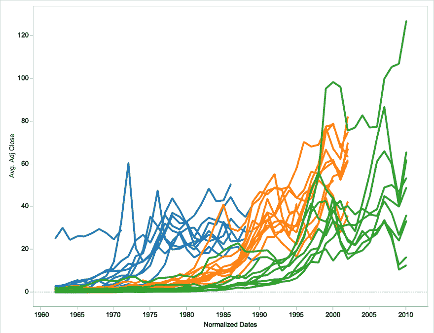

# 表格:时间序列对齐的正常化日期

> 原文：<https://dev.to/sneha27j/tableau-normalising-dates-for-time-series-alignment--4l2e>

这是一种尽可能定期记录学习成果的尝试。

今天，我想讨论标准化日期，以对齐您的时间序列图。

今天的例子是从 20 世纪 60 年代至今的公司列表，以及它们调整后的收盘价。

**默认视图**

[现在，如果您想创建一个图表，将所有公司的开始日期对齐到同一日期，步骤如下。](https://res.cloudinary.com/practicaldev/image/fetch/s--6hM-sGtq--/c_limit%2Cf_auto%2Cfl_progressive%2Cq_auto%2Cw_880/http://thepracticaldev.s3.amazonaws.com/i/d6b9j8xfgdwu8pw8tf1d.png)

**标准化视图**

 
a .找到闵。使用 LOD 的每个公司的日期。
***公式***:{固定【公司】:min(日期-年份)}
b .求最小值。使用 LOD 的整个数据集的日期。
***公式***:{ min(Date-Year)}
c .求年份 b/w 步骤 a .和 b 的差
姑且称这个为 *Diff。年*
d .使用 Diff。从步骤 c 到调整公司日期的年数。
***公式*** :【日期-年份】-差异。年份
让我们称之为*正常化日期*
e .将正常化日期拖到列中，将调整后的收盘价拖到行中，将公司拖到明细栏中。

一定要让我知道你的想法/问题/建议。我很乐意听听他们的意见。