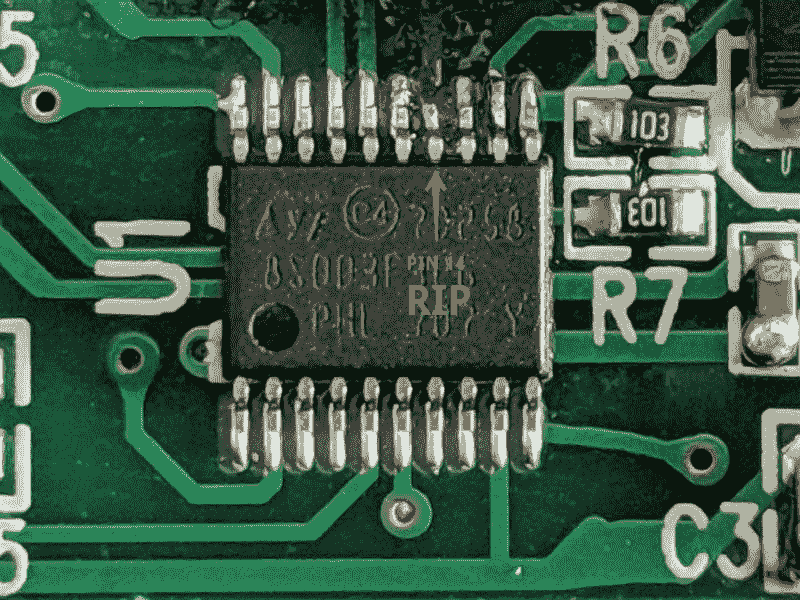
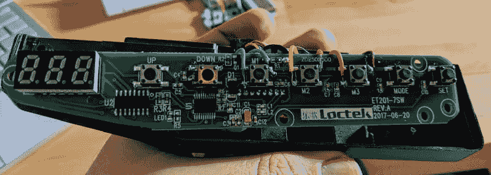
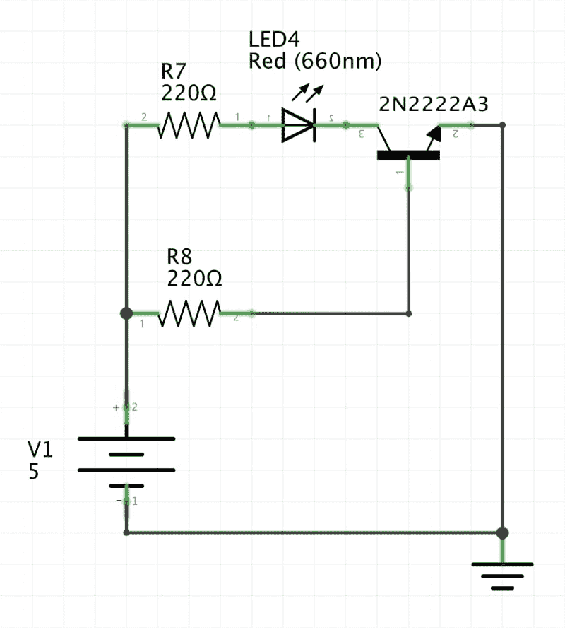
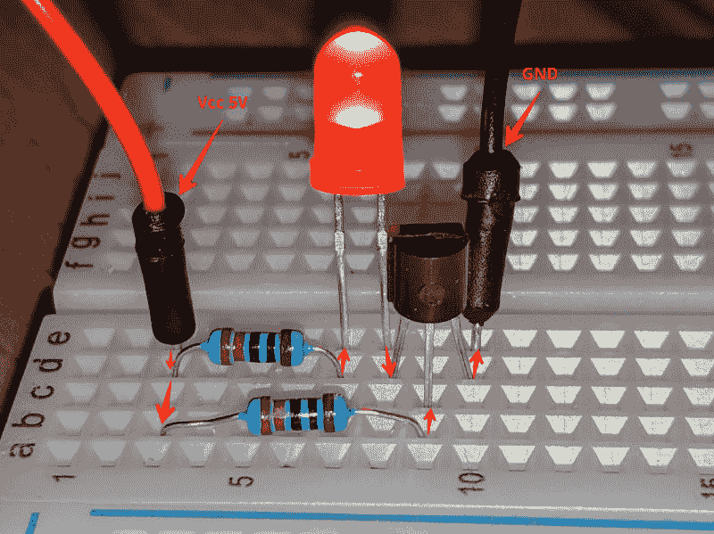
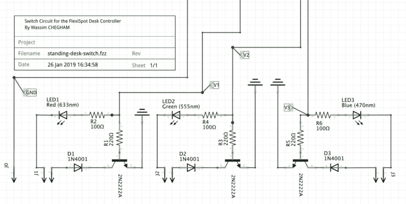
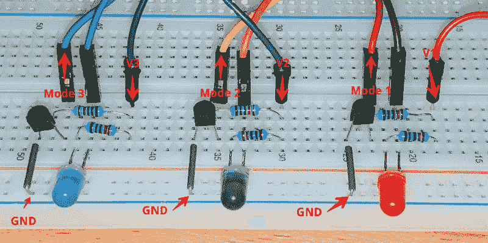

# 嘿谷歌，把我的桌子设置成站立模式！

> 原文：<https://dev.to/wassimchegham/hey-google-set-my-desk-to-standingmode-ai6>

你好，如果你一直在关注我最近的推文，你就会知道我有多喜欢我的新立式办公桌:[flexi spot 的 E2B](https://amzn.to/2UmHpyI)！因此，在一个深夜，我的创造力过剩，我想出了一个有趣的主意:如果我可以使用谷歌助手来控制我的桌面设置会怎么样？

> Wassim cheg ham@ manekinekko晚间项目:逆向工程我的站立式桌面控制器并将其连接到我的谷歌助手🤫21:21PM-2019 年 1 月 23 日

所以我决定建立一个概念证明，5 个小时后...

液体错误:内部

让我向你介绍一下这个过程...

# 免责声明

开始之前，有几件事需要注意:

1.  此处提供的所有信息都是基于“原样”和“可用”的基础上提供的，您同意使用此类信息时完全自担风险。在任何情况下，我都不会以任何方式对您使用此处提供的信息和材料所导致的任何损害、损失、费用、成本或债务负责。
2.  我不是专业的电子工程师，但我确实有一些知识——来自大学——足以把这个概念的证明放在一起。然而，如果你知道一个更好的替代电路，请告诉我。我将非常乐意升级我的设置！

# 高层计划

我们对该项目的计划如下:

1.  逆向工程桌面控制器，了解系统如何工作。
2.  想办法不用桌面控制器手动触发控制信号。
3.  想办法通过编程触发控制信号。
4.  将谷歌助手接入系统。

* * *

# #1 了解桌面控制器的工作原理

显然，如果你需要了解一个设备是如何工作的，首先要做的就是打开它(**这将使保修无效**)。此外，确保你有一个备用设备(或零件)以防事情出错(它为我做了，阅读下一部分了解更多细节！).因此，谢天谢地，我已经预料到了这种情况，并买了一个备用控制器。我要感谢 FlexiSpot 的人们，他们很好地给了我一个折扣代码！

*顺便说一下，如果您想购买 E2 立式办公桌，您可以使用代码“rffr1”获得 20 欧元的折扣(仅在 [Fexispot 网站](https://flexispot.com/)上有效，直到 2019 年 2 月底)！*

我们来看看桌面控制器的外部是这样的:
打开后，内部的 [PCB](https://en.wikipedia.org/wiki/Printed_circuit_board) 板显示如下设计:

1

以下是该 PCB 中所示每个元件的基本说明:

1.  上下按钮可让您将书桌从 70 厘米升至 120 厘米(42.1 英寸至 63 英寸)；
2.  设置模式按钮允许记忆某个高度，并将其存储到 M1、M2 或 M3 插槽中(三个可编程预设)；
3.  自动跟踪按钮用于设置坐/站计时系统，并在该站的时候提醒您；
4.  TM1650 是一个 LED 微控制器，负责左侧的 8 段显示([参见完整规格](https://os.mbed.com/components/TM1637-LED-controller-32-LEDs-max-Keyboa/))；
5.  STM8S (STM8S103F2)是主微控制器，是整个系统的大脑([参见这里的数据表](https://www.st.com/resource/en/datasheet/stm8s103f2.pdf))。

现在我们需要弄清楚使用哪些命令来手动控制桌子，而不是真正使用(可以吗？)书桌控制器！

让乐趣开始吧！

* * *

## 尝试#1:逆向工程 STM8S 微控制器(TL；大卫:不要——不要——不要——不要！！)

我的第一个尝试是尝试对 STM8S 微控制器进行逆向工程，以便获得指示电机改变位置的所需信号，然后我会建模并向电机发送这些确切的信号，就好像它们来自 STM8S 本身一样。嗯，那是我的计划！

然而，当我尝试这个过程时，我设法损坏了微控制器的引脚 14，它的作用是降低桌子(向下按钮)。诚然，即使我设法从微控制器获得所有信号，我也不能再降低桌子了——除非更换 STM8S 微控制器单元，如果我有一个备用的，我会这样做的！

所以，我不得不另想办法。实际上，有一种更简单的方法来做我正在寻找的事情。

* * *

## 尝试二:黑 M1、M2、M3 按钮……？咄！

原来有一种更简单的方法可以让我在不接触(或燃烧)的情况下向马达发送信号！)的 STM8S 微控制器。我只需要黑进 M1，M2 和 M3 的按钮！这些模式作为预设工作，存储桌子的特定高度，当被触发时，它们指示桌子从任何位置移动到该精确高度。

这种简单的方法变得更加通用，可以应用于任何有按钮输入的电子设备。

现在，我为下一步做好了准备:找出一种模拟按钮的方法，让微控制器认为 M1、M2 或 M3 按钮中的一个被按下了。

为此，我必须建立一个电子开关电路。

* * *

# #2。手动触发控制信号

在我们自动化所有的事情之前，让我们首先尝试并手动测试我们的方法。为此，我建立了一个简单的电路，这是一个“NPN 晶体管开关电路”。这种基于晶体管的开关电路是低压 DC 设备的理想选择，这正是我们正在努力做的:记住，我们正在尝试模拟一个需要几毫安才能触发的按钮！

## NPN 晶体管作为开关电路- 101

简单来说，晶体管开关的工作区域被称为*饱和区*和*截止区*。这意味着我们将通过在晶体管的“完全截止”(截止)和“完全导通”(饱和)区域之间来回驱动晶体管来将它用作开关。这里是一个典型双极晶体管工作区域的*非常简化的*图示:

说到这里，我们现在来看看一个典型的“NPN 晶体管作为开关”电路:

在本电路中，我们使用 LED 作为负载来演示开关过程。这是这样一个电路的“实现”:

很简单吧？我们的电路似乎像预期的那样工作。

现在让我们继续，将桌面控制器连接到这个电路中:

在上图中，J1、J2 和 3 是跳线，分别连接到我们焊接到桌面控制器的电线，即模式 1、模式 2 和模式 3。J0 是地，它也将连接到桌面控制器。
这是试验板上的实际电路:

注意，V1、V2 和 V3(以及不在此图中的 GND)线暂时保持松弛。

* * *

# #3。自动触发推送信号

为了自动触发欺骗 STM8S 微控制器的“按钮”信号，我们需要一个可编程的微控制器。为此，你可以使用任何你有的板(Arduino，Nanode，Teensy 等…)，甚至是一个树莓派；任何带 GPIOs 的东西。

我最初使用 Arduino MEGA 2560 板来试验代码，但后来我意识到我没有 Wifi 屏蔽(这是该项目的下一部分所需要的)。作为参考，以下是 Arduino 代码: