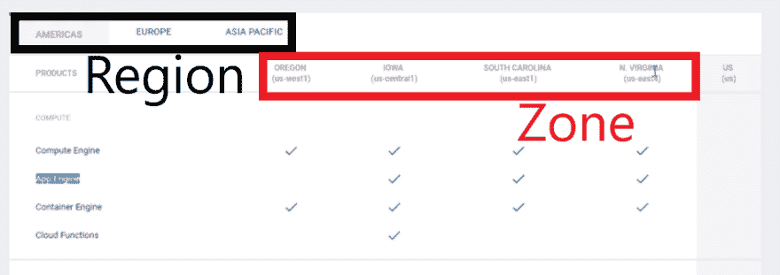
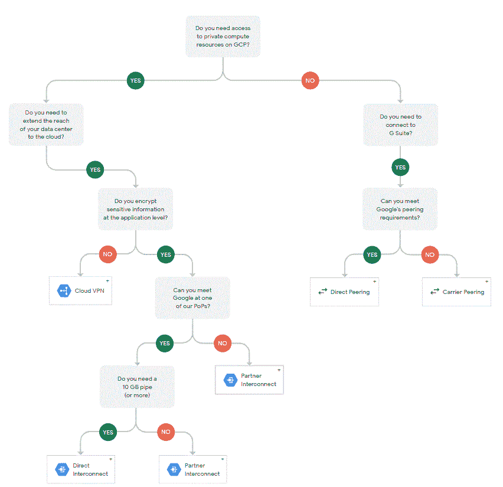
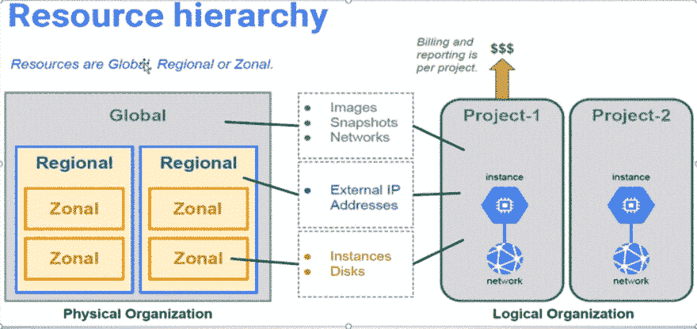

# 研究 GCP 时记了很多笔记

> 原文：<https://dev.to/philiplavoie/a-ton-of-notes-while-studying-gcp-3e9h>

你好，世界...

*所以这只是一个免责声明...这些都不会真正让你为 GCP 注册建筑师考试做好准备...这真的只是一些体面的“基地”信息。我只是通过了，但是不管你需要知道多少，或者不知道多少，所有这些东西，所有我读过的，看过的，或者接受过培训的东西，都不足以让我为考试做好准备。*

简单地说，你基本上需要知道所有这些，甚至更多...他们可能永远不会直接问你任何问题...或者他们可能会深入研究 gsutil 或 kubectl 的确切命令行语法。

我还发现谷歌和其他实践考试甚至各种文档中包含了如此多相互矛盾的信息，以至于很难确切知道真相是什么。一切都很模糊。所以请对这一切持保留态度。但最重要的是，知道如何从你所学的一切中构建场景，并预测未来

许多内容正在进行中，所以在我点击发布时可能已经过时了。见鬼，我学的一些材料在我拿到的时候已经过时了。祝你好运！

就这样...我将收集一船我在准备 GCP 考试时学到的趣闻:

## 控制台关注的 3 个推荐区域:

*   IAM(联盟、配额、角色)
*   计算:
    *   应用引擎
    *   计算引擎
    *   集装箱发动机
    *   云函数
    *   网络(VPC、VPN、云 DNS、路由、防火墙)
*   储存；储备
    *   大表- NoSQL (HBase)
    *   水桶！
    *   SQL 和扳手

## 出现问题的其他领域(不重，但知道是什么以及如何组合在一起):

*   部署经理。
*   容器注册。
*   端点。

## 区域和分区:

*   包含区域的独立于区域的地理区域。
*   区域-您的资源在一个区域内的部署区域。
*   需要防止整个地区或区域的损失。
*   多区域、区域和地区将是细分。
*   并非每种产品都能在美洲、欧洲和亚洲买到。
*   资源分为地区、区域和多区域。

## IAM 配额:

*   无限制或有配额的资源。
*   知道如何找到并解决这些问题。
*   项目将会有配额。
    *   资源配额限制了创建的资源数量。
    *   有些资源有全球和区域配额。
    *   大多数可以根据要求增加。
    *   API 请求配额限制费率和每日交易量。
    *   自由配额允许在最大限度内自由使用。
    *   示例 5GB 云存储和 50，000 次实体读取。

## GCP 的等级制度:

*   Orgs 本质上是 TLD。
    *   可以使用 G-Suite 或云身份。
    *   链接您的组织域。
    *   可以在组织或项目级别设置访问和配置。
    *   当员工离开公司时，计费帐户、项目和资源不会被删除。
    *   如果不使用 G-Suite，这个组织可能对你没有好处。
*   文件夹——在使用 cloud IAM 时引入(相当于 AWS 目录服务)。
    *   以您选择的粒度将策略分配给资源。
    *   文件夹中的资源可以共享 IAM 策略。
    *   组织以下和项目以上分类。
*   项目——相当于主要的交互点。
    *   资源放在这里进行跟踪
    *   计费和会计通常也是如此。
    *   管理权限和凭据。
    *   启用服务和 API。
    *   主要目标是提供一个沙箱。
    *   您提供项目名称
    *   项目 ID - GCP 提供，通常是 AppID。
    *   GCP 提供了项目编号。
    *   一个网络只能属于一个项目。
    *   每个项目的默认限制为 24 个 CPU。
    *   API 特定于给定项目中的资源。
    *   他们有配额。
    *   项目名称必须在 4 到 30 个字符之间。
    *   一个项目最多可以有 5 个 VPC 网络。
*   资源。

## 计算选项(经过严格测试)

### 计算引擎:这些虚拟机专注于您的企业 IaaS(可以是 linux 或 windows server)

*   垂直运动模拟器（vertical-motion simulator 的缩写）
*   IaaS
*   模板或自定义
*   云启动器(市场)
*   cpu 和内存。
*   建立工作关系网
*   操作系统(林/温)
*   TCP/UDP/IMCP
*   注意:仅支持 IPv4
*   每个虚拟机实例都属于一个网络。
*   存储:
    *   标准(区域持续)
    *   固态硬盘(分区持久)
    *   本地 SSD
    *   可以在不停机的情况下调整大小或迁移。
*   如果在同一个网络中，他们可以在本地局域网上进行通信。
*   如果想要连接到互联网，我们需要提供外部 IP。
*   全球、区域和地区资源
    *   全局资源包括预配置的磁盘映像、磁盘快照和网络。
    *   区域资源包括静态外部 IP 地址。
    *   区域资源包括虚拟机实例及其类型和磁盘。
*   计算引擎虚拟机附带一个根永久磁盘
*   在引导过程中，映像被加载到根磁盘上。
    *   可引导-您可以连接到虚拟机并从其引导。
    *   快照-增量备份。
    *   持久——可以在虚拟机终止后继续存在
    *   GCE 安装了一些软件并配置了操作系统
*   每个永久磁盘的大小可达 64TB。
*   每个实例只能附加有限的总持久磁盘空间和有限数量的持久磁盘。
*   单个文件系统可在永久磁盘上提供最佳性能。
*   本地固态硬盘=高 IOPS 和低延迟。
*   你真的不需要知道速度...但是要知道用例...如果你用的是本地 SSD，知道为什么吗...持久磁盘，了解区域和地域。等等。
*   迁移虚拟机:
    *   手动和自动
    *   不要在带有本地 SSD 的虚拟机上使用
    *   本地 SSD 数据无法备份，将被丢弃。
    *   永久磁盘只能连接到您要移动的虚拟机(不支持多个)
    *   复制期间复制的所有资源必须有足够的配额，否则该过程将失败。
*   快照:
    *   快照不可用于本地 SSD
    *   创建 GCS 的增量备份
    *   快照可以恢复到新的永久磁盘
    *   不要将用于跨区域的数据库迁移
    *   不能跨项目共享。
*   虚拟机访问- CLI linux -需要固件规则端口 22
    *   SSH(从控制台、CloudShell SDK 或计算机。
    *   `gcloud compute ssh (instance name)`
*   虚拟机访问- windows RDP -需要固件规则端口 3389。
    *   powershell 所有权
    *   `gcloud compute ssh (instance name)`
*   虚拟机的自动重启。-发生硬件故障或系统事件后，虚拟机应该做什么。如果被标记，它将尝试启动一个替换虚拟机。如果由于用户事件(关机或终止)而终止，自动重启不会自动重启虚拟机
    *   注意:如果虚拟机可用性策略设置为默认的实时迁移，在常规系统维护期间，您的虚拟机将被迁移到 diff 硬件，因此没有停机时间。
*   创建虚拟机-要考虑的项目:
    *   每个区域支持多代处理器的组合。
    *   在区域中创建实例时，您的实例将使用该区域中支持的默认处理器。有的支持 GPU，有的支持 TPU 等。
        *   例句:美国中部的爱荷华州将会有桑迪大桥。
*   实例组:
    *   使用实例模板创建或更新属于该组的实例。
    *   创建一次模板，并在多个组和配置中重复使用。
    *   模板是全局的，没有绑定到区域或地区。
    *   您可以在模板 tho 中指定一个区域资源，这将对其进行限制。
    *   默认情况下，该组中的实例将被放置在默认和中，并随机分配区域范围中的 IP。
    *   三种类型:管理区域、管理区域和非管理区域
        *   非托管:可以任意添加/删除的不同实例。这些不提供自动缩放、滚动更新，也不使用实例模板。仅当您有不同类型的实例或者需要对现有配置进行负载平衡时，才使用这些方法。将支持 Linux 变种和 Win 版本
        *   建议使用管理组。
*   将虚拟机的*迁移到 GCP 的*:
    *   导入虚拟磁盘-使用导入工具。它支持大多数格式 VMDK，VHD 和原始数据。这将使用 CloudBuild:这用于帮助部署基础架构。也是不兼容的预检查工具。
    *   Velostrata -无代理云迁移，从其他云服务迁移到 GCP 的客户可以免费使用该服务。
    *   基于代理的托管服务，支持本地到云以及云到云的迁移。
*   了解计费方法和工具:
    *   每秒账单，一分钟的最小值。
    *   可抢占(24 小时)-有点像斑点。
    *   折扣-承诺使用-有点像保留。用的越多，省的越多。他们不希望他们只是无所事事。
    *   节省-高达 80%，没有预付合同。
    *   推断实例-出于计费目的，在同一区域使用的相同类型的机器将合并为一项费用。
*   您将获得优化(合理调整)虚拟机的建议。这些是自动生成的。

### App 引擎:PaaS——两种不同的环境:标准或灵活。移动应用非常适合这里。

*   PaaS
*   完全托管，只需担心您的代码
*   支持用支持的语言编写的代码:
    *   计算机编程语言
    *   Java 语言(一种计算机语言，尤用于创建网站)
    *   节点. js
    *   去
    *   红宝石
    *   服务器端编程语言（Professional Hypertext Preprocessor 的缩写）
    *   。网
*   标准或灵活的环境。
*   SDK 工具包，以便您可以在本地开发。
*   App 引擎是**区域性的**
    *   谷歌将在该地区的所有区域对其进行冗余管理。
    *   设定区域后，您不能更改它。
*   提供免费和付费资源。
*   支持 Spring 框架和 MemCache
*   支持和 SLA
*   支持:
    *   流量分流
    *   应用程序版本控制
    *   与 StackDriver 集成
*   经过严格测试，旨在让您部署 web 应用程序。
*   根据需要对实例进行健康检查和修复，并与项目中的其他服务放在一起。
*   关键的、向后兼容的更新会自动应用到底层操作系统。
*   根据项目中的设置，VM 实例会自动按地理区域定位。
*   虚拟机实例每周重启一次，GCP 将应用任何必要的操作系统和安全更新。
*   对计算引擎虚拟机实例的 Root 访问权限。
*   默认情况下，flex env 中虚拟机实例的 SSH 是禁用的。
*   我应该使用标准还是灵活:
    *   标准:意味着您的应用程序实例运行在沙箱中，使用运行时 env pf a 支持的语言。
    *   Flex:意味着您的应用程序实例在 GCE 虚拟机上的 Docker 容器中运行。
    *   它增加了选择红宝石或。Net 以及选择你所选择的任何版本的语言。
*   云安全扫描器:一个很酷的功能，可以帮助你发现应用程序中的安全问题，以便你可以阻止潜在的攻击。
*   在 AppEngine 中存储数据的方法:
    *   NoSQL /无模式云数据存储。
    *   文件和元数据的云存储
    *   用于关系数据库数据的云 SQL，如 MySQL/PGSQL
    *   Connect 3rd party: Redis、Mongo、Cassandra、Hadoop
*   缩放:
    *   App.yaml 控件类型和实例类(参考资料)
    *   3 种类型(取决于实例类):
    *   指南
    *   基础
    *   自动的
*   应用程序引擎 A/B 测试
    *   流量分流
    *   在一个服务内的两个或多个版本之间指定百分比分布
    *   控制展示的速度
    *   拆分适用于不明确针对某个版本的 URL
    *   **注意**:必需的权限和检查缓存问题
*   3 种不同的流量分流方法:
    *   国际电脑互联网地址
    *   饼干
    *   随意
*   交通迁移取决于环境
    *   标准:您可以选择立即或者逐渐地将请求路由到目标版本。**不能**把这些机器暴露给世界。
    *   灵活:不支持渐进迁移**——也可以附加临时磁盘。**能不能**把这些机器公诸于世。**
    ***   *注意*:预热请求允许当前接收流量的版本处理这些请求，从而改善了用户响应时间。**
***   流量迁移还是流量分流？？？
    *   他们会让你参与进来的！
    *   **流量迁移**在服务内的版本之间切换请求路由*。实质上是将流量从一个或多个版本转移到一个新版本。*
    *   **流量分割**是在两个或多个版本的应用程序之间进行 A/B 测试。*流量分流适用于不明确针对某个版本的 URL。**   每个实例的初始启动成本为 **15 分钟***   请注意哪个案例研究使用了这一点。注意，如果他们在其他地区找到其他 GCP 服务，这是可以依赖的。*   包含 Blobstore，但是推荐 Google 云存储*   共享或专用内存缓存*   可以设置自定义域名或在这里注册。也上传证书。**

 **### Kubernetes 引擎-容器管理。可能非常适合用容器构建 CI/CD 管道。

*   这里的内容量增加了。
*   管理应用程序，而不是机器。
*   为什么用？
    *   工作负载可移植性
    *   跨云提供商在多个环境中运行
    *   实现是开放和模块化的
    *   滚动更新:
    *   零停机升级应用程序
    *   自动缩放
    *   自动适应工作负载的变化
*   条款
    *   Pod -主机容器。
    *   卷-装载到 pod 的任何数据访问。能坚持。适用于 pod 中的所有容器。
    *   容器-如果每个 pod 超过 1 个，则保证它们在同一虚拟机上一起被调度
    *   集群容器打包了一个应用程序，因此它可以很容易地部署到自己的隔离环境中运行。容器在集群中进行管理，可自动创建和维护虚拟机。Kubernetes 集群是一组托管的虚拟机实例，用于运行容器化的应用程序。
    *   kubernetes 集群中的池实例组
    *   池中的所有虚拟机都是相同的
    *   池可以包含彼此不同的虚拟机
    *   池可以位于不同的分区中，GKE 可识别节点池
    *   池中虚拟机上的标签使它们可供 GKE 使用
    *   节点池和多区域容器集群
        *   节点池是在集群中运行 Kubernetes 的独立实例组。您可以在不同的区域中添加节点池以获得更高的可用性，或者添加不同类型机器的节点池。
    *   GKE 将复制所有池以及所有群集。
        *   小心，这可能会用完该地区的配额。
    *   工作负载——容器集群内部运行的内容。
    *   应用程序-可以从市场上部署。Kubernetes 应用程序收集容器、服务和配置，并一起管理。
    *   服务——服务实例是 Kubernetes 应用程序可以连接和使用的应用程序。为了使用服务实例，您必须首先在群集上安装服务目录。

|  | 库伯内特发动机 | 应用引擎标准 | App Engine Flex |
| --- | --- | --- | --- |
| **语言** | 任何的 | Java，Python，Go，PHP。结节 | 任何的 |
| **服务模式** | 混合物 | PaaS | PaaS |
| **用例** | 容器 | 网络和移动 | 基于 Web 和移动容器 |

*   看起来他们在这里推动的差异是 AppEngine 专注于应用程序，虽然他们做类似的事情，Kube 会给你更多的调整。
*   Kube Scaling:
    *   GKE 集群自动缩放器根据工作负载的需求自动调整集群的大小。
    *   集群自动扩展允许您只为所需的资源付费。
    *   Cluster autoscaler 最多支持 1000 个节点，每个节点运行 30 个 pod
    *   在向下扩展时，Cluster autoscaler 支持长达 10 分钟的 pod 正常终止期。
*   集群架构
    *   由至少一个集群主机和多个称为节点的工作机组成。
    *   这些主机而不是机器运行 Kube 编排系统。
    *   资源分配计算:
    *   可分配=预留容量驱逐阈值
*   部署-没有唯一身份的多个相同单元的集合
    *   生命周期:检查、缩放、自动缩放(通过水平自动缩放)、删除
    *   状态:正在进行、已完成、失败。
    *   模板:当发生更改时，会自动一次创建一个新的窗格。
    *   部署清单文件。yaml
    *   理解无状态和有状态使用模式
    *   无状态-具有多个副本的多读卷还是多读卷？
*   要知道安装在 pod 上的数据访问是一个**卷**，它可用于 pod 中的所有容器。
*   知道它运行 Docker 容器
*   了解它如何适应 CI/CD 管道并利用 CloudBuild、容器注册表等)
*   秘密？
*   身份管理

### 云功能——无服务器/微服务。网钩，小功能微服务风格特征。

*   基于事件的微服务
*   完全管理，无服务器，安全，FaaS。
*   触发器-云发布/订阅、HTTP、云存储
*   CloudStorage Bucket、GitHub 或 BitBucket repo 中的代码部署功能
*   用 JS 写的，在 Node 中运行。
*   堆栈驱动集成
*   云函数有两种不同的变体:前台(HTTP)和后台。
*   允许您编写简单、单一用途的函数，附加到从您的云基础架构和服务发出的事件。
*   当被监视的事件开始时，Funcs 被触发。
*   工作单元是一个*【函数】*，或者是*【代码片断】*的代码。
*   示例:
    *   Obj 上传到云存储
    *   事件在创建时生成，事件数据被传输到函数。
    *   函数由该事件触发，并被调用/运行/执行
*   其他调用方法:
    *   HTTP -通过请求直接调用
    *   云存储
    *   云发布/订阅
    *   堆叠驱动测井
    *   云风暴
    *   计算引擎
    *   BigQuery
    *   Firebase(数据库、分析、验证)
*   云函数的一些缺点:
    *   它不是低延迟服务
*   无服务器，可用于性价比权衡的资源就少了。
*   无服务器，但性能不佳。
*   案例研究将询问使用什么“计算服务”。
    *   关键词-微服务、传统云应用和无服务器。

### 联网:

*   VPC 是全球性的。
*   一个**全局**专用隔离虚拟网络分区，为您的 GCP 资源提供托管网络功能。
*   安全执行程序。
*   区域、IP 地址、子网...
*   一个网络只能属于一个项目。
*   默认情况下:每个项目限制 5 个网络和 100 个子网。
*   一个实例只能连接到一个网络。
*   每个网络最多 7000 个实例。
*   对于通过私有 IP 通信的实例，它们必须在同一个项目和同一个网络中。
    *   当不在同一个网络上时，它们必须通过外部 IP 进行通信。
*   静态或短暂的外部 IP 是可用的。
*   GCE 包括一个内部 FQDN DNS 解析器。
*   您可以将防火墙规则与资源上的标记相关联....或者使用特定服务帐户的事物。
*   你必须定义其他的协议来允许，比如 icmp。
*   了解 DNS 区域和前缀。
    *   管理区域。
*   3 种类型的网络:
    *   默认
    *   汽车
    *   使用每个区域的一个子网创建的 VPC 网络会自动在其中创建。
    *   使用预定义的 IP 范围
    *   自动添加带有子网的新区域
    *   可以手动添加
    *   习俗
    *   自定义配置
    *   VPC 网络已创建，但不会自动创建子网。
    *   用户自定义 IP 范围
    *   您可以根据需要控制和添加子网。
*   共享 VPC -允许一个组织通过来自一个公共 VPC 网络的*内部 IP*将多个项目的资源连接到该网络。
*   混合支持
*   私有对等。
    *   允许跨两个 VPC 网络的专用 RFC1918 连接，无论它们是否属于同一个项目或同一个组织。
    *   一个例子是，一家公司收购了另一家公司，它们都在这个平台上。
    *   拥有多个网络管理域的组织或希望与其他组织对等的组织。
*   直接通过谷歌主干网。(差异化)
*   全局资源:预配置的磁盘映像、磁盘快照和网络。
*   区域资源:静态外部 IP 地址
*   分区资源:虚拟机实例、它们的类型和磁盘。
*   使用网络隔离系统。
*   虚拟网络对象:(9)
    *   项目
    *   网络
    *   子网
    *   地区
    *   区域
    *   IP 地址
    *   虚拟计算机
    *   防火墙
    *   路线

| 内部 IP | 外部 IP |
| --- | --- |
| 由 DHCP 从子网范围虚拟机分配 | 从池中分配(短暂) |
| 每 24 小时更新一次 | 未连接到正在运行的虚拟机时，保留(静态)计费 |
| 虚拟机名称+ IP 已在网络范围的 DNS 中注册 | 虚拟机不知道外部 IP，它被映射到内部 IP |

*   了解如何将外部 IP 连接到虚拟机，需要从内部向外部调配资源，不能只向虚拟机授予外部资源。
*   支持的协议:
    *   传输控制协议（Transmission Control Protocol）
    *   用户数据报协议(User Datagram Protocol)
    *   网间控制报文协议(Internet Control Messages Protocol)
*   注意:仅支持 IPv4
*   每个虚拟机实例都属于一个网络。
*   如果未选择任何网络，则使用默认网络。
*   子网:
    *   将相关资源分组在一起
*   IP 范围
    *   汽车
    *   习俗
*   按指定路线发送
    *   控制数据流，将流量导向您想要的位置
    *   默认路线在大多数情况下都有效，但是如果您需要自定义路线，您可以创建一个。
*   防火墙=(标签！)
    *   使用用户定义的标签
    *   用于对虚拟机进行分组
    *   应用于虚拟机
    *   不限于像 IP 地址这样的拓扑
    *   也可以绑定到服务帐户
    *   规则是一种全局资源
    *   通过优先级控制入口和出口流量
    *   默认允许入口(仅允许)匹配 IP CIDR 范围、协议、端口和目标。
    *   标签- ICMP、SSH、RDP
    *   **支持允许进入**不拒绝。
*   流量出口计费
    *   互联网(因地区而异)
    *   从一个区域到另一个区域(在同一网络中)
    *   同一个大陆地区与洲际之间的不同费率
    *   一个区域内的分区之间
*   您的账单是**而不是**:
    *   流量入口
    *   单个区域(同一区域、网络)中虚拟机到虚拟机的流量
    *   GCP 服务的流量(限制适用，见文件)
*   堡垒主机
    *   用外部 IP 连接
    *   需要扩展 ssh(受 ssh 和 CIDR 的限制)
    *   可以使用点对点 vpn 连接
    *   也可以使用 NAT 网关。
*   IP 地址提醒:
    *   每个实例都有一个可以解析为内部 IP 地址的主机名。
    *   主机名与实例名相同。
    *   FQDN 是:[主机名]. c .[项目标识].内部的
    *   例如:test-machine . c . my-user-project-220928 . internal
    *   名称解析由内部 DNS 解析器处理。

### 混合连接

*   云互联
    *   10GPS
*   GCP 有一个名为云互联的互联(AWS DirectConnect)，可以将你的数据中心网络扩展到你的谷歌云项目中。
*   IPsec VPN
    *   可以使用自己的解决方案或应用 VPN
*   在您的 VPC 直接访问 RFC1918 IPs(有 SLA)
    *   您将连接到一个 Google 端点
*   合作伙伴互连-更关注合作伙伴- (SLA 仅针对合作伙伴)
    *   最小 50 兆字节

*   凝视
*   减少了网络延迟
*   网络安全(可以保持服务 pvt 到互联网和内部)
*   网络成本(如果全部在内部，成本可能会更低，但并不总是如此)
*   对等 VPC 是单独管理的
    *   路由、防火墙、VPN 和其他流量在每个 VPC 中单独处理(可能会重复)
*   对等关联的每一端都是独立设置的。只有当两端匹配时，对等才会激活
*   给定的 VPC 网络可以与多个 VPC 网络对等。
*   协作是对等的关键。
*   可以用来建立 SaaS 生态系统。

    *   共享 VPC
*   VPC 网络允许与共享的 VPC 对等

*   共享 VPC 主机项目是允许其他项目使用其网络之一的项目。

*   注意:一个实例可以有两个网络接口，每个接口位于一个单独的 VPC 中。

    *   云 VPN
*   Google Cloud VPN 通过 IPSec VPN 连接将您的内部网络安全地连接到您的 GCP VPC。

*   两个网络之间的流量由一个 VPN 网关加密，然后由另一个网关解密。

*   保护您在互联网上传输的数据

*   云 VPN 仅支持 IPSec 网关到网关场景。客户端必须有专用的物理或虚拟 IPSec VPN 网关。

*   高吞吐量、可靠的托管服务。

*   支持 IKE(互联网密钥交换)v1 和 v2

*   可以在云互联上运行

*   多个 VPN 隧道上的 ECMP，以实现更高的总吞吐量

*   利用谷歌在全球的边缘位置来最大限度地减少延迟。

*   支持私有寻址(RFC1918)

*   每个地区都需要一个单独的云路由器/ VPN 实例

*   每条隧道 3 个 GPS，可随 ECMP 增加。

*   不能使用巨型数据包

*   需要一些防火墙和 UDP 配置。

*   如果密码是旧的，可能不被支持。

*   使用静态路由，更新隧道需要添加到 GCP 的静态路由，并重新启动 VPN 隧道以包含新的子网。

*   考试需要知道的几点:

    *   双方的公共 IP
    *   全球或区域服务
    *   1.5GPS 吞吐量
    *   秘密密码
    *   通过 ECMP 平行隧道进行水平缩放
    *   使用动态路由在区域或全球范围内扩展。
        *   还将需要云路由器
*   知道您想要连接到多少个地区

*   简单设置、自动模式、自定义模式

*   网关子网自动模式或多个子网自动模式。

### IAM

*   单点登录（single sign-on 的缩写）
    *   使用你自己的认证系统和管理凭证
    *   将身份联合到 GCP
    *   用户无需再次登录
    *   可以使用现有机制撤销访问
    *   Google Apps 目录同步与 LDAP 集成
    *   GCDS - GSuite 管理可以自动添加，修改或删除用户，组等。与 LDAP 目录服务器或 MS AD 同步。
    *   LDAP / AD 中的数据永远不会被修改或泄露。
    *   GCDS 是一个安全的工具，跟踪用户和团体。
    *   GSuite 管理员可以使用 GCDS 配置管理器来定制同步，并可以执行同步测试来找出最适合组织的方法。
    *   然后可以在需要时对这些进行调度。
    *   基于 SAML2 构建
    *   唯一使用的*断言是用户名*
    *   将需要证书来验证签名
    *   可以使用第三方插件，如 Ping 或 Okta。
    *   角色:
    *   原始的
        *   GCP 的原创角色。
        *   所有者、编辑者、查看者。
        *   这些是宽泛的。
    *   策划:
        *   提供细粒度访问控制的新 IAM 角色。
*   服务帐户-服务器到服务器帐户
    *   会将虚拟机上运行的应用授权给其他 GCP 服务。
    *   例如:应用程序读取和写入云存储，因此它必须授权给云存储 API。您可以启用服务帐户来授予您计划运行应用程序的实例上的帐户的读/写访问权限。
    *   然后，程序从服务帐户获取凭证，应用程序可以无缝地使用 API，而不需要实例、映像或应用程序代码中的密钥或凭证。
    *   默认情况下，所有项目都有一个服务帐户
    *   当您使用 gcloud 启动一个新实例时，会在该实例上启用默认服务帐户
    *   除了默认服务帐户，所有项目都有一个 Google APIs 服务帐户，可以使用电子邮件`{project-number}@cloudservices.gserviceaccount.com`识别
    *   默认服务帐户支持原始和管理的 IAM 角色。
    *   服务帐户的角色可以分配给组或用户。
    *   注意:_ IAM 服务帐户的一个特性是，您可以将它们视为资源或身份。谷歌管理计算引擎和应用引擎的密钥和密钥轮换，你也可以自己创建和管理。
*   身份感知代理-一种保护所有在线身份并通过 MFA 保护它们的方法。
    *   身份识别代理(IAP)可让您管理谁有权访问应用引擎、计算引擎或 HTTPS 负载平衡器上托管的服务。
    *   要开始使用 IAP，请添加应用引擎应用、计算引擎实例或配置 HTTPS 负载平衡器。

### 资源

*   GCP 云资源经理
    *   IAM-flow(继承)下来！
    *   资源从父资源继承策略
    *   资源策略是父策略和资源策略的联合
    *   如果父策略限制较少，则覆盖限制较多的资源策略。
    *   计费和资源监控-流量上升！
    *   资源消耗的衡量标准是:
        *   使用率/时间
        *   项目数量
        *   功能使用
    *   一个资源只属于一个项目
    *   项目所有资源的累计消耗
    *   项目与一个计费帐户相关联
    *   组织包含所有计费帐户
    *   一个组织是通过与谷歌销售的合同创建的

*   2 个组织角色:
    *   组织管理-控制所有云资源
    *   项目创建者-控制项目的创建。
*   3 种资源类型:
    *   全局-可由同一项目中任何区域的任何资源访问。创建全局资源时，不需要提供范围规范。
    *   形象
    *   快照
    *   VPC 网络**但是子网是区域性的**
    *   防火墙-适用于单个 VPC，但被认为是全球性的，因为软件包可以从其他网络到达它们。
    *   路线
    *   全球运营
    *   区域性-在特定区域(在美洲)
    *   子网是区域性的
    *   地址(静态外部)
    *   区域业务
    *   地区
    *   例子
    *   磁盘
    *   机器类型
    *   分区操作
*   配额-用于保护你和其他客户以及谷歌
    *   防止 runnaway 资源消耗
    *   防止计费高峰
    *   加强尺寸考虑和定期审查。
    *   如何检查:
    *   转到控制台上的配额页面或
    *   `gcloud compute project-info describe --project <project name>`
    *   要检查您在某个地区使用的配额，请运行:
        *   `gcloud compute regions describe <region>`
*   标签-组织 GCP 资源的工具
    *   连接到资源:虚拟机、磁盘、快照、映像
    *   控制台或者 API，可能不在 gcloud？
    *   可以附加的键:值对
*   帐单-链接到项目 ID
    *   可以设置警报
    *   警报将发送一个触发器
    *   可以导出账单信息
    *   大查询(额外费用)或
    *   文件导出(csv 或 json)
    *   报告每天生成，而不是按需生成
    *   项目名称和标签是你导出后的解析工具。

### 堆栈驱动程序

*   StackDriver 是一个混合监控、日志记录和诊断工具，适用于 GCP 和 AWS 上的应用程序
*   GCP 收购了 stackdriver，并更名为 Google StackDriver
*   StackDriver 在单个 SaaS 解决方案中监控云的服务层
*   与 GCP 数据工具 BigQuery、Cloud Pub/Sub、Cloud Storage、Cloud Datalab 和 OOTB intregatoins 的本机集成与您的其他应用程序组件。
*   从 GCP 控制台访问。
*   它与项目相关联
*   免费 30 天，然后降级为基本版。
*   监控多重云
*   识别趋势并预防问题。
*   降低监控难度
*   更快地解决问题
*   降低监控噪音。
*   主要特点:
    *   监视
    *   排除故障
    *   记录
    *   找到；查出
    *   错误报告
*   您需要为项目创建一个 StackDriver 帐户
*   您将创建一个监视多个项目的 StackDriver 帐户
*   默认是智能和动态的-它会自动扫描和填充一旦绑定到我们的 GCP 帐户。
*   健康检查
*   指标=平台、系统、应用
    *   接收数据指标、事件和元数据
    *   然后通过 dasboards、图表和警报提供洞察。
*   手动监控代理安装
    *   对于 AWS EC2 和 GCP 虚拟机
    *   应用程序引擎具有内置支持
    *   `curl -O https://repo.stackdriver.com/stack-install.sh`
    *   `sudo bash ./stack-install.sh --write-gcm`
    *   该代理基于原始的 collectd 系统统计信息收集守护程序。`stackdriver-agent`
    *   没有容器引擎支持
    *   其实: *Google Kubernetes 引擎提供了在集群和节点上安装两个版本 Stackdriver 支持的选项。使用 GKE 控制台或 gcloud containers 命令创建或更新集群时，会出现该选项。*
    *   仅支持特定的操作系统和版本号[，因此请在此验证](https://cloud.google.com/monitoring/agent/)
*   正常运行时间检查验证了 6 个 GCP 全球位置
*   当您更改正常运行时间检查时，延迟可能是 25 分钟
*   日志记录:
    *   支持平台、系统和应用程序日志
    *   基本保留 7 天，高级保留 30 天(云存储时间更长)
    *   搜索、查看和过滤
    *   基于日志的指标
    *   日志事件警报
    *   基本版和高级版(额外付费)
    *   日志代理的手动安装:
    *   `curl -sSO https://dl.google.com/cloudagents/install-logging-agent.sh`
    *   `sudo bash ./install-logging-agent.sh`
    *   同样，你不必在 AppEngine 上这样做
*   不要使用子字符串
*   设置过滤器
*   高级查看界面
*   将日志导出到云存储
*   大查询(搜索和分析)
*   数据实验室(可视化)
*   发布/订阅(应用或端点流)
*   聚合和显示运行云服务的错误
    *   错误通知
    *   错误仪表板
    *   Java、Python、JS、Ruby、C#、PhP 和 Go
*   跟踪:
    *   如果您有一个需要分析的应用程序，您需要考虑 stackdriver 的哪个部分？
    *   收集和分析跟踪流
    *   瓶颈发现
    *   分析应用程序并生成报告
    *   捕获的应用程序引擎项目
    *   TRACE SDK: Java，Node，Ruby，Go
    *   显示最近的数据
    *   延迟报告
    *   延迟采样(URL)
    *   收集数据:
    *   应用引擎
    *   HTTP 负载平衡器和 Stackdriver 跟踪 SDK。
    *   调试:
    *   检查应用程序，而不必停止它
    *   标准或灵活的应用引擎
    *   Java，Python，Go
    *   快照
    *   对数点

### 存储选项

*   云存储
    *   4 个具体选项
    *   多区域-所有 loc
    *   区域-一个 loc
    *   近线-每月一次
    *   Coldline -一年一次
    *   特征
    *   对象控制
    *   对象版本控制
    *   对象生命周期管理
        *   配置更改可能需要 24 小时才能应用
        *   可以根据年龄、大小和位置创建规则集。
        *   对象检查是在异步批处理中完成的
    *   对象更改通知
    *   导入(通过迁移服务从 aws 或地区到地区)
        *   类似雪球的线下媒体导入服务。
        *   第三方提供商。
    *   通常用作所有其他 GCP 服务的摄入点。
    *   要在谷歌上完成 AWS EFS，你必须使用保险丝适配器。
    *   入口免费，出口收费。
    *   区域内的数据传输是免费的
    *   数千兆字节的数据
    *   读取-必须复制到本地磁盘
    *   一次写入文件
    *   升级粒度- 1 对象
    *   用法-存储 blob
    *   每个对象限制 5TB
    *   安全性
    *   数据加密(静态)
        *   使用密钥管理
        *   在应用层加密
        *   硬盘和固态硬盘的硬件加密支持。
        *   他们跟踪每个驱动程序的整个生命周期
    *   数据删除
        *   "计划删除"
        *   根据服务政策删除
    *   泰坦安全芯片
    *   还有很多，但它与 S3 和尼克斯太相似了，所以我没有记太多笔记。
*   云 SQL (RDBMS)
    *   MySQL -5.6/5.7(第二代，更高性能)
    *   PostgreSQL - 9.6
    *   **区域** -设置区域和分区(非多级)-垂直刻度
    *   并非所有地区/区域都受支持。
    *   云 SQL 实例是完全托管的关系型 MySQL 和 PostgreSQL 数据库。Google 处理复制、补丁管理和数据库管理，以确保可用性和性能
    *   按使用付费模式
    *   Rest API
    *   经济实惠且高性能
    *   自适应垂直缩放读/写
    *   水平缩放 R
    *   与 AppEngine 和 ComputeEngine 无缝集成
    *   支持 IPv4 和 IPv6
    *   自动化备份和恢复
    *   可用性保护
    *   合作伙伴生态系统
    *   全面管理
    *   Google scale 安全性
    *   在选定的时间段内，每天都会进行自动备份
    *   还可以通过控制台或 API 进行按需备份
    *   SQL 支持的功能:
    *   存储的过程、触发器、视图
    *   不支持:用户自定义函数、内部 MySQL 复制、与文件和插件相关的语句和函数
    *   CMS、电子商务、Web 框架
*   云扳手(RDBMS+)
    *   需要在项目中启用 CloudSpanner API
    *   **全局** -水平刻度
    *   GBs
    *   强一致性
    *   SQL 支持
    *   托管服务
    *   安全的全球交易
    *   由谷歌 SRE 团队管理
    *   水平缩放。
    *   严格的耐酸性。
    *   可以包含一个或多个表。
    *   数据是强类型的(强架构)
    *   支持 SQL 语法，但处于不同的兼容级别
    *   不兼容 ANSI SQL
    *   一些为扳手编写的代码不可移植
    *   所有节点上高度一致的内部时钟。
    *   支持更大的功能集(例如时间限制查询，可以执行更快的读取)
    *   通过云扳手 API 进行交互
    *   留意跨地区的要求。
    *   广告技术，金融交易
    *   Cloud Spanner 是一种完全托管的关键任务关系数据库服务，旨在实现全球范围内的事务一致性。它提供了传统的关系语义(模式、ACID 事务、SQL)和自动化的同步复制来实现高可用性。
*   考试
    *   主要焦点应该是“客户是否需要每秒高交易量的*全球*规模？或者客户只是想要一个现在可以水平扩展的传统 RDBMS”
    *   客户是否需要开源解决方案。
    *   迁移——云 SQL 是开源的，其中 Cloud Spanner 是现有源代码的“提升和转移”。
*   云数据存储
    *   文件数据库.结构化数据.持久散列表
    *   TBs
    *   高度可扩展
    *   NoSQL
    *   强一致性
    *   自动处理分片和复制
    *   高可用性和耐用性
    *   自动缩放
    *   网络或移动应用
    *   游戏或用户档案
    *   无模式数据库
    *   按使用付费，Rest API
    *   实体读写和操作
    *   存储使用
    *   读取-过滤对象
    *   写-放对象
    *   属性-实体(行)-种类(表)
    *   与 AppEngine 紧密耦合
    *   复制:
    *   多个位置
    *   多区域(更可靠)或区域(更低的写入延迟)
    *   全球存在点(pops 为最终用户降低延迟。
*   云大表- HBASE
    *   Cloud Bigtable 是一个完全托管的 NoSQL 数据库，支持流行的开源 Apache HBase 1.0 API。您可以为您的工作负载调配云 Bigtable 实例，然后使用 Bigtable HBase 客户端，使用您熟悉的标准开源大数据工具来开发应用程序。
    *   千兆字节
    *   低延迟
    *   全面管理
    *   吞吐量的无缝可扩展性
    *   倾斜并调整以适应访问模式(AI like)
    *   低延迟存储堆栈
    *   冗余自动缩放
    *   用于低延迟大数据
    *   适用于 heacy 读写事件
    *   关键字值
    *   行(扫描和放置)
    *   无运营、高吞吐量、可扩展、扁平化的数据
    *   用于本地模拟开发 BigTable 的实用程序
    *   数据 API
    *   流式/顺序
    *   成批处理
    *   巨像文件系统-平板电脑
    *   加工与储存是分开的。
    *   与 Hadoop、Google cloud dataflow 和 Dataproc 集成
    *   云数据流:云数据流为小型和大型作业提供可扩展的数据处理管道。使用 Cloud Dataflow SDK 定义作业，然后在控制台上监控它们。
    *   BQ 命令行工具

### DevOps

*   可用工具
    *   CloudSource 免费回购
    *   云源代码库帮助您在 Google 云平台上私有地托管、跟踪和管理大型代码库的变更。
    *   几分钟内完成部署和调试——与其他 GCP 工具的内置集成让您可以在几分钟内自动构建、测试、部署和调试代码。
    *   快速代码搜索——使用正则表达式在多个项目、文件和存储库中进行搜索，以快速检查和调试代码。
    *   完全托管的 Git——在 Google Cloud 上访问功能全面的私有 Git 存储库。从 GitHub 或 Bitbucket 存储库中引入现有代码。
    *   无限的私有库——创建无限数量的私有 Git 库来托管和维护您的代码。
    *   堆栈驱动程序调试、跟踪、日志
    *   云端点- (AWS API 网关)
    *   Google Cloud 端点允许您管理和控制对您自己的 API 的访问。您可以保持 API 私有或者与合作伙伴共享，并且可以监控 API 的使用
    *   仅 CLI
    *   基于 NGINX 的程序
    *   用于创建 web 后端
    *   用于 web 和移动客户端
    *   使用 AppEngine 部署
    *   工具和库
    *   允许访问:
        *   AppEngine 实例
        *   数据存储
        *   云存储
        *   任务队列
    *   缩短开发周期
    *   Java 和 Python
    *   cloud build——容器构建器/部署器——可以通过多个 Env 来实现
    *   在 Google 云平台上快速、一致、可靠的环境中运行您的容器映像构建。用任何语言构建，并将构建工件打包到 Docker 容器中进行部署。使用 Google Cloud SDK 与您喜欢的开发人员工具和任何持续交付系统集成。
    *   统一 CI/CD 管道 Kubernetes 引擎/容器注册
    *   Google Container Registry 在 Google 云平台上提供安全、私有的 Docker 存储库。您可以使用 gcloud 将图像推送到您的注册表，然后您可以使用 HTTP 端点从任何机器上提取图像，无论是 Google 计算引擎实例还是您自己的硬件
    *   您可以为每个环境(开发、生产、测试、qa)创建一个项目
    *   确保他们有正确的烫发
    *   蓝绿色部署模型
    *   app engine 可以分流流量
    *   App engine 安全扫描程序也可以查找问题。
*   云发布/订阅
    *   全面管理的实时消息服务
    *   解耦发送方和接收方
    *   异步
    *   全球扩展
    *   低延迟
    *   动态速率限制
    *   耐用/可复制/可靠/安全
    *   发布者->主题(消息存储)->订阅(拉/推)->订阅者(确认)
    *   消息具有有效负载和属性
    *   使用案例:
    *   平衡工作负载
    *   实施异步工作流
    *   Dritibute 事件通知(扇出)
    *   刷新分布式缓存
    *   登录到多个系统
    *   来自各种进程或设备的数据流
    *   可靠性改进

### 存储迁移

*   gsutil 还是云存储转移服务？
    *   从本地传输数据时，使用 gsutil
    *   如果您有大量的数据重组或重命名，请使用 gsutil。
    *   当从另一家云提供商传输数据时，使用存储传输服务(STS)——它实际上是针对 S3 的 xfer 进行了优化。
    *   (如果在本地并且有带宽问题，可能需要导入/导出)
*   云存储转移服务
    *   源到接收器(目标)
    *   可以从另一个存储提供商备份数据
    *   可以将数据从多区域存储桶移动到近线存储桶，以降低您的成本。或者甚至从一个地区到另一个地区。
    *   可以安排一次性或重复的预算
    *   如果源中没有对应的对象，则删除目标中的现有对象
    *   传送后删除源对象
    *   使用高级过滤器(文件日期、名称)安排定期同步
    *   默认情况下，如果它不在接收器中或不同，则从源复制到接收器。默认情况下也是将文件保留在源文件中。
*   云存储保险丝(CSFUSE)
    *   允许您在 Linux 或 OSX 系统上挂载云存储桶作为文件系统，用于正常的文件 cp、rm、mv 操作。
    *   可以在计算引擎或 prem 系统上使用。
    *   不是由 Google 官方支持，而是由他们构建并通过 Apache 发布。
*   离线媒体导入/导出
    *   可能是最后使用的手段
    *   用于大量数据，但带宽紧张
    *   由第三方完成
    *   铁山(北美)
    *   主要焦点(EMEA/APAC)
    *   Zadara (NA/EMEA)

### 负载均衡&自动伸缩

负载平衡

*   GCP 负载平衡是一项托管服务
*   连接排出-延迟实例的终止，直到剩余的连接关闭
    *   呈现新的连接
    *   实例保留现有会话，直到它们结束或达到指定的超时时间
    *   最大限度地减少对用户的干扰。
    *   从实例组中删除实例时触发
    *   手动移除、调整大小、自动缩放。
*   类型
    *   网络
    *   **外部&内部**
    *   跨多个实例分发传入流量
    *   支持非 HTTP(S)协议(TCP/IP)
    *   当您希望终止实例上的连接而不是负载平衡器上的连接时，可用于 HTTPS(直通)
    *   支持托管实例组的自动缩放。
    *   如果场景是移动应用，这可能不是正确的选择。
    *   区域性服务，而非全球性服务
    *   将保留客户端 IP 地址(直通)
    *   支持各种端口
    *   转发规则由名称、区域
    *   区域 IP 地址
    *   IP (TCP、UDP、ICMP)
    *   可以以池或实例为目标。
        *   目标池包括
        *   名字
        *   描述
        *   地区
        *   实例(必须都在同一区域)
        *   会话关联性(无，客户端 IP PROT，客户端 IP)
        *   备份池
        *   FailoverRatio
    *   HTTP(S)
    *   端口 80、8080、443
    *   根据与用户和/或 URL 的接近程度，在实例组之间分发 HTTP(S)流量
    *   自动缩放器可以连接到 HTTP(S)负载平衡器。
    *   有一个全局转发规则
    *   目标代理(HTTPS 代理的 SSL 证书资源)
    *   URL 映射-基于特定 URL 路由流量
    *   后端服务和后端
    *   健康检查
    *   全局 IP 地址(短暂或静态)
    *   一个或多个实例组
    *   全局转发(规则)为应用程序提供单个全局 IP 地址
        *   此规则通过 IP 地址、端口和协议将流量路由到 HTTP(S)目标代理。
        *   全局转发规则只能转发到单个端口
        *   **只能由 HTTP(S)负载平衡器使用**
    *   目标代理
        *   基于 URL 映射和后端服务配置路由传入的 HTTP(S)请求
        *   HTTPS 目标代理终止客户端 SSL 会话
        *   HTTPS 目标代理需要配置的 SSL 证书
    *   跨区域
    *   **仅 HTTP(S)**
    *   使用单个 IP 跨区域
    *   路由到最近区域的请求
    *   自动重新路由到最近的一个
    *   **不再需要基于 DNS 的负载平衡。**
    *   基于内容
    *   **仅 HTTP(S)**
    *   创建多个后端服务来处理内容类型
    *   向后端服务添加路径规则
    *   /video 用于视频服务
    *   /static 表示静态内容
    *   为不同的内容类型配置不同的实例类型。
    *   云 SSL 代理
    *   **非 HTTP(S)流量**
    *   **外部**
    *   执行全局负载平衡，将客户端路由到具有容量的最近实例
    *   智能路由
    *   实例上的 CPI 负载减少
    *   证书管理
    *   安全修补
*   对于考试:
    *   HTTP(S)、TCP 和 SSL 负载平衡
    *   网络负载平衡
    *   [https://cloud . Google . com/load-balancing/docs/choosing-load-balancer](https://cloud.google.com/load-balancing/docs/choosing-load-balancer)
    *   Google cloud SSL 代理在全局负载平衡层终止用户 SSL(TLS)连接，然后通过 SSL 或 TCP 平衡实例间的连接
    *   云 SSL 代理适用于**非 HTTP(S)** 流量。
    *   对于 HTTP(S)流量 **HTTP(S)** 使用负载平衡。

| 负载平衡 | 交通类型 | 全球/区域 | 外部/内部 | 用于负载平衡的外部端口 |
| --- | --- | --- | --- | --- |
| HTTP(S) | HTTP 或 HTTPS | 全球的 | 外部的 | 80 或 8080 上的 HTTPHTTPS 在 443 |
| SSL 代理 | 带 SSL 卸载的 TCP | 全球的 | 外部的 | 25、43、110、143、195、443、465、587、700、993、995、1883 和 5222 |
| TCP 代理 | 不带 SSL 卸载的 TCP。不保留客户端 IP 地址 | 全球的 | 外部的 | 25, 43, 110, 143, 195, 443, 465, 587, 700, 993, 995, 1883, 5222 |
| 网络 TCP/UDP | 不带 SSL 卸载的 TCP/UDP。保留客户端 IP 地址。 | 地区的 | 外部的 | 任何的 |
| 内部 TCP/UDP | TCP 或 UDP | 地区的 | 内部的 | 任何的 |

自动缩放

*   计算引擎 API 的一部分
*   用于根据工作负荷自动调整托管实例组中的实例数量
*   为每个托管实例组创建一个自动缩放器
*   自动缩放可以与基于区域的托管实例组或区域托管实例组一起使用
*   快速，通常约 1 分钟。
*   对于考试:
    *   当自动缩放器缩小时:
    *   它决定了需要关闭的虚拟机数量。
    *   在实例终止之前，会验证剩余的连接，并且应用程序/etc 会正常关闭
    *   利用关机脚本。

### 案例分析

*   **考试将近 50%！**
*   可能会在考试中看到 3 个中的 2 个，我 3 个都中了

[Mountkirk 游戏](https://cloud.google.com/certification/guides/cloud-architect/casestudy-mountkirkgames-rev2/)

*   您可以做些什么来将(开发环境)与(试运行和生产)隔离开来？
    *   2 个项目- (1。开发/测试 2。stg/prod)
*   测试覆盖率应该如何不同于其他平台上现有的后端？
    *   对 GCP 进行测试。
*   在发布之前完成后端新版本的测试过程，并且测试环境应该以经济的方式扩展。这个怎么设计？
    *   使用现有基础架构大规模测试基于 GCP 的后端
*   CD 管道，arch 包含小服务，更新回滚快。跨多个地区冗余。只有前端暴露。单一 IP。不变的艺术品。他们应该使用什么产品？
    *   谷歌容器注册，GKE，谷歌 HTTP(s)负载平衡器

[Dress4Win](https://cloud.google.com/certification/guides/cloud-architect/casestudy-dress4win-rev2/)

*   公司电子邮件至少在 10 年内可供审计人员偶尔查看。成本是重中之重。你应该选择哪些服务？
    *   Google 云存储 coldline 存储数据，GSUtil 访问数据。
*   stackdriver 的正常运行时间检查未报告服务运行状况良好。他们应该怎么做？
    *   配置他们的遗留 web 服务器，当值与 GoogleStackDriverMonitoring 匹配时，允许包含用户代理 HTTP 头的请求
*   禁用对生产虚拟机的外部 SSH 访问。运营团队需要远程管理 GCS 对象。最佳选择？
    *   配置到 GCP 的 VPN 连接，以允许 SSH 访问云。

[TerramEarth](https://cloud.google.com/certification/guides/cloud-architect/casestudy-terramearth-rev2/)

*   计划将现场所有 2000 万辆汽车连接到云上。这将增加需求。你如何设计数据摄取？
    *   车辆将数据直接写入发布/订阅
*   随着 GCP 应用的增加，哪些传统服务将会发生变化？
    *   容量规划、TCO 计算、运营支出/资本支出分配。

### 提示

*   计算引擎/组/模板
*   IAM -配额
*   应用引擎
*   储存；储备
*   发布/订阅
*   DataProc
*   部署管理器-创建部署或预打包解决方案
*   监控/堆栈驱动程序
*   网络-负载平衡- DNS
*   快速入门指南
*   浏览案例研究并规划可能的云服务。**