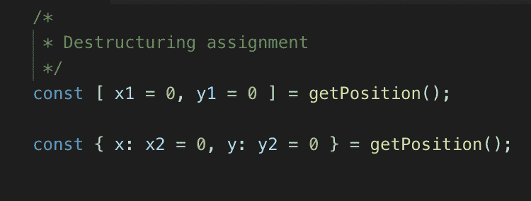

# 超棒的 Javascript——析构赋值

> 原文：<https://dev.to/codingsam/awesome-javascriptdestructuring-assignment-1bh7>

### 牛逼 Javascript——析构赋值

Javascript 越来越成为一种真正酷的语言。为什么？因为在 [ES6](http://es6-features.org/) (ECMAScript 6 又名 ECMAScript 2015)和所有其他更高级的版本中引入的所有功能。ECMAScript 只是 Javascript 的标准化规范。一些浏览器已经支持它了。然而，依赖它通常是不安全的，因为不能保证任何浏览器都支持完整的规范。最好的办法是使用 transpiler，它将你的 ES6 代码转换成 ES5，这当然可以在任何浏览器上运行。 [*Babel*](https://babeljs.io/) 是一个众所周知的 transpiler，你可以将其集成到大多数常用的构建工具中，例如， [*webpack*](https://webpack.js.org/) 或 [*gulp*](https://gulpjs.com/) *。*

在我之前的一份工作中，我在一个 web 开发项目中使用了大量的 Javascript。我的意思是…很多！尝试在没有任何框架的前端工作(没有反应，角或其他任何东西！).所以，你可以想象，我非常熟悉 Javascript，但它是 ES5。

从几个月前开始，我不得不在我的全职工作中处理很多 ES6。它有很多很酷的功能。这就是为什么我决定开始一个新的系列帖子，讲述我所了解到的(并且还在学习的)特性！

这篇文章是关于*析构赋值*的，我认为这是一种处理对象和数组的干净方式。

> 基本上，这是一种从数组和对象中获取值的好方法。

让我们看看它是如何工作的！

### 数组解构

你可以从一个给定的数组中获取一些值，并给它们取任何你想要的名字。例如，假设您有一个数字数组， *[1，2，3，5，8，13，21]* ，并且您希望将前两个索引存储在单独的变量中。在“普通的”Javascript 中，您应该这样做: