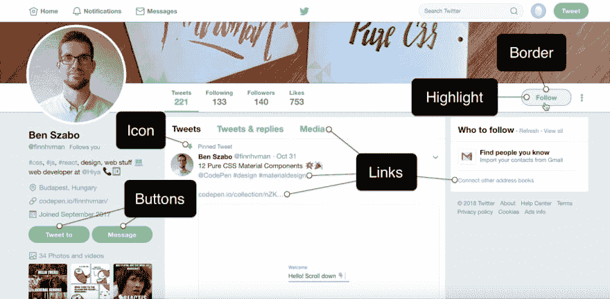

# 通过巧妙使用 CSS 自定义属性来了解它们

> 原文：<https://dev.to/chriscoyier/learn-about-css-custom-properties-through-clever-uses-of-them-2fjo>

CSS 自定义属性的一个最大的用例是主题化。让我们考虑一下。也许你已经设置了一些最高级别的变量:

```
html {
  --column-bg: #ae0001;
  --menu-bg-hover: #680001;
  --active-item: #D3A625;
}

/* Anywhere else in the CSS, you use the variables */
.menu:hover, .menu:focus {
  background: var(--menu-bg-hover);
} 
```

然后，如果你想改变主题，你有机会在一个孤立的地方做这件事，这使得事情变得非常容易推理。这里我们将允许根元素上的类改变来改变变量。任何使用这些变量的地方都会立即更新。

```
html {
  --column-bg: #ae0001;
  --menu-bg-hover: #680001;
  --active-item: #D3A625;
}
html.alternate-theme {
  --column-bg: #680001;
  --menu-bg-hover: #BE0002;
  --active-item: #00FFBA;
}

/* Anywhere else in the CSS, you use the variables */
.menu:hover, .menu:focus {
  background: var(--menu-bg-hover);
} 
```

这是斯蒂芬妮·刘对主题化的精彩运用。这是对 Slack 界面主题化功能的再创造

[https://codepen.io/ramenhog/embed/yXYNzz?height=600&default-tab=result&embed-version=2](https://codepen.io/ramenhog/embed/yXYNzz?height=600&default-tab=result&embed-version=2)

上面，我展示了如何通过改变一个类来改变 CSS 自定义属性的值，但是 JavaScript 能够通过选择元素并传递一个新值给它来直接改变这些变量值，就像`el.style.setProperty("--custom-property", "new-value");`一样，这就是 Stephanie 在这个演示中所做的。

像任何好的主题一样，用户的选择应该是持久的。Stephanie 在这个演示中通过将选择放到`localStorage`中来处理这个问题，所以看看她的 JavaScript，看看她是怎么做的。

## 调整主题颜色

CSS 自定义属性控制颜色主题的另一个考虑因素是，有时您想要一种颜色的变化，而不是必须选择一种全新的第二种颜色。就像一个按钮，以选择的颜色作为边框，但背景是一个褪色的版本。

在 Ben Szabo 的一篇文章中，他提到你可以使用 RGBA 或 HSLa 来调整不透明度。

[](https://res.cloudinary.com/practicaldev/image/fetch/s--QPPwMwOA--/c_limit%2Cf_auto%2Cfl_progressive%2Cq_auto%2Cw_880/https://thepracticaldev.s3.amazonaws.com/i/3hox8ilmhfreg936owgw.jpg)

如果开始时原始颜色是 RGB 或 HSL，不透明度调整很容易:

```
:root {
  --my-color-rgb: 255, 0, 0; 
}

.btn {
  border: 1px solid var(--my-color-rgb);
  background: rgba(var(--my-color-rgb), 0.5);
} 
```

我做过一次演示，我在颜色上面放了一个透明的黑色渐变来加深颜色，所以你不仅可以加深颜色，也可以加深颜色:

[https://codepen.io/chriscoyier/embed/ybgNKP/?height=600&default-tab=result&embed-version=2](https://codepen.io/chriscoyier/embed/ybgNKP/?height=600&default-tab=result&embed-version=2)

## Ana Tudor 向我们展示了通过 CSS 自定义属性开关的翻转，我们可以对样式做出巨大的改变。

她称之为[干切换](https://css-tricks.com/dry-switching-with-css-variables-the-difference-of-one-declaration/)。

这个技巧根植于数学以及`0`和`1`的力量。有了`calc()`，我们可以将值乘以 0 和 1，或者什么都不得到，或者得到原始值。我们可以用这个基本技巧来处理颜色，位置，变换...各种各样的东西，以获得巨大的不同结果时，翻转切换。

[https://codepen.io/thebabydino/embed/JeXMVe/?height=600&default-tab=result&embed-version=2](https://codepen.io/thebabydino/embed/JeXMVe/?height=600&default-tab=result&embed-version=2)

## 有趣的 SVG 悬浮于马里乌斯·尼韦里

我喜欢这个概念，在这个概念中，普通彩色 SVG 的颜色被 CSS 临时移除，移动到一个自定义属性，然后在悬停时重新应用。比如渐进增强着色！

[https://codepen.io/m4r1vs/embed/qVReQz/?height=600&default-tab=result&embed-version=2](https://codepen.io/m4r1vs/embed/qVReQz/?height=600&default-tab=result&embed-version=2)

## 基思·克拉克将它们与圆锥曲线渐变结合在一起，制成了饼状图

从标记中传递右边的百分比:

```
<div class="pie pie--value" style="--percent:65;"></div> 
```

然后使用圆锥梯度中的值来绘制饼图。

```
.pie {
  background-image: conic-gradient(
    rgba(0,0,0,0) calc(3.6deg  var(--percent)),
    rgba(0,0,0,1) calc(3.6deg  var(--percent))
  );
  background-blend-mode: overlay;
  background-position: 50% 50%;
  background-size: 150%; /* oversize bg image to prevent "underdraw" */
  width: 3.75em;
  height: 3.75em;
  border-radius: 50%;
} 
```

基思的演示是虚构的:

[https://codepen.io/keithclark/embed/aEbEoo/?height=600&default-tab=result&embed-version=2](https://codepen.io/keithclark/embed/aEbEoo/?height=600&default-tab=result&embed-version=2)

他甚至有一个额外的技巧，使用 CSS 计数器来显示百分比值。

如果你能直接告诉一个 HTML 元素你希望它是什么样的长宽比呢？记录在这里。您直接从元素的自定义属性传递一个比率:

```
<div style="--aspect-ratio:16/9;">
</div> 
```

然后使用该值在内部应用一个完美大小的伪元素，将它推至该大小。

```
[style="--aspect-ratio"] > :first-child {
  width: 100%;
}
[style="--aspect-ratio"] > img {   height: auto;
} 
@supports (--custom:property) {
  [style="--aspect-ratio"] {
    position: relative;
  }
  [style="--aspect-ratio"]::before {
    content: "";
    display: block;
    padding-bottom: calc(100% / (var(--aspect-ratio)));
  }
  [style*="--aspect-ratio"] > :first-child {
    position: absolute;
    top: 0;
    left: 0;
    height: 100%;
  }
} 
```

聪明的东西。