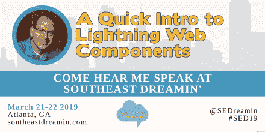

# 前往东南梦想 19

> 原文：<https://dev.to/brettmn/heading-to-southeast-dreamin-19-3lfd>

你好！3 月，东南梦想 19 活动将于 2019 年 3 月 21 日至 22 日在佐治亚州亚特兰大举行。我将展示“Lightning Web 组件快速介绍”。

## 东南寻梦

更多关于[东南梦想](http://www.southeastdreamin.com/)和[注册](http://www.southeastdreamin.com/#tile_registration)的信息，你应该访问他们的[网站](http://www.southeastdreamin.com/)。以下内容摘自[关于我们](http://www.southeastdreamin.com/about-us-2/)页面**什么是东南梦想？**节。

> *Southeast dream in’是由 Salesforce 用户为 Salesforce 用户创建的，旨在提供学习和交流机会以及促进协作。*
> 
> *这是一个为期半天的活动，&包括主题演讲、20 多个由机构群体主导的分组会议和实践培训(热门)会议。您还将有机会参观赞助商博览会和现场演示 Jam，了解可以扩展您对 Salesforce 的使用的 AppExchange 选项。*

## Lightning Web 组件快速介绍

 

<figcaption>他们做出了整齐的横幅形象！</figcaption>

照明 Web 组件是一种新的、基于标准的方式来创建照明 UI 元素。我们将快速浏览一下入门所需的工具以及创建一个照明 Web 组件的基础知识。

希望在那里见到你！

## 现在就这样。

记得报名参加 **[每周一次的单口相声！你可以得到我们关于 WIPDeveloper.com 的任何最新信息。](https://wipdeveloper.com/newsletter/)**

前往东南梦想 19 的帖子最早出现在 WIPDeveloper.com[的](https://wipdeveloper.com)上。