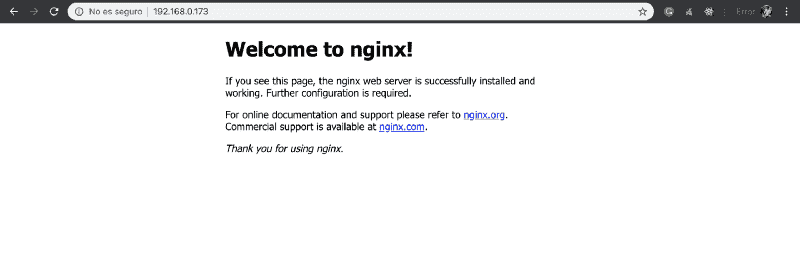
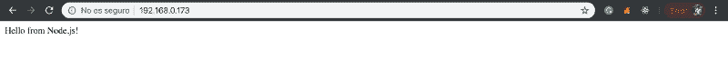

# 如何在树莓上使用 Nginx 服务 Node.js 应用程序

> 原文：<https://dev.to/guimg/how-to-serve-nodejs-applications-with-nginx-on-a-raspberry-jld>

这是一个关于我如何使用 *Nginx* 制作自己的服务器的教程，以便在我的本地网络上使用 *Raspberry Pi* 服务于 *Node.js* 应用程序。我这样做是为了在向生产主机提交任何更改之前，在我的本地网络中拥有自己的开发服务器。我们将介绍所有步骤，以便您也可以轻松地制作自己的产品。

## 先决条件和规范

对于本教程，我假设你有一个安装了 *Raspbian 操作系统*的 *Rasberry Pi* ，对开发板的 root 访问权限，连接到同一网络的另一台计算机，以及访问你的 Wifi 应用程序。

*   **板型号:**树莓 Pi 3 B+
*   **棋盘操作系统:**拉斯边
*   **板卡 CPU:** ARMv7l

## 安装并运行 Nginx

要在你的*树莓*上安装 *Nginx* 并启动服务，打开终端并键入以下命令:

```
sudo apt-get update
sudo apt-get install nginx
sudo systemctl start nginx 
```

现在，您的 Nginx 服务器已经启动并运行。为了检查服务器是否正常工作，我们可以从另一台计算机上打开网络浏览器，搜索我们的本地 IP。如果你不知道什么是你的*覆盆子*本地 IP 打开一个新的终端和类型:

```
hostname -I 
```

我的情况是 **192.168.0.173** 。所以我要搜索的地址将是**[http://192 . 168 . 0 . 173](http://192.168.0.173)**。这里可以看到 *Nginx* 的默认登陆页面。

[](https://res.cloudinary.com/practicaldev/image/fetch/s--p9uVNp0L--/c_limit%2Cf_auto%2Cfl_progressive%2Cq_auto%2Cw_880/https://cdn-images-1.medium.com/max/800/1%2A73xWgLveCtpOOoZGywlcqg.png)

恭喜你，你的 *Nginx* 服务器工作正常。现在我们必须服务于 *Node.js* 应用程序，而不是静态的 *HTML* 文件。怎么会？

## 安装 Node.js 和 NPM

显然，要使用 *Node.js* ，我们首先需要安装 *Node.js* 包和 *NPM* (节点包管理器)。我们也将把 NPM 更新到最新版本。为此，打开一个新的终端并键入:

```
sudo apt-get install nodejs
sudo apt-get install npm
npm install -g npm 
```

要检查 *Node.js* 和 *NPM* 是否安装正确，运行以下命令:

```
nodejs -v
npm -v 
```

现在我们已经运行了 *Nginx* 并且安装了 *Node.js* ，是时候制作我们的第一个 *Node* app 了。该应用程序将是一个简单的“Hello World”来检查*节点*和 *Nginx* 是否有良好的通信。我们来写 app 吧。

## 创建 Node.js app

在您的主目录中创建一个名为`server`的新文件夹。在这个文件夹中，我们将创建我们的 *Node.js* 应用程序。我们来写一下`index.js`文件。

```
const express = require("express");
const app = express();

// The HelloWorld
app.get("/", (req, res) => {
  res.send("Hello from Node.js!");
});

const port = process.env.PORT || 3000;
app.listen(port, () => {
  console.log(`App listening on http://localhost:${port}`);
}); 
```

将该文件保存在我们之前创建的`server`目录中。为了让这个应用程序工作，我们需要安装`express`包。打开终端，进入你的`server`文件夹，用 *NPM* 安装它们:

```
cd ~/server
npm init -y
npm install express --save 
```

我们所做的是初始化 *NPM* 并安装`express`包。现在我们可以用 *Node.js* :
运行 app 了

```
nodejs index.js 
```

如果你在你的*树莓*里打开浏览器，搜索 [http://localhost:3000](http://localhost:3000) 你会看到这个*节点*“你好世界”。

## Nginx 代理到 app

我们的应用程序现在运行在端口 3000。但是我们想要的是将端口 80 的所有 HTTP 请求( *Nginx* 服务器)重定向到端口 3000(*node . js*app)。我们可以通过修改 *Nginx* 的默认配置文件来实现。

```
server {
        listen 80 default_server;
        listen [::]:80 default_server;

        root /var/www/html;

        index index.html index.htm index.nginx-debian.html;

        server_name _;

        location / {
                proxy_pass http://localhost:3000;
                proxy_http_version 1.1;
                proxy_set_header Upgrade $http_upgrade;
                proxy_set_header Connection 'upgrade';
                proxy_set_header Host $host;
                proxy_cache_bypass $http_upgrade;
        }
} 
```

复制这个配置，删除配置文件中的所有文本并粘贴它。编辑您的默认文件类型:

```
sudo nano /etc/nginx/sites-enabled/default 
```

完成编辑后，键入`crtl+X`在退出前保存更改。别忘了重启你的 *Nginx* 服务:

```
sudo systemctl restart nginx 
```

现在，您的 *Nginx* 正在将您的 HTTP 请求重定向到您的本地主机应用程序。如果我们再访问[http://192 . 168 . 0 . 173](http://192.168.0.173)(*Nginx*监听的地址)我们现在就要看到*节点*“Hello World”。

[](https://res.cloudinary.com/practicaldev/image/fetch/s--THn9n4zm--/c_limit%2Cf_auto%2Cfl_progressive%2Cq_auto%2Cw_880/https://cdn-images-1.medium.com/max/800/1%2Ay7oBAnhKV1SDW7vx-c2Nrg.png)

## 配置 IP 表

现在唯一的问题是，我们可以通过 [http://localhost](http://localhost) 访问应用程序(感谢 *Nginx* )，但仍然可以通过[http://localhost:3000](http://localhost:3000)(*node . js*直接访问)。我们不希望这个端口对任何人开放。

想象一下，在未来你想将所有端口 **80** 连接重定向到端口 **443** ，因为你传输个人数据，你需要一个 *SSL 证书*。人们仍然可以连接到端口 **3000** 并忽略这个加密连接。

为了解决这个问题，我们只需要改变我们的 IP 表中的两个规则。第一个将允许本地主机*树莓*连接到端口 **3000** 。第二个将拒绝任何人访问。打开终端，输入这个:

```
iptables -A INPUT -p tcp -s localhost --dport 3000 -j ACCEPT
iptables -A INPUT -p tcp --dport 3000 -j DROP 
```

## DHCP IP 预留

你可能想做的另一件事是为你的*覆盆子*保留一个 IP。因此，您的设备每次连接到您的 Wifi 时都有相同的 IP 地址。

*   打开您的 Wifi 应用程序访问: [http://192.168.0.1](http://192.168.0.1) (这是您的路由器地址)
*   使用印在路由器底部的用户名和密码登录。
*   有一个板块叫**高级联网**。
*   搜索 **DHCP IP 预留**。
*   点击**添加**设备，搜索你的*树莓*。
*   把 IP 地址的最后一个数字改成你的意愿。

## 最后一句话

我希望这篇教程对你有用。如果你在这些步骤中有任何困难，请在下面的评论中留下，我会尽力帮助你。谢谢！