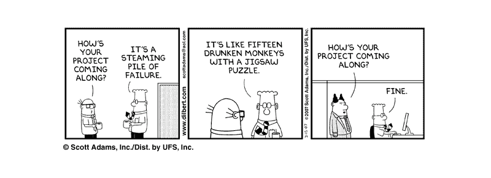
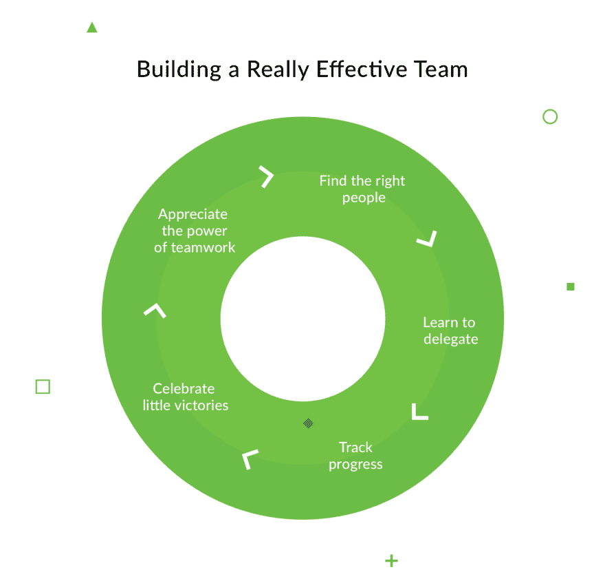
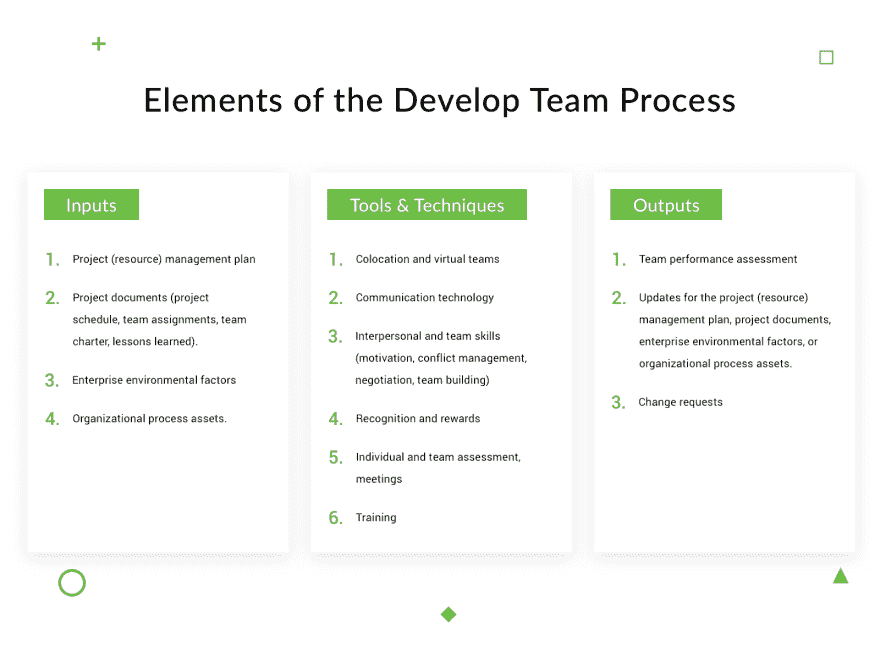
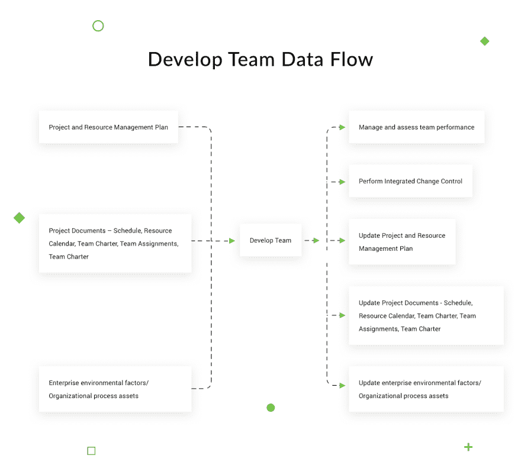
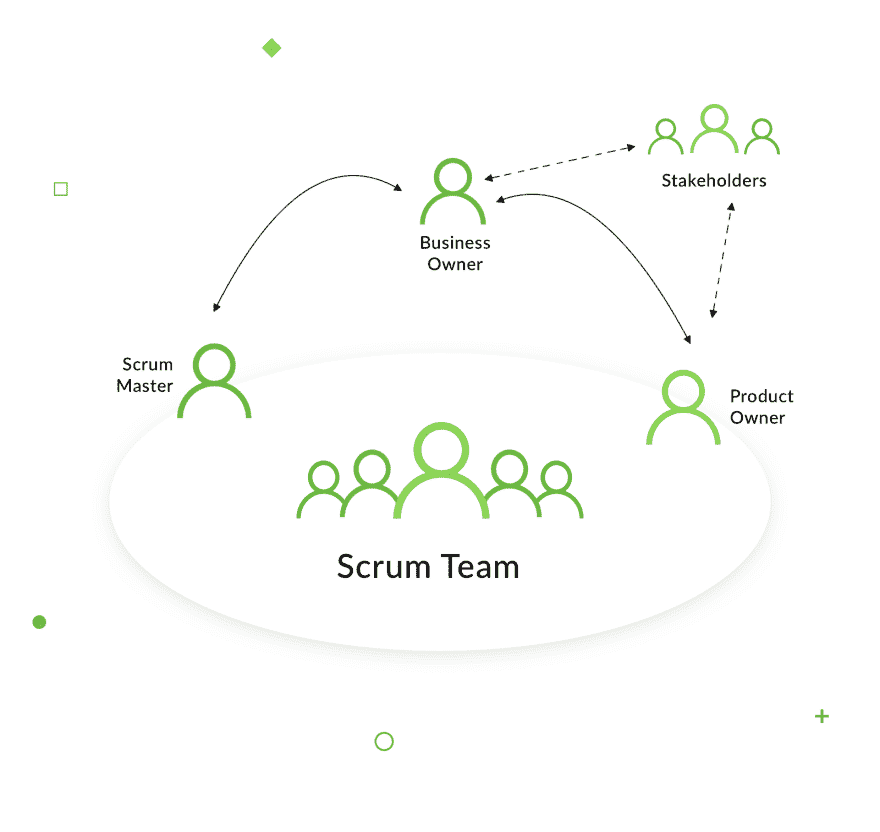

# 如何组建一个成功的开发团队

> 原文：<https://dev.to/django_stars/how-to-form-a-successful-development-team-4kao>

一个好的团队不是自然而然产生的。但是我们为什么需要一个呢？好的专业人士不都是默认组建好的团队吗？问题是，把他们锁在房间里给他们一个期限是不够的。一个高效的团队不仅仅是专业的；这也是团队成员如何互动的问题。只有真正高效的团队才能更快地处理工作量，更有生产力。总的来说，和一个不会搞砸的团队一起工作总是很好的。

统计数据显示，事实上，项目失败的主要原因是对项目的成功缺乏信心:“75%的受访者承认他们的项目要么总是要么通常”从一开始就注定失败。“但是你认为它为什么会发生，你又怎么能改变它呢？为了正常运作，团队需要了解流程的所有方面，他们的职责和责任，并相信他们所做的事情——而你就是说服他们的人。以下是如何组建一个你可以依赖的团队，一个你有信心的高效团队，一个你可以看到并说“我们将改变世界”的团队！"

# 创建软件开发团队:从哪里开始？

就像任何其他需要承担大量责任的大任务一样，建立一个成功的软件开发团队一开始可能会让人望而生畏。你从哪里开始？你怎么知道你需要谁，去哪里找他们？首先:写下团队应该解决的业务任务。前端还是后端开发？团队的作用是什么？一旦你清楚了这一点，就开始组建团队。

为了让你知道这个过程是如何展开的，这里有几个来自我们自己经验的例子。

如果我们的任务是完成或修复一个由其他人启动的项目，首先我们需要检查现有的代码并理解任何潜在变化的复杂性。对于这样的情况，我们在开始时所需要的只是涉及一个后端开发人员和一个前端开发人员。

如果你需要做测试用例，那么你就需要一个 QA 来支持这个项目。同时，如果你从头开始做一个项目，通常两个后端和一个前端开发人员，一个 QA 和一个项目经理就足够了。

组建好队伍了吗？下一步是定义团队的目标和/或结果，因为目标和任务应该对每个人都是透明和清晰的。你可以根据业务目标来做，并调整团队中的所有流程。

# 有效的团队:追求什么以及如何实现

在我们继续之前，让我们快速回顾一下什么是真正有效的团队。如果你想创建一个真正成功的开发团队来帮助你实现目标，考虑这五个步骤。

 
**第一步。欣赏团队合作的力量**。明智地识别员工的技能，并根据他们的能力分配任务。但也要确保团队成员欣赏彼此在团队中的作用，并意识到他们的个性如何互补。团队的凝聚力将赋予他们专注于共同目标并实现目标的真正力量。

**第二步。找到合适的人**。选择那些给你的项目带来不同经验和观点的候选人。你覆盖的面越多，你的产品在发布时就越好，你以后需要改变或改进的就越少。

**第三步。学会授权**。你的工作基本上是确保你的团队能做好他们的工作。一旦你设定了目标和指导方针，让团队成员做他们的事情。向您的开发团队授权并提供对工具的访问。

**第四步。跟踪进度**。问题是，当人们喜欢他们所做的事情时，他们往往会忘乎所以。你的任务是监控进度，确保项目不偏离轨道。提供一种分享问题的方式，并定期讨论项目的状态。这样，你会看到团队是否运转良好，或者你是否需要重新分配角色。然而，让团队在你的指导下自己克服一些障碍。处理团队中的问题能让任何团队更紧密地团结在一起，并在团队成员之间建立信心。

**第五步。庆祝小胜利**。当你的团队达到目标——或者更好，超过目标——别忘了给团队成员一些鼓励。这将鼓励团队更好地工作，提高团队精神。如果你不是一个真正喜欢庆祝的人，至少安排一次最后的会议来感谢那些为你的项目工作并帮助它实现的人。

# 开发团队职责:保持有效性

然而，创建一个高效的团队只是冰山一角。让我们更详细地讨论如何在一定水平上保持有效性。要做到这一点，项目经理应该额外关注他们如何构建工作流以及如何安排和委派任务。我们建议熟悉开发团队流程。

发展团队是一个改善团队成员互动和人际交往技巧的过程。结果是，您获得了更高的绩效、更好的团队环境和高度激励的员工。该过程贯穿于整个项目。它需要某些输入(项目管理计划、项目文档等。)、工具&技巧(共处、人际和团队技能、奖励、评估等。)，以及输出(计划和文档更新、变更请求等)。).

 
开发团队也是一个有数据流的过程。它基于项目管理计划、项目文档，并考虑了企业环境因素和/或组织过程资产。所有这些信息都用于管理团队和项目、控制变更、更新项目文档和企业环境因素和/或组织过程资产。

 
**为了结束这一部分，让我提醒你，激励团队实现目标的是项目经理，他们总是尽最大努力并满足项目的目标。**他们应该能够识别、建立和领导团队。他们的主要职责是组建有效的项目团队，就像组装一个复杂的拼图游戏，其中的每一个部分最终都会到位。他们应该能够创造一个完美的环境，对每个项目都是独一无二的，并促进团队合作。同时，他们应该提供反馈、奖励、设置挑战并提供机会来帮助团队成长、提高和学习。

优秀的项目经理总是有一套可以用来保持团队精神和效率的技能:

*   公开有效的沟通
*   增强团队成员之间的信任
*   团队建设机会
*   建设性冲突管理
*   协作决策和解决问题

# 开发团队角色:谁做什么

那么，有什么计划？你需要什么专家？数量是多少？至于我们，我们大部分时间都在使用 Python，并且我们已经为它建立了一个开发团队好几次了。这正是我们下面要讨论的。

为了组织工作过程和分配项目角色，我们通常使用 Scrum 方法。有趣的事实:与普遍的看法相反，这不是一个缩写。Scrum 这个名字是从橄榄球中借用来强调团队合作的重要性。Scrum 指南描述了三个重要的角色:

*   产品所有者——通常是项目的主要利益相关者；
*   scrum Master——一个促进者，一个协调团队工作的过程所有者；
*   开发团队——一起为项目工作的一组开发人员。

根据 Scrum 指南，产品负责人和 Scrum 主管也是 Scrum 团队的一部分。但是团队的其他成员是谁呢？**下面是一个 Python 项目团队所需的最少人员**:

*   具有相关经验的团队领导。
*   后端-团队领导
*   后端-中间
*   前端–中间
*   质量保证
*   项目经理/Scrum Master
*   设计者(取决于项目的任务)

**其他需要记住的重要规则**:

*   没有两个领导；
*   没有没有该领域经验的人；
*   让在初始阶段分析项目的建筑师或领导者参与进来。

虽然前两条建议非常简单，但是让架构师立即参与进来是非常重要的，这样他们就可以从第一天开始为项目铺平道路。如果架构师在中间的某个时候出现，团队可能不得不重做软件的某些部分。

现在我们来谈谈如何选择一个好的团队领导和项目经理(或者，如果你使用 Scrum，一个 Scrum Master)。

# 选择团队领导的注意事项

你是做什么的？首先，**选择有丰富经验和良好职业道德的候选人**。仔细看看那些在相关领域工作了至少 5 年的人，那些被重视良好工作场所文化的大中型公司雇佣的人。

这到底是什么文化？这是一个每个人都明白在任何情况下都不可以欺骗的世界。每个人都很合作，公司和所有员工都乐于接受现代的工作流程组织方式，等等。所以，基本上**那些大中型 IT 公司的荣誉角色就是为你提供开发者**。每个或多或少的大公司都有优秀的开发人员，他们要么被困在职业阶梯上，要么陷入财务困境。这些人正是你的团队所需要的。

当你在挑选团队成员时做出了正确的选择，你将获得巨大的回报——你将得到一个知道该做什么、完全参与过程、做生意透明、心中只有一个目标的团队:创造伟大的产品。

“不要”现在已经很容易理解了。最重要的是，不要把 PM 的职责分配给没有任何经验的人，或者来自小公司内部开发的人(除非他们以前有过我们上面描述的经验)。

习惯于小项目或内部开发的人，不管他们有多好，都没有经验或观点来允许他们做出正确的重大决策(例如，当涉及到预测数据量、数据负载、模块化组织和关注点分离时)。或者他们将缺乏有效团队的工作文化的知识，这涉及到承担重大责任、计划、敏捷工作、审查设计和代码、测试、编写测试等等。

最重要的是，**一个没有经验的开发者基本上会以你为代价来学习，并产生很少甚至没有价值**。与此同时，他们将取代一个能够推动你的项目突飞猛进的人。

# 软件开发团队中的项目经理与 Scrum 大师

项目经理通常做什么？项目经理是为团队设定任务，将任务分配给团队成员，并监督他们完成任务的人。

然而，Scrum 改变了角色。Scrum 大师更像是一个指导者，一个名义上的团队领导，负责管理方法的应用。Scrum 是关于独立团队的。这样，项目经理比销售经理承担更多的管理任务和责任。但是由 SM 领导的团队的好处是团队成员对他们的工作有更大的责任感。当人们觉得他们的项目属于他们，并且只属于他们自己，而不是某个更高的人——比如项目经理——他们会工作得更好，也更有效率。

有些人误以为做 SM 就意味着彻底抛弃团队。这将不可避免地导致不良后果，因为团队不习惯于设定自己的目标并找到实现目标的方法。在这种情况下，Scrum 大师应该让团队去找出他们的下一步，他们的错误，但是提供足够的帮助让他们完成工作。

简而言之，在 Scrum 中，PM 不太像保姆，更像软件开发团队的导师。使用 Scrum 的公司应该提前重新定义项目经理的角色，并且绝对清楚经理不负责团队在 Sprint 中完成他们的承诺。

# 专门开发团队:心理同步

现在你知道在团队领导或项目经理身上应该寻找什么，但是团队的其他成员呢？我们怎么强调都不为过，不仅要找到适合不同人的技能组合，还要找到匹配心态和心理怪癖的技能组合。**团队需要在每个层面上同步**。

以下是我们关于如何为 IT 项目挑选团队成员的建议——在只有一个优先事项的任何阶段——以提高产品质量:

1.  看一看候选人的人际交往能力如何搭配。这和他们的专业知识、技能、成就和经验一样重要。
2.  作为一名团队领导，在保持团队大方向的同时，不仅要考虑技能，还要考虑角色、性格类型和职业抱负。
3.  要评估团队成员的兼容性，每隔一个月找一种方法来衡量团队关系。
4.  向团队展示您的测量结果和团队关系研究，并一起讨论。这样，如果有必要的话，你就能找到改变关系的有效方法。

不要忘记所有的团队成员都是人。这意味着，除了专业技能，你还应该考虑心理因素。基于个人心理特征，一个[开发团队](https://djangostars.com/team/)在以下情况下是有效的:

1.**规模**最小(3 至 10 人),同时包括特定项目时间范围内的全部技能；

1.  **团队核心非常有凝聚力**，但是可能与某些团队成员缺乏沟通(次要任务的外包)；
2.  **领导者被高度接受**(至少一半的团队成员)，而接受度最高的成员是智力水平最高的人，这使得他或她能够做出最大的贡献；
3.  领导者的团队是针对自身的，团队成员是针对目标的，针对沟通的成员数量极少；
4.  **领队的目的是服务**，而领队的目的是精通；
5.  团队有一整套角色:创意生成者、分析师和评论家。演技角色主持心智角色，心智角色主持社交角色。与其他角色相比，创意者和分析师的数量并不多；
6.  团队的**智力资本应该有不同的层次**:最好是一个智力领导者和几个智力资本较低的社会领导者的组合。

# 团队绩效评估

至此，您已经学会了如何建立一个开发团队。假设您的团队正在工作，现在是时候看看它实际上有多好，多有效了。任何和所有对团队绩效的评估都应该关注两件事:团队结果和团队过程。

团队成果由团队的主要目标决定。它可以是任何东西——从更好的产品质量，到更快的交付时间，到更少的资源使用。另一方面，团队过程是团队实现结果的方式——团队成员解决冲突、共享信息、管理预算、时间表和人际关系的能力。

如果你看到你的团队工作得有多好，评估将允许你为将来的参考设置标记。但是如果一个团队面临内部障碍，对所有团队过程的详细评估就变得更加重要。有许多方法可以用来评估你的团队的过程，但是最简单有效的方法包括基准测试、持续的团队讨论和项目汇报。

如你所见，建立一个软件开发团队有点像组建一支棒球队。每个人都有并且知道自己的角色，自己在场上的位置，以及每个人渴望的目标。仅仅挑出好的专业人士是不够的；他们必须像拼图一样互相匹配。你的工作是真正了解每个候选人，看看他们是如何一起工作的。学习如何欣赏团队合作，如何在实现大目标的过程中庆祝小成就。创建一个专门的开发团队，在这个特定的领域取得成功。更好的是，建立一个团队，即使在你的项目完成后，他们也愿意一起工作——这将是一个真实的信号，表明你不仅创建了一个好的开发团队，而且是一个伟大的团队。

这篇关于如何组建一个成功的开发团队的文章是由 Django Stars 的项目经理 Nataliia Peterheria 撰写的。最初发布于 [Django Stars 博客](https://djangostars.com/)。