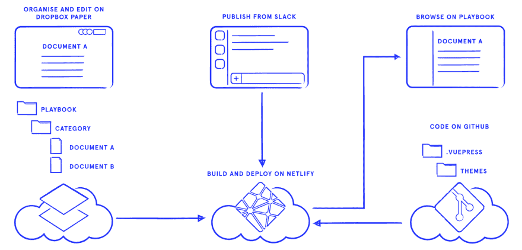
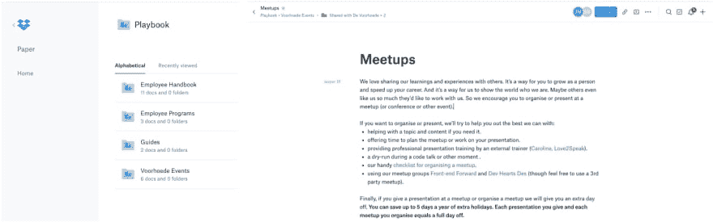
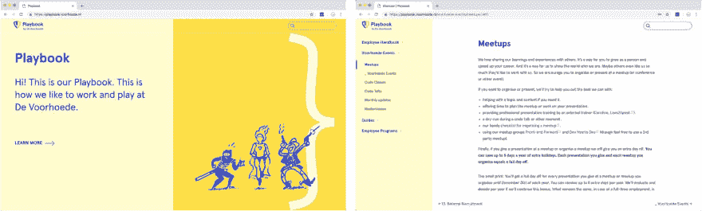
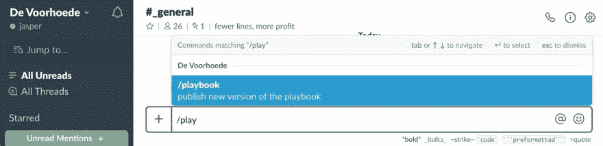

# 作为无头 CMS 的 Dropbox Paper

> 原文：<https://dev.to/jbmoelker/dropbox-paper-as-a-headless-cms-361h>

我们把 Dropbox Paper 变成了一个无头 CMS，用它在别处发布我们的内容。

> 注:[最初发布在 Voorhoede.nl](https://www.voorhoede.nl/en/blog/dropbox-paper-as-a-headless-cms/) 上，所以你也可以在那里阅读:)

为什么？Dropbox 纸张非常适合编辑。我们可以在 markdown 中写作，添加富媒体，在文件夹中组织文档，内容自动版本化，其他人可以在评论中给出反馈。这使得 Paper 成为像我们公司剧本这样的文档集合的完美 CMS 候选。然而，纸质用户界面对于阅读、浏览和导航来说并不理想，一个包含文档的文件夹也不像是我们的剧本。这就是我们想到的:

[](https://res.cloudinary.com/practicaldev/image/fetch/s--yIHfIRLl--/c_limit%2Cf_auto%2Cfl_progressive%2Cq_auto%2Cw_880/https://thepracticaldev.s3.amazonaws.com/i/1aam3q8gvizr1yac2ht7.png)

## 整理和编辑 Dropbox 纸上的内容

我们首先从项目内容开始。通过熟悉的 Dropbox 纸质用户界面([paper.dropbox.com](paper.dropbox.com))，我们将内容写在纸质文档中，并将其组织到文件夹中:

[](https://res.cloudinary.com/practicaldev/image/fetch/s--hiEDD4p_--/c_limit%2Cf_auto%2Cfl_progressive%2Cq_auto%2Cw_880/https://thepracticaldev.s3.amazonaws.com/i/rn1d0cr13y4xcm3ude8x.jpg)

从我们的根文件夹的 URL(`https://paper.dropbox.com/folder/show/Playbook-e.1g...Mxe`)中，我们提取它的`DIRECTORY_ID`(在我们的例子中是`e.1g...Mxe`)，所以我们可以通过 API 以编程方式访问它。

## 通过纸质 API 收集内容

我们使用 [Dropbox Paper API](https://www.dropbox.com/developers/documentation/http/documentation#paper) 来检索文件夹、文档及其元数据:

1.  我们从[列出所有文档](https://www.dropbox.com/developers/documentation/http/documentation#paper-docs-list)和[开始，获取项目根文件夹中的所有文件夹](https://www.dropbox.com/developers/documentation/http/documentation#paper-docs-get_folder_info)，通过我们的`DIRECTORY_ID`过滤。
2.  然后[获取每个文档的元数据](https://www.dropbox.com/developers/paper-api-alpha#paper-docs-get_metadata)来过滤掉“删除”的文档，并收集有用的元数据，如“最后更新日期”。
3.  最后我们[下载每个文档的内容](https://www.dropbox.com/developers/documentation/http/documentation#paper-docs-download)作为 markdown。

我们将来自 API 的数据写入一个文件夹结构中，每个文档都有一个 markdown 文件，文件顶部包含内容和元数据(三条虚线之间的 YAML 格式的数据)。例如，写入到`playbook/voorhoede-events/meetups.md`的文档看起来像:

```
---
doc_id: "rzWK0vA059CSQcQdmKydy"
last_updated_date: "2019-01-08T15:24:33Z"
---

# Meetups

We love sharing our learnings and experiences with others ... 
```

Paper API 集成的完整源代码在 GitHub 上。

## 作为静态站点构建和部署

有了从 Dropbox Paper 写入文件系统的内容，我们可以随心所欲地处理它。带有前置内容的降价文件是静态站点生成器的一种流行输入格式。我们已经在使用 [VuePress](https://vuepress.vuejs.org/) ，所以我们用它来发布我们的文档作为一个静态站点。我们项目的代码，包括 [VuePress 设置](https://github.com/voorhoede/playbook/tree/master/docs/.vuepress)和 Paper API 集成，都在 GitHub 上。我们使用 Netlify 在每次代码更改时构建和部署我们网站的新版本。这就是结果:

[](https://res.cloudinary.com/practicaldev/image/fetch/s--M1YVFK1_--/c_limit%2Cf_auto%2Cfl_progressive%2Cq_auto%2Cw_880/https://thepracticaldev.s3.amazonaws.com/i/hyc1h2bmwidyacltimng.jpg)

您可以查看我们的行动手册的[简化现场演示版本。](https://playbook-demo.netlify.com/)

## /从时差发布

虽然我们的网站会自动更新*代码*的变化，但不会更新*内容*的变化。😕不幸的是，当内容改变时，Paper 无法以编程方式通知我们。这意味着我们不能自动触发新的发布。因此，作为开发人员，我们想出了一些更贴近实际的东西:使用`/playbook`从 Slack 中直接触发发布的自定义“斜杠命令”:

[](https://res.cloudinary.com/practicaldev/image/fetch/s--QoWM2g6H--/c_limit%2Cf_auto%2Cfl_progressive%2Cq_auto%2Cw_880/https://thepracticaldev.s3.amazonaws.com/i/4xn7p84119ll86q8sx6y.jpg)

就是这样，我们使用 Paper 作为 CMS，通过一种机制在一个定制的网站上发布我们的内容，具有我们想要的外观和感觉。

## 论文 API 的局限性和弊端

在我们的开发过程中，我们遇到了 Paper API 的一些限制:

*   Paper API 只返回 API 令牌所属的帐户至少打开过一次的文档。
*   与目前所有友好的 REST 和 GraphQL APIs 相比，Paper 的 RPC API 很难使用。
*   Paper API 按照“最后访问/修改/创建”的顺序返回文档，这对我们来说不是很有用。
*   Paper 没有 [webhooks](https://en.wikipedia.org/wiki/Webhook) 或其他机制来触发关于文档更改的新发布。
*   纸张没有用于认证的“团队令牌”。我们最终创建了一个 Dropbox 用户(大约 300 欧元/年)，只是为了拥有一个 Playbook 令牌。

## 我们的判决

Dropbox Paper 非常适合作为文档集合的无头 CMS。它有很棒的创作工具。只要你能克服它的局限性，下次你需要快速 CMS 的时候，你应该记住它。

有用的链接:

*   [项目源代码](https://github.com/voorhoede/playbook)
*   [收纳盒纸](/)和[收纳盒纸 API](https://www.dropbox.com/developers/documentation/http/documentation#paper)
*   [静态现场发电机](https://www.staticgen.com/)和[堵塞烟囱](https://jamstack.org/)