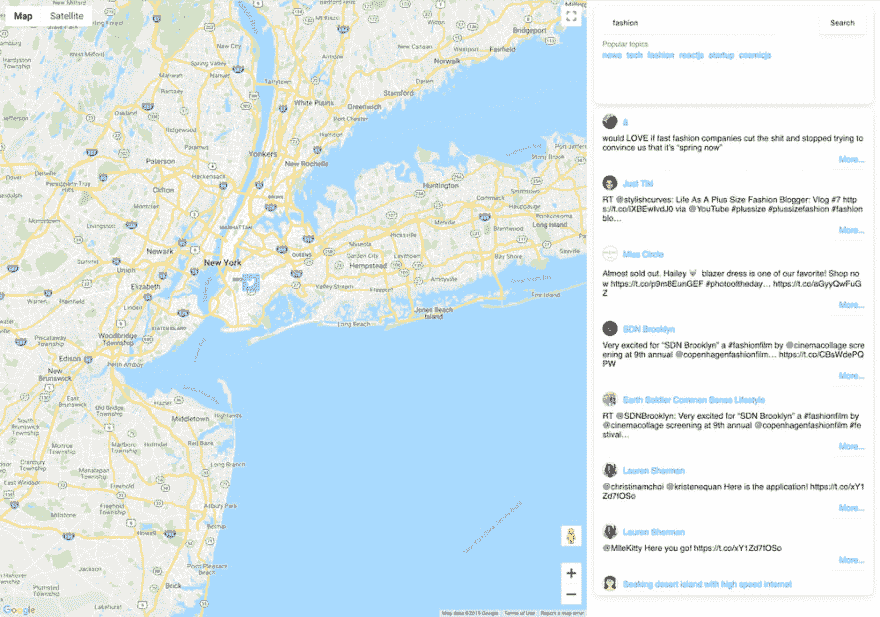

# 如何用 React 和 Cosmic JS 构建基于位置的 Twitter 搜索应用

> 原文：<https://dev.to/haykadamyan/how-to-build-a-location-based-twitter-search-app-with-react-and-cosmic-js-4inj>

# 按位置推文

嗨，在本教程中，我们将创建一个应用程序，使用 [React](https://reactjs.org/) 和 [Cosmic JS](https://cosmicjs.com/) 按位置过滤 twitter 推文。我们将使用 [Cosmic JS npm 包](https://www.npmjs.com/package/cosmicjs)来实现我们应用程序中的基本 CRUD 系统。让我们开始吧。

# TL；速度三角形定位法(dead reckoning)

[查看试玩](https://search-tweets-by-location.cosmicapp1.co/)
[下载 GitHub 回购](https://github.com/haykadamyan/tweet-locator)

# 先决条件

在启动之前，您需要安装[节点 JS](https://nodejs.org/en/) 和 [NPM](https://www.npmjs.com/) 。确保你已经有了。

# 入门

#### 使用现有的 git 回购做一切事情

首先，你必须确保你有 node > 8.x:
因为我们的应用程序使用外部 API，比如[宇宙 JS](https://cosmicjs.com/) 、 [Gmail API](https://developers.google.com/gmail/api/) 和 [Twitter API](https://developer.twitter.com/en/docs.html) 我们必须为这些 API 设置环境变量。
注意，您必须在上述服务中创建 API 密钥，以便将“密钥”放在`.env`文件中。
下面是你的`.env`文件的样子。