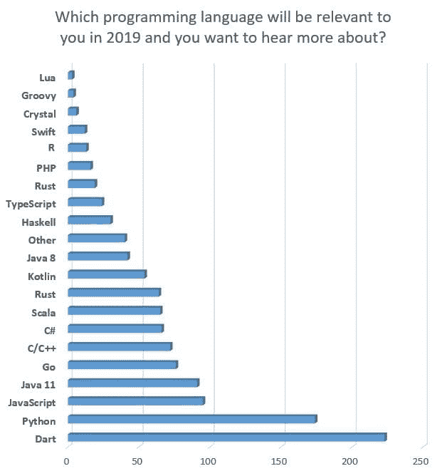
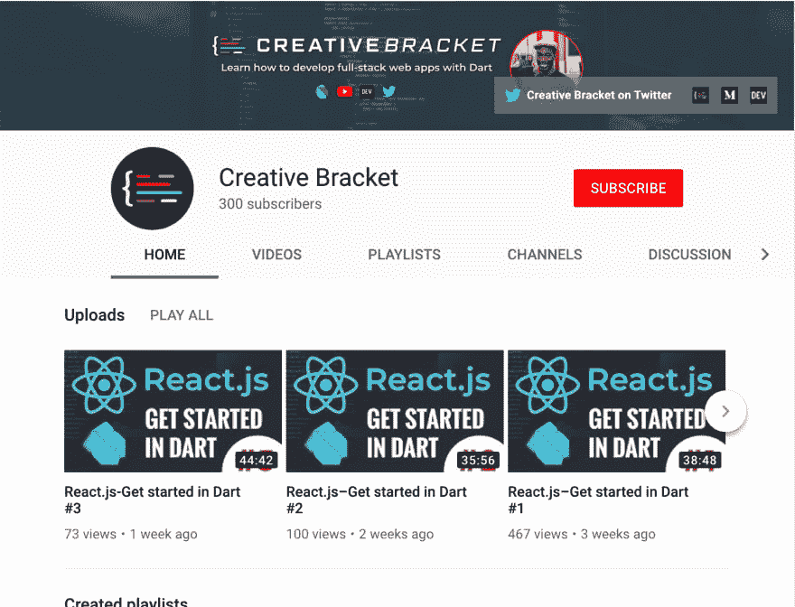

# 超过 4000 名粉丝！对使用 Dart 学习全栈开发越来越感兴趣

> 原文：<https://dev.to/graphicbeacon/over-4000-followers-growing-interest-in-learning-full-stack-development-with-dart-lnn>

我要感谢并祝贺所有与我一起踏上这段旅程的粉丝们！

当我在四月份开始写这个博客时，我没有意识到这会有什么影响。还不到一年，DEV 社区通过我的读者的鼓励和追随真的让我感到惊讶和谦卑。

去年 10 月，我孤注一掷，决定以 [**的品牌**](https://youtube.com/c/CreativeBracket) 做全职博主、编程导师和 YouTuber。

我的目的(*现在仍然是*)是展示清晰高质量的视频教程，介绍如何构建全栈 Dart 应用，涵盖 web 和服务器环境。

2019 年给 Dart 开发者带来了巨大的希望，以下是我实现这一点的一些方式:

## 1。支持 ES6 语法和工具

Dart 已经使用 SDK 中包含的`dart2js`工具编译成 JavaScript。这里唯一需要注意的是输出是 **ES5** 代码。这是为了支持传统浏览器，如 Internet Explorer 11 及更低版本。

因此，我们非常高兴地宣布，迁移到现代 **ES6** 语法和功能的工作正在进行中，包括将 Dart 代码翻译成 ES6！

> 谷歌的 Dart 团队@ Dart _ lang我们计划在 2019 年将我们的生产 JavaScript 编译器迁移到现代语法和功能——详情:[groups.google.com/a/dartlang.org…](https://t.co/kUo039Fvsv)23:54PM-08 2019 年 1 月

这也将允许与常见的 ES6 工具集成，如 Babel 和 WebPack。这是一个早期的视频:

[https://www.youtube.com/embed/oH6czEQwHdE](https://www.youtube.com/embed/oH6czEQwHdE)

## 2。50K⭐ GitHub 星上空现在已经飘起了星星

液体错误:内部

超过 50，000 人参与了 Flutter 项目，展示了这种方法在构建跨平台应用程序方面的巨大潜力。有了蜂鸟项目，我们应该很快就会看到浏览器支持。

[**阅读颤振 2019 路线图**](https://github.com/flutter/flutter/wiki/Roadmap)

## 3。在最近的民意调查中获得势头

[Pluralsight 的 2018 年总结报告](https://learn.pluralsight.com/resource/infographic/tech-in-2018)将 Dart 列为一项不断发展的技术，而 JAXCenter 的[民意调查](https://jaxenter.com/poll-results-dart-word-2019-154779.html)显示 Dart 在 2019 年成为开发者最希望使用的相关语言:

液体错误:内部

## 4。增加我的 YouTube 频道的订户

超过 400 艘潜艇！[立即订阅](https://youtube.com/c/CreativeBracket)用 Dart 学习全栈开发！

## 5。现在正在制作关于高级灾难援助反应队主题的高质量私人截屏

我正在为我的 [Patreon](https://patreon.com/join/creativebracket?) 页面制作文字和视频内容。这将是高层成员独有的。

与此同时，[为什么不现在就成为基础层的 Patreon](https://www.patreon.com/join/creativebracket?) 并帮助推动未来的 Dart 内容呢？这将授予你访问**镖启动电子书**我计划很快发布！

感谢阅读！**喜欢、分享和[关注我](https://twitter.com/creativ_bracket)T3】😍有关 Dart 的更多内容。**